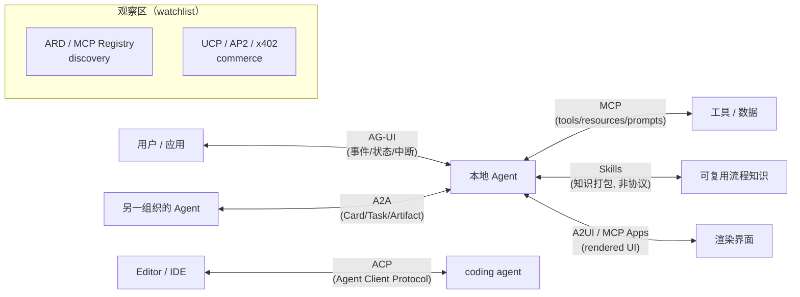
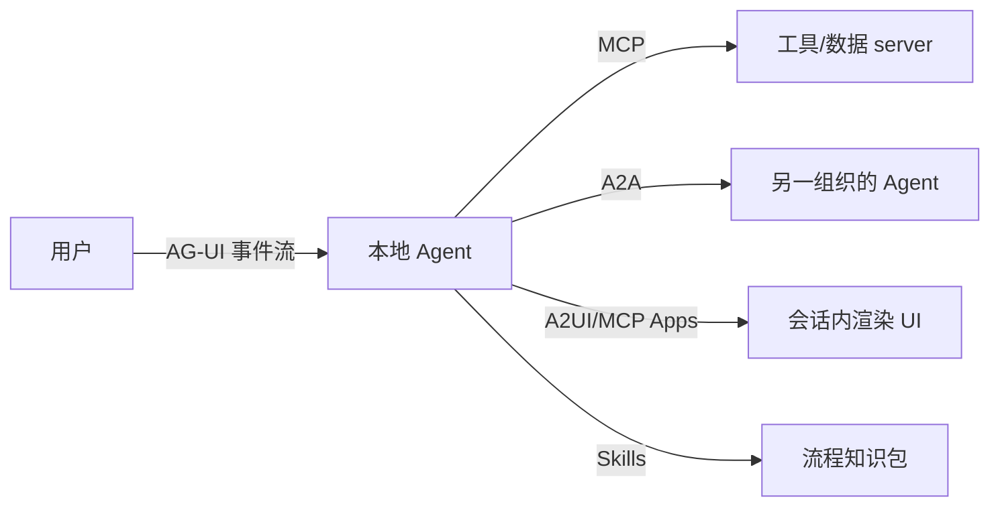

> **在哪一层**：层 4 · 行动与协作 ｜ **上一层出口**：能把模型输出接入会话与状态 ｜ **本层出口**：面对跨界需求能按连接方向选出协议，并说清不选其余协议的理由
> **前置**：[工具执行工程](../tool-execution)、[复杂度决策阶梯](../../00-orientation/complexity-ladder) ｜ **下一步**：按地图进入 [MCP](mcp)、[A2A](a2a)、[ACP](acp-agent-client)、[AG-UI](ag-ui)、[A2UI 与 MCP Apps](a2ui-mcp-apps)

## 1. 概述

**结论先讲**：层 4 的协议不是竞品，而是**各占一条连接方向**。选型的第一问不是「哪个协议更好」，而是「我要连通的**两边是什么**」：Agent 到工具、编辑器到编码智能体、Agent 到用户界面、还是 Agent 到 Agent。方向定了，候选集通常只剩一个；再用信任域与状态需求确认。

### 心智模型：按连接方向分组

注意：**Skills 不是协议**——它是知识打包格式（无 wire 层），画进图里只为占住「可复用知识」这条方向；[Plugins](../plugins) 同理，占住「能力组合打包」方向。

### 协议全景表

| 连接方向 | 协议/格式 | 状态 | 一句话职责 | 详情 |
| --- | --- | --- | --- | --- |
| 可复用知识 → Agent | Agent Skills | canonical | 指令+资源的打包格式，渐进披露 | [Skills](../skills) |
| 能力组合 → 分发包 | Agent Plugins | watchlist | plugin.json 清单 + 固定发现位置 | [Plugins](../plugins) |
| Agent ↔ 工具/数据 | MCP | canonical | JSON-RPC：tools/resources/prompts | [MCP](mcp) |
| Editor/IDE ↔ coding agent | ACP（Agent Client Protocol） | canonical | 编辑器与编码智能体的标准通信 | [ACP](acp-agent-client) |
| Agent ↔ 用户/应用 | AG-UI | canonical | 事件流/状态/中断的用户交互协议 | [AG-UI](ag-ui) |
| Agent ↔ Agent | A2A | canonical | 跨框架 Agent 互操作（Card→Task→Artifact） | [A2A](a2a) |
| Agent ↔ 渲染 UI | A2UI / MCP Apps | canonical | 会话内渲染的交互 UI 元素 | [A2UI 与 MCP Apps](a2ui-mcp-apps) |
| discovery / registry | ARD、MCP Registry | watchlist | 能力与资源发现 | [协议观察清单](watchlist) |
| commerce（支付/结算） | UCP、AP2、x402 | watchlist | Agent 商务支付轨道 | [协议观察清单](watchlist) |

### ACP 三义消歧（读任何 ACP 资料前先对表）

「ACP」是重灾区缩写，至少三个不同事物共用：

| # | 全称 | 是什么 | 边界 | 状态 |
| --- | --- | --- | --- | --- |
| ① | **Agent Client Protocol**（agentclientprotocol.com） | 编辑器/IDE ↔ coding agent 的标准通信协议；本地走 JSON-RPC over stdio，远程走 HTTP/WebSocket；复用 MCP 的 JSON 表示 | 本页层 4 协议地图中的 ACP 指**它**；详情见 [ACP 章](acp-agent-client) | 活跃（Zed 等编辑器生态） |
| ② | IBM/BeeAI **Agent Communication Protocol** | 历史上的 Agent↔Agent 通信方案 | 已并入 A2A 路线；读旧资料遇到时按 A2A 前身理解 | 历史 |
| ③ | OpenClaw 内部 **Agent Communication Protocol** | OpenClaw 产品的私有内部协议，与 ①② 无关 | 产品实现细节，见 [OpenClaw 源码：ACP](/zh/products/openclaw/source-code/acp) | 产品私有 |

引用规则：本站层 4 所有页面中未加限定的「ACP」一律指 ①；提 ② 必须带「IBM/BeeAI」前缀并注明历史；提 ③ 必须带「OpenClaw」前缀并链到产品区。

### 选择决策表

| 需求 | 方向 | 信任域 | 状态需求 | 最低复杂度选择 |
| --- | --- | --- | --- | --- |
| 让 Agent 调用工具/读数据 | Agent → 工具 | 工具边界 | server 进程/无状态请求 | MCP |
| 编辑器接入编码智能体 | Editor ↔ agent | 本机进程或远程 | 会话/流式 diff | ACP① |
| 前端应用承接 Agent 过程 | Agent → 用户 UI | 应用边界 | 事件流/中断 | AG-UI |
| 两个独立 Agent 协作 | Agent ↔ Agent | 跨组织/跨框架 | 异步 Task/Artifact | A2A |
| Agent 输出可交互 UI | Agent → 渲染 UI | host 渲染边界 | UI payload | A2UI / MCP Apps |
| 只是复用一段流程知识 | 知识 → 上下文 | 宿主进程内 | 无 | Skills（非协议） |
| 同 host 内一个函数 | 进程内 | 进程内 | 无 | 直接函数调用（别上协议） |

最后一行是防御性提醒：协议解决**跨边界**的通信与发现；同进程内的调用用函数即可，复杂度阶梯（层 0）的梯级 6 触发条件未命中时不要引入任何本页协议。

### 组合示例：一次真实协作的协议拼图

一次会话可以同时用到四条方向：AG-UI 承接用户侧的过程展示，MCP 接工具，A2A 把子任务委托给远端 Agent，Skills 决定「按什么步骤做」。协议之间互补，不存在「全家用一个协议」的合理架构。

### 何时使用 / 何时不用

- 用：任何跨进程/跨组织/跨信任域的连通选型；评审「要不要引入协议 X」。
- 不用：协议内部的消息结构学习——进入对应详情页。

历史版本里程碑：本地图于 2026-09 随 Issue #116 冻结；各协议自身版本（如 MCP 2026-07-28、A2A 1.0.0、Agent Plugins 1.0.0）在各自详情页维护。

## 2. 使用

本页是选型地图，无可运行代码产物；「使用」= 决策演练（纸面即可，≤15 分钟）。验收标准：四个场景全部选中唯一协议并说出不选其余的理由。

### 演练：四个场景

**场景 A**：VS Code 里换一个新出的编码智能体，希望不写集成代码。
- 预期：ACP①。连接方向是 Editor ↔ coding agent。
- 反例判断：不是 MCP（那是 Agent ↔ 工具）；不是 A2A（两端不是两个自治 Agent）。

**场景 B**：让自家 Agent 读写公司 wiki 与工单系统。
- 预期：MCP。方向是 Agent ↔ 工具/数据。
- 反例判断：若 wiki 只需要「按什么步骤查」，那是 Skills；连接与流程是两条方向。

**场景 C**：两个部门各自的 Agent（不同框架）要互派长任务。
- 预期：A2A。方向是 Agent ↔ Agent，跨团队信任域，任务异步。
- 反例判断：若是同一运行时内的子任务委派，用运行时自带的 subagent 机制，不需要 A2A。

**场景 D**：Agent 分析过程要实时显示在自家 React 应用里，可打断。
- 预期：AG-UI。方向是 Agent → 用户界面的事件流。
- 反例判断：若只是「在聊天里渲染一张图表」，那是 A2UI / MCP Apps 的 host 渲染，不是应用级事件流。

### 使用边界

- 本地图判断**选哪个方向**；每个协议的版本、消息与安全在详情页。
- 观察区（watchlist）协议不进决策表：没有生产证据前，只记录不推荐。

## 3. 原理

### 为什么按「连接方向」而不是「功能强弱」组织

协议的成本来自**边界**而非功能：每引入一条协议边界，就多一套版本协商、授权与失败语义。连接方向是边界的自然坐标——两边的身份（用户/编辑器/Agent/工具）决定了谁发起、谁渲染、谁付费、谁担责。功能强弱的对比（谁的消息更丰富）在没有方向约束时没有意义：AG-UI 的事件流再丰富也不能替代 MCP 的工具授权。

### MCP 与 A2A 互补不竞争（官方口径）

A2A 官方文档明确表述：「MCP 与 A2A 不是竞争者，而是高度互补」——**MCP 管 Agent↔工具**（连接 API 与资源），**A2A 管 Agent↔Agent**（发现、委托、共享结果）。选型冲突时不需要在两者间二选一（retrievedAt 2026-09-01）。

### 观察区的准入规则

一条协议进入 watchlist 只需「有官方规范或活跃维护者」；升入 canonical 决策表需要：learn-ai 或 sibling 有真实消费证据，或生态出现多个独立实现。ARD、MCP Registry、UCP、AP2、x402 等当前全部停留在观察区，详情与核验日期见[协议观察清单](watchlist)。

### 规范要求 vs 本地实测

本页是选型模式，无规范可实现测；「规范 vs 实测」分栏在四个 canonical 协议详情页各自维护（[MCP](mcp)、[A2A](a2a)、[ACP](acp-agent-client)、[AG-UI](ag-ui)）。

## 4. 开发

本页无代码集成；「开发」= 把地图用作架构评审的门禁。

### 症状 → 证据 → 处理 → 完成标准

**症状**：评审争论「用 MCP 还是 A2A」，双方各列功能清单。
**证据**：没人先陈述连接方向——两端身份（Agent↔工具 还是 Agent↔Agent）未被定义。
**处理**：先填选择决策表的「方向/信任域/状态」三列；候选集会收敛到一个。
**完成标准**：设计文档写明两端身份与方向，选型结论直接由表格导出。

### 症状 → 证据 → 处理 → 完成标准

**症状**：文档/方案里的「ACP」读者理解不一致，讨论串楼层越来越歪。
**证据**：没有限定词——可能是 Agent Client Protocol、IBM 历史 ACP 或 OpenClaw 私有 ACP。
**处理**：按三义消歧表补限定词；站内默认 ①，其余必须带前缀。
**完成标准**：该文档中每个 ACP 出现处都能唯一对应表中一行。

### 症状 → 证据 → 处理 → 完成标准

**症状**：方案引用了 watchlist 协议（如 x402）作为关键路径依赖。
**证据**：该协议无本站消费证据，决策表未收录。
**处理**：降级为「观察项」：主路径改用 canonical 协议或显式自定义层，watchlist 协议列为可选实验。
**完成标准**：关键路径不依赖任何 watchlist 条目；实验项有独立开关与回退。

### 反模式清单

- **方向未定先选协议**：拿功能清单代替连接方向分析。
- **一词三义**：不加限定地使用 ACP。
- **把观察区当货架**：在关键路径采用无生产证据的新协议。

## 5. 资料库

四级阅读路线：

- **Beginner**：读本页，能复述全景表与三义消歧。
- **Builder**：进 [MCP](mcp) 跑通零依赖 server+client fixture；再按方向读 ACP/AG-UI。
- **Operator**：把选择决策表用作评审模板；跟踪各协议版本公告。
- **Researcher**：读 A2A 官网「How A2A Works with MCP」与各规范原文，验证互补口径。

### 资源表

| 名称 | 证据层级 | canonical URL | 用途 | 支持的断言 | 下一步 |
| --- | --- | --- | --- | --- | --- |
| A2A 官网（含 MCP 互补口径） | L0（官方） | https://a2a-protocol.org/latest/ | A2A 与 MCP 分工的官方表述 | 「MCP↔工具、A2A↔Agent，互补不竞争」（retrievedAt 2026-09-01） | [A2A](a2a) |
| Agent Client Protocol 官网 | L0（官方） | https://agentclientprotocol.com/ | ACP① 的定义 | 「标准化 code editors/IDEs 与 coding agents 的通信」（retrievedAt 2026-09-01） | [ACP](acp-agent-client) |
| MCP 规范 | L0（官方规范） | https://modelcontextprotocol.io/specification/latest | Agent↔工具方向的规范 | 协议职责与版本（retrievedAt 2026-09-01） | [MCP](mcp) |
| AG-UI 文档 | L0（官方） | https://docs.ag-ui.com/introduction | Agent↔用户方向的规范 | 事件/状态/中断模型（retrievedAt 2026-09-01，详情页复核） | [AG-UI](ag-ui) |

### 主动证伪与未决问题

- 证伪入口：若你遇到一个真实需求，按选择决策表会落到两个协议（或零个），说明地图的方向坐标不完备——修订本表而不是掩盖场景。
- 未决：观察区协议（ARD/Registry/UCP/AP2/x402）的升格评审在[协议观察清单](watchlist)持续进行；A2UI 与 MCP Apps 的边界分工在[其详情页](a2ui-mcp-apps)维护。

### learn-ai 到此为止 / 继续去哪

- 四个 canonical 协议的原理与 fixture：[MCP](mcp)、[A2A](a2a)、[ACP](acp-agent-client)、[AG-UI](ag-ui)。
- 选型之前的总纲：[复杂度决策阶梯](../../00-orientation/complexity-ladder)——梯级 6 未触发就不需要本页任何协议。
