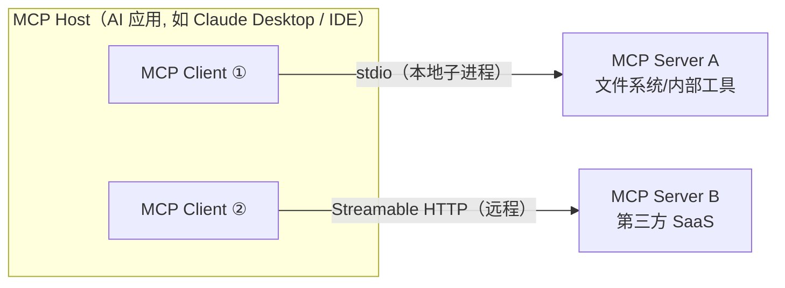
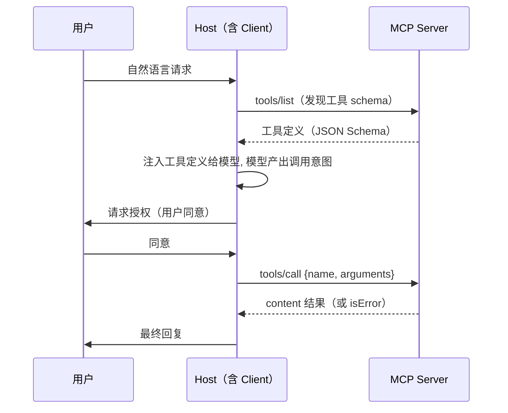

> **在哪一层**：层 4 · 行动与协作 ｜ **上一层出口**：能把模型输出接入会话与状态 ｜ **本层出口**：能实现/调试一个 MCP server（含路径安全与错误语义），并按 2026-07-28 版本意识做迁移决策
> **前置**：[工具调用契约](../../../01-contracts/tool-calling)、[工具执行工程](../tool-execution) ｜ **下一步**：[A2A](a2a)（Agent↔Agent 方向）、[协议地图](index)

## 1. 概述

**结论先讲**：没有 MCP 时，M 个 AI 应用接 N 个外部系统要写 M×N 套集成；MCP 把它变成 M+N——应用实现一次 client，系统实现一次 server，中间是开放协议。MCP（Model Context Protocol，模型上下文协议）是连接 LLM 应用与外部数据源和工具的开放标准：JSON-RPC 2.0 消息、三角色（host/client/server）、服务端三原语（tools/resources/prompts）、两种官方传输（stdio、Streamable HTTP）。

### 心智模型：三角色



- **Host**：发起连接的 LLM 应用；内含一个或多个 client。
- **Client**：host 内的连接器，维护与一个 server 的专属连接，把 tools/resources/prompts 呈现给模型。
- **Server**：提供上下文与能力的服务程序——本地子进程或远程 HTTP 服务。

一个 server 挂多个 client，一个 host 挂多个 server；每个 client 与一个 server 一一对应。

### 何时使用 / 何时不用

- 用：Agent 需要接外部工具/数据（文件、数据库、API、浏览器）；工具集需要跨应用复用；需要统一授权与审计边界。
- 不用：
  - 同 host 内的普通函数调用——直接函数即可（见[复杂度决策阶梯](../../../00-orientation/complexity-ladder)梯级 3）；
  - Agent↔Agent 协作——那是 [A2A](a2a) 的方向；
  - 只是想复用流程知识——[Skills](../skills) 不是协议。

### 决策表：与相邻协议/机制对比

| 机制 | 方向 | 控制权 | 状态 | 信任域 | 最低复杂度 |
| --- | --- | --- | --- | --- | --- |
| 直接函数调用 | 进程内 | 代码即边界 | 无 | 进程内 | 写一个函数 |
| MCP（本页） | Agent ↔ 工具/数据 | server 声明 + client/host 授权确认 | 2026-07-28 起无状态请求 | 跨进程/跨网络边界 | 一个 server + 工具 schema |
| A2A | Agent ↔ Agent | 双方自治 + 能力发现（Agent Card） | 异步 Task | 跨组织 | 双方实现协议端点 |
| Skills | 知识 → 上下文 | description 触发 | 静态文件 | 宿主进程内 | 一个文件夹 |

### 历史版本里程碑（均核验于 2026-09-01）

| 修订 | 关键变化 |
| --- | --- |
| 2024-11-05 | 早期修订；定义了 HTTP+SSE 传输（后被弃用） |
| 2025-03-26 | HTTP+SSE 传输在此版本被弃用，由 Streamable HTTP 取代 |
| 2025-11-25 | **最后一个 legacy 代修订**（initialize 握手代） |
| 2026-07-28 | 当前修订（modern 代）：协议改为无状态，移除 initialize 握手与 `Mcp-Session-Id`，新增 `server/discover`，请求经 `_meta` 携带版本与能力；ping、logging/setLevel 移除；Roots/Sampling/Logging 进入弃用流程 |

版本意识是本页主线：网上大量教程（含本仓旧笔记）描述的是 legacy 代行为，读时先对代次再对细节。

## 2. 使用

最小实战：零依赖实现一个 echo server + 驱动它的 client——不用任何 SDK，Node 内置模块手写 JSON-RPC over stdio，15 分钟内看到完整生命周期（握手→发现→调用→错误→优雅关闭）。

### 步骤 1：创建 `server.mjs`

```javascript fixture
// server.mjs — 零依赖最小 MCP server（node 内置模块）
// 实现 legacy 代交互面（initialize 握手, <=2025-11-25）：
// 双代（dual-era）server 必须继续应答 legacy client，这是当前互操作基线。
// 从 stdin 逐行读 JSON-RPC 2.0；每条回复一行写到 stdout。
// 日志只写 stderr（stdout 是协议通道）。
import { createInterface } from "node:readline";

const PROTOCOL_VERSION = "2025-11-25"; // 最新的 legacy 代修订

function result(id, payload) {
  return { jsonrpc: "2.0", id, result: payload };
}
function error(id, code, message) {
  return { jsonrpc: "2.0", id, error: { code, message } };
}

function handle(msg) {
  if (msg.method === "initialize") {
    return result(msg.id, {
      protocolVersion: PROTOCOL_VERSION,
      capabilities: { tools: {} },
      serverInfo: { name: "echo-server", version: "1.0.0" },
    });
  }
  if (msg.method === "notifications/initialized") return null; // 通知：不回复
  if (msg.method === "tools/list") {
    return result(msg.id, {
      tools: [{
        name: "echo",
        description: "Echoes the input text back, prefixed with 'echo:'.",
        inputSchema: {
          type: "object",
          properties: { text: { type: "string" } },
          required: ["text"],
        },
      }],
    });
  }
  if (msg.method === "tools/call") {
    const { name, arguments: args } = msg.params ?? {};
    if (name !== "echo") {
      return error(msg.id, -32602, `Unknown tool: ${name}`); // Invalid params
    }
    if (typeof args?.text !== "string") {
      return error(msg.id, -32602, "arguments.text must be a string");
    }
    return result(msg.id, { content: [{ type: "text", text: `echo: ${args.text}` }] });
  }
  // 其余一律 JSON-RPC "Method not found"
  return error(msg.id, -32601, `Method not found: ${msg.method}`);
}

const rl = createInterface({ input: process.stdin });
rl.on("line", (line) => {
  if (!line.trim()) return;
  let msg;
  try {
    msg = JSON.parse(line);
  } catch {
    console.error(`[server] non-JSON line ignored: ${line.slice(0, 40)}`);
    return;
  }
  const reply = handle(msg);
  if (reply) process.stdout.write(JSON.stringify(reply) + "\n");
});
rl.on("close", () => process.exit(0)); // client 关闭 stdin = 优雅关闭信号
console.error("[server] echo-server ready on stdio");
```

### 步骤 2：创建 `client.mjs`

```javascript fixture
// client.mjs — 零依赖最小 MCP client：拉起 server, 走完一次完整交互,
// 打印所有 JSON-RPC 消息；任一预期步骤失败则退出码 1。
import { spawn } from "node:child_process";

const child = spawn(process.execPath, ["server.mjs"], { stdio: ["pipe", "pipe", "inherit"] });

let nextId = 1;
const pending = new Map(); // id -> { method, resolve }
let buf = "";

child.stdout.on("data", (chunk) => {
  buf += chunk;
  let nl;
  while ((nl = buf.indexOf("\n")) !== -1) {
    const line = buf.slice(0, nl); buf = buf.slice(nl + 1);
    if (!line.trim()) continue;
    const msg = JSON.parse(line);
    console.log(`<-- ${JSON.stringify(msg)}`);
    pending.get(msg.id)?.resolve(msg);
    pending.delete(msg.id);
  }
});

function request(method, params) {
  const id = nextId++;
  return new Promise((resolve) => {
    pending.set(id, { method, resolve });
    const msg = { jsonrpc: "2.0", id, method, ...(params ? { params } : {}) };
    console.log(`--> ${JSON.stringify(msg)}`);
    child.stdin.write(JSON.stringify(msg) + "\n");
  });
}
function notify(method) {
  const msg = { jsonrpc: "2.0", method };
  console.log(`--> ${JSON.stringify(msg)}`);
  child.stdin.write(JSON.stringify(msg) + "\n");
}

const failures = [];
const expect = (ok, label) => { console.log(`${ok ? "PASS" : "FAIL"}  ${label}`); if (!ok) failures.push(label); };

// 1. legacy 生命周期：initialize -> notifications/initialized
const init = await request("initialize", {
  protocolVersion: "2025-11-25",
  capabilities: {},
  clientInfo: { name: "minimal-client", version: "1.0.0" },
});
expect(init.result?.serverInfo?.name === "echo-server", "initialize returns serverInfo");
expect(init.result?.capabilities?.tools !== undefined, "server advertises tools capability");
notify("notifications/initialized");

// 2. 发现工具
const list = await request("tools/list", {});
expect(list.result?.tools?.[0]?.name === "echo", "tools/list returns the echo tool");

// 3. 调用 echo 工具（正常路径）
const call = await request("tools/call", { name: "echo", arguments: { text: "hello mcp" } });
expect(call.result?.content?.[0]?.text === "echo: hello mcp", "tools/call echoes the text");

// 4. 负例：未知工具 + 未知方法
const badTool = await request("tools/call", { name: "nope", arguments: {} });
expect(badTool.error?.code === -32602, "unknown tool -> JSON-RPC -32602");
const badMethod = await request("debug/poke", {});
expect(badMethod.error?.code === -32601, "unknown method -> JSON-RPC -32601");

// 5. 优雅关闭：关 stdin, 等 server 退出
child.stdin.end();
const code = await new Promise((r) => child.on("exit", r));
expect(code === 0, `server exits 0 on stdin close (got ${code})`);
console.log(failures.length ? `result: ${failures.length} failure(s)` : "result: all checks passed");
process.exit(failures.length ? 1 : 0);
```

### 步骤 3：运行（正常路径）

```bash fixture
node client.mjs; echo "exit=$?"
```

正常输出节选（实测，Node 24；完整输出含全部消息逐行打印）：

```text fixture
--> {"jsonrpc":"2.0","id":1,"method":"initialize","params":{"protocolVersion":"2025-11-25","capabilities":{},"clientInfo":{"name":"minimal-client","version":"1.0.0"}}}
<-- {"jsonrpc":"2.0","id":1,"result":{"protocolVersion":"2025-11-25","capabilities":{"tools":{}},"serverInfo":{"name":"echo-server","version":"1.0.0"}}}
PASS  initialize returns serverInfo
PASS  server advertises tools capability
--> {"jsonrpc":"2.0","id":3,"method":"tools/call","params":{"name":"echo","arguments":{"text":"hello mcp"}}}
<-- {"jsonrpc":"2.0","id":3,"result":{"content":[{"type":"text","text":"echo: hello mcp"}]}}
PASS  tools/call echoes the text
PASS  unknown tool -> JSON-RPC -32602
PASS  unknown method -> JSON-RPC -32601
PASS  server exits 0 on stdin close (got 0)
result: all checks passed
exit=0
```

### 步骤 4：负例（错误语义长什么样）

client fixture 内置两个负例，单独看原始响应：

```text fixture
<-- {"jsonrpc":"2.0","id":4,"error":{"code":-32602,"message":"Unknown tool: nope"}}
<-- {"jsonrpc":"2.0","id":5,"error":{"code":-32601,"message":"Method not found: debug/poke"}}
```

`-32602` 是 JSON-RPC 的 Invalid params（工具名属于参数错误）；`-32601` 是 Method not found（方法层未知）。MCP 规范在 -32020 至 -32099 区间保留自己的错误码（如版本不支持的 `-32022`），不要挪用。

### 验收与清理

- 验收：`node client.mjs` 退出码 0，七项 PASS；`exit=$?` 为 0。
- 清理：`rm server.mjs client.mjs`。
- 旧 fixture：仓库的 `examples/mcp-lab/` 是基于官方 SDK 的旧教学示例；本页零依赖版是协议层最小实现，两者并存，读源码时以本页的代次叙述为准。

### 场景矩阵

| 场景 | 输入 | 动作 | 输出 | 适用 | 不适用 |
| --- | --- | --- |---|--- | --- |
| 基础：本地工具 | 文件/计算等本地能力 | stdio server 暴露 tools | host 内模型按需调用 | 个人/IDE 场景 | 需要跨网络共享 |
| 常见：桥接 HTTP API | 第三方 REST 服务 | server 做协议转换（对上是 MCP，对外是普通 HTTP client） | 统一成 MCP 工具 | 聚合多 API、集中鉴权审计 | 单一简单调用（直接 HTTP 更省） |
| 组合：MCP + Skills | 「连上之后怎么用」 | MCP 供连接，Skill 供流程 | 连接与步骤分工 | 工具使用规范 | 互替思维 |

## 3. 原理

### 两代生命周期（版本意识的根）

MCP 在 2026-07-28 完成了一次代际切换，读任何 MCP 资料先判代：

| | legacy 代（≤2025-11-25） | modern 代（2026-07-28 起） |
| --- | --- | --- |
| 会话 | 有状态：`initialize` 握手建会话（HTTP 有 `Mcp-Session-Id`） | **无状态**：无握手、无会话头 |
| 版本与能力 | 握手时一次协商（`protocolVersion`/`capabilities`） | **每个请求**经 `_meta` 携带（`io.modelcontextprotocol/protocolVersion`、`clientCapabilities`、`clientInfo`） |
| 探测 | 无 | server **必须**实现 `server/discover`，广播支持版本与能力；client 可先探测再调用，也可直接调用并处理版本错误 |
| 版本不匹配 | 握手失败 | `UnsupportedProtocolVersionError`（`-32022`），响应带 `supported` 列表，client 选交集重试 |
| 取消 | `notifications/cancelled`（通知） | 同左（沿用） |
| 兼容 | — | 双代（dual-era）实现同时支持两代：收到带 `_meta` 的请求按 modern 处理，收到 `initialize` 按 legacy 处理 |

**为什么这样设计**：无状态让 server 可以水平扩缩、请求可独立重试（连接断了在途请求丢失后直接换新请求重发），也删掉了会话粘性与恢复这类最贵的状态机。

### 原语：server 给什么、client 给什么（2026-07-28 状态）

| 方 | 原语 | 控制权 | 状态 |
| --- | --- | --- | --- |
| server | **tools**（可执行函数，模型控制） | 模型决定调用，host 必须先取得用户同意 | 活跃 |
| server | **resources**（只读上下文数据） | 应用控制 | 活跃 |
| server | **prompts**（可复用消息模板） | 用户控制 | 活跃 |
| client | **elicitation**（server 向用户请求补充信息） | 用户确认 | 活跃 |
| client | sampling / roots / logging | — | **已进入弃用流程**（2026-07-28；迁移建议：直接对接 LLM 供应商 API、经参数传目录、日志走 stderr/OTel） |

注意第三行的代际变化：旧教程把 sampling/roots/logging 讲成 client 标配能力；2026-07-28 起它们是弃用项，新实现不应新增依赖。另：异步长任务不再是核心方法，移入扩展 `io.modelcontextprotocol/tasks`；会话内 UI 是扩展 `io.modelcontextprotocol/ui`（MCP Apps）。

### 传输：stdio 与 Streamable HTTP

| | stdio | Streamable HTTP |
| --- | --- | --- |
| 形态 | client 把 server 拉起为子进程 | 远程 HTTP 端点 |
| 帧 | **换行分隔的 JSON-RPC，一行一条，禁止内嵌换行** | HTTP POST 携带 JSON-RPC；响应可流式 |
| 协议通道 | stdin/stdout；**stdout 只准写协议消息** | 请求/响应体 |
| 日志 | stderr（client 不应假定 stderr 输出等于出错） | 常规 HTTP 语义 + OTel |
| 关闭 | client 关 stdin → server 应立即退出（EOF 是唯一可移植的优雅关闭信号） | 连接/请求生命周期 |
| 授权 | 进程信任 + 宿主授权确认 | OAuth（见下） |
| 已弃用 | — | HTTP+SSE（2024-11-05 定义、2025-03-26 起弃用） |

规范明确 stdio 的帧格式与子进程生命周期是两件事：同样的「一行一条 JSON-RPC」可直接跑在 Unix socket/TCP 上。

### 授权（authorization）

远程 MCP server 的授权建立在 OAuth 系模型上：MCP server 扮演 OAuth 资源服务器。2026-07-28 的关键变化（核验）：动态客户端注册（RFC 7591）进入弃用流程，改用 **Client ID Metadata Documents**；授权服务器应在响应中带 `iss`（RFC 9207），client 兑换 code 前必须校验；凭据必须按签发方隔离，不得跨授权服务器复用。安全三原则（规范原文要点）：用户同意与控制、数据隐私、工具安全——工具即任意代码执行，其描述与注解在不可信来源下应视为不可信输入。

### 规范要求 vs 本地实测

| 规范要求（2026-07-28，2026-09-01 核验） | 本地实测（第 2 节 fixture） |
| --- | --- |
| stdout 不得写入任何非 MCP 消息的内容 | server 全部日志走 stderr，实测输出无污染 |
| 消息换行分隔、单行单条 | client 按行切分解析，全部通过 |
| client 关闭 stdin 后 server 应及时退出 | `rl.on("close") → process.exit(0)`，实测退出码 0 |
| 未知方法 → JSON-RPC 错误（legacy server 常用 -32601） | `debug/poke` 收到 `-32601`，实测一致 |
| modern 代每个请求带 `_meta` 版本；server 必须实现 `server/discover` | **fixture 未实现**（它刻意实现 legacy 面以便与最大存量的双代 client 互操作）；补 modern 面时按上表加 `_meta` 与 `server/discover` |
| Roots/Sampling/Logging 弃用 | fixture 不依赖这三者 |

### 控制流全景（一次工具调用）



关键边界：**模型输出的是调用意图，host 解析后构建 JSON-RPC**——模型不直接说协议。授权发生在 host 侧（工具=任意代码执行）。

## 4. 开发

### 调试工具链

- **MCP Inspector**（官方，https://github.com/modelcontextprotocol/inspector）：交互式连接 server，可视化查看 initialize/tools/list/tools/call 与原始消息，是「先看真实消息再改代码」的第一站。
- **日志**：stdio server 日志只进 stderr；在 host 侧打开 server stderr 转发即可看到生命周期日志。
- **超时**：host 对 `tools/call` 设超时；server 对外部依赖（文件、HTTP）设内层超时，超时返回 `isError` 结果而不是挂死。

### 症状 → 证据 → 处理 → 完成标准

**症状**：client 报 JSON parse error / 消息流错乱，工具时好时坏。
**证据**：server 把日志或 banner 打到了 stdout——stdout 混入非协议内容，破坏「一行一条 JSON-RPC」的帧。
**处理**：所有输出改走 `console.error`（stderr）或日志库默认 stderr；CI 加一条断言：stdout 每行都能 `JSON.parse` 成功。
**完成标准**：Inspector 连接该 server 无解析错误；CI 断言常绿。

### 症状 → 证据 → 处理 → 完成标准

**症状**：client 连上后长时间无响应或直接报错，双方都「正常启动」。
**证据**：代次不匹配——modern client 遇到 legacy-only server（或反之）；用 `server/discover` 探测：返回 `DiscoverResult` 或版本错误（`-32022`）= 对端是 modern；返回其他错误或不响应 = legacy。
**处理**：client 侧实现双代回退（探测失败即退回 `initialize` 握手）；或升级 server 同时应答两代（收到带 `_meta` 的请求按 modern 处理，收到 `initialize` 按 legacy 处理）。
**完成标准**：用 Inspector 与目标 host 各连一次，两种打开方式都能完成 tools/list。

### 症状 → 证据 → 处理 → 完成标准

**症状**：文件类工具能读到服务器上任意文件（如 `.env`、密钥）。
**证据**：工具的路径参数未做根目录约束。本仓真实教训：`examples/mcp-lab` 的 `read_file_summary` 工具接受**绝对路径**直接 `fs.readFile`——模型（或诱导模型的输入）可以让它读宿主机器上任何文件。参数 schema 只验证类型，不验证边界。
**处理**：**root allowlist 模式**——server 启动时显式声明允许访问的根目录，所有路径参数先解析再校验包含关系，越界返回错误：

```javascript normative
// 路径安全：root allowlist（修复 examples/mcp-lab read_file_summary 的模式）
import { readFile } from "node:fs/promises";
import { resolve, relative, isAbsolute } from "node:path";

// 1. 显式声明允许访问的根（来自配置/环境, 不是来自模型输入）
const ALLOWED_ROOTS = [resolve(process.env.DATA_ROOT ?? "./data")];

function assertWithinRoots(p) {
  const abs = isAbsolute(p) ? resolve(p) : resolve(process.cwd(), p);
  const ok = ALLOWED_ROOTS.some((root) => {
    const rel = relative(root, abs);
    return rel === "" || (!rel.startsWith("..") && !isAbsolute(rel));
  });
  if (!ok) throw new Error(`path outside allowed roots: ${p}`);
  return abs;
}

// 2. 工具实现里先校验再读
export async function readFileSummary(filePath) {
  const abs = assertWithinRoots(filePath);       // 越界在这里抛错
  const content = await readFile(abs, "utf-8");  // 校验通过才碰文件系统
  return content.slice(0, 100);
}
```

**完成标准**：负例测试（`../../etc/passwd`、绝对路径指向允许根之外）全部返回错误而非内容；正例（允许根内相对路径）不受影响；测试进 CI。

### 症状 → 证据 → 处理 → 完成标准

**症状**：升级 SDK/规范版本后 server 行为异常（ping 失效、日志级别不生效、握手报错）。
**证据**：对照 2026-07-28 变更清单：`ping` 与 `logging/setLevel` 已移除（日志级别改为请求级 `_meta`）；`initialize` 握手在 modern 代不存在；结果对象新增必填 `resultType`（legacy server 省略时 client 按 `"complete"` 处理）。
**处理**：按迁移清单逐项替换——ping→业务层心跳或删除；logging→stderr/OTel；握手→per-request `_meta` 或保留双代应答；错误码若用到 `-32001/-32003/-32004` 改为重编号后的 `-32020/-32021/-32022`。
**完成标准**：目标 host 与 Inspector 双代各连一次通过；版本升级 PR 附迁移对照表。

### 反模式清单

- **「一次挂五个 server」**：工具定义先吃掉上下文预算；按当期任务最小化启用。
- **stdout 当日志**：见 runbook 1，必炸。
- **路径参数无边界**：见 runbook 3；schema 只管类型不管权限。
- **把工具描述当可信输入**：规范明确注解来自不可信 server 时应视为不可信。
- **拿 MCP 做 Agent↔Agent 通信**：方向错了，用 [A2A](a2a)。

## 5. 资料库

四级阅读路线：

- **Beginner**：跑通第 2 节 fixture；用 Inspector 重连一次看原始消息。
- **Builder**：读 2026-07-28 规范的 Architecture 与 Base Protocol 两页；给自己的 server 补 modern 代 `_meta` 与 `server/discover`。
- **Operator**：把「stdout 纯净性」与「路径越界」两测进 CI；跟踪官方 SDK 版本与 CHANGELOG。
- **Researcher**：读版本页的兼容矩阵与 SEP 记录（无状态化、MRTR、subscriptions/listen 的取舍）。

### 资源表

| 名称 | 证据层级 | canonical URL | 用途 | 支持的断言 | 下一步 |
| --- | --- | --- | --- | --- | --- |
| MCP 规范（latest=2026-07-28） | L0（官方规范） | https://modelcontextprotocol.io/specification/latest | 协议契约唯一来源 | 代次划分、原语、传输、弃用清单（retrievedAt 2026-09-01） | 读 Architecture / Base Protocol |
| 版本与兼容页 | L0（官方规范） | https://modelcontextprotocol.io/specification/2026-07-28/basic/lifecycle | modern/legacy 与兼容矩阵 | `_meta` 字段名、`server/discover`、`-32022`（retrievedAt 2026-09-01） | 对照第 3 节两代表 |
| Key Changes（changelog） | L0（官方规范） | https://modelcontextprotocol.io/specification/latest/changelog | 修订间差异 | 2026-07-28 全部变更与弃用（retrievedAt 2026-09-01） | 迁移清单来源 |
| MCP Inspector | L0（官方工具） | https://github.com/modelcontextprotocol/inspector | 交互式调试 | 官方调试入口（retrievedAt 2026-09-01） | 第 4 节 runbook 实操 |
| MCP SDK（TypeScript/Python 等） | L0（官方工具） | https://modelcontextprotocol.io/sdk | 生产实现 | 官方多语言 SDK（retrievedAt 2026-09-01） | 替换手写实现 |

### 主动证伪与未决问题

- 证伪入口：若你的 server 在两种代次下与规范行为不符（如 `server/discover` 返回形状不对），以规范 schema 为准并修订本页「规范 vs 实测」表。
- 未决：2026-07-28 之后的新修订（watch specVersion）；弃用项（Roots/Sampling/Logging、HTTP+SSE、RFC 7591 注册）的最终移除时间表；扩展生态（tasks/ui）的稳定性——均需按核验日复查。

### learn-ai 到此为止 / 继续去哪

- 工具调用的模型侧契约（schema、选择、参数验证）：[工具调用契约](../../../01-contracts/tool-calling)。
- 幂等/超时/重试/审批的执行工程：[工具执行工程](../tool-execution)。
- Agent↔Agent 方向：[A2A](a2a)；全景：[协议地图](index)。
- 具体第三方 MCP server 的用法（如 chrome-devtools-mcp）：Products 区。
