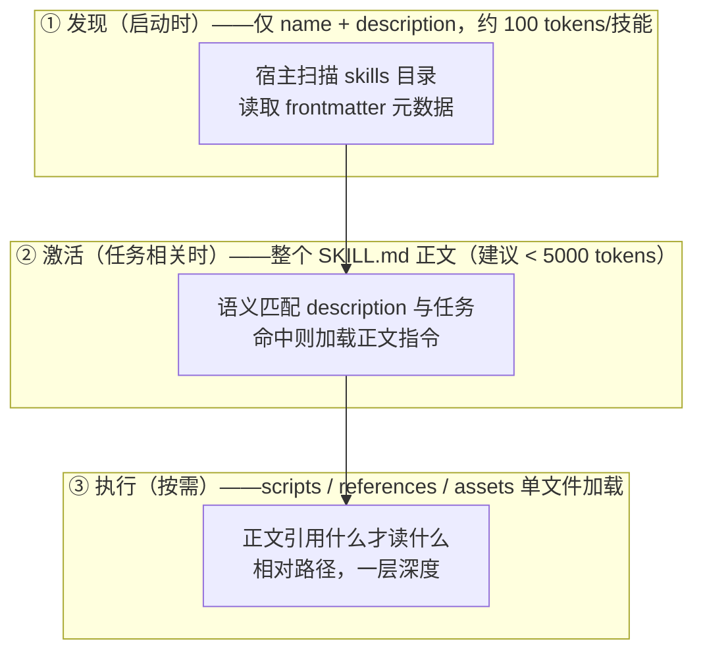

> **在哪一层**：层 4 · 行动与协作 ｜ **上一层出口**：能把模型输出接入会话与状态 ｜ **本层出口**：能把一套重复流程打包成 Skill，让宿主按需加载并稳定触发
> **前置**：[上下文工程](../01-contracts/context)、[工具调用契约](../01-contracts/tool-calling) ｜ **下一步**：[Agent Plugins](plugins)（打包分发）、[协议地图](protocols/index)

## 1. 概述

**结论先讲**：当同一段「怎么做」的指令在多次对话里重复出现，把它打包成一个 Skill——一个带 `SKILL.md` 的文件夹。Skills 解决的是**可复用程序性知识的打包与发现问题**：它是 instruction/package format（指令与资源的打包格式），不是 wire protocol（线上协议）。它不做网络通信、不做能力协商；它决定「什么知识、何时、以多大体积进入上下文」。

### 心智模型：一个文件夹 + 三层加载



关键不变量：**大多数技能停留在第①层**。100 个技能只占约 1 万 token 的元数据预算；只有被任务命中的技能才把正文放进上下文。这就是「渐进披露（progressive disclosure）」——上下文工程（层 1）在能力包装上的应用。

### 何时使用 / 何时不用

- 用：团队工作流规范、输出标准、领域操作步骤（如何发版、如何写周报、如何查某系统）、需要附带脚本的重复流程。
- 不用：
  - 需要连接外部系统取数/执行 → 那是工具调用与 [MCP](protocols/mcp) 的事；
  - 只用一次的指令 → 直接写进 prompt；
  - 需要独立上下文与权限隔离的任务执行 → subagent（见 [Agent 运行时](agent-runtime)）。

### 决策表：与相邻机制对比

| 机制 | 方向 | 控制权 | 状态 | 信任域 | 最低复杂度 |
| --- | --- | --- | --- | --- | --- |
| Prompt（单次指令） | 读 | 每次手写 | 无 | 进程内 | 直接写在对话里 |
| Skill（本页） | 读（可含脚本执行） | description 决定触发 | 文件即资产，无运行态 | 宿主进程内 | 一个含 SKILL.md 的文件夹 |
| Tool / MCP server | 读写外部 | 函数边界 + 参数校验 | server 进程 | 跨进程边界 | 一个函数 + schema |
| Subagent | 读写 | 独立上下文 + 独立工具权限 | 会话状态 | host 内隔离 | 运行时配置 |

经验法则（社区口径）：同一段指令重复 5 次以上，就该从 prompt 升格为 Skill。

### 历史版本里程碑

- Anthropic 于 2025-10 推出 Claude Skills（社区记录，一手日期未验证）；随后开放为 Agent Skills 规范（agentskills.io）。
- agentskills.io 规范页当前未标注版本号（2026-09-01 核验）；`allowed-tools` 字段在规范中标注为 Experimental（实验性）。

## 2. 使用

最小实战：15 分钟内创建一个 Skill 目录，并用零依赖校验器验证结构。全程无 API key，Node LTS 即可。

### 步骤 1：创建最小 Skill 目录

```text fixture
skills-lab/
├── commit-helper/
│   ├── SKILL.md              # 必需：frontmatter + 正文指令
│   └── scripts/
│       └── analyze-diff.sh   # 可选：可执行脚本
└── validate-skill.mjs        # 校验器（下一步创建）
```

`commit-helper/SKILL.md`：

```markdown fixture
---
name: commit-helper
description: Generates conventional commit messages from staged changes. Use when the user asks for a commit message or wants to amend one.
---

# Commit Message Helper

## When to Use

The user asks for a commit message for staged changes.

## Process

1. Run `scripts/analyze-diff.sh` to get the staged change summary.
2. Pick a type (feat/fix/docs/refactor/test/chore) and a scope.
3. Write a subject in imperative mood, max 50 characters.
```

`commit-helper/scripts/analyze-diff.sh`：

```bash fixture
#!/bin/bash
# Prints a compact summary of staged changes for commit message generation.
git diff --cached --stat
echo "---"
git diff --cached --name-only
```

### 步骤 2：编写零依赖结构校验器

Skills 规范没有强制 schema 校验环节，lint 策略是自己校验结构完整性。以下校验器只做规范的结构断言（frontmatter 必填字段、name 命名规则、name 与目录一致），Node 内置模块实现：

```javascript fixture
// validate-skill.mjs — 零依赖 Agent Skills 结构校验器
// 用法: node validate-skill.mjs <skill-dir>
// 退出码 0 = 全部通过; 1 = 至少一项失败
import { readFileSync } from "node:fs";
import { basename, join } from "node:path";

const skillDir = process.argv[2];
if (!skillDir) {
  console.error("usage: node validate-skill.mjs <skill-dir>");
  process.exit(1);
}

const failures = [];
const check = (ok, label) => {
  console.log(`${ok ? "PASS" : "FAIL"}  ${label}`);
  if (!ok) failures.push(label);
};

// 1. SKILL.md 存在且以 frontmatter 块开头
let raw;
try {
  raw = readFileSync(join(skillDir, "SKILL.md"), "utf-8");
  check(true, "SKILL.md exists");
} catch {
  check(false, "SKILL.md exists");
  console.error(`result: ${failures.length} failure(s)`);
  process.exit(1);
}

const fmMatch = raw.match(/^---\r?\n([\s\S]*?)\r?\n---/);
check(fmMatch !== null, "frontmatter block delimited by ---");

// 2. 提取顶层 key: value（对必填字段足够）
const fm = {};
if (fmMatch) {
  for (const line of fmMatch[1].split(/\r?\n/)) {
    const m = line.match(/^([A-Za-z-]+):\s*(.*)$/);
    if (m && !line.startsWith(" ")) fm[m[1]] = m[2].trim();
  }
}

// 3. name: 必填, 1-64 字符, 小写字母数字+连字符,
//    无首尾/连续连字符, 必须与父目录名一致
const name = fm.name ?? "";
check(!!name, "frontmatter has non-empty name");
check(/^[a-z0-9]+(-[a-z0-9]+)*$/.test(name) && name.length <= 64,
  "name matches ^[a-z0-9]+(-[a-z0-9]+)*$ and is <= 64 chars");
check(name === basename(skillDir), `name matches directory name (expected "${basename(skillDir)}")`);

// 4. description: 必填, 1-1024 字符
const description = fm.description ?? "";
check(description.length >= 1 && description.length <= 1024,
  `description is 1-1024 chars (got ${description.length})`);

// 5. frontmatter 之后有非空 Markdown 正文
const body = fmMatch ? raw.slice(fmMatch[0].length).trim() : "";
check(body.length > 0, "markdown body is non-empty");

console.log(failures.length === 0
  ? `result: all checks passed for "${name}"`
  : `result: ${failures.length} failure(s): ${failures.join("; ")}`);
process.exit(failures.length === 0 ? 0 : 1);
```

### 步骤 3：运行（正常路径）

```bash fixture
cd skills-lab
node validate-skill.mjs commit-helper
```

正常输出（实测，Node 24）：

```text fixture
PASS  SKILL.md exists
PASS  frontmatter block delimited by ---
PASS  frontmatter has non-empty name
PASS  name matches ^[a-z0-9]+(-[a-z0-9]+)*$ and is <= 64 chars
PASS  name matches directory name (expected "commit-helper")
PASS  description is 1-1024 chars (got 126)
PASS  markdown body is non-empty
result: all checks passed for "commit-helper"
```

### 步骤 4：负例（错误示范）

创建一个违规的 `pdf-helper/SKILL.md`：name 大写且与目录不符、缺少 description：

```markdown fixture
---
name: PDF-Helper
---

Helps with PDFs.
```

```bash fixture
node validate-skill.mjs pdf-helper; echo "exit=$?"
```

负例输出（实测）：

```text fixture
PASS  SKILL.md exists
PASS  frontmatter block delimited by ---
PASS  frontmatter has non-empty name
FAIL  name matches ^[a-z0-9]+(-[a-z0-9]+)*$ and is <= 64 chars
FAIL  name matches directory name (expected "pdf-helper")
FAIL  description is 1-1024 chars (got 0)
PASS  markdown body is non-empty
result: 3 failure(s): name matches ^[a-z0-9]+(-[a-z0-9]+)*$ and is <= 64 chars; name matches directory name (expected "pdf-helper"); description is 1-1024 chars (got 0)
exit=1
```

### 验收与清理

- 验收：正常路径退出码 0，负例退出码 1；两者输出与上面一致。
- 清理：`rm -rf skills-lab`。
- 宿主接入（可选）：Claude Code 等宿主从其 skills 目录（如项目或用户级 `skills/`）发现技能；本仓约定 Skill 只放在 `.claude/skills/<name>/SKILL.md`（直接放 `.claude/` 根目录不会被发现）。

### 场景矩阵

| 场景 | 输入 | 动作 | 输出 | 适用 | 不适用 |
| --- | --- | --- | --- | --- | --- |
| 基础：流程标准化 | 团队发布步骤 | 步骤写进 SKILL.md 正文 | 每次按同一清单执行 | 无脚本的纯指令流程 | 需要外部数据源 |
| 常见：脚本封装 | 重复的命令序列 | 脚本放 `scripts/`，正文写何时运行 | 宿主按需执行脚本 | 确定性子步骤 | 需要模型判断的步骤 |
| 组合：Skill + MCP | 「连上系统后按什么步骤做」 | MCP 提供连接，Skill 提供流程 | 连接与流程分工 | 工具使用规范 | 二选一的场合（两者互补不互斥） |

## 3. 原理

### SKILL.md 结构契约（按核验到的规范）

| 字段 | 必填 | 约束 |
| --- | --- | --- |
| `name` | 是 | 1-64 字符；仅小写字母、数字、连字符；不能首尾连字符、不能连续 `--`；**必须与父目录名一致** |
| `description` | 是 | 1-1024 字符；应同时说明「做什么」与「何时用」 |
| `license` | 否 | 许可证名或打包的许可证文件引用 |
| `compatibility` | 否 | 1-500 字符；环境要求（目标产品、系统依赖、网络） |
| `metadata` | 否 | 字符串键值映射；客户端自定义元数据 |
| `allowed-tools` | 否 | 空格分隔的预授权工具串；**规范标注 Experimental**，各实现支持程度不一 |

目录惯例：`SKILL.md` 必需；`scripts/`（可执行代码）、`references/`（按需阅读的文档）、`assets/`（模板、数据等静态资源）为推荐目录。正文引用一律用**相对路径、一层深度**，避免深层引用链。

### 渐进披露的三层预算

| 层 | 加载时机 | 体积预算 | 内容 |
| --- | --- | --- | --- |
| ① 元数据 | 宿主启动，所有技能 | 约 100 tokens/技能 | name + description |
| ② 正文 | 技能被任务命中激活 | 建议 < 5000 tokens；正文建议 < 500 行 | SKILL.md Markdown 正文 |
| ③ 资源 | 正文引用时 | 按需，单文件 | scripts / references / assets |

### 触发是语义匹配，不是关键词注册

宿主用模型的语义理解评估「任务 ↔ description」相关性。推论：description 要写**意图与场景**（动词、对象、边界），不是堆关键词；泛化描述（"Helps with PDFs."）触发不稳，具体描述（"Extracts text and tables from PDF files... Use when working with PDF documents..."）才可靠。description 是唯一影响触发的字段——正文写得再好，描述不命中就不会被加载。

### 规范要求 vs 本地实测

| 规范要求（agentskills.io，2026-09-01 核验） | 本地实测（校验器 fixture） |
| --- | --- |
| name 必须与父目录一致 | 负例 `PDF-Helper` 被第 3 组检查捕获 |
| description 1-1024 字符 | 负例缺失 description 被捕获（got 0） |
| 正文无格式限制，但建议拆分引用文件 | 校验器只断言非空，不约束结构（与规范一致） |
| 官方校验工具为 `skills-ref validate` | 本页零依赖校验器覆盖其结构断言子集；接入 CI 时优先用官方库 |

### 与 tools、与资产目录的关系

- **Skills vs tools**：Skill 是知识封装（告诉模型「按什么步骤做」），tool 是可调用函数（给模型一个可执行的接口）。Skill 里的脚本最终也通过宿主的工具能力执行——Skill 不新增执行机制，只组织知识与入口。
- **本页与 [/zh/skills/ 资产目录](/zh/skills/) 的关系**：本页是方法论 canonical（格式、触发、验证）；`/zh/skills/` 是本仓的技能资产登记（registry projection），列出实际可用的技能资产。改方法论改这里，加资产去那里。

## 4. 开发

### 集成与宿主差异

- **Claude Code**：从项目级/用户级 skills 目录发现；本仓约定 `.claude/skills/<name>/SKILL.md`。
- **Claude.ai / API**：产品内上传或 `/v1/skills` 端点（产品能力随版本变化，以官方文档为准；接入细节归 Products，不在本页复制）。
- 跨宿主分发时，格式按 agentskills.io 规范写；宿主特有行为（触发实现、脚本沙箱）不进 Skill 正文。

### 症状 → 证据 → 处理 → 完成标准

**症状**：该触发的时候不触发——任务明明匹配，技能没被加载。
**证据**：宿主日志/调试输出里看不到该技能激活；对比任务措辞与 description，缺少意图词与场景词。
**处理**：改写 description——加动词（extract/create/merge）、加对象与文件类型、加「Use when...」场景句、加「Not for...」边界句；用 2-3 种自然措辞重试任务。
**完成标准**：显式请求（「用 commit-helper 写提交信息」）与自然请求（「帮我写条提交信息」）都能触发；邻近的不相关任务不触发。

### 症状 → 证据 → 处理 → 完成标准

**症状**：不相关的任务也触发，技能互相干扰。
**证据**：description 过于宽泛（如「处理文档」），或一个技能塞了多个领域；激活日志显示错误命中。
**处理**：拆分为单一用途的技能；在 description 里显式写排除项（"Not for ..."）；按「一个技能 = 一个领域/工作流」收敛粒度。
**完成标准**：越界测试（对邻近任务发请求）连续不触发；正常任务不受影响。

### 症状 → 证据 → 处理 → 完成标准

**症状**：脚本不被执行或执行报错。
**证据**：正文中脚本路径写成了绝对路径或嵌套路径；脚本无执行权限；脚本依赖宿主沙箱里不存在的运行时。
**处理**：改为技能根相对路径（`scripts/analyze-diff.sh`，一层深度）；补执行权限（`chmod +x`）；脚本自包含或在 `compatibility` 里声明依赖。
**完成标准**：clean checkout 下按正文步骤从头到尾跑通一次。

### 症状 → 证据 → 处理 → 完成标准

**症状**：激活技能后上下文被撑爆，响应变慢变贵。
**证据**：SKILL.md 超过 500 行或正文超 5000 tokens；大量参考内容内联在正文里。
**处理**：正文只留流程骨架，细节移入 `references/`；正文用「菜单」方式引用（描述有什么、按需读哪个文件）。
**完成标准**：正文回到 500 行以内；同一任务的总 token 消耗对比迁移前下降。

### 版本与迁移

- 规范当前未标注版本号，字段级兼容风险点是 `allowed-tools`（Experimental）；生产技能不要依赖它做安全边界——权限收敛由宿主的工具授权承担（见[工具执行工程](tool-execution)）。
- 官方校验库 `skills-ref` 的 `validate` 子命令可进 CI：先跑结构 lint，再跑触发测试（正例 + 越界负例）。

### 反模式清单

- **凭空造技能**：没有 5 次以上真实重复就打包——会得到没人触发的能力孤儿。
- **描述堆关键词**：触发是语义匹配；关键词列表既不充分也不必要。
- **把 SKILL.md 当仓库**：正文塞满参考材料，违背渐进披露的三层预算。
- **用技能做安全边界**：`allowed-tools` 是 Experimental 的便利字段，不是权限模型；敏感操作要有宿主级审批。

## 5. 资料库

四级阅读路线：

- **Beginner**：读懂本页 + 在宿主里用现成技能；能复述三层加载与 description 的作用。
- **Builder**：按第 2 节亲手建一个技能并过校验器；读规范页核对每个 frontmatter 字段。
- **Operator**：把校验器与触发测试接进 CI；建立团队技能的评审与淘汰节奏。
- **Researcher**：读 anthropics/skills 仓库的真实技能，分析其 description 写法与正文拆分策略。

### 资源表

| 名称 | 证据层级 | canonical URL | 用途 | 支持的断言 | 下一步 |
| --- | --- | --- | --- | --- | --- |
| Agent Skills 规范 | L0（官方规范） | https://agentskills.io/specification | 格式契约唯一来源 | 字段表、目录惯例、渐进披露预算（retrievedAt 2026-09-01） | 对照第 3 节字段表 |
| skills-ref 校验库 | L0（官方工具） | https://github.com/agentskills/agentskills/tree/main/skills-ref | `skills-ref validate` 结构校验 | 官方 lint 入口（retrievedAt 2026-09-01） | 接入 CI |
| Anthropic 工程博客：Agent Skills | L1（维护者） | https://www.anthropic.com/engineering/equipping-agents-for-the-real-world-with-agent-skills | 设计动机与渐进披露论证 | 「打包知识而非硬编码」的工程口径（retrievedAt 2026-09-01） | 读编排案例 |
| anthropics/skills 仓库 | L1（维护者） | https://github.com/anthropics/skills | 官方示例技能集 | 真实技能的 description 写法（retrievedAt 2026-09-01） | 模仿粒度与拆分 |

### 主动证伪与未决问题

- 证伪入口：若你发现某宿主对同一 SKILL.md 的触发/加载行为与本页「规范要求 vs 本地实测」表相矛盾，以规范与该宿主文档为准，并修订本页分栏表。
- 未决：agentskills.io 规范未标注版本号，字段演进（尤其 `allowed-tools`）需要按核验日复查；宿主差异（触发实现、脚本沙箱）归 Products 各自记录，本页不维护逐宿主矩阵。

### learn-ai 到此为止 / 继续去哪

- 触发的底层是上下文与语义匹配：[上下文工程](../01-contracts/context)。
- 脚本执行的权限、幂等、审批：[工具执行工程](tool-execution)。
- 把技能与 MCP server 打包分发：[Agent Plugins](plugins)。
- 本仓技能资产登记（projection）：[/zh/skills/](/zh/skills/)。
