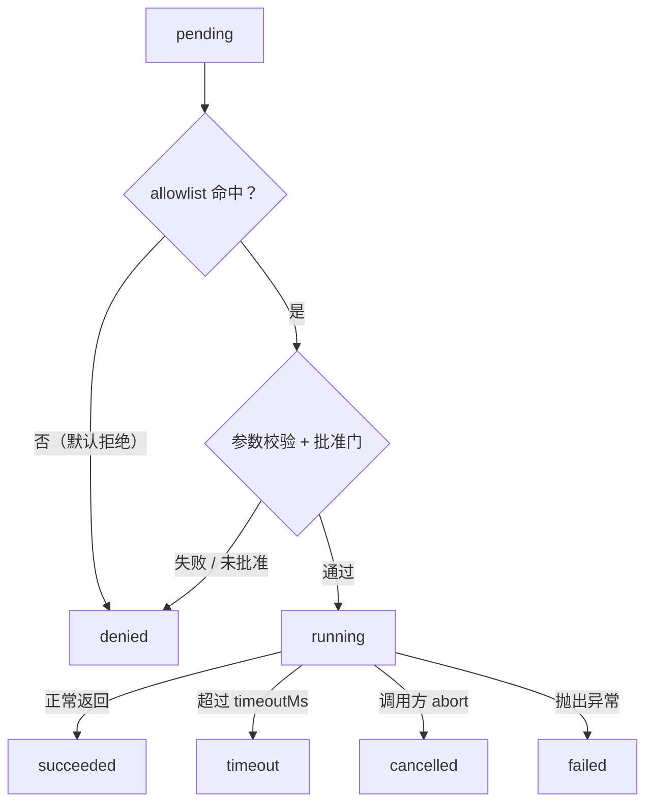

> **在哪一层**：层 4 · 行动与协作 ｜ **上一层出口**：能构建可追溯的检索链 ｜ **本层出口**：能把一次模型发起的动作放进一个可拒绝、可超时、可取消、可去重的受控执行器里
> **前置**：[工具调用契约](../01-contracts/tool-calling)、[结构化输出](../01-contracts/structured-output) ｜ **下一步**：[工作流模式](workflow)、[恢复与人工批准](agent-runtime/recovery-hitl)、[安全](../05-operations/security)

## 1. 概述

**结论先讲**：模型返回的 `tool_use` 只是一个「请求」，不是一次执行。层 1 的[工具调用契约](../01-contracts/tool-calling)规定了模型如何表达调用；本章规定**你的代码如何执行它**。凡是改变外部状态的动作（写文件、发请求、改数据库），都必须过五道门：**幂等去重 → allowlist → 参数校验 → 人工批准 → 超时与取消**。缺任何一道，重试、网络抖动或模型幻觉都会变成真实世界的副作用。

### 心智模型：执行状态机

模型侧只看到「调用 → 结果」；执行侧是一个显式状态机，每条边都有owner：



关键区别：`denied` 发生在**任何副作用之前**（策略拒绝，可安全重试修正后重发）；`failed`/`timeout`/`cancelled` 发生在**执行中或之后**（副作用可能已部分发生，重试必须靠幂等键保护）。

### 何时使用 / 何时不用

- 用：任何会进入生产的工具调用——无论来自 agent 循环、workflow 还是单次 API 交互。
- 不用：纯只读且无成本的查询在原型期可以裸调用；但只要它会出现在重试路径上，`readonly` 也是一种需要登记的副作用档位。

### 决策表

| 方案 | 方向 | 控制权 | 状态 | 信任域 | 最低复杂度 |
| --- | --- | --- | --- | --- | --- |
| 直接函数调用（代码写死） | 写 | 全在你，无模型参与 | 无 | 进程内 | 步骤能枚举时就不要让模型决策 |
| 裸 tool call（模型直连函数） | 写 | 模型决定何时、带何参数 | 单次调用结果 | 进程内 | demo 与一次性原型 |
| 受控 executor（本章） | 写 | 五道门 + 调用记录 | 每次调用可审计 | 进程内 | 任何会进生产的工具调用 |
| MCP server 工具 | 写 | server 侧权限与沙箱 | 会话状态 | 跨进程边界 | 工具需要跨进程/跨团队复用时（见[协议地图](protocols/)） |

「方向」沿用[复杂度决策阶梯](../00-orientation/complexity-ladder)的读/写世界口径：从梯级 3 起，写世界的每一级都必须回答权限、幂等、取消、重试、批准与回滚。

### 副作用四档

| 档位 | 定义 | 执行策略 | 例子 |
| --- | --- | --- | --- |
| `readonly` | 不改变外部状态 | 直接执行，可随意重试 | 查询配置、搜索 |
| `reversible` | 可用补偿动作撤销 | 执行 + 登记补偿 | 创建草稿、加标签 |
| `irreversible` | 不可撤销 | 幂等键必须；失败不自动重试 | 删除数据、对外发送 |
| `approval` | 不可逆且影响面大 | 人工批准后才进入执行 | 生产发布、资金操作 |

历史版本里程碑：本章整合自旧页《Advanced Tool Use》（Anthropic 工程博客的仓库存档）；工具搜索、编程式调用、调用示例等**模型侧**特性已划归相关协议章，本章只保留**执行侧**不变量。更早时间线未验证，不编造。

## 2. 使用

最小实战：一个受控执行器 + 两个 mock 工具（一个只读、一个写文件），演示**正常 / 超时 / 取消 / allowlist 拒绝**四种输出，外加幂等去重与路径逃逸拒绝两个负例。零 API key、零依赖。

**环境**：Node ≥ 22.18（原生 type stripping）。保存为 `tool-execution.ts`，运行 `node tool-execution.ts`。

```ts
// tool-execution.ts — a controlled tool executor: allowlist + validation + idempotency + timeout + cancel.
// Zero dependencies. Runs natively on Node >= 22.18: node tool-execution.ts
import { mkdir, rm, writeFile } from "node:fs/promises";
import { tmpdir } from "node:os";
import { join, resolve, sep } from "node:path";
import { setTimeout as sleep } from "node:timers/promises";

// ---------- Contracts: four side-effect tiers + a call state machine ----------
type SideEffect = "readonly" | "reversible" | "irreversible" | "approval";
type CallStatus =
  | "pending" | "running" | "succeeded"
  | "failed" | "timeout" | "cancelled" | "denied";

interface ToolDef {
  name: string;
  sideEffect: SideEffect;
  timeoutMs: number;          // deadline: abort on expiry; never wait for the tool to behave
  validate: (input: any) => string | null; // non-null = rejection reason (args / path escape)
  run: (input: any, signal: AbortSignal) => Promise<unknown>;
}

interface CallRecord {
  id: number;
  tool: string;
  status: CallStatus;
  output?: unknown;
  error?: string;
}

const BASE_DIR = join(tmpdir(), "tool-execution-demo");

// ---------- Two mock tools: one readonly, one that writes a file ----------
const readConfig: ToolDef = {
  name: "read_config",
  sideEffect: "readonly",
  timeoutMs: 1000,
  validate: (i) => (typeof i.key === "string" ? null : "key must be a string"),
  run: async (i) => ({ key: i.key, value: "dark-theme" }),
};

const slowSearch: ToolDef = {
  name: "slow_search",
  sideEffect: "readonly",
  timeoutMs: 50, // deliberately small, to demonstrate timeout
  validate: () => null,
  run: async (i, signal) => {
    await sleep(500, undefined, { signal }); // tools MUST honor the signal, or cancel cannot propagate
    return { hits: 42 };
  },
};

const writeReport: ToolDef = {
  name: "write_report",
  sideEffect: "irreversible",
  timeoutMs: 1000,
  validate: (i) => {
    const target = resolve(BASE_DIR, i.path);
    if (target !== BASE_DIR && !target.startsWith(BASE_DIR + sep)) {
      return `path escapes sandbox: ${i.path}`;
    }
    return null;
  },
  run: async (i) => {
    const target = resolve(BASE_DIR, i.path);
    await writeFile(target, i.content, "utf8");
    return { written: i.path, bytes: i.content.length };
  },
};

const deleteEverything: ToolDef = {
  name: "delete_everything",
  sideEffect: "irreversible",
  timeoutMs: 1000,
  validate: () => null,
  run: async () => ({ deleted: true }),
};

// ---------- Executor: registry + allowlist + idempotency + timeout + cancel ----------
class ControlledExecutor {
  private registry = new Map<string, ToolDef>();
  private allowlist = new Set<string>();
  private idempotency = new Map<string, CallRecord>();
  private nextId = 1;

  register(tool: ToolDef, allowed = true) {
    this.registry.set(tool.name, tool);
    if (allowed) this.allowlist.add(tool.name);
  }

  async execute(
    name: string,
    input: any,
    opts: { idempotencyKey?: string; approved?: boolean; signal?: AbortSignal } = {},
  ): Promise<CallRecord> {
    const rec: CallRecord = { id: this.nextId++, tool: name, status: "pending" };
    // state-machine transition log: print old -> new, then update atomically
    const log = (s: CallStatus) => {
      console.log(`[call ${rec.id}] ${name}: ${rec.status} -> ${s}`);
      rec.status = s;
    };

    // 1) Idempotency: a successful call under the same key is reused, never re-executed
    if (opts.idempotencyKey && this.idempotency.has(opts.idempotencyKey)) {
      const prev = this.idempotency.get(opts.idempotencyKey)!;
      rec.status = prev.status; rec.output = prev.output;
      console.log(`[call ${rec.id}] ${name}: deduplicated (reuse call ${prev.id})`);
      return rec;
    }
    // 2) Permission gate: allowlist (deny by default)
    if (!this.allowlist.has(name)) {
      rec.error = "tool not in allowlist";
      log("denied"); return rec;
    }
    const tool = this.registry.get(name)!;
    // 3) Argument validation (including path-escape protection)
    const invalid = tool.validate(input);
    if (invalid) {
      rec.error = `invalid input: ${invalid}`;
      log("denied"); return rec;
    }
    // 4) Human-approval gate: the "approval" tier must carry an explicit approval
    if (tool.sideEffect === "approval" && opts.approved !== true) {
      rec.error = "requires human approval";
      log("denied"); return rec;
    }

    // 5) Execute + timeout + cancel (one AbortController merges both sources)
    const controller = new AbortController();
    let timedOut = false;
    const timer = setTimeout(() => { timedOut = true; controller.abort(); }, tool.timeoutMs);
    opts.signal?.addEventListener("abort", () => controller.abort(), { once: true });

    log("running");
    try {
      rec.output = await tool.run(input, controller.signal);
      log("succeeded");
      if (opts.idempotencyKey) this.idempotency.set(opts.idempotencyKey, rec);
    } catch (err: any) {
      if (timedOut) rec.error = `deadline exceeded after ${tool.timeoutMs}ms`;
      else if (controller.signal.aborted) rec.error = "cancelled by caller";
      else rec.error = String(err);
      log(timedOut ? "timeout" : controller.signal.aborted ? "cancelled" : "failed");
    } finally {
      clearTimeout(timer);
    }
    return rec;
  }
}

// ---------- Demo: normal / timeout / cancel / allowlist denial (+ idempotency & validation negatives) ----------
async function main() {
  await rm(BASE_DIR, { recursive: true, force: true });
  await mkdir(BASE_DIR, { recursive: true });

  const ex = new ControlledExecutor();
  ex.register(readConfig);
  ex.register(slowSearch);
  ex.register(writeReport);
  ex.register(deleteEverything, /* allowed */ false); // registered but NOT in the allowlist

  console.log("== case 1: normal readonly call ==");
  const c1 = await ex.execute("read_config", { key: "theme" });
  console.log(JSON.stringify(c1.output));

  console.log("== case 2: timeout (timeoutMs=50, tool needs 500ms) ==");
  const c2 = await ex.execute("slow_search", { q: "agents" });
  console.log(`status=${c2.status} error=${c2.error}`);

  console.log("== case 3: caller cancels (abort after 20ms) ==");
  const caller = new AbortController();
  setTimeout(() => caller.abort(), 20);
  const c3 = await ex.execute("slow_search", { q: "agents" }, { signal: caller.signal });
  console.log(`status=${c3.status} error=${c3.error}`);

  console.log("== case 4: tool not in the allowlist ==");
  const c4 = await ex.execute("delete_everything", {});
  console.log(`status=${c4.status} error=${c4.error}`);

  console.log("== bonus A: idempotency-key dedup ==");
  const c5 = await ex.execute("write_report",
    { path: "report.txt", content: "hello" }, { idempotencyKey: "report-1" });
  const c6 = await ex.execute("write_report",
    { path: "report.txt", content: "hello" }, { idempotencyKey: "report-1" });
  console.log(`first=${c5.status}, second deduplicated=${c6.id !== c5.id && c6.status === "succeeded"}`);

  console.log("== bonus B: path traversal rejected by validation ==");
  const c7 = await ex.execute("write_report", { path: "../escape.txt", content: "x" });
  console.log(`status=${c7.status} error=${c7.error}`);

  await rm(BASE_DIR, { recursive: true, force: true });
  console.log("cleanup done");
}

main();
```

**正常输出**（确定性，可逐行比对）：

```text
== case 1: normal readonly call ==
[call 1] read_config: pending -> running
[call 1] read_config: running -> succeeded
{"key":"theme","value":"dark-theme"}
== case 2: timeout (timeoutMs=50, tool needs 500ms) ==
[call 2] slow_search: pending -> running
[call 2] slow_search: running -> timeout
status=timeout error=deadline exceeded after 50ms
== case 3: caller cancels (abort after 20ms) ==
[call 3] slow_search: pending -> running
[call 3] slow_search: running -> cancelled
status=cancelled error=cancelled by caller
== case 4: tool not in the allowlist ==
[call 4] delete_everything: pending -> denied
status=denied error=tool not in allowlist
== bonus A: idempotency-key dedup ==
[call 5] write_report: pending -> running
[call 5] write_report: running -> succeeded
[call 6] write_report: deduplicated (reuse call 5)
first=succeeded, second deduplicated=true
== bonus B: path traversal rejected by validation ==
[call 7] write_report: pending -> denied
status=denied error=invalid input: path escapes sandbox: ../escape.txt
cleanup done
```

**负例即上表的一部分**：case 2（超时）、case 3（取消）、case 4（allowlist 拒绝）、bonus B（路径逃逸拒绝）都是预期内的失败路径，不是程序 bug——受控执行器的价值就在于让这些路径**可见、可断言**。

**验收命令**：

```bash
node tool-execution.ts | grep -c "^status="   # 期望输出: 4（timeout / cancelled / denied×2）
```

**清理**：脚本自清理（写入 `os.tmpdir()` 下的临时目录并在退出前删除）。本页代码即 fixture 完整体，无占位符。

### 场景推演

| 场景 | 输入 | 动作 | 输出 | 适用 | 不适用 |
| --- | --- | --- | --- | --- | --- |
| 原型验证 | 单个只读工具 | `register` + 直接 `execute` | CallRecord | demo、教程 | 有重试路径的生产 |
| 生产单步动作 | 写接口 + 幂等键 | 五道门全开 | succeeded/denied 记录 | 用户确认后的写入 | 高频只读（可放宽校验成本） |
| agent 循环内 | 模型返回的 `tool_use` | 逐个 `execute`，`denied`/`failed` 以 `tool_result` 错误回传模型 | 模型自行修正 | 任何 agent | — |

## 3. 原理

### 五道门：从 `tool_use` 到 `tool_result`


门的顺序有讲究：**便宜且确定的门放前面**。幂等去重与 allowlist 是纯内存判断，先挡掉大多数非法重放；参数校验次之；人工批准最后（避免为一注定被拒的调用唤醒人）。这与 API 网关「限流 → 鉴权 → 校验 → 业务」的分层同构。

### 关键不变量

1. **默认拒绝**：不在 allowlist 的工具名一律 `denied`。模型可以幻觉出不存在的工具名，执行器不能执行不存在的意图。
2. **幂等键先于执行**：去重查询发生在任何副作用之前；`succeeded` 之后才登记幂等结果——失败不占用幂等键。
3. **截止时间属于执行器**：`timeoutMs` 由执行器强制（abort），不依赖工具自觉。工具必须尊重传入的 `AbortSignal`，否则取消无法传播（fixture 中 `slow_search` 通过 `sleep(..., { signal })` 示范）。
4. **超时 ≠ 取消**：两者共用 `AbortController`，但终态不同（`timeout` vs `cancelled`），因为重试策略不同——超时可退避重试，取消是调用方意图，不可重试。
5. **denied 可修正，failed 需诊断**：`denied` 回给模型（改参数/换工具），`failed` 进日志与告警。

### 错误语义：哪些可重试

| 错误类别 | 可重试 | 原因 | 处理 |
| --- | --- | --- | --- |
| 超时、网络 5xx、限流 429 | 是（指数退避 + 抖动） | 瞬态 | 必须带幂等键 |
| 参数校验失败、allowlist 拒绝 | 否 | 确定性拒绝 | 以错误 `tool_result` 回传，让模型修正 |
| 业务失败（余额不足、冲突 409） | 否 | 确定性业务态 | 上抛业务分支或人工 |
| 已执行但响应丢失（未知态） | 查询而非重放 | 副作用可能已发生 | 用幂等键查询原结果；查不到才降级补偿 |

### 规范要求 vs 本地实测

| 官方口径 | 来源 | 本地 fixture 对应 |
| --- | --- | --- |
| client tools 由**你的代码**执行：模型返回 `tool_use`，你执行后以 `tool_result` 回传 | Claude tool use 文档（L1，retrievedAt 2026-09-01） | `execute()` 返回 `CallRecord`，由调用方映射为 `tool_result` |
| SDK 的 tool result 块带错误标志参数（如 Go 示例第三参 `false`） | 同上 | `denied`/`failed` 记录的 `error` 字段即错误回传内容 |
| `tool_choice: {type:"auto", disable_parallel_tool_use:true}` 可限制单轮单调用 | 同上 | executor 串行处理每次 `execute` |
| strict 模式要求 `additionalProperties:false` + 全字段 required，保证调用匹配 schema | OpenAI function calling 文档（L1，retrievedAt 2026-09-01） | fixture 用手写 `validate()`；生产用 JSON Schema 校验库 |
| 「模型可能一次返回多个调用」 | 同上 | agent 循环中逐个 `execute`，天然串行 |

### 与层 1 的分工

[工具调用契约](../01-contracts/tool-calling)回答「模型如何**表达**调用」（schema、选择、验证）；本章回答「系统如何**执行**调用」。契约层把参数验证做在**发给模型前后**，执行层把验证做在**触碰世界之前**——前者防模型说错，后者防错误真的发生。

## 4. 开发

### 集成进 agent 循环

1. 把模型响应中的 `tool_use` 块逐个映射为 `execute(name, input, { idempotencyKey: hash(use_id 或业务键) })`。
2. 把 `CallRecord` 映射回 `tool_result`：`succeeded` → 正常内容；`denied`/`failed` → 错误内容，让模型自行修正（Anthropic 口径：让 agent 知道工具失败并适应，效果好于直接崩溃）。
3. `approval` 档工具挂接到[恢复与人工批准](agent-runtime/recovery-hitl)的审批队列。

### 版本 pin 与兼容

- Node ≥ 22.18 原生运行 `.ts`（type stripping）；低于该版本用 `tsc` 编译或改写为 `.mjs`（去掉类型注解即可，逻辑零依赖）。
- `AbortSignal` 传入 `sleep` 依赖 `node:timers/promises`（Node 16+）。`addEventListener("abort")` 为标准 Web API。

### 测试

- **失败注入**：如 fixture 演示，用可替换的 `run` 函数注入 503/超时；断言终态与幂等登记。
- **四态覆盖**：每次新增工具，最少补四条断言——正常、超时、取消、被拒。
- **并发幂等**：两个同 key 调用并发到达时只执行一次（生产实现需把 `Map` 换成带锁存储或 DB 唯一约束）。

### 回滚

执行器是纯库代码，回滚 = 回退版本。真正需要回滚设计的是**已发生的副作用**：`reversible` 档登记补偿动作（compensation），`irreversible` 档在设计时就要回答「这个操作错了怎么办」（详见[工作流模式](workflow)的 saga 讨论）。

### 症状 → 证据 → 处理 → 完成标准

**症状**：用户收到两封相同的邮件/两笔相同的扣款。
**证据**：调用日志出现两条同参数的 `succeeded`；上游有一次超时重试或用户双击。
**处理**：为该工具补幂等键（业务键优于随机键，如 `orderId + action`）；重试策略改为「查询幂等结果 → 不存在才执行」。
**完成标准**：并发/重放同 key 的集成测试只产生一条副作用记录；日志中出现 `deduplicated`。

### 症状 → 证据 → 处理 → 完成标准

**症状**：日志里出现模型调用了不存在或未授权的工具名（幻觉工具）。
**证据**：`CallRecord.status=denied, error="tool not in allowlist"` 大量出现。
**处理**：先确认这是**预期防御**而非 bug；若模型反复尝试，说明工具描述误导——修[工具调用契约](../01-contracts/tool-calling)层的 description，而不是放宽 allowlist。
**完成标准**：`denied` 率回落；没有为迁就模型而新增危险工具。

### 症状 → 证据 → 处理 → 完成标准

**症状**：用户取消后，进程 CPU/连接仍被占用，或文件仍被慢慢写入。
**证据**：`cancelled` 已返回，但工具内部没有检查 `signal`。
**处理**：改造工具 `run`，在长任务内部传播 `AbortSignal`（每个 `await` 点传入）；对不可中断的系统调用，在完成后检查 `signal.aborted` 并丢弃结果。
**完成标准**：取消后 100ms 内资源占用归零；副作用文件不存在或被清理。

### 症状 → 证据 → 处理 → 完成标准

**症状**：安全审计发现工具可被诱导访问任意路径/内网地址（路径逃逸、SSRF）。
**证据**：`validate` 对路径/URL 无约束；构造 `../` 或 `http://169.254.169.254/` 可通过。
**处理**：路径类参数 `resolve` 后必须落在白名单基目录内（fixture bonus B）；URL 类参数校验 scheme + 域名 allowlist，禁止解析到内网 IP。
**完成标准**：逃逸测试用例全部 `denied`；渗透清单归档到[安全](../05-operations/security)章。

### 反模式清单

- **「日志成功」当成功**：HTTP 200 但业务体是错误码——校验必须到业务语义层，不是传输层。
- **重试不带键**：任何 `retry` 循环若不先查幂等，就是在放大副作用。
- **超时靠工具自觉**：把 `setTimeout` 写在工具内部而不是执行器，等于没有截止时间。
- **为修一个 `denied` 放宽 allowlist**：把策略问题误诊为工具问题（正确方向是修工具描述或参数契约）。
- **approval 档形同虚设**：批准 UI 只有一个「确定」按钮、无上下文 diff，等于把人工批准降级为点击疲劳。

## 5. 资料库

四级阅读路线：

- **Beginner**：读完本页 → 能复述五道门与执行状态机；跑通 fixture 四种输出。
- **Builder**：[工具调用契约](../01-contracts/tool-calling)（模型侧）+ Claude tool use 文档（client/server 工具分工、`tool_result` 格式）。
- **Operator**：OpenAI function calling 的 strict 模式与并行调用控制；[恢复与人工批准](agent-runtime/recovery-hitl)（approval 档的完整闭环）。
- **Researcher**：Building Effective Agents（ACI：把工具接口当人机接口设计）；进阶工具使用（tool search / programmatic calling）的模型侧演进。

### 资源表

| 名称 | 证据层级 | canonical URL | 用途 | 支持的断言 | 下一步 |
| --- | --- | --- | --- | --- | --- |
| Tool use with Claude（官方文档） | L1（维护者） | https://platform.claude.com/docs/en/agents-and-tools/tool-use/overview | client/server 工具分工、`tool_use`/`tool_result` 回路、`tool_choice` | 「client tools 在你的应用里执行，模型返回 tool_use，你的代码执行并回传 tool_result」（retrievedAt 2026-09-01） | [工具调用契约](../01-contracts/tool-calling) |
| Function calling（OpenAI 文档） | L1（维护者） | https://platform.openai.com/docs/guides/function-calling | strict 模式、并行调用开关、工具定义最佳实践 | 「strict 要求 additionalProperties:false 且全字段 required」；「模型调用函数后你必须执行并返回结果」（retrievedAt 2026-09-01） | 对照你的 `validate` 实现 |
| Building Effective Agents（Anthropic） | L1（维护者） | https://www.anthropic.com/engineering/building-effective-agents | ACI 设计、poka-yoke 工具参数、停止条件 | 「工具接口值得投入与人机接口同等的工程量」；绝对路径参数修复示例（retrievedAt 2026-09-01） | [Agent 运行时](agent-runtime/) |
| How we built our multi-agent research system | L1（维护者） | https://www.anthropic.com/engineering/built-multi-agent-research-system | 生产 agent 的容错口径 | 「retry + 定期 checkpoint + 从出错处恢复，而不是从头重启」（retrievedAt 2026-09-01） | [多 Agent 系统](multi-agent) |
| Advanced tool use（Anthropic 工程博客） | L1（维护者，本仓旧页存档） | https://www.anthropic.com/engineering/advanced-tool-use | 工具规模化的模型侧方案（tool search / 编程式调用 / 调用示例） | 旧页存档数字（55K tokens 工具定义负担等）未在本次重验，按未验证对待 | [协议地图](protocols/)（MCP 工具规模） |

### 主动证伪与未决问题

- 证伪入口：如果你的系统里存在一种工具调用，**不需要**五道门中的任何一道也从未出过事故——给出它的形态与运行时长，本章的「生产最低要求」断言就需要收窄边界。
- 未决：幂等存储的分布式实现（并发同 key、跨进程锁）本章只给出口未展开；属于[部署与发布](../05-operations/deployment)与后端工程交叉地带。
- 未决：模型侧的工具搜索与延迟加载（defer_loading）如何影响执行器的 allowlist 语义（动态发现的工具如何进入 allowlist），待协议章（MCP）落地后回链。

### learn-ai 到此为止 / 继续去哪

- 一次动作受控之后，多步如何组合与恢复：[工作流模式](workflow)。
- 审批队列、暂停/恢复的完整协议：[恢复与人工批准](agent-runtime/recovery-hitl)。
- 注入、SSRF、提示词攻击的攻防全景：[安全](../05-operations/security)（层 5）。
- 工具执行质量如何被证明（而非演示）：[测试](../05-operations/testing)与 [evals](https://evals.zenheart.site/)。
