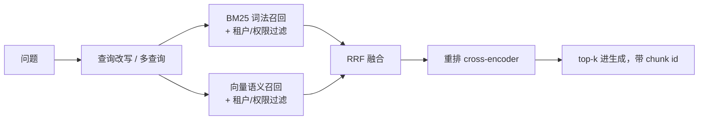

# 高级检索

> **所在组**：组 4 · 知识接地（读世界） ｜ **上一组出口**：能把检索接进生成循环——答案带出处、无命中拒答、更新后可重建（[RAG](rag.md)） ｜ **本页出口**：能用混合检索、查询改写与重排把召回质量提上去，并让权限过滤与引用忠实度成为检索层不变量
> **前置**：[RAG：检索增强生成](rag.md) ｜ **下一步**：[工具执行工程](../05-action/tool-execution)、[评估（桥接）](../08-production/evaluation)

## 1. 概述

基线 RAG（单路向量检索 + top-k）的召回质量有天花板：语义向量对精确标识符不敏感，用户的问题常常不是语料的说法。本页是**已验证有效的升级阶梯**，按投入从低到高排：

| 升级 | 解决什么 | 效果（Anthropic 实验，检索失败率 = 1 − recall@20） |
| --- | --- | --- |
| 基线（单路嵌入） | — | 5.7% |
| + 混合检索（BM25 + 向量，RRF 融合） | 精确码/罕见词查不到 | Embeddings+BM25 优于单路嵌入（具体幅度见博文附录） |
| + 上下文化切块（Contextual Embeddings） | 脱离文档上下文的 chunk 检不准 | 5.7% → 3.7%（降 35%） |
| + 上下文化 BM25 | 同上，词法侧同步受益 | → 2.9%（合计降 49%） |
| + 重排（rerank） | 初筛噪声多、上下文被挤占 | → 1.9%（合计降 67%） |

以上数字来自 Anthropic Contextual Retrieval 博文在其语料与配置下的实验（retrievedAt 2026-09-01），方向可信、数值需在你自己的 golden set 上复测。博文的总结论是：**这些手段的收益可叠加**（benefits stack）。

七件事构成本页：**混合检索**（BM25+向量，RRF 融合）、**查询改写/多查询**、**重排**（cross-encoder 思路）、**parent-child 切块**、**上下文化切块**、**ACL 与多租户过滤**、**引用忠实度**。前五件提召回，后两件是权限与可信度的不变量——升级检索质量时最容易先丢的就是它们。



### 何时使用 / 何时不用

- **用**：基线 RAG 的误拒/漏检在 golden set 上过不了线；查询里混有错误码、函数名等精确 token；语料是长文档（chunk 脱上下文严重）；多租户产品。
- **不用**：语料一批能塞进上下文（先直塞）；检索质量还没量化（先建 golden set，否则无法证明任何升级有效——见 [评估](../08-production/evaluation)）。

### 决策表：检索架构对比

| 架构 | 方向 | 控制权 | 状态 | 信任域 | 最低复杂度 |
| --- | --- | --- | --- | --- | --- |
| 单路向量 | 查询 → 嵌入 → ANN | 嵌入模型依赖 | 索引可重建 | 嵌入提供方 | 基线（RAG 页） |
| 混合（BM25+向量+RRF） | 双路召回 → 排名融合 | 词法路完全自管 | 双索引都可重建 | 嵌入提供方 | +1 套倒排索引 |
| 混合 + 重排 | 融合后过精排模型 | 重排模型可换（托管 API 或自托管） | 无状态（请求内） | 重排提供方 | +1 次 API 调用/查询 |
| + 上下文化切块 | 离线给每块生成上下文前缀 | 生成器模型可控 | 重建索引时重算 | 上下文化模型 | 离线管道 +1 步 |

### 历史版本里程碑

- 2009：Reciprocal Rank Fusion 发表（Cormack, Clarke, Büttcher，SIGIR 2009）——简单倒数排名融合胜过多种学习式融合（DOI: 10.1145/1571941.1572114，经 Semantic Scholar 核验，retrievedAt 2026-09-01）。
- BM25 源自 Robertson 等人的概率检索框架（年代未在本次核验范围，标注未验证）；Anthropic 博文对其机制的描述已核验：在 TF-IDF 上加词频饱和与文档长度归一。
- 2024-09-19：Anthropic 发布 Contextual Retrieval 博文——内容已核验（见上表数字）；发布日期经多个独立转载源交叉核验（retrievedAt 2026-09-01）。

## 2. 使用

最小实战：**纯 TypeScript 的 BM25 + 向量双路检索 + RRF 融合**，零 key、确定性。词法路是标准 BM25（k1=1.2、b=0.75，教科书默认值）；"向量"路复用 [嵌入与检索](embeddings-retrieval.md) 的教学哈希嵌入（生产换成真嵌入模型）。同一个查询打印三份榜单，直接对比融合行为。

保存为 `advanced-retrieval.ts`（Node 22.18+ / 24 内置类型剥离，直接运行）：

```ts
// Teaching fixture: BM25 (lexical, IDF-weighted) + vector retrieval + Reciprocal Rank Fusion.
// Zero API key, deterministic. The "vector" side reuses the hashing bag-of-words embedder
// from the embeddings-retrieval page; production replaces it with a real embedding model.
// Run: node advanced-retrieval.ts

// ---- Shared token machinery (identical to embeddings-retrieval.ts) ----

const DIM = 512;

const STOPWORDS = new Set([
  "a", "an", "and", "are", "as", "at", "be", "but", "by", "do", "does", "for",
  "i", "if", "in", "is", "it", "its", "my", "of", "on", "or", "our", "that", "the",
  "this", "to", "we", "were", "what", "when", "where", "which", "who", "why", "you", "your",
]);

function tokenize(text: string): string[] {
  return (text.toLowerCase().match(/[a-z0-9]+/g) ?? []).filter((token) => !STOPWORDS.has(token));
}

function fnv1a(token: string): number {
  let hash = 0x811c9dc5;
  for (let i = 0; i < token.length; i++) {
    hash ^= token.charCodeAt(i);
    hash = Math.imul(hash, 0x01000193) >>> 0;
  }
  return hash >>> 0;
}

function embed(text: string): number[] {
  const vector = new Array<number>(DIM).fill(0);
  for (const token of tokenize(text)) {
    vector[fnv1a(token) % DIM] += 1;
  }
  const norm = Math.sqrt(vector.reduce((sum, value) => sum + value * value, 0));
  return norm === 0 ? vector : vector.map((value) => value / norm);
}

function cosine(a: number[], b: number[]): number {
  let dot = 0;
  for (let i = 0; i < a.length; i++) dot += a[i] * b[i];
  return dot;
}

// ---- Corpus ----

type Doc = { id: string; text: string };

const corpus: Doc[] = [
  {
    id: "token-reset.md",
    text:
      "To reset the deploy token, an administrator must first confirm the request in the admin console, " +
      "then run nimbus token reset, and finally restart the cli. " +
      "The old token stops working immediately after the reset.",
  },
  {
    id: "deploy.md",
    text:
      "Every deploy uses the deploy token to authenticate. " +
      "Rotate the deploy token each quarter. " +
      "The deploy token authenticates every deploy against the gateway. " +
      "A failed deploy with an expired token returns ERR-4001.",
  },
  {
    id: "errors.md",
    text:
      "ERR-4292 means the request was throttled; the retry delay doubles on each attempt. " +
      "ERR-4001 means the token expired; obtain a fresh one from the console. " +
      "Each error entry also lists the component, the severity, and the owning team.",
  },
  {
    id: "billing.md",
    text: "Invoices list the plan price and the request count. Refunds take five business days.",
  },
];

// ---- BM25: lexical scoring with IDF, TF saturation, length normalization ----
// k1 and b are the standard defaults (k1 = 1.2, b = 0.75).

function bm25Index(docs: Doc[]) {
  const docTokens = docs.map((doc) => tokenize(doc.text));
  const avgdl = docTokens.reduce((sum, tokens) => sum + tokens.length, 0) / docTokens.length;
  const df = new Map<string, number>();
  for (const tokens of docTokens) {
    for (const token of new Set(tokens)) df.set(token, (df.get(token) ?? 0) + 1);
  }
  const idf = (token: string) =>
    Math.log((docs.length - (df.get(token) ?? 0) + 0.5) / ((df.get(token) ?? 0) + 0.5) + 1);
  return { docTokens, avgdl, idf };
}

function bm25Score(queryTokens: string[], docTokens: string[], avgdl: number, idf: (t: string) => number, k1 = 1.2, b = 0.75): number {
  let score = 0;
  for (const token of new Set(queryTokens)) {
    const tf = docTokens.filter((t) => t === token).length;
    if (tf === 0) continue;
    const denominator = tf + k1 * (1 - b + (b * docTokens.length) / avgdl);
    score += idf(token) * ((tf * (k1 + 1)) / denominator);
  }
  return score;
}

// ---- Two retrievers, then RRF fusion ----

function rankBM25(query: string): string[] {
  const { docTokens, avgdl, idf } = bm25Index(corpus);
  const queryTokens = tokenize(query);
  return corpus
    .map((doc, i) => ({ id: doc.id, score: bm25Score(queryTokens, docTokens[i], avgdl, idf) }))
    .filter((hit) => hit.score > 0)
    .sort((a, b) => b.score - a.score || a.id.localeCompare(b.id))
    .map((hit) => hit.id);
}

function rankVector(query: string): string[] {
  const queryVector = embed(query);
  return corpus
    .map((doc) => ({ id: doc.id, score: cosine(queryVector, embed(doc.text)) }))
    .filter((hit) => hit.score > 0.2)
    .sort((a, b) => b.score - a.score || a.id.localeCompare(b.id))
    .map((hit) => hit.id);
}

// Reciprocal Rank Fusion (Cormack et al., SIGIR 2009): score = sum of 1 / (k + rank).
function rrfFuse(rankings: string[][], k = 60): { id: string; score: number }[] {
  const scores = new Map<string, number>();
  for (const ranking of rankings) {
    ranking.forEach((id, index) => {
      scores.set(id, (scores.get(id) ?? 0) + 1 / (k + index + 1));
    });
  }
  return [...scores.entries()]
    .map(([id, score]) => ({ id, score }))
    .sort((a, b) => b.score - a.score || a.id.localeCompare(b.id));
}

// ---- Demo: one query, three rankings ----

const query = "how to reset the deploy token";
const bm25Ranking = rankBM25(query);
const vectorRanking = rankVector(query);
const fused = rrfFuse([bm25Ranking, vectorRanking]);

console.log(`query: "${query}"`);
console.log("BM25 ranking:  ", bm25Ranking.join(" > "));
console.log("Vector ranking:", vectorRanking.join(" > "));
console.log(
  "RRF fused:     ",
  fused.map((hit) => `${hit.id} (${hit.score.toFixed(4)})`).join(" > "),
);
```

实际输出（确定性，可逐字对照）：

```text
query: "how to reset the deploy token"
BM25 ranking:   token-reset.md > deploy.md > errors.md
Vector ranking: deploy.md > token-reset.md
RRF fused:      deploy.md (0.0325) > token-reset.md (0.0325) > errors.md (0.0159)
```

逐条解读：

- **两路冠军互换**：BM25 把 `token-reset.md` 排第一——"reset" 在语料里罕见，IDF 权重高；向量路把 `deploy.md` 排第一——它对 "deploy/token" 的词面密度最大，但哈希词袋没有 IDF，分辨不出 "reset" 更稀有。
- **RRF 不选边**：两份榜单的冠军各得 `1/61 + 1/62`，并列榜首（0.0325，显示顺序是并列时的字典序）；只在一路出现的弱匹配 `errors.md` 沉到 0.0159。这正是 rank fusion 的设计意图——**共识浮上来，单路噪声沉下去**，且无需调两路分数的量纲（BM25 分数与余弦分数不可直接比大小，RRF 只用排名）。
- 负例即上表的 `errors.md`：它在 BM25 里因共享 "token" 捞到第三，但向量路弃权，融合后得分腰斩。生产里这对应"只该一路命中的文档不该进 top-k"。

验收命令与标准：`node advanced-retrieval.ts` 输出与上面逐字一致；两路排名确实互换、融合后前二并列且 `errors.md` 得分减半。清理：删除脚本文件即可。

### 场景矩阵

| 场景 | 输入 / 动作 | 输出 | 适用 | 不适用 |
| --- | --- | --- | --- | --- |
| 基础：混合检索 | 查询 → BM25 + 向量 → RRF | 融合排名 | 语义与精确词混合的查询 | 纯数值/区间过滤（用元数据过滤） |
| 常见：重排 | 融合 top-50/150 → 重排 → 截 top-20 | 精排后的少量段落 | 上下文预算紧张 | 延迟极敏感且初筛已够准 |
| 组合：多租户 | 查询 + 租户上下文 → 过滤贯穿两路 | 本租户 top-k | SaaS 多租户语料 | 无隔离需求的单租户 |

## 3. 原理

### 3.1 混合检索：BM25 + 向量 + RRF

BM25（Best Match 25）是词法打分函数：在 TF-IDF 之上加**词频饱和**（一个词出现十次不比三次强多少）与**文档长度归一**（长文档不占便宜）——机制描述来自 Anthropic 博文（retrievedAt 2026-09-01）。它擅长向量检索的盲区：精确标识符。Anthropic 的例子：查 "Error code TS-999"，嵌入模型可能捞回一堆"错误码"泛论，BM25 直接命中 "TS-999" 字面。

两路分数量纲不同（BM25 无界、余弦有界），直接加权需大量调参。RRF（Reciprocal Rank Fusion）绕开量纲：`score(d) = Σ 1/(k + rank_i(d))`，只用排名，k=60 是论文给出的经验值（Cormack et al.，SIGIR 2009，retrievedAt 2026-09-01）。OpenAI 的托管混合检索同样以 RRF 权重暴露（`embedding_weight` / `text_weight`，retrievedAt 2026-09-01）——工业界事实标准。

### 3.2 查询改写与多查询

用户的问题往往不是语料的说法。OpenAI Retrieval 的 `rewrite_query` 把口语问句改写成检索友好的短语（官方样例："I'd like to know the height of the main office building." → "primary office building height"，retrievedAt 2026-09-01）。多查询（multi-query）再进一步：让模型生成 N 个改写，分别检索后合并去重——用离线成本换召回覆盖。代价是每查询 N 倍检索与更高的聚合延迟，N 通常取 3–5 并以 golden set 验证增益。

### 3.3 重排：cross-encoder 思路

召回（bi-encoder：查询与文档分别嵌入再比距离）快而粗；重排（cross-encoder：查询与文档拼接后联合编码打分）精而慢。所以架构是**漏斗**：粗召回 top-50/150 → 重排 → 只留 top-20 进生成。Anthropic 实验用初筛 150、重排后留 20（retrievedAt 2026-09-01）；Cohere Rerank 即该形态的托管服务：入参 query + documents，返回相关性分数与排名（retrievedAt 2026-09-01）。收益：上下文更干净、生成 token 更省、引用更准；代价：每查询一次额外 API 调用的延迟与成本。

### 3.4 parent-child 切块

检索要小块（命中准），生成要大块（上下文足）。parent-child 把两者解耦：小块（child）建索引负责命中；命中后取其所属父块（parent，如完整小节）进生成。这与 RAG 页"chunk 是检索粒度"的讨论衔接：粒度冲突不再靠折中，靠两个角色分离。

### 3.5 上下文化切块（Contextual Retrieval）

切块的原生缺陷：chunk 脱离文档后丢失指代与范围——"公司营收增长 3%"这块，不知道是哪家公司哪个季度。Anthropic 的方案：**入库前给每块生成 50–100 token 的上下文前缀**（用模型针对整篇文档为每块写一句"这块在讲什么"），再嵌入并建 BM25 索引。配合 prompt caching，其一次性成本约 **$1.02 / 百万文档 token**（按 800 token 块、8k token 文档的假设）。组合效果见概述表的 49%（+上下化 BM25）与 67%（+重排）（均 retrievedAt 2026-09-01）。这是**离线管道改进**：只改重建索引的流程，在线链路无感。

### 3.6 ACL 与多租户：检索层的权限不变量

多租户产品的检索不变量：**所有检索路径共享同一份租户/权限过滤，且过滤发生在召回阶段**。混合架构下尤其要警惕——BM25 路和向量路都要带过滤，重排的输入候选集也要过滤后才能进；漏掉任何一路就是越权通道。工程做法：把"当前用户可见性"编码为检索器的强制参数（不是可选参数），并维护一个越权用例集持续回归（见 [评估](../08-production/evaluation)）。

### 3.7 引用忠实度

升级检索后引用要跟着升级：答案引用必须指向**重排后真正进入生成上下文**的 chunk id，而不是初筛命中的全集——否则引用列表里会出现答案根本没用到的文档。最小实现：`sources` 只从送入生成的 top-k 构造（本层 fixture 与 RAG 页 fixture 均如此），并在评测里加一条"引用的段落确实支撑对应句子"的抽检。

### 规范要求 vs 本地实测

| 断言 | 官方/规范口径 | 本页 fixture |
| --- | --- | --- |
| RRF | k=60（SIGIR 2009 论文）；OpenAI 暴露 embedding/text 权重 | k=60，两路等权 |
| BM25 参数 | 教科书默认 k1=1.2、b=0.75 | 相同 |
| 重排形态 | Anthropic：初筛 150 → 重排留 20 | 未实现（无 key） |
| 上下文化 | Anthropic：50–100 token 前缀，$1.02/M doc token | 未实现（离线管道） |
| 混合收益 | Anthropic：Embeddings+BM25 优于单路 | 演示了冠军互换与融合行为，未测收益 |

## 4. 开发

### 集成与升级顺序

- **一次只加一个变量**：混合 → 改写 → 重排 → 上下文化，每步跑 golden set 对照，确认增益再叠下一个（Anthropic 的"收益可叠加"结论也来自逐项实验）。
- **重排服务选型**：托管 API（如 Cohere Rerank）起步；延迟敏感再评估自托管 cross-encoder。
- **版本**：BM25 索引与向量索引分别版本化；上下文化切块属于索引构建配置，变更触发全量重建。

### 症状 → 证据 → 处理 → 完成标准

**症状**：错误码、函数名等精确 token 查不到，语义相近的泛论倒是一堆。
**证据**：该类查询的 BM25 路是否存在；单路向量 top-k 分数普遍偏高（语义泛化）。
**处理**：加 BM25 路 + RRF 融合（本页 fixture 即骨架）。
**完成标准**：标识符查询集全部命中字面目标文档；原语义查询集 recall 不回退。

### 症状 → 证据 → 处理 → 完成标准

**症状**：top-k 里近半与问题无关，上下文被浪费、引用变噪。
**证据**：初筛结果人工抽检；进入生成的 chunk 利用率（答案是否引用了它）。
**处理**：过采样（top-50/150）后加重排截断（top-20）。
**完成标准**：单位答案的上下文 token 下降，引用精度（引用段落支撑答案的比例）上升。

### 症状 → 证据 → 处理 → 完成标准

**症状**：多租户环境偶发跨租户串数据。
**证据**：越权用例集（构造 A 租户查询命中 B 租户文档的用例）在 BM25 路/向量路/重排候选逐一复测。
**处理**：租户过滤改为检索器强制参数，三处（两路召回 + 重排输入）统一注入。
**完成标准**：越权用例集全空；上线后租户隔离告警为零。

### 症状 → 证据 → 处理 → 完成标准

**症状**：长文档场景，命中的块"差一点"——缺主语、缺范围。
**证据**：抽检命中 chunk 的原文，确认指代丢失而非检索错。
**处理**：按投入顺序选 parent-child（改结构）或上下文化切块（改离线管道，成本参考 $1.02/M doc token）。
**完成标准**：同批查询的引用完整度提升；golden set recall 上行。

### 反模式清单

- 没有 golden set 就上混合/重排。无法证明增益，也无法发现回退。
- 用重排模型当语义检索用。cross-encoder 对全库打分成本不可行；它是精排不是召回。
- 融合两路的原始分数。BM25 与余弦量纲不同，直接加权是调参地狱；用排名（RRF）。
- ACL 只加在一路检索上。混合架构的每条召回路径与重排候选都要过滤。
- 初筛 top-5 直接进生成。重排的价值来自漏斗：宽进（50–150）严出（≈20）。

## 5. 资料库

### 四级阅读路线

- **Beginner**：本页 fixture 跑通 → Anthropic 博文的 RAG primer 部分（混合检索为什么有效）。
- **Builder**：Cohere Rerank 指南（托管重排的入参与输出）→ OpenAI Retrieval 的 `rewrite_query` 与混合权重。
- **Operator**：RRF 论文（k 的选取与对照实验）→ Anthropic 博文的实现考量（chunk 边界、上下文化 prompt、块数权衡）。
- **Researcher**：HNSW 论文（向量路底层）→ [Learn LLM](https://llm.zenheart.site/chapters/11-rag)（检索机制与评测的深层原理）。

### 资源表

| 名称 | 层级 | canonical URL | 用途 | 支持的断言 | 下一步 |
| --- | --- | --- | --- | --- | --- |
| Anthropic：Contextual Retrieval | L1 | https://www.anthropic.com/news/contextual-retrieval | 混合/上下化/重排的机制与实验数据 | 35%/49%/67%；TS-999 例子；150→20；$1.02/M | 试其 cookbook |
| RRF 论文 | L0 | https://dl.acm.org/doi/10.1145/1571941.1572114（开放 PDF：http://plg.uwaterloo.ca/~gvcormac/cormacksigir09-rrf.pdf） | 排名融合公式与 k=60 | RRF 优于多种融合 | 对比加权融合 |
| Cohere：Rerank guide | L1 | https://docs.cohere.com/docs/rerank-guide | 托管重排的调用形态 | query+documents → 相关性排名 | 接入重排漏斗 |
| Cohere：Embeddings | L1 | https://docs.cohere.com/docs/embeddings | `input_type` 与多语种嵌入 | 非对称嵌入参数 | 换真模型时对照 |
| OpenAI：Retrieval | L1 | https://developers.openai.com/api/docs/guides/retrieval | `rewrite_query`、混合检索 RRF 权重、阈值 | 改写样例；rrf_embedding_weight/text_weight | 托管对照 |
| HNSW 论文 | L0 | https://arxiv.org/abs/1603.09320 | 向量路 ANN 索引 | 多层图、对数复杂度 | 索引调参 |

以上页面 retrievedAt 均为 2026-09-01（RRF 经 Semantic Scholar 元数据核验）。

### 主动证伪与未决问题

- 35%/49%/67% 是 Anthropic 在其语料、嵌入配置（其实验中 Gemini/Voyage 嵌入表现最佳）与 recall@20 口径下的结果；你的语料与口径不同，数值必不同，方向需复测。
- "top-20 优于 top-10/top-5"同样是其实验结论，上下文越大气噪声越大；在你自己的生成质量曲线上找拐点。
- 本页 fixture 的向量路是词法哈希，与 BM25 的分歧来自 IDF/加权差异而非语义；真实语义分歧行为需接真嵌入模型后重跑观察。

### learn-ai 到此为止 / 继续去哪

本页交付"召回质量升级阶梯与权限不变量"。把检索当工具交给 Agent → [工具执行工程](../05-action/tool-execution)；增益的量化与上线门 → [评估（桥接）](../08-production/evaluation) 与 [evals](https://evals.zenheart.site/)；检索算法与嵌入的深层原理 → [Learn LLM 第 11–12 章](https://llm.zenheart.site/chapters/11-rag)。
