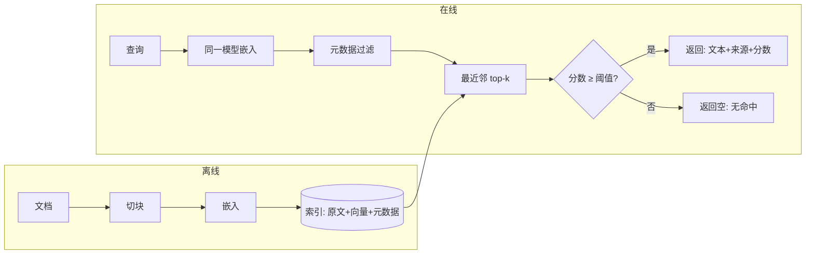

# 嵌入与检索

> **在哪一层**：层 3 · 知识接地 ｜ **上一层出口**：能做一次可取消、可观测的端到端交互 ｜ **本层出口**：能搭一个带元数据过滤与无命中路径的向量检索入口，并知道换模型必须重建索引
> **前置**：[模型 API 契约](../02-inference-interface/model-api) ｜ **下一步**：[RAG：检索增强生成](rag.md)、[高级检索](advanced-retrieval.md)

## 1. 概述

关键词匹配只认字面：搜"怎么回滚版本"找不到只写了"还原到上一版"的文档。**嵌入（Embedding）把一段文本变成一个向量，意思相近的文本向量距离近**，于是说法不同的问句也能命中讲同一件事的段落。检索只负责"找出哪几段该看"；生成回答走 [RAG](rag.md)。

OpenAI 官方指南给过一组对照：问 "When did we go to the moon?"，最相关的句子 "The first lunar landing occurred in July of 1969." 与问题**关键词重合 0%、语义相似 65%**；而字面更像的 "When I ate the moon cake, it was delicious." 关键词重合 40%、语义相似只有 28%（OpenAI Retrieval 指南，retrievedAt 2026-09-01）。语义检索的价值就在这一档差距。

一个向量检索入口由四件事构成：

- **嵌入**：同一模型把语料与查询都变成向量；**索引与查询必须同一模型，换模型要重建索引**。
- **索引**：小语料暴力扫描就够；大规模用近似最近邻（ANN），主流实现是 HNSW 图索引。
- **元数据**：每个向量带来源路径、标题、权限等字段；检索时可先过滤再算相似度。
- **无命中路径**：分数低于阈值就返回空——这是产品行为，不是异常（详见使用段的负例）。



### 何时使用 / 何时不用

- **用**：自然语言问题、表述多变、跨大量文档找"讲这件事的段落"；推荐、聚类、异常检测等相似度任务（OpenAI 指南列举的用途，retrievedAt 2026-09-01）。
- **不用**：精确标识符（错误码、函数名、订单号）——先 grep / 全文检索 / [BM25](advanced-retrieval.md)；语料小到能整批塞进上下文——直接塞（见 [层 3 决策表](index.md)）。

### 决策表：检索方式对比

| 方式 | 方向 | 控制权 | 状态 | 信任域 | 最低复杂度 |
| --- | --- | --- | --- | --- | --- |
| 关键词 / 全文检索 | 查询 → 倒排索引 | 完全自管 | 索引可重建 | 语料不出系统 | 最低（多数系统自带） |
| 向量检索（本页） | 查询 → 向量空间最近邻 | 切块/索引/过滤自管，嵌入依赖模型 | 索引可重建，模型版本是输入 | 嵌入模型提供方进入信任域 | 中（嵌入 + 索引 + 管道） |
| 长上下文直塞 | 语料 → prompt | 提示层拼接 | 每次请求重发 | 整个语料进上下文 | 低（但成本随规模线性涨） |

### 历史版本里程碑

- 2016：HNSW 图索引发表（Malkov & Yashunin，arXiv:1603.09320）：多层近邻图、对数复杂度、结构类似跳表（retrievedAt 2026-09-01）。
- Matryoshka 表示学习（arXiv:2205.13147）：训练出的向量可截短前若干维而不丢主要语义；OpenAI `text-embedding-3` 系列与 Cohere `embed-v4.0` 都实现了该特性（retrievedAt 2026-09-01）。`text-embedding-3` 系列的发布时间未在本次核验范围，标注未验证。

## 2. 使用

最小实战：一个**零 API key、纯 TypeScript、确定性输出**的向量检索器。它用哈希词袋（bag-of-words）充当"教学嵌入"——这是**词法向量**，只认字面重合；真实系统把 `embed()` 换成模型 API 调用，其余代码不变。

保存为 `embeddings-retrieval.ts`（Node 22.18+ / 24 内置类型剥离，直接运行）：

```ts
// Teaching fixture: deterministic hashing bag-of-words "embedding" + cosine retrieval.
// Teaching only: this is a LEXICAL vector. Real systems call an embedding model API,
// which maps paraphrases close together; this one cannot (see case 2).
// Run: node embeddings-retrieval.ts

const DIM = 512;

const STOPWORDS = new Set([
  "a", "an", "and", "are", "as", "at", "be", "but", "by", "do", "does", "for",
  "i", "if", "in", "is", "it", "its", "my", "of", "on", "or", "our", "that", "the",
  "this", "to", "we", "were", "what", "when", "where", "which", "who", "why", "you", "your",
]);

function tokenize(text: string): string[] {
  return (text.toLowerCase().match(/[a-z0-9]+/g) ?? []).filter((token) => !STOPWORDS.has(token));
}

function fnv1a(token: string): number {
  let hash = 0x811c9dc5;
  for (let i = 0; i < token.length; i++) {
    hash ^= token.charCodeAt(i);
    hash = Math.imul(hash, 0x01000193) >>> 0;
  }
  return hash >>> 0;
}

function embed(text: string): number[] {
  const vector = new Array<number>(DIM).fill(0);
  for (const token of tokenize(text)) {
    vector[fnv1a(token) % DIM] += 1;
  }
  const norm = Math.sqrt(vector.reduce((sum, value) => sum + value * value, 0));
  return norm === 0 ? vector : vector.map((value) => value / norm);
}

function cosine(a: number[], b: number[]): number {
  let dot = 0;
  for (let i = 0; i < a.length; i++) dot += a[i] * b[i];
  return dot;
}

type Doc = { id: string; text: string; meta: { source: string; team: "platform" | "growth" } };

const corpus: Doc[] = [
  {
    id: "deploy#0",
    text: "Deploy version v2 with nimbus deploy. Every deploy writes an entry to the deploy log.",
    meta: { source: "docs/deploy.md", team: "platform" },
  },
  {
    id: "rollback#0",
    text: "Roll back a bad release with nimbus rollback --to v1. Rollback restores the previous release in under a minute.",
    meta: { source: "docs/rollback.md", team: "platform" },
  },
  {
    id: "ratelimit#0",
    text: "Rate limits: the free plan allows 60 requests per minute. Raise the limit by upgrading the plan.",
    meta: { source: "docs/rate-limits.md", team: "growth" },
  },
  {
    id: "billing#0",
    text: "Billing invoices are issued on the first day of each month. Refunds are processed within five business days.",
    meta: { source: "docs/billing.md", team: "growth" },
  },
];

const index = corpus.map((doc) => ({ ...doc, vector: embed(doc.text) }));

type Hit = { id: string; source: string; score: number };

function retrieve(
  query: string,
  opts: { topK?: number; minScore?: number; team?: Doc["meta"]["team"] } = {},
): Hit[] {
  const topK = opts.topK ?? 3;
  const minScore = opts.minScore ?? 0.15;
  const queryVector = embed(query);
  return index
    .filter((doc) => (opts.team ? doc.meta.team === opts.team : true))
    .map((doc) => ({ id: doc.id, source: doc.meta.source, score: cosine(queryVector, doc.vector) }))
    .filter((hit) => hit.score >= minScore)
    .sort((a, b) => b.score - a.score || a.id.localeCompare(b.id))
    .slice(0, topK);
}

function report(label: string, query: string, hits: Hit[]): void {
  console.log(`${label} query: "${query}"`);
  if (hits.length === 0) {
    console.log("  NO HIT (every score below 0.15) -> refuse, do not guess");
    return;
  }
  for (const hit of hits) {
    console.log(`  ${hit.id.padEnd(12)} ${hit.source.padEnd(22)} score=${hit.score.toFixed(3)}`);
  }
}

// Case 1: shared vocabulary -> hit (metadata filter: platform docs only)
report("[1]", "how do i roll back a release", retrieve("how do i roll back a release", { team: "platform" }));

// Case 2: paraphrase, zero shared tokens -> a lexical vector misses it.
// A real embedding model still ranks "undo my deployment" near "roll back a release".
report("[2]", "undo my deployment", retrieve("undo my deployment"));

// Case 3: off-corpus question -> no hit is the correct behavior
report("[3]", "office wifi password", retrieve("office wifi password"));
```

实际输出（确定性，可逐字对照）：

```text
[1] query: "how do i roll back a release"
  rollback#0   docs/rollback.md       score=0.471
[2] query: "undo my deployment"
  NO HIT (every score below 0.15) -> refuse, do not guess
[3] query: "office wifi password"
  NO HIT (every score below 0.15) -> refuse, do not guess
```

逐条解读：

- **Case 1 正常路径**：查询词与 rollback 文档词面重合，余弦分数最高；`team: "platform"` 过滤先于打分发生（growth 团队的限流/账单文档根本没进候选）。
- **Case 2 是本页最重要的输出**：同一意图、零词面重合，词法向量直接漏检。这就是"教学嵌入"与真实嵌入模型的差距——模型学到的语义空间能把改写映射到邻近位置。把 `embed()` 换成模型 API（查询与文档用**同一模型**），其余逻辑不变。
- **Case 3 负例路径**：语料外问题返回空列表。空结果要一路传到产品层变成"没找到"，而不是让上层模型自由发挥。

验收命令与标准：`node embeddings-retrieval.ts` 输出与上面逐字一致（case 1 命中 `rollback#0`；case 2、3 为 NO HIT）。清理：删除脚本文件即可，无外部状态。

### 场景矩阵

| 场景 | 输入 / 动作 | 输出 | 适用 | 不适用 |
| --- | --- | --- | --- | --- |
| 基础：语义搜索 | 自然语言查询 → embed → top-k | 文本 + 来源 + 分数 | 文档问答入口 | 精确标识符检索 |
| 常见：权限/租户过滤 | 查询 + 元数据条件 | 过滤后的 top-k | 多团队/多租户语料 | 无元数据的裸索引 |
| 组合：检索 + 拒答 | 分数全部低于阈值 | 空结果 → 产品层拒答 | 一切向量检索入口 | 把空结果当错误抛栈 |

## 3. 原理

### 3.1 相似度怎么算

余弦相似度（cosine similarity）度量两个向量夹角：`cos(A, B) = A·B / (|A||B|)`，值域 -1 到 1，越大越相似。OpenAI 指南推荐余弦并说明其嵌入已归一化到长度 1——此时点积即余弦，且与欧氏距离排序一致（retrievedAt 2026-09-01）。本页 fixture 同样做 L2 归一化，`cosine()` 里只剩点积。

### 3.2 为什么"意思近 → 距离近"能成立

这不是向量天然的性质，而是**训练目标**的结果：嵌入模型在训练时被约束"把语义相关的文本对拉近、不相关的推远"（对比学习一类目标），向量空间的几何由此而生。训练目标、损失函数与向量几何的数学推导归 [Learn LLM 的嵌入章节](https://llm.zenheart.site/chapters/11-rag)——本仓到此为止，只保留工程结论：**换模型 = 换空间**，跨模型的向量不可比较。

### 3.3 索引结构：从暴力到 HNSW

| 结构 | 做法 | 精度 | 规模 |
| --- | --- | --- | --- |
| 暴力扫描（本页 fixture） | 查询向量与每条向量算点积 | 精确 100% | 千级以下 |
| ANN 近似索引 | 只探索一部分候选，换速度 | 召回率可调（如 95%+） | 百万到十亿级 |
| HNSW（主流 ANN） | 多层近邻图，上层稀疏下层稠密，自顶向下贪心走图 | 对数级复杂度下高召回 | 主流向量库默认 |

HNSW 论文（arXiv:1603.09320，retrievedAt 2026-09-01）描述的结构：元素以指数衰减概率选层，形成嵌套的邻近图层次；从顶层起搜、逐层下沉，复杂度对数级；作者指出其与跳表（skip list）的相似性。工程要点：ANN 是**用召回换延迟**——上线前用 golden set 量过召回率再调参数。

### 3.4 元数据过滤：先过滤，再打分

元数据（来源路径、标题、时间、权限、租户）与向量存在一起，检索时用条件收窄候选集。OpenAI 向量存储的属性过滤支持比较符（`eq/ne/gt/gte/lt/lte/in/nin`）与组合符（`and/or`），属性上限 16 个键、每键 256 字符（retrievedAt 2026-09-01）。工程原则：**过滤必须发生在打分之前或之中**（pre-filter）；先检索完再从 top-k 里删（post-filter）会出现"top-k 全被删光"的空结果假象。

### 3.5 chunk 策略：检索粒度由它决定

检索返回的是 chunk，不是整篇文档，所以**切块边界直接决定召回上限**：切太大，一段里混多个主题，向量被稀释；切太小，上下文不足，引用对不回原意。OpenAI 向量存储的默认值是 `max_chunk_size_tokens=800`、`chunk_overlap_tokens=400`，允许范围 100–4096、重叠不超过块长一半（retrievedAt 2026-09-01）。Anthropic 的参考是"通常不超过几百 token 一块"（Contextual Retrieval 博文，retrievedAt 2026-09-01）。通用做法：优先按结构边界切（标题/段落/列表），再加少量重叠兜底边界切断。

### 3.6 召回质量怎么验

思路：准备一个 golden set——每条是"问题 → 应命中的文档/chunk"，跑检索后统计 recall@k（前 k 条里包含正确目标的比例）。阈值、top-k、chunk 策略的每次调整都对照这个集合。构建方法论、统计口径与上线门在 [evals.zenheart.site](https://evals.zenheart.site/)——本仓只负责"知道要测、测什么"。

### 规范要求 vs 本地实测

| 断言 | 官方/规范口径 | 本页 fixture |
| --- | --- | --- |
| 距离函数 | OpenAI 推荐余弦；归一化后点积即余弦 | L2 归一化词袋，点积即余弦 |
| 查询/文档嵌入 | Cohere 要求 `input_type` 区分 `search_query` / `search_document` | 教学哈希无此区分（换真模型时要加） |
| 向量维度 | OpenAI 3-small 1536 / 3-large 3072，可 `dimensions` 截短 | 512（教学哈希） |
| 默认 chunk | OpenAI 800 token / 重叠 400 | 无切块（整文档入库） |
| 无命中行为 | 规范不规定，属于产品设计 | 阈值 0.15 之下返回空列表 |

## 4. 开发

### 集成与升级

- **换嵌入模型是破坏性变更**：维度与语义空间都变了。索引要带模型版本号重建，切换期用别名（alias）指向新旧两个索引，验证后切流量。
- **版本 pin**：嵌入模型名写进索引元数据；查询侧启动时校验"查询模型 == 索引模型"，不一致直接报配置错误，而不是悄悄给出劣化结果。
- **兼容性**：同一模型才可比距离；不同模型（哪怕同家族不同代）的分数不可跨索引比较。

### 症状 → 证据 → 处理 → 完成标准

**症状**：该命中的文档检索不到，答非所问。
**证据**：跑 golden set 看 recall@k；对漏检样本检查其 chunk——长度分布是否畸形、语义是否被边界切断。
**处理**：按结构边界重切、加重叠；精确词类查询补 BM25 一路（→ [高级检索](advanced-retrieval.md)）。
**完成标准**：golden set recall@k 回到目标线；漏检样本清单清零或逐条有解释。

### 症状 → 证据 → 处理 → 完成标准

**症状**：换了嵌入模型后，检索结果整体异常或全部无命中。
**证据**：报错或分数分布坍缩；检查查询向量与索引向量的维度是否一致。
**处理**：确认索引与查询同模型；用新模型全量重建索引，切换期双索引并存。
**完成标准**：同一 golden set 在新索引上的 recall 不低于旧索引；查询侧模型校验通过。

### 症状 → 证据 → 处理 → 完成标准

**症状**：无命中过多，用户大量收到"没找到"。
**证据**：无命中查询清单 + 这些查询的 top 分数分布（是 0.05 的真空区还是 0.14 的临界区）。
**处理**：临界区→阈值下调并用精度对照确认；真空区→词法失配（走改写/混合检索），不是调阈值能救的。
**完成标准**：误拒率下降且"该拒答"样本仍全部拒答（两条都要测，见 [evals](https://evals.zenheart.site/)）。

### 症状 → 证据 → 处理 → 完成标准

**症状**：检索结果出现用户无权看到的文档。
**证据**：用低权限测试账号跑越权用例集；检查过滤发生在检索前还是检索后。
**处理**：把 ACL/租户条件并入检索过滤（pre-filter），所有检索路径共用同一过滤构造器。
**完成标准**：越权用例集全部无命中；正常用户召回不受影响。

### 反模式清单

- 召回了就当事实。相似度高只表示"像"，不是"对"；消费方必须带出处（→ [RAG](rag.md)）。
- 用聊天模型的输出当嵌入。嵌入要走嵌入端点，两者是不同的模型与接口。
- 一篇文章切一块。检索粒度过粗，引用对不上段落。
- 先 top-k 再删权限。post-filter 会制造空结果假象，也可能泄露元数据。

## 5. 资料库

### 四级阅读路线

- **Beginner**：OpenAI 向量嵌入指南（是什么、余弦、能干什么）→ 本页 fixture 跑一遍。
- **Builder**：Cohere 嵌入文档（`input_type` 非对称嵌入、多语种、压缩）→ OpenAI Retrieval 指南（向量存储、属性过滤、chunk 默认值）。
- **Operator**：HNSW 论文（索引参数怎么影响召回-延迟）→ [evals](https://evals.zenheart.site/)（golden set 与 recall 口径）。
- **Researcher**：Matryoshka 表示学习（arXiv:2205.13147）→ [Learn LLM 嵌入章](https://llm.zenheart.site/chapters/11-rag)（训练目标与几何）。

### 资源表

| 名称 | 层级 | canonical URL | 用途 | 支持的断言 | 下一步 |
| --- | --- | --- | --- | --- | --- |
| OpenAI：Vector embeddings | L1 | https://developers.openai.com/api/docs/guides/embeddings | 嵌入用途、余弦推荐、归一化、dimensions 截短 | 用途清单；余弦+归一化；MTEB 对照 | 跑其 cookbook 检索样例 |
| OpenAI：Retrieval | L1 | https://developers.openai.com/api/docs/guides/retrieval | 语义vs关键词对照、属性过滤、chunk 默认值 | 0%/65% 对照；过滤算子；800/400 默认 | 接 file search 试托管链路 |
| Cohere：Embeddings | L1 | https://docs.cohere.com/docs/embeddings | `input_type` 非对称嵌入、Matryoshka 维度、压缩 | search_query/search_document 区分 | 换真模型时对照参数 |
| HNSW 论文 | L0 | https://arxiv.org/abs/1603.09320 | ANN 图索引结构与复杂度 | 多层近邻图、对数复杂度 | 读向量库索引调参文档 |
| Matryoshka 论文 | L0 | https://arxiv.org/abs/2205.13147 | 可截短向量的训练方法 | dimensions 特性的来源 | → Learn LLM |

以上官方页面 retrievedAt 均为 2026-09-01；字段与价格随版本变化，使用当天复核。

### 主动证伪与未决问题

- "截短到 256 维仍优于不截短的旧模型"是 OpenAI 在 MTEB 上的对照结论，迁移到中文/代码语料前自行评测。
- ANN 召回率随参数（如 HNSW 的 ef/M）变化，本页未给数值——不同向量库默认值不同，以你所用库的文档与实测为准。

### learn-ai 到此为止 / 继续去哪

本页交付"检索入口"。嵌入模型的训练目标与向量几何 → [Learn LLM](https://llm.zenheart.site/chapters/11-rag)；把检索接进生成循环 → [RAG](rag.md)；混合检索与重排 → [高级检索](advanced-retrieval.md)；召回评测方法论 → [evals](https://evals.zenheart.site/)。
