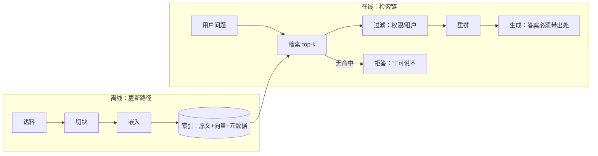

# 组 4 · 知识接地

> **所在组**：组 4 · 知识接地（读世界） ｜ **上一组出口**：能写并验证输入输出 schema，并交付一次可取消、可观测的端到端交互（组 2–3） ｜ **本组出口**：能构建可追溯的检索链和更新路径
> **前置**：[流式响应](../02-inference-interface/streaming) ｜ **下一步**：[嵌入与检索](embeddings-retrieval.md)、[工具执行工程](../05-action/tool-execution)

## 1. 概述

本组解决一个具体症状：**回答缺少私有或新事实**。模型的参数知识（parametric memory）在训练结束那一刻就冻结了——它不知道你的工单、你的代码、上周改过的文档。本组把回答接到外部证据上：先检索、后生成、答案带出处、数据更新后可重建。

RAG 原论文（Lewis et al.，NeurIPS 2020）把这个结构命名为"参数记忆 + 非参数记忆"：参数记忆是预训练的生成模型，非参数记忆是可用检索器访问的外部向量索引（论文中即维基百科的稠密向量索引）。论文同时指出，纯参数模型"为决策提供出处（provenance）"和"更新世界知识"是两个未解问题——这正是本组要交付的两件事（检索链可追溯、更新路径可重跑）（arXiv:2005.11401，摘要已复核，retrievedAt 2026-09-01）。

本组与 [Action 组](../05-action/tool-calling)（05，写世界）共享"让模型接触模型之外的东西"这个直觉，但方向相反：**读世界 vs 写世界**。本组全部动作是"读"——切块、索引、检索、引用，默认无副作用；失败模式是"答错或该拒答没拒答"，不会破坏任何东西。Action 组才"写世界"（执行动作），失败模式是"破坏状态"。因此两组的验收口径不同：本组验收**引用正确与拒答正确**，Action 组验收**权限受限与可恢复**。



### 何时进入本组 / 何时不进

- **进**：回答需要私有语料（产品文档、工单、代码）、需要引用出处、或知识频繁更新。
- **不进**：回答不稳定、无法解析——先回 [组 3 上下文](../03-context/)（输出形状的落点：[结构化输出](../02-inference-interface/structured-output)）；还没接入产品交互——先去 [组 2 推理与接口](../02-inference-interface/)；要让系统执行动作——去 [组 5 行动](../05-action/tool-calling)。

### 症状 → 主题导航

| 症状 | 去哪 | 读完你能 |
| --- | --- | --- |
| 想按"意思"搜文档，关键词搜不到 | [嵌入与检索](embeddings-retrieval.md) | 搭一个带元数据过滤与无命中路径的向量检索入口 |
| 要做"基于我们文档回答"的产品功能 | [RAG：检索增强生成](rag.md) | 跑通 ingest→chunk→embed→retrieve→generate 全链，答案带出处、无命中拒答 |
| 基线 RAG 召回质量不够 / 错误码查不到 | [高级检索](advanced-retrieval.md) | 用混合检索、查询改写、重排把召回提上去，权限钉在检索层 |

### 决策表：知识注入方式对比

| 方式 | 方向 | 控制权 | 状态 | 信任域 | 最低复杂度 |
| --- | --- | --- | --- | --- | --- |
| 长上下文直塞 | 语料 → prompt（整批搬运） | 提示层拼接，无检索控制 | 每次请求重发全文 | 整个语料进模型上下文 | 最低（单批小语料） |
| RAG（本组） | 查询 → 检索 → 上下文（选择性搬运） | 索引、切块、过滤全自管 | 索引是派生物，可重建 | 只送命中片段与元数据 | 中（嵌入 + 索引 + 更新管道） |
| 微调 | 语料 → 参数（改写模型本身） | 训练配方与数据配比 | 固化进权重，更新即重训 | 语料进入训练流程 | 最高（详见 Learn LLM 桥接） |

选型原则：**从最低复杂度起步**。语料小到一批能塞进上下文（Anthropic 给的参考线是约 200,000 token，配合 prompt caching），就先直塞；语料大、更新频繁、要引用，才上 RAG；要改的是行为风格而不是事实，才考虑微调。

### 历史版本里程碑

- 2016：HNSW 近似最近邻索引结构发表（Malkov & Yashunin, arXiv:1603.09320），成为向量库的主流索引底座（retrievedAt 2026-09-01）。
- 2020：RAG 论文发表（Lewis et al., NeurIPS 2020, arXiv:2005.11401），确立"参数记忆 + 非参数记忆"框架（retrievedAt 2026-09-01）。
- 2024-09-19：Anthropic 发表 Contextual Retrieval（上下文化切块 + BM25 + 重排的组合方案）；实验数据见 [高级检索](advanced-retrieval.md)。发布日期经多个独立转载源交叉核验（retrievedAt 2026-09-01）。
- 2026-09：v6 重构（Issue #116）把 v5 的六层金字塔改组为十组依赖结构，本组由"层 3 · 知识接地"改称"组 4 · 知识接地（读世界）"，读写分离的边界与验收口径不变。

## 2. 使用

本组最小实战是 [嵌入与检索](embeddings-retrieval.md) 的零 key 示例：一个纯 TypeScript 的确定性向量检索器，15 分钟内可在干净环境跑通。

```bash
# 保存 embeddings-retrieval 页的完整示例为 embeddings-retrieval.ts，然后：
node embeddings-retrieval.ts
```

验收：三组输出齐全——词法重合的查询命中正确文档并带来源、改写过的查询（零词面重合）正确走"无命中"路径、语料外问题正确拒答。跑通后你已经见过本组最核心的两个行为：**分数不是真理**（相似度高只代表"像"）与**无命中是路径而不是异常**。

各主题的使用段都遵循同一约束：零 API key、单文件自包含、确定性输出、正常路径与负例路径成对出现。

## 3. 原理

在能力变换链上，本组把组 2 的"一次交互"升级为"一次有依据的交互"：

```text
离线：语料 → 切块 → 嵌入 → 索引（原文 + 向量 + 元数据 + 内容指纹）
在线：问题 → 检索 top-k → 过滤（权限/租户）→ 重排 → 生成（带引用）
更新：文档变更 → 指纹对比 → 增量重建索引条目 → 陈旧条目删除
```

- **不变量 1：要么引用，要么明说没有**。每条答案必须能回链到源文档；检索不到就拒答，不允许模型凭参数记忆补洞。
- **不变量 2：权限过滤发生在检索时**。有权限的文档不能被没权限的人检索到；过滤发生在召回阶段，不是生成后再藏。
- **不变量 3：索引是派生物**。索引由"语料 + 切块策略 + 嵌入模型版本"三者决定，任何一项变化都要重建；索引永远可以从语料重跑出来。

**出口标准（Exit criteria）**：能构建可追溯的检索链和更新路径——任意一条答案能回链到源文档与 chunk；该拒答的问题拒答；语料更新后有一条可重跑的重建管道。

各主题的原理细节：[embeddings-retrieval](embeddings-retrieval.md)、[rag](rag.md)、[advanced-retrieval](advanced-retrieval.md)。

## 4. 开发

进入本层前，先用三条诊断定位该读哪页。

### 症状 → 证据 → 处理 → 完成标准
**症状**：模型编造私有事实，说得还很自信。
**证据**：把同一问题分别问裸模型和带检索链的产品，对比答案；查检索日志确认是否命中。
**处理**：确认问题真的走了检索链路；按 [rag](rag.md) 补无命中拒答与引用约束。
**完成标准**：golden set 里"该拒答"的题目全部拒答，"该命中"的题目答案带正确出处。

### 症状 → 证据 → 处理 → 完成标准
**症状**：答案带引用，但引用的段落和答案对不上。
**证据**：抽样答案，回放其 chunk id 指向的原文；检查 chunk 边界是否把语义切断。
**处理**：按 [embeddings-retrieval](embeddings-retrieval.md) 的 chunk 策略重切（结构边界优先、带重叠），用稳定 id 重建索引。
**完成标准**：20 条抽检答案的引用全部指向支撑该答案的段落。

### 症状 → 证据 → 处理 → 完成标准
**症状**：文档已经改了，答案还是旧口径。
**证据**：对比索引条目的时间戳/内容指纹与文档当前版本。
**处理**：按 [rag](rag.md) 的更新管道（内容指纹 + 增量重建 + 陈旧条目删除）修索引管道。
**完成标准**：文档更新触发的重建跑完后，同一问题的答案指向新版本文档。

## 5. 资料库

### 四级阅读路线

- **Beginner**：[嵌入与检索](embeddings-retrieval.md)（先跑通一次向量检索）。
- **Builder**：[RAG：检索增强生成](rag.md)（把检索接进生成循环）。
- **Operator**：各主题"开发"段的 runbook → [评估（桥接）](../08-production/evaluation)（把引用正确率变成上线门）。
- **Researcher**：[高级检索](advanced-retrieval.md) → Learn LLM 的 RAG 原理章（机制与数学，本仓不重复）。

### 主动证伪与未决问题

- "长上下文直塞的参考线约 200,000 token"来自 Anthropic Contextual Retrieval 博文（retrievedAt 2026-09-01）；具体模型的窗口与缓存价格以官方文档当天页面为准。
- 混合检索与重排的收益数字是 Anthropic 在其语料与配置下的实验结果，迁移到你自己的语料前先跑 golden set 对照。

### learn-ai 到此为止 / 继续去哪

本组回答"怎么让结果有依据"，不回答"嵌入模型的训练目标与向量几何"（→ [Learn LLM](https://llm.zenheart.site/chapters/11-rag)）、"评估方法与 benchmark"（→ [evals](https://evals.zenheart.site/)）、"执行动作与权限"（→ [组 5 行动](../05-action/tool-calling)）。
