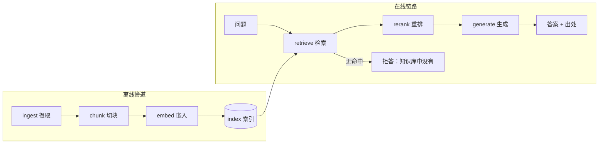

# RAG：检索增强生成

> **所在组**：组 4 · 知识接地（读世界） ｜ **上一组出口**：能写并验证输入输出 schema，并交付一次可取消、可观测的端到端交互（组 2–3） ｜ **本页出口**：能把检索接进生成循环——答案带出处、无命中拒答、语料更新后有可重跑的重建管道
> **前置**：[嵌入与检索](embeddings-retrieval.md) ｜ **下一步**：[高级检索](advanced-retrieval.md)、[工具执行工程](../05-action/tool-execution)

## 1. 概述

模型背不住你的文档、工单和代码。**RAG（Retrieval-Augmented Generation，检索增强生成）先用检索找出几段带出处的原文，再让模型基于这些段落作答；检索不到就拒答**。原论文（Lewis et al.，NeurIPS 2020）把它定义为"参数记忆 + 非参数记忆"的组合：参数记忆是预训练的生成模型，非参数记忆是外部向量索引；论文明确把"为决策提供出处（provenance）"和"更新世界知识"列为纯参数模型的未解问题——引用与更新不是 RAG 的附件，而是它存在的理由（arXiv:2005.11401，retrievedAt 2026-09-01）。

一条 RAG 链分两半：**离线管道**（语料进索引）与**在线链路**（问题变答案），六个阶段环环相扣，任何一个阶段出错都会伪装成"模型答错了"：



| 阶段 | 职责 | 失败模式 | 症状 |
| --- | --- | --- | --- |
| ingest | 拉取、清洗、去重（多格式清单见 3.3） | 脏数据/陈旧文档入库 | 答案是旧口径 |
| chunk | 切成检索单元 | 边界切断语义、粒度过粗 | 该命中不命中；引用对不上 |
| embed | 文本→向量 | 查询与索引不同模型 | 结果整体异常 |
| retrieve | top-k 召回 | 阈值/词法失配 | 误拒或捞回噪声 |
| rerank | 精排截断（→ [高级检索](advanced-retrieval.md)） | 缺失 | 上下文被噪声挤占 |
| generate | 基于段落作答 | 无引用约束/无命中硬编 | 幻觉；答案无出处 |

### 何时使用 / 何时不用

- **用**：回答需要私有语料（产品文档、工单、规章、代码）、需要引用出处、知识随时间更新。
- **不用**：语料一批就能塞进上下文——直接塞（Anthropic 的参考线：约 200,000 token 以内配合 prompt caching，直接把知识库放进 prompt，retrievedAt 2026-09-01）；要改的是行为/风格而非事实——那是微调的事（→ Learn LLM 桥接）；助手场景要的是整仓上下文注入——先看上下文工程。

### 决策表：知识注入方式

| 方式 | 方向 | 控制权 | 状态 | 信任域 | 最低复杂度 |
| --- | --- | --- | --- | --- | --- |
| RAG（本页） | 查询 → 检索 → 上下文 | 切块/索引/过滤/阈值全自管 | 索引派生可重建；语料更新→重建索引 | 只送命中片段给模型 | 中（本页 fixture 即最小形态） |
| 长上下文直塞 | 语料 → prompt 整批搬运 | 提示层拼接 | 每次请求重发全文；缓存可摊薄 | 整个语料进上下文 | 最低（单批小语料） |
| 微调 | 语料 → 参数 | 训练配方 | 固化进权重；更新即重训 | 语料进入训练流程 | 最高 |

选型顺序：**直塞 → RAG → 微调**。直塞到"装不下/更新频繁/要引用"任何一条出现就换 RAG；微调只在要改变行为时考虑——用微调去补事实是反模式，知识变了重建索引即可，不用重训。

### 历史版本里程碑

- 2020：RAG 论文（Lewis et al.，NeurIPS 2020，2020-05-22 提交 arXiv）：两种形式（RAG-Sequence 全序列共用检索结果 / RAG-Token 逐 token 可换检索结果），在三个开放域问答任务上刷新当时最优（摘要已复核，arXiv:2005.11401，retrievedAt 2026-09-01）。
- 2024-09-19：Anthropic 发表 Contextual Retrieval（切块上下文化 + BM25 + 重排）——发布日期经多个独立转载源交叉核验（retrievedAt 2026-09-01）；内容见 [高级检索](advanced-retrieval.md)。

## 2. 使用

最小实战：**零 API key 的完整 RAG 循环**。检索侧复用 [嵌入与检索](embeddings-retrieval.md) 的同一套函数；"生成"用一个确定性的抽取式 mock——从检索结果里挑支撑度最高的句子当答案并标注出处。真实系统把 `generate()` 换成聊天模型调用（提示词要求"只依据给定段落、标注引用、找不到就说不知道"），其余不变。

保存为 `rag.ts`（Node 22.18+ / 24 内置类型剥离，直接运行）：

```ts
// Teaching fixture: complete RAG loop with a deterministic extractive "generator".
// Zero API key: embed/retrieve are the exact functions from the embeddings-retrieval
// page; the "generation" step extracts the best-supported sentence instead of
// calling a chat model, so the whole loop runs offline and deterministically.
// Run: node rag.ts

// ---- Embedder: identical to embeddings-retrieval.ts (hashing bag-of-words) ----

const DIM = 512;

const STOPWORDS = new Set([
  "a", "an", "and", "are", "as", "at", "be", "but", "by", "do", "does", "for",
  "i", "if", "in", "is", "it", "its", "my", "of", "on", "or", "our", "that", "the",
  "this", "to", "we", "were", "what", "when", "where", "which", "who", "why", "you", "your",
]);

function tokenize(text: string): string[] {
  return (text.toLowerCase().match(/[a-z0-9]+/g) ?? []).filter((token) => !STOPWORDS.has(token));
}

function fnv1a(token: string): number {
  let hash = 0x811c9dc5;
  for (let i = 0; i < token.length; i++) {
    hash ^= token.charCodeAt(i);
    hash = Math.imul(hash, 0x01000193) >>> 0;
  }
  return hash >>> 0;
}

function embed(text: string): number[] {
  const vector = new Array<number>(DIM).fill(0);
  for (const token of tokenize(text)) {
    vector[fnv1a(token) % DIM] += 1;
  }
  const norm = Math.sqrt(vector.reduce((sum, value) => sum + value * value, 0));
  return norm === 0 ? vector : vector.map((value) => value / norm);
}

function cosine(a: number[], b: number[]): number {
  let dot = 0;
  for (let i = 0; i < a.length; i++) dot += a[i] * b[i];
  return dot;
}

// ---- Ingest: chunk each document (fixed size + overlap, deterministic) ----

type Chunk = { id: string; text: string; source: string; vector: number[] };

function chunkText(text: string, size = 12, overlap = 4): string[] {
  const words = text.split(/\s+/);
  const chunks: string[] = [];
  for (let start = 0; start < words.length; start += size - overlap) {
    const chunk = words.slice(start, start + size).join(" ");
    if (chunk.trim().length > 0) chunks.push(chunk);
    if (start + size >= words.length) break;
  }
  return chunks;
}

function ingest(source: string, text: string): Chunk[] {
  return chunkText(text).map((chunk, i) => ({
    id: `${source}#${i}`,
    text: chunk,
    source,
    vector: embed(chunk),
  }));
}

const knowledgeBase = [
  ...ingest(
    "runbook.md",
    "The checkout service returns error 502 when the payment gateway times out after ten seconds. " +
      "To mitigate, the gateway timeout must stay below the service timeout. " +
      "On-call runbook: check the payment gateway dashboard first, then restart the checkout pods. " +
      "Escalate to the payments team if the gateway error rate exceeds five percent for five minutes.",
  ),
  ...ingest(
    "oncall.md",
    "The on-call rotation changes every Monday morning. " +
      "Handover notes must list open incidents and pending follow-ups. " +
      "Acknowledge a page within five minutes or it escalates to the secondary on-call.",
  ),
];

// ---- Retrieve: top-k with a floor threshold ----

function retrieve(query: string, topK = 2, minScore = 0.2): Chunk[] {
  const queryVector = embed(query);
  return knowledgeBase
    .map((chunk) => ({ chunk, score: cosine(queryVector, chunk.vector) }))
    .filter((hit) => hit.score >= minScore)
    .sort((a, b) => b.score - a.score || a.chunk.id.localeCompare(b.chunk.id))
    .slice(0, topK)
    .map((hit) => hit.chunk);
}

// ---- Generate: extractive mock. A real system calls a chat model here. ----

type Answer = { text: string; sources: string[] };

function generate(query: string, chunks: Chunk[]): Answer {
  if (chunks.length === 0) {
    // Refusal tier 1: nothing retrieved -> say no instead of guessing.
    return { text: "I cannot answer: nothing in the knowledge base matches this question.", sources: [] };
  }
  const queryTokens = new Set(tokenize(query));
  let best = { sentence: "", overlap: 0, source: "" };
  for (const chunk of chunks) {
    for (const sentence of chunk.text.split(/(?<=\.)\s+/)) {
      const overlap = tokenize(sentence).filter((token) => queryTokens.has(token)).length;
      if (overlap > best.overlap) best = { sentence, overlap, source: chunk.source };
    }
  }
  if (best.overlap === 0) {
    // Refusal tier 2: retrieved chunks exist but none supports an answer.
    return {
      text: "I cannot answer: retrieved passages do not address this question.",
      sources: chunks.map((chunk) => chunk.source),
    };
  }
  return {
    text: `${best.sentence} [${best.source}]`,
    sources: [...new Set(chunks.map((chunk) => chunk.source))],
  };
}

function ask(query: string): void {
  const chunks = retrieve(query);
  const answer = generate(query, chunks);
  console.log(`Q: ${query}`);
  console.log(`A: ${answer.text}`);
  console.log(`sources: ${answer.sources.length > 0 ? answer.sources.join(", ") : "(none)"}`);
  console.log("");
}

// Normal case: a question the runbook can support, answered WITH its source
ask("what to do when the checkout service returns error 502");

// Negative case: off-corpus question -> refusal instead of hallucination
ask("where is the company summer party");
```

实际输出（确定性，可逐字对照）：

```text
Q: what to do when the checkout service returns error 502
A: The checkout service returns error 502 when the payment gateway times out [runbook.md]
sources: runbook.md

Q: where is the company summer party
A: I cannot answer: nothing in the knowledge base matches this question.
sources: (none)
```

逐条解读：

- **正常路径**：检索命中 runbook 的 chunk，抽取式生成器挑出与问题词面重合最高的句子，并把出处 `runbook.md` 钉在答案上。`sources` 是结构化字段，UI 拿它渲染可点击引用，不是装饰文字。
- **负例路径**：语料外问题在检索层就返回空（阈值之下），生成器进入拒答第一层。注意它**没有**退回模型参数记忆去编一个答案——这就是"宁可说不"。
- 真实系统里把 `generate()` 换成模型调用时，拒答要求要写进系统提示词。OpenAI 指南的问答样例即如此措辞："If the answer cannot be found, say 'I don't know.'"（retrievedAt 2026-09-01）。

验收命令与标准：`node rag.ts` 输出与上面逐字一致（正常问题带 `[runbook.md]` 出处；语料外问题拒答且 `sources: (none)`）。清理：删除脚本文件即可。

### 场景矩阵

| 场景 | 输入 / 动作 | 输出 | 适用 | 不适用 |
| --- | --- | --- | --- | --- |
| 基础：文档问答 | 问题 → 检索 → 生成 | 答案 + 出处列表 | 产品文档/规章 FAQ | 开放闲聊 |
| 常见：拒答路径 | 语料外/低分问题 | "知识库中没有" | 一切 RAG 入口 | 用阈值外的答案凑数 |
| 组合：更新后重建 | 文档变更 → 指纹对比 → 增量重建 | 新索引条目 | 知识频繁变更 | 每次全量重嵌（浪费） |

## 3. 原理

### 3.1 可追溯性是产品接口

一条 RAG 答案的可信度来自**每句断言能回链到源文档**。工程上意味着：chunk 入库时带稳定 id（`source#index`）与元数据（路径、标题、权限、内容指纹）；检索结果把 chunk id 传给生成；答案的引用（`[1]`、`[runbook.md]`）由消费端渲染成可点击回链。引用缺失的 RAG 只是"读了资料的聊天"，无法审计。

### 3.2 无命中路径：宁可说不

无命中不是异常分支，是产品行为，分两层处理：检索层全空（拒答第一层）；检索有结果但无一段支撑问题（拒答第二层，仍给出"看过但不够"的来源）。两层都要有明确的用户文案与埋点——误拒率是 RAG 的核心运营指标之一（口径见 [evals](https://evals.zenheart.site/)）。反面是把空结果悄悄传给模型让它自由发挥：这是幻觉的直接来源。

### 3.3 多格式摄取：语料不是纯文本

ingest 的第一课：**真实语料很少是纯文本**。Markdown、PDF、网页、表格、扫描件各有各的取法与坑，取错形态的代价要到检索层才显形——"该命中不命中"，且难归因。多格式清单（覆盖面参照黄佳《RAG 实战课》Ch1 的结构；工具思路为通用思路，非产品推荐）：

| 格式 | 工具思路 | 主要失败模式 |
| --- | --- | --- |
| Markdown / HTML | 按标题层级解析成结构树，按结构边界切块 | 导航、页脚等样板噪声混进 chunk；源码与渲染文本不一致 |
| PDF（有文本层） | 文本层提取（如 pypdf / pdf-parse），保留页码做引用回链 | 双栏文档阅读顺序错乱；表格被拆成碎片 |
| 扫描件 / 图片 | 先 OCR（如 Tesseract 或云 OCR），置信度写进元数据 | 低置信度乱码入库污染索引——检索"答错"却难归因 |
| 网页 | 抓取 + 正文抽取（如 readability），记录抓取时间戳 | 页面改版后静默丢内容；动态渲染部分抓不全 |
| CSV / 表格 | 按行切，表头拼进每条记录 | 整表嵌一个 chunk 丢失列语义；跨行聚合问题查不到 |
| Office（docx / pptx） | 解包 XML 或转换成 Markdown 再切 | 批注 / 修订 / 隐藏页混入；无标题幻灯片丢失结构信息 |

两条与格式无关的兜底：**摄取产物统一归一到"纯文本 + 元数据（来源、页码或行号、抓取时间）"的内部表示**，下游 chunk / embed / index 不感知来源格式；**OCR 低置信度与解析失败的文件走隔离队列人工复核**，不入索引。托管侧参照：OpenAI 向量存储直接接受 doc / docx / pdf / html / md / pptx / json / 代码等格式并自动切块（官方 MIME 表，retrievedAt 2026-09-01）。多模态嵌入是另一条路：Cohere `embed-v4.0` 可把截图、幻灯片等图文混合内容直接嵌入（官方定位即省去文本抽取 ETL，retrievedAt 2026-09-01），适合保真优先的语料。

### 3.4 更新管道：数据变了怎么重建

RAG 的知识更新单位是**重建索引**，不是重训模型。一条可重跑的增量管道：

```text
文档变更 → 对每个 chunk 计算内容指纹（如 SHA-256）
        → 与清单里旧指纹比对：相同则跳过，不同则重嵌并 upsert
        → 文档删除 → 按稳定 id 前缀清掉其全部 chunk
        → 清单落盘（id → 指纹），作为下次比对的基线
```

稳定 id（`docId:chunk:i` 这类格式）保证更新与删除是确定性操作；指纹比对避免未变更内容重复付费嵌入。（该模式提炼自站内语义搜索实战案例，案例全文在附录；管道实现细节另见各家向量库的 upsert 语义。）

### 3.5 不变量

- **索引与查询同一嵌入模型**：换模型必须重建索引；启动时校验模型名与维度。
- **权限过滤在检索时**：ACL 进检索条件，不是生成后再藏（详见 [嵌入与检索](embeddings-retrieval.md) 原理段）。
- **答案出口统一走"引用或拒答"**：任何绕过检索直接生成的路径都是这次链路上的幻觉后门。

### 规范要求 vs 本地实测

| 断言 | 官方/规范口径 | 本页 fixture |
| --- | --- | --- |
| 切块粒度 | Anthropic：通常几百 token 一块 | 12 词一块、4 词重叠（演示用） |
| 拒答提示 | OpenAI 样例："找不到就说 I don't know" | 生成器内建两层拒答，不依赖提示词 |
| 引用形态 | OpenAI file search 以 `file_citation` 注解返回出处 | `source` 字段 + `[runbook.md]` 内联标注 |
| 更新语义 | 各家向量库提供 upsert（存在则更新） | 未实现（管道描述见 3.4） |
| 托管 RAG | OpenAI file search：向量存储 + 语义/关键词混合检索内置 | 本页手写全链，教学用 |

## 4. 开发

### 集成、测试与回滚

- **接到产品交互（组 2）**：生成步骤换真实模型后，答案流式渲染复用 [流式响应](../02-inference-interface/streaming)；引用列表在流结束后随 `sources` 一次性给出。
- **版本 pin**：索引记录嵌入模型版本；升级 = 新版本索引 + 别名切换 + golden set 对照，而不是原地覆盖。
- **测试**：至少 20 条真实问题做 fixture——一半"该命中"（答案必须引用正确文档），一半"该拒答"（必须拒答）。只测"感觉通顺"不算验收。
- **回滚**：保留上一版索引；切流量的开关在别名上，回滚即改回指向。

### 症状 → 证据 → 处理 → 完成标准

**症状**：答案引用的段落和答案内容对不上。
**证据**：抽样答案回放 chunk id 指向的原文；看 chunk 边界是否把"现象"和"处理"切在两块。
**处理**：按结构边界（标题/段落）重切并加重叠；用稳定 id 重建索引。
**完成标准**：20 条抽检答案的引用全部指向支撑该答案的段落。

### 症状 → 证据 → 处理 → 完成标准

**症状**：大量该答的问题被拒答。
**证据**：拒答清单 + 这些问题的检索分数分布（区分"真空区"与"临界区"）。
**处理**：临界区调阈值；真空区是词法/语义失配——上混合检索与查询改写（→ [高级检索](advanced-retrieval.md)）。
**完成标准**：golden set 里"该命中"全部命中，"该拒答"仍全部拒答。

### 症状 → 证据 → 处理 → 完成标准

**症状**：文档更新后，答案还是旧口径。
**证据**：对比索引条目指纹与文档当前内容；检查更新管道是否在跑、陈旧 chunk 是否清理。
**处理**：按 3.4 的管道补指纹比对与删除路径；把索引重建挂到文档发布流程。
**完成标准**：文档发布后 N 分钟内，同一问题答案指向新版本文档。

### 症状 → 证据 → 处理 → 完成标准

**症状**：无权限用户问出了受限内容。
**证据**：低权限账号跑越权用例集；检索日志看过滤条件是否携带 ACL。
**处理**：把 ACL 并入检索过滤；所有检索入口共用同一过滤构造器。
**完成标准**：越权用例集全空；正常用户召回不变。

### 反模式清单

- 用微调代替更新文档。知识变了重建索引即可；微调改的是行为不是事实来源。
- 把整仓当一块嵌入。粒度过粗，检索稀释、引用失焦。
- 检索到就当事实。相似度高只代表"像"；生成段仍要约束"只依据给定段落"。
- 无命中时放任模型作答。空结果必须短路到拒答文案。
- 只验收通顺度。没有 golden set 的 RAG 上线等于没有验收。

## 5. 资料库

### 四级阅读路线

- **Beginner**：本页 fixture 跑通 → OpenAI Retrieval 指南（托管形态的 RAG 长什么样）。
- **Builder**：OpenAI file search 工具文档（向量存储、引用注解、元数据过滤）→ Anthropic Contextual Retrieval 博文（检索质量天花板在哪）。
- **Operator**：本页 runbook → [evals](https://evals.zenheart.site/)（把引用正确率/误拒率变成上线门）。
- **Researcher**：RAG 原论文（Lewis et al. 2020）→ [Learn LLM 第 11–12 章](https://llm.zenheart.site/chapters/11-rag)（切块、召回、引用正确率的机制与评测）。

### 资源表

| 名称 | 层级 | canonical URL | 用途 | 支持的断言 | 下一步 |
| --- | --- | --- | --- | --- | --- |
| RAG 原论文 | L0 | https://arxiv.org/abs/2005.11401 | 定义、参数/非参数记忆、出处与更新动机 | RAG-Sequence/Token；三个 QA 任务最优 | 读全文的实验设置 |
| Anthropic：Contextual Retrieval | L1 | https://www.anthropic.com/news/contextual-retrieval | 检索失败模式与 200k token 直塞参考线 | 分块丢上下文；49%/67% 改进（在高级检索页展开） | 试其 cookbook |
| OpenAI：Retrieval | L1 | https://developers.openai.com/api/docs/guides/retrieval | 语义检索、属性过滤、chunk 默认值、响应合成 | 过滤算子；800/400 默认 | 接 file search |
| OpenAI：File search | L1 | https://developers.openai.com/api/docs/guides/tools-file-search | 托管 RAG 形态与引用注解 | `file_citation`；语义+关键词混合 | 对照自建链路的差距 |
| OpenAI：Vector embeddings | L1 | https://developers.openai.com/api/docs/guides/embeddings | 问答样例的拒答措辞 | "找不到就说 I don't know" | — |

以上页面 retrievedAt 均为 2026-09-01。

### 主动证伪与未决问题

- "约 200,000 token 以内可直塞"是 Anthropic 的参考线（配合 prompt caching），随模型窗口与价格变化，使用当天复核。
- 本页 fixture 的抽取式生成器没有幻觉能力，也因此验证不了"提示词约束对真实模型幻觉的抑制效果"——该问题交给 [evals](https://evals.zenheart.site/) 的对照评测。

### learn-ai 到此为止 / 继续去哪

本页交付"带出处与拒答的最小 RAG 链"。检索质量升级（混合检索/重排/上下文化切块）→ [高级检索](advanced-retrieval.md)；把检索当成工具交给 Agent 调度 → [工具执行工程](../05-action/tool-execution)；切块与召回的机制、评测细节 → [Learn LLM 第 11–12 章](https://llm.zenheart.site/chapters/11-rag) 与 [evals](https://evals.zenheart.site/)。
