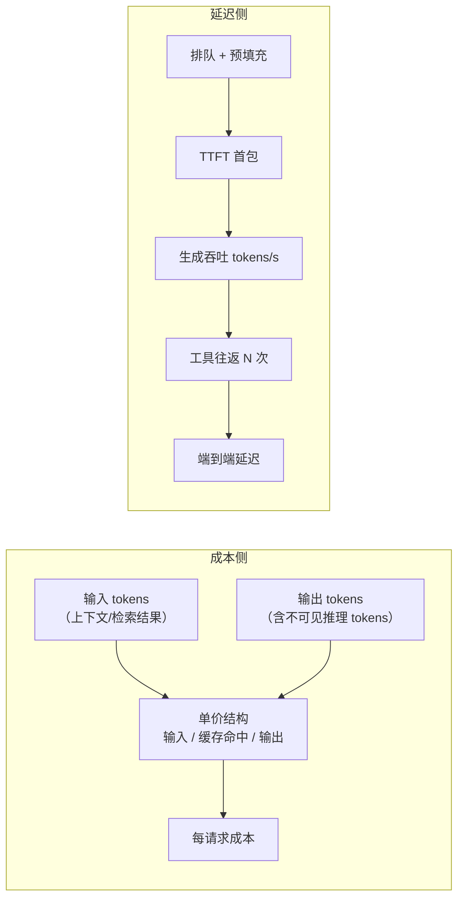

> **在哪一层**：层 5 · 可靠运营 ｜ **上一层出口**：能限制权限、暂停/恢复任务 ｜ **本层出口**：能拆解一次请求的成本与延迟，并按优化阶梯选择性价比手段
> **前置**：[模型 API 契约](../02-integration/model-api)（usage 字段）、[可观测性](observability)（每请求记录） ｜ **下一步**：[部署与发布](deployment)（预算告警与熔断落地点）

## 1. 概述

**结论先讲**：AI 应用的成本与延迟不是「厂商说了算的黑盒」，而是**可分解、可记账、可优化的工程量**。成本 = 每请求 token 用量 × 单价结构（输入/输出/缓存三档）；延迟 = TTFT（首 token 时间）+ 生成吞吐 + 工具往返。优化的正确顺序是**先记账、再优化**——没有[可观测性](observability)的每请求记录，一切优化都是猜。动态单价**一律以厂商定价页为准**（本文引用结构不引用数字，见「原理」段的核验表）。

### 心智模型：一次请求的钱和时间去了哪



### 决策表：贵模型还是小模型

| 场景特征 | 选贵模型 | 选小模型 | 先优化别换 |
| --- | --- | --- | --- |
| 任务复杂度 | 多步推理/严格指令遵循 | 分类/抽取/格式转换/日常对话 | — |
| 失败代价 | 错一次损失大（法律/资金） | 错了可重试可忽略 | — |
| 流量结构 | 长尾少量难例 | 高频重复大流量 | 高频且相似 → 先缓存 |
| 当前症状 | 质量不达标 | 质量过剩、账单痛 | 上下文爆炸 → 先压缩 |

路由模式（难例升贵模型、易例走小模型）是两者兼得的形态，前提是有[评估](evaluation)阈值判定难度。

### 何时使用 / 何时不用

- 用：任何有持续账单或延迟 SLO 的系统；任何「换模型能不能省钱」的决策。
- 不用：月成本可忽略的个人玩具——记账与优化的工时比账单贵。

历史版本里程碑：本页 2026-09 由旧 `engineering/cost-optimization.md`（模型路由/语义缓存/压缩/自托管四策略）重写，补充延迟分解与优化阶梯，并把所有单价口径改为「结构引用 + 厂商定价页 + retrievedAt」。

## 2. 使用

最小实战：15 分钟、零 API key，实现**每请求成本追踪 + 预算熔断 + 延迟分解记录**。单价以配置注入（示例数字是**演示配置，非厂商报价**），真实项目从厂商定价页录入并标注日期。

### 步骤 1：保存 `cost-tracker.mjs`

```javascript
// cost-tracker.mjs — 每请求成本记账 + 预算熔断 + 延迟分解（单价为演示配置，非厂商报价）
import assert from 'node:assert/strict';

// 单价结构：真实项目从厂商定价页录入（每 1M token），并记 retrievedAt。
// 结构本身是行业通式：输入 / 缓存命中 / 输出 三档（OpenAI、Anthropic 同构，2026-09-01 核验）。
const PRICES = {
  'model-large':  { input: 5.0, cacheRead: 0.5, output: 25.0, retrievedAt: 'fixture' },
  'model-small':  { input: 0.5, cacheRead: 0.05, output: 2.0, retrievedAt: 'fixture' },
};

function requestCost(model, usage) {
  const p = PRICES[model];
  if (!p) throw new Error(`unknown model: ${model}`);
  const m = (n) => n / 1e6; // tokens -> 百万 token 单位
  return p.input * m(usage.inputTokens - (usage.cacheReadTokens ?? 0))
       + p.cacheRead * m(usage.cacheReadTokens ?? 0)
       + p.output * m(usage.outputTokens);
}

// ---- 预算熔断：单位时间累计超限即拒绝新请求（防失控循环烧钱）----
function createBudgetGuard(monthlyLimitUsd) {
  let spent = 0;
  return {
    check: () => { if (spent >= monthlyLimitUsd) throw new Error('budget_exhausted'); },
    record: (usd) => { spent += usd; return spent; },
    spent: () => spent,
  };
}

// ---- 延迟分解：一次请求的分段记录 ----
function latencyProfile(segments) {
  const total = segments.reduce((a, s) => a + s.ms, 0);
  const gen = segments.find((s) => s.name === 'generate');
  return {
    totalMs: total,
    ttftMs: gen?.ttftMs ?? null,
    tokensPerSec: gen ? gen.outputTokens / (gen.ms / 1000) : null,
    toolRoundtrips: segments.filter((s) => s.name === 'tool').length,
  };
}

// ---- 演示（确定性）：三个记账用例 ----
const guard = createBudgetGuard(1.0); // 演示预算 1 美元
const r1 = requestCost('model-small', { inputTokens: 2000, cacheReadTokens: 0, outputTokens: 200 });
assert.ok(Math.abs(r1 - (0.5 * 0.002 + 2.0 * 0.0002)) < 1e-9);
guard.record(r1);

const r2 = requestCost('model-large',
  { inputTokens: 50000, cacheReadTokens: 40000, outputTokens: 1500 }); // 80% 缓存命中
assert.ok(r2 > 0); guard.record(r2);

const profile = latencyProfile([
  { name: 'retrieve', ms: 120 },
  { name: 'generate', ms: 1800, ttftMs: 350, outputTokens: 1500 },
  { name: 'tool', ms: 400 }, { name: 'tool', ms: 300 },
]);
assert.equal(profile.toolRoundtrips, 2);
assert.ok(profile.tokensPerSec > 0 && profile.tokensPerSec < 2000);

console.log('小模型请求:', r1.toFixed(6), 'USD');
console.log('大模型+80%缓存:', r2.toFixed(6), 'USD');
console.log('累计:', guard.spent().toFixed(6), 'USD / 限额 1');
console.log('延迟分解:', JSON.stringify(profile));

guard.record(0.9); // 模拟流量继续消耗
assert.throws(() => guard.check(), /budget_exhausted/); // 负例：熔断生效
console.log('预算熔断: budget_exhausted 如预期抛出');
```

### 步骤 2：运行

```bash
node cost-tracker.mjs
```

### 步骤 3：正常输出

```text
小模型请求: 0.001400 USD
大模型+80%缓存: 0.107500 USD
累计: 0.108900 USD / 限额 1
延迟分解: {"totalMs":2620,"ttftMs":350,"tokensPerSec":833.3333333333333,"toolRoundtrips":2}
预算熔断: budget_exhausted 如预期抛出
```

### 步骤 4：负例观察

把用例 2 的 `cacheReadTokens` 改为 0（缓存完全未命中），成本显著上升——这就是「缓存命中率」作为成本杠杆的直接展示；再调低 `monthlyLimitUsd` 到 0.05，第一笔记录后即熔断。

### 验收与清理

- 验收：断言全过；能口头回答「80% 缓存命中省了哪一档的钱」。
- 清理：删除文件即可。

## 3. 原理

### token 成本结构（核验于 2026-09-01，单价以厂商定价页为准）

| 结构项 | OpenAI（platform.openai.com/docs/pricing） | Anthropic（docs.claude.com/en/docs/about-claude/pricing） |
| --- | --- | --- |
| 计价分档 | 输入 / **缓存命中输入** / 输出，每 1M token | 基础输入 / **缓存写**（5 分钟档与 1 小时档）/ **缓存读** / 输出 |
| 缓存命中单价 | 约为输入价的一成（如 gpt-5.2 系 cached input 为 input 的 10%） | 缓存读为输入价的 0.1x；缓存写为 1.25x（5m）/ 2x（1h） |
| 批处理 | Batch API 折扣（非时效请求） | Batch API 输入输出均五折 |
| 不可见推理 tokens | 按输出 token 计费（占上下文但不可见） | 推理计入输出成本（thinking 计费与显示无关） |

两条工程推论：**缓存命中的钱接近输入价的十分之一**（两家一致），高重复前缀的场景缓存是第一杠杆；**看不见的推理 tokens 也按输出计费**，「输出看着短」不等于便宜。

### 缓存的工程前提（前缀匹配）

提示缓存是**严格前缀匹配**：前缀中任何一字节变动都会使其后的缓存失效。因此稳定内容（冻结的系统提示、确定性顺序的工具清单）放前面，易变内容（时间戳、请求 ID、用户问题）放后面。验证手段：读取响应 usage 的缓存命中字段（如 `cache_read_input_tokens`），重复请求持续为零即存在**静默失效源**（系统提示里的时间戳、乱序序列化的 JSON、变动的工具集）。 caching 失效的排查与[可观测性](observability)共用同一份 usage 记录。

### 延迟分解

| 分量 | 定义 | 杠杆 |
| --- | --- | --- |
| TTFT | 请求发出到首个 token | 预填充量（上下文长度）、缓存命中（命中段免重算） |
| 生成吞吐 | 首 token 后每秒输出 token 数 | 模型档位、输出长度约束 |
| 工具往返 | 每次工具调用的串行等待 | 并行工具调用、工具超时上限、减少循环步数 |
| 端到端 | 以上之和（多轮再乘轮数） | 架构层：改检索、改 prompt、改路由 |

交互式产品对 TTFT 敏感（体感「快不快」），批处理对吞吐与单价敏感——优化目标先分类再动手。

### 优化阶梯（按投入产出排序，从低到高）

1. **缓存**：稳定前缀 + 命中验证。改动最小，收益直接（见上）。
2. **prompt 压缩**：砍冗余指令、检索结果摘要、历史裁剪——输入 token 直接下降。
3. **模型路由**：易例走小模型、难例升贵模型，路由依据用[评估](evaluation)阈值而非直觉。
4. **批处理**：非时效任务走 Batch 档（两厂商均有折扣结构）。
5. **蒸馏/微调**：把高频任务的贵模型行为固化到小模型——投入大，需 [Learn LLM](https://llm.zenheart.site/) 的训练知识与本仓[评估](evaluation)的质量门。
6. **架构**：改检索策略减少注入量、改 agent 循环减少步数——回到层 3/层 4 重新设计。

**先记账再上阶梯**：每一级都要用每请求成本数据验证收益，否则优化本身成为新的成本。

### 规范要求 vs 本地实测

本页无协议规范可实现测；「规范」侧为两家厂商定价页的结构口径（上表，retrievedAt 2026-09-01），「实测」侧为本页记账器对三档结构的计算（断言验证）。单价数字刻意不入正文——**引用结构，不引用价格**。

## 4. 开发

### 症状 → 证据 → 处理 → 完成标准

**症状**：月账单环比翻倍，不知道从哪涨的。
**证据**：每请求 usage 记录按「功能 × 模型 × 分档」聚合（→[可观测性](observability)）；找出贡献增量的维度。
**处理**：输入涨 → 查上下文膨胀与缓存命中率；输出涨 → 查推理类模型用量与循环步数；请求量涨 → 查是否有失控重试。
**完成标准**：能指认主要增长项并给出对应阶梯动作；下个周期同维度对账回落。

### 症状 → 证据 → 处理 → 完成标准

**症状**：缓存命中率持续为零，缓存形同虚设。
**证据**：响应 usage 的缓存命中字段在重复请求下仍为 0；diff 两次请求的序列化前缀。
**处理**：消除前缀里的变动源——时间戳/请求 ID 移到后段、JSON 键排序固定、工具清单冻结顺序。
**完成标准**：同前缀重复请求的缓存命中字段大于 0 且稳定；命中率进入常规看板。

### 症状 → 证据 → 处理 → 完成标准

**症状**：P95 延迟劣化，用户抱怨变慢。
**证据**：延迟分解看板定位分量——TTFT 涨（上下文变长/缓存失效）、吞吐降（输出变长）、工具往返涨（循环步数增加）。
**处理**：按分量对症：压缩上下文、限制输出长度、并行化工具、给工具设超时上限。
**完成标准**：劣化分量回到基线区间；延迟分解成为发布前后的对账项（→[部署与发布](deployment)）。

### 反模式清单

- **先优化后记账**：没拆账就上微调/换模型，收益无法归因。
- **只看总价不看分档**：缓存命中与推理 token 两档的杠杆完全不同。
- **把演示单价当事实传播**：正文写死厂商价格必然过期——结构引用 + 厂商定价页 + retrievedAt 是唯一合规写法。
- **预算无熔断**：失控循环一夜烧穿预算（OWASP 2026 将 Unbounded Consumption 升至 LLM06）。

## 5. 资料库

四级阅读路线：

- **Beginner**：跑通本页记账器；理解三档单价与 TTFT/吞吐/往返。
- **Builder**：给自己的系统接每请求 usage 记账与预算熔断；验证缓存前缀稳定。
- **Operator**：建立「功能 × 模型 × 分档」成本看板与延迟分解看板；按优化阶梯逐级验证。
- **Researcher**：读两家厂商定价与缓存文档全文；对照推理引擎侧的性能机理（→ Learn LLM）。

### 资源表

| 名称 | 证据层级 | canonical URL | 用途 | 支持的断言 | 下一步 |
| --- | --- | --- | --- | --- | --- |
| OpenAI API 定价页 | L0（厂商官方） | https://platform.openai.com/docs/pricing | 单价与分档结构 | 输入/缓存命中/输出三档；批处理折扣；推理 tokens 按输出计费（retrievedAt 2026-09-01） | 录入最新单价到配置 |
| Anthropic 定价文档 | L0（厂商官方） | https://docs.claude.com/en/docs/about-claude/pricing | 单价与缓存结构 | 缓存写 1.25x/2x、读 0.1x；Batch 五折（retrievedAt 2026-09-01） | 读其 prompt caching 实现文档 |
| OpenTelemetry GenAI 语义约定 | L0（官方规范） | https://github.com/open-telemetry/semantic-conventions-genai | token/延迟属性的统一命名 | `gen_ai.usage.*` 与 TTFT 类指标（Development 级，retrievedAt 2026-09-01） | [可观测性](observability) |
| OWASP GenAI LLM Top 10 2026 | L0（官方清单） | https://genai.owasp.org/resource/owasp-genai-llm-top-10-2026/ | 无限制消耗风险 | LLM06 Unbounded Consumption（retrievedAt 2026-09-01） | [安全](security) |

### 主动证伪与未决问题

- 证伪入口：若你的流量里前缀几乎无重复（每次上下文都全新），缓存这一级应跳过——优化阶梯按流量形态裁剪，不是逐级打卡。
- 未决：路由器（难易分流）的难度判定本身引入额外成本与错误率，何时「路由不划算」需要用评估数据逐案例定，本仓暂无量化门槛。

### learn-ai 到此为止 / 继续去哪

- 蒸馏/微调的训练侧知识：[Learn LLM](https://llm.zenheart.site/)。
- 路由的难度判定阈值：[评估（桥接）](evaluation) 与 [evals](https://evals.zenheart.site/)。
- 预算告警与发布前后对账的落地：[部署与发布](deployment)。
