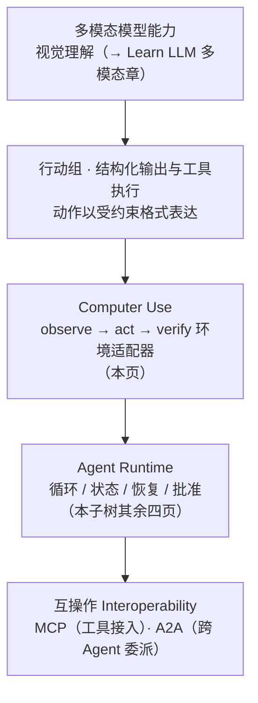

> **所在组**：Agent 系统 ｜ **上一组出口**：能搭最小 Agent 循环，并知道恢复与人工批准怎么架 ｜ **本页出口**：能判断一个界面自动化需求该用 API、DOM 自动化还是 Computer Use，并给 Computer Use 配上沙箱、批准门与注入防护
> **前置**：[Agent 运行时](agent-runtime.md) · [工具执行工程](../05-action/tool-execution.md) ｜ **下一步**：[多 Agent 系统](multi-agent.md) · [安全](../08-production/security) · [A2A](../07-interoperability/a2a.md)

## 1. 概述

**结论先讲**：Computer Use 的技术本质是**一个控制回路**——模型以视觉 / 语义观察（截图、可访问性树）为输入，产生**受约束的界面动作**（截图、点击、键入、缩放），每个动作后重新观察来验证结果。它不是新的顶层能力类别，而是三个已有件的交叉节点：**行动能力**（[行动组](../05-action/tool-calling)的结构化输出与工具执行）+ **环境适配器**（把像素 / DOM 翻译成模型可读、把模型动作翻译成环境可执行）+ **Agent 运行时**（本子树的循环、状态、恢复、批准）。

### 归位图：它站在哪些能力的交叉点上



从下往上读：模型能看懂界面（多模态）+ 动作能被结构化表达（工具执行），才可能驱动界面；而「驱动界面」要安全可靠，必须套在完整运行时里；如果目标其实是「委派任务」，出口是 A2A 而不是模拟点击。

### 最低复杂度决策表

| 环境条件 | 最低复杂度方案 | 为什么不用 Computer Use |
| --- | --- | --- |
| 目标系统有稳定 API | 直接 API + schema（[工具调用契约](../05-action/tool-calling)） | 确定性、快、便宜、可测 |
| 页面有稳定 DOM / 选择器 | Playwright / CDP 确定性自动化 | 坐标漂移与视觉误判**全部消失** |
| 只有视觉 UI（无 API、无稳定 DOM） | **Computer Use + 沙箱 + 人工批准** | 这是它唯一的入场券 |
| 要把任务委派给另一个 Agent | [A2A](../07-interoperability/a2a.md)，不是桌面动作协议 | 语义级委派优于模拟点击 |

判定顺序自上而下：**每往下一行都是被迫的**。用 Computer Use 之前先证明上两行不可行——「有 API 但不想申请权限」不是正当理由。

### 非目标（本页不是什么）

| 不是 | 它是什么 / 去哪 |
| --- | --- |
| 浏览器自动化库 | Playwright 是确定性驱动代码；Computer Use 是模型在循环里**决定**下一步动作。两者常组合：Computer Use 判断意图，Playwright 执行稳定段 |
| 视觉模型原理 | 多模态 tokenization、视觉编码 → Learn LLM 多模态章；本页只借用「模型能看图」这个事实 |
| MCP | MCP 是工具接入协议；Computer Use 是其中「界面工具」的**执行环境**，可以经 MCP 暴露，但两者层次不同 |
| A2A | A2A 委派的是任务语义；Computer Use 操作的是像素与焦点。委派需求 ≠ 自动化需求 |

### 何时使用 / 何时不用

- 用：遗留系统只有 GUI；跨应用的长尾操作（填表、核对、提交）；作为确定性自动化的**补充**处理结构不稳定的部分。
- 不用：有稳定 API / DOM（见决策表）；要求精确与速度（官方自述延迟偏高、坐标会错）；无人监督的高危操作（支付、删除、对外发送必须过[批准门](recovery-hitl.md)）。

历史版本里程碑：Anthropic computer use 的当前工具集为 `computer_toolset_20260801`（17 个成员工具）；此前的 beta 版本为 `computer_20250124` 与 `computer_20251124`（官方文档记载，retrievedAt 2026-09-01）。更早的能力演化时间线未验证，不编造。

## 2. 使用

**最小实战**：≤15 分钟、零 API key、**无浏览器依赖**。用纯字符串 DOM mock 演示 Computer Use 的同一契约：`observe`（快照元素表）→ `act`（按 ref 点击 / 键入）→ `verify`（断言后置条件），外加**元素漂移**负例——重渲染后旧引用失效。真实浏览器端到端验证待 Phase 5 落地（见[测试](../08-production/testing)）。

### 步骤

1. 新建空目录，把下面的代码保存为 `computer-use-dom-mock.ts`。
2. 运行 `node --experimental-strip-types computer-use-dom-mock.ts`。

```ts
// computer-use-dom-mock.ts
// Zero-key, deterministic observe -> act -> verify loop over a string DOM mock.
// Demonstrates the Computer Use control loop and the "element drift" failure
// where a stale element reference misses after the page re-renders.
// Real-browser validation is deferred to Phase 5.
// Run: node --experimental-strip-types computer-use-dom-mock.ts   (Node >= 22.6)

/** A page element as the "vision" layer would report it: role + name + ref. */
interface Element {
  ref: string;
  role: string;
  name: string;
}

/**
 * Pure string "DOM". In real Computer Use this is a screenshot plus pixel
 * coordinates; here the same contract (observe refs, act on refs, verify)
 * is exercised without a browser.
 */
let page: Element[] = [
  { ref: "username", role: "textbox", name: "Username" },
  { ref: "password", role: "textbox", name: "Password" },
  { ref: "submit", role: "button", name: "Sign in" },
];

/** Observe: snapshot the interface state the model will act on. */
function observe(): Element[] {
  return page.map((el) => ({ ...el })); // copy: snapshots go stale
}

/** Act: click / type against a ref. Returns what the environment did. */
function act(command: { action: "click" | "type"; ref: string; text?: string }): string {
  const el = page.find((e) => e.ref === command.ref);
  if (!el) return `error: no element with ref "${command.ref}"`;
  if (command.action === "type") {
    if (el.role !== "textbox") return `error: ${command.ref} is not typeable`;
    return `typed "${command.text}" into ${el.ref}`;
  }
  return `clicked ${el.ref} (${el.name})`;
}

/** Verify: check the postcondition; the model must not assume success. */
function verify(predicate: (els: Element[]) => boolean): boolean {
  return predicate(observe());
}

// --- happy path: fill the form, submit, verify the outcome ---
function happyPath(): void {
  act({ action: "type", ref: "username", text: "zen" });
  act({ action: "type", ref: "password", text: "hunter2" });
  act({ action: "click", ref: "submit" });
  // submit navigates: replace the page with the signed-in view
  page = [{ ref: "welcome", role: "heading", name: "Welcome back, zen" }];
  const ok = verify((els) => els.some((e) => e.name.includes("Welcome back")));
  console.log(`happy path verified: ${ok}`); // true
}

// --- negative path: stale snapshot after a re-render ("element drift") ---
function driftPath(): void {
  // restore a fresh login page first (happyPath navigated away)
  page = [
    { ref: "username", role: "textbox", name: "Username" },
    { ref: "password", role: "textbox", name: "Password" },
    { ref: "submit", role: "button", name: "Sign in" },
  ];
  const snapshot = observe(); // taken before the page changed
  page = [
    { ref: "banner", role: "banner", name: "Cookie notice" }, // inserted on top
    { ref: "submit-v2", role: "button", name: "Sign in" }, // ref re-assigned
  ];

  const target = snapshot.find((e) => e.ref === "submit")!; // stale reference
  const result = act({ action: "click", ref: target.ref });
  console.log(`stale click result: ${result}`); // error: no element with ref "submit"

  // recovery rule: after a failed act, re-observe before retrying
  const fresh = observe().find((e) => e.role === "button")!;
  console.log(`re-observed click: ${act({ action: "click", ref: fresh.ref })}`);
}

happyPath();
driftPath();
```

### 正常输出

```text
happy path verified: true
stale click result: error: no element with ref "submit"
re-observed click: clicked submit-v2 (Sign in)
```

### 负例输出（错误示范）

负例已内置：drift 场景里用**旧快照**的 ref 点击，环境返回 `error: no element with ref "submit"`。错误的做法是原样重试同一个 ref（页面没变它还会失败）；正确做法是**失败后重新 observe**再定位——这正是「每个动作后重新观察」这条回路规则存在的原因。

### 验收命令

```bash
node --experimental-strip-types computer-use-dom-mock.ts
```

通过标准：happy path 验证为 true；漂移点击报错且错误信息含旧 ref；重观察后的点击成功。

### 清理

删除整个目录即可。

## 3. 原理

### 回路怎么转：官方的 agent loop

Anthropic 文档把 computer use 的核心定义为 agent loop：模型返回若干**成员工具调用**（`screenshot`、`left_click`、`type`、`zoom` 等），你的应用**在自己的环境里按顺序执行**，每个调用回一个 `tool_result`，再调模型；「步骤 3 和步骤 4 无用户输入地重复」就是这个循环。三条回路规则直接来自官方文档：

1. **batch 内按序执行、首个失败即停**：后续块全部标记未执行——后面的动作依赖前面的焦点状态。
2. **每个 batch 以 `screenshot` 收尾**（或由宿主附加截图）：模型必须在决定下一步前看到当前屏幕。
3. **坐标在截图的像素空间里**：缩放截图后要把模型坐标等比映射回真实屏幕。

官方建议的提示词把 verify 讲得很直白：「每步之后截图并仔细评估是否达到预期结果……只有确认本步正确才进入下一步」。

### 环境适配器的职责

模型与桌面之间由你提供五件东西（官方参考实现的构成）：虚拟显示（如 Xvfb）+ 轻量桌面环境 + 预装应用 + 动作实现（把「点击」翻译成真实鼠标事件）+ agent loop 本身。全部跑在容器 / VM 里——**模型不直连任何环境，你的应用是唯一的执行通道**，这正是权限收口的位置。

### 注入：页面内容是不可信输入

官方安全节的原话：某些情况下「Claude 会遵循内容中发现的指令，即使它们与你的指令冲突」——网页、甚至图片里嵌入的指令可能覆盖你的任务。护栏分层：

1. **隔离**：沙箱内无生产凭据、无敏感数据访问。
2. **检测**：官方对截图跑注入分类器，命中即引导模型转向人工确认。
3. **批准**：后果性动作（支付、发送、删除）逐块过[人工批准门](recovery-hitl.md)——官方明确提醒：batch 能在一轮内完成多步动作，批准检查必须放在**每个块执行前**。

### 已知局限（官方自述）

| 局限 | 工程对策 |
| --- | --- |
| 延迟高于人直接操作 | 用于速度不敏感的场景（信息收集、回归测试） |
| 坐标会错 / 幻觉 | 动作后 verify；漂移即重观察 |
| 工具选择会错 | 任务拆小、指令明确；一次只碰一个应用 |
| 滚动不生效 | 键盘替代（Page Down 等） |
| 截图历史膨胀成本 | 修剪策略（官方建议：保留最近约 3 张、约每 25 轮成批修剪） |

### 规范要求 vs 本地实测

| 断言（官方文档） | 本地实测（字符串 DOM mock） |
| --- | --- |
| 循环 = 模型出动作、宿主执行、结果回填 | `observe → act → verify` 三函数即同一契约 |
| 动作失败要显式报错并触发重规划 | `act` 返回 `error: no element with ref …` |
| 每步后重新观察验证结果 | `verify` 用**新** observe 的谓词断言 |
| 快照会过期，旧引用会漂移 | drift 场景：旧 ref 点击失败，重观察后成功 |
| 真实浏览器行为 | **未实测**——待 Phase 5 用 Playwright 驱动真实页面验证 |

## 4. 开发

### 上线前的四道护栏

1. **沙箱与 allowlist**：独立容器 / VM，网络按域名 allowlist，无生产凭据。参考实现是 Docker 容器 + Xvfb 虚拟显示。
2. **最小权限动作集**：按任务裁剪成员工具（不需要拖拽就禁用 `left_click_drag`）；文件系统与剪贴板隔离。
3. **敏感操作 HITL**：支付、删除、对外发送、登录（官方明确：登录场景注入风险升高）强制走批准门，检查点在 batch 的**每个块之前**。
4. **重试 / 幂等 / 取消**：点击不幂等（提交两次 = 下两单）——重试前必须 verify 当前状态；取消 = 停止执行未跑的 batch 块（官方 halt 语义天然支持）。

### 症状 → 证据 → 处理 → 完成标准

**症状**：点击总是朝同一个方向偏移。
**证据**：官方诊断表的第一行——模型坐标基于你返回的截图像素，被未缩放地应用到了不同尺寸的真实屏幕。
**处理**：按「屏幕尺寸 / 截图尺寸」的比率缩放每个坐标再执行；高分屏注意设备像素比。
**完成标准**：点击命中目标元素；漂移量回到 0。

### 症状 → 证据 → 处理 → 完成标准

**症状**：agent 在某个页面上突然开始执行与任务无关的动作（比如点开了广告里的「下载」）。
**证据**：trace 显示触发动作前的截图包含新注入的页面内容；任务提示里没有任何该动作的依据。
**处理**：按注入处理——立即终止运行；开启截图注入分类器；敏感动作的批准门本来就该拦下它；事后把该页加入不可信清单并审计已执行动作。
**完成标准**：同页面重放被分类器 / 批准门拦截；审计确认无越权副作用残留。

### 症状 → 证据 → 处理 → 完成标准

**症状**：长会话成本爆炸、请求开始被拒。
**证据**：请求里堆积几十张截图；超过 20 张后触发更严的图像限制。
**处理**：控制分辨率（官方基线 1280×720 / 1024×768，避免高于 1920×1080）；成批修剪旧截图（不要逐轮剪，会打穿提示缓存）。
**完成标准**：单请求图像数 ≤ 20；p95 成本回落；缓存命中率恢复。

### 症状 → 证据 → 处理 → 完成标准

**症状**：目标按钮存在，点击却总落空或点错。
**证据**：元素很小或截图缩放丢失细节；附近有视觉相似元素。
**处理**：保留 `zoom` 成员工具让模型放大查看；提示词用**位置性描述**（「右下角的蓝色提交按钮」）；把交互拆成更小的步骤。
**完成标准**：该步骤连续 N 次重放命中；误击相邻元素次数归零。

### 反模式清单

- 有 API 却用 Computer Use「绕过申请权限」——把确定性问题换成概率问题。
- 无沙箱直接在宿主机跑——注入一发即失守。
- batch 一口气执行含支付的多步动作且块前无批准——一轮内就能完成不可逆链。
- 演示视频当验收——没有 drift / 注入 / 成本三类负例的测试都不算证据。

## 5. 资料库

四级阅读路线：

- **Beginner**：跑通本页字符串 DOM mock，理解 observe / act / verify 与漂移负例。
- **Builder**：用官方 computer-use-demo（Docker 参考）跑一次真任务，全程在沙箱内。
- **Operator**：给生产实例加注入分类器、批准门与截图修剪策略；接入[可观测性](../08-production/observability)看每步截图。
- **Researcher**：读多模态机制（Learn LLM）与 GUI agent 评测文献（WebShop / OSWorld 类基准）。

### 资源表

| 名称 | 证据层级 | canonical URL | 用途 | 支持的断言 | 下一步 |
| --- | --- | --- | --- | --- | --- |
| Computer use tool（Anthropic docs） | L0（官方文档） | https://docs.anthropic.com/en/docs/agents-and-tools/tool-use/computer-use-tool | agent loop、batch 语义、注入防护、局限清单 | 引用与诊断表全部出自此页（retrievedAt 2026-09-01） | browser use tool 文档 |
| Browser use tool（Anthropic docs） | L0（官方文档） | https://docs.anthropic.com/en/docs/agents-and-tools/tool-use/browser-use-tool | 网页内任务的更贴近工具集 | 「任务限于网页时 browser use 更合适」（转引自 computer use 页，retrievedAt 2026-09-01） | 官方文档 |
| computer-use-demo（anthropic-quickstarts） | L1（维护者代码） | https://github.com/anthropics/anthropic-quickstarts/tree/main/computer-use-demo | Docker + Xvfb 参考环境 | 沙箱环境五件套的落地实现（retrievedAt 2026-09-01） | 克隆跑通 |
| Playwright | L1（维护者） | https://playwright.dev/ | 稳定 DOM 的确定性自动化（官方定位已含 AI agents：CLI 与 MCP） | 「Web automation and testing for apps, scripts, and AI agents」（retrievedAt 2026-09-01，站点元描述原文核验） | [测试](../08-production/testing) |
| ReAct（Yao et al., 2022） | L4（研究） | https://arxiv.org/abs/2210.03629 | observe-act 交替的回路起源 | WebShop 等 GUI 交互任务的早期论证（retrievedAt 2026-09-01） | 论文全文 |
| Learn LLM · 多模态 | sibling | https://llm.zenheart.site/chapters/ | 视觉编码与多模态机制 | 模型怎么「看」不在本仓展开（retrievedAt 2026-09-01） | Learn LLM |

### 主动证伪与未决问题

- 证伪入口：如果你的 GUI 自动化任务在 Playwright 下稳定通过验收，Computer Use 在该任务上就是过度方案——记录成本差并降级。
- 未决：本页 fixture 用字符串 DOM 模拟契约，**真实浏览器端到端验证待 Phase 5**（届时用 Playwright 驱动真实页面复跑 drift 负例）；截图注入分类器的检出率官方未给数字，不引用。

### learn-ai 到此为止 / 继续去哪

- 模型怎么理解截图：Learn LLM 多模态章。
- 确定性 UI 自动化与测试：本仓[测试](../08-production/testing)。
- 把任务委派给别的 Agent：[A2A](../07-interoperability/a2a.md)。
- 注入与隔离的攻击面全景：[生产与运营组的安全](../08-production/security)。
