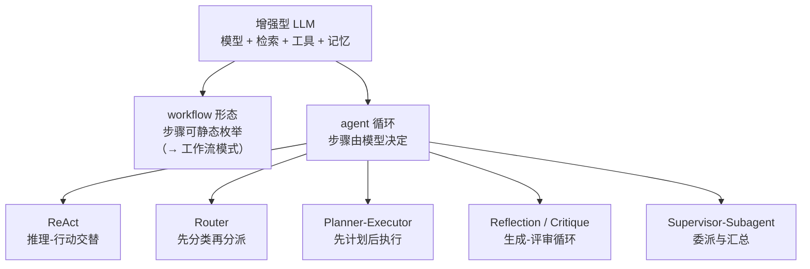

> **在哪一层**：层 4 · 行动与协作 / Agent Runtime ｜ **上一层出口**：能搭出带停止条件与预算的最小 Agent 循环 ｜ **本层出口**：能为一个已经确认要自治的循环选出正确的控制结构，并说出每个结构的失败模式
> **前置**：[Agent 运行时](agent-runtime.md) ｜ **下一步**：[多 Agent 系统](multi-agent.md) · [工作流模式](workflow.md)

## 1. 概述

**结论先讲**：设计模式是**循环的控制结构**——决定「谁在什么时候决定下一步」。本页给五个生产里最常见的结构：ReAct、Router（路由）、Planner-Executor（规划-执行）、Reflection（反思/评审）、Supervisor-Subagent（监督者-子代理）。选型原则先于所有模式：**能用 workflow 解决就不要用 agent**（Anthropic：「找最简单的可行方案，只在需要时增加复杂度」）；模式是给「已经确认需要自治」的循环选骨架，不是把简单任务升级成 agent 的理由。

### 心智模型：模式的家族树



同一个增强型 LLM，控制权放的位置不同就得到不同形态：控制权全在代码是 workflow，逐步交给模型是 agent 循环，五个模式是循环内部的不同分工方式。

### 五模式决策表

| 模式 | 解决的问题 | 自治度 | 相对成本 | 典型失败模式 |
| --- | --- | --- | --- | --- |
| ReAct | 每一步要先「想一下」再行动 | 单循环内逐步推理 | 每步多耗推理 token | 推理不落地、原地打转 |
| Router | 输入有明确类别，各走各的处理 | 仅分类步自治 | +1 次分类调用 | 误分类把错误放大到下游 |
| Planner-Executor | 任务复杂，先出计划再逐步执行 | 规划器一次性自治 | +1 次规划调用 | 计划不可执行、执行中计划过时 |
| Reflection | 首轮输出质量不够，要按标准打磨 | 生成 + 评审双循环 | token 与延迟 ×2 起 | 评审永不收敛、成本翻倍 |
| Supervisor-Subagent | 子任务需要隔离的上下文 | 委派式自治 | 每个子 Agent 独立上下文 | 过度拆分、接缝处上下文断裂 |

### 何时使用 / 何时不用

- 用：已经按[复杂度决策阶梯](../00-map/complexity-ladder)确认要上 agent（写得出停止条件与权限边界），现在要回答「循环里怎么分工」。
- 不用：步骤可静态枚举——去[工作流模式](workflow.md)；要跨 Agent 委派与状态隔离——去[多 Agent 系统](multi-agent.md)；单步任务——[工具执行工程](../05-action/tool-execution.md)。

历史版本里程碑：ReAct 论文 2022-10 提交（arXiv 2210.03629）；Anthropic《Building Effective Agents》2024-12 给出 routing / orchestrator-workers / evaluator-optimizer 等生产模式。五个模式在各类框架中的演化时间线未验证，不编造。

## 2. 使用

**最小实战**：≤15 分钟、零 API key。用固定脚本回放模型响应，驱动一个真实的 ReAct 循环：Thought → Action → Observation 交替，直到 Final Answer；另附一个幻觉动作名的负例。

### 步骤

1. 新建空目录，把下面的代码保存为 `react-loop.ts`。
2. 运行 `node --experimental-strip-types react-loop.ts`。

```ts
// react-loop.ts
// Zero-key, deterministic ReAct: Thought -> Action -> Observation -> ... -> Final Answer.
// The "model" is a fixed script; the loop mechanics and failure paths are real.
// Run: node --experimental-strip-types react-loop.ts   (Node >= 22.6)

/** One scripted model step: a thought plus either an action or a final answer. */
type ReActTurn =
  | { thought: string; action: { name: string; args: Record<string, string> } }
  | { thought: string; finalAnswer: string };

const knowledgeBase: Record<string, string> = {
  "refund policy": "refunds allowed within 30 days of delivery",
  "order A-42": "delivered 2026-08-20, total 129.00",
};

const actions: Record<string, (args: Record<string, string>) => string> = {
  search: (args) =>
    args.topic in knowledgeBase
      ? knowledgeBase[args.topic]
      : `no_result for "${args.topic}"`,
  finish: () => "", // handled by the loop, never dispatched
};

const script: ReActTurn[] = [
  {
    thought: "I need the delivery date to decide if a refund is possible.",
    action: { name: "search", args: { topic: "order A-42" } },
  },
  {
    thought: "Delivered 2026-08-20. Now I need the refund window.",
    action: { name: "search", args: { topic: "refund policy" } },
  },
  {
    thought: "Delivery + 30-day window means the refund is still possible.",
    finalAnswer:
      "Order A-42 was delivered 2026-08-20 and refunds are allowed within 30 days, so a refund is still possible.",
  },
];

function runReAct(script: ReActTurn[], maxSteps = 6): string {
  for (let step = 1; step <= maxSteps; step++) {
    const turn = script[step - 1];
    if (!turn) throw new Error(`max_steps_exceeded: no turn ${step} in script`);
    console.log(`Thought: ${turn.thought}`);

    if ("finalAnswer" in turn) {
      console.log(`Final Answer: ${turn.finalAnswer}`);
      return turn.finalAnswer;
    }

    const handler = actions[turn.action.name];
    if (!handler) {
      // Negative path: the model hallucinated an action name with no tool.
      throw new Error(
        `unknown_action: "${turn.action.name}" is not a registered action`,
      );
    }
    console.log(`Action: ${turn.action.name} ${JSON.stringify(turn.action.args)}`);
    const observation = handler(turn.action.args);
    console.log(`Observation: ${observation}\n`);
  }
  throw new Error(`max_steps_exceeded: no final answer within ${maxSteps} steps`);
}

// --- positive run ---
console.log("== ReAct run: refund eligibility ==");
runReAct(script);

// --- negative run: hallucinated action name ---
console.log("\n== ReAct run: hallucinated action ==");
try {
  runReAct([
    {
      thought: "I will email the warehouse directly.",
      action: { name: "send_email", args: { to: "warehouse" } },
    },
  ]);
} catch (err) {
  console.log(`expected failure: ${(err as Error).message}`);
}
```

### 正常输出

```text
== ReAct run: refund eligibility ==
Thought: I need the delivery date to decide if a refund is possible.
Action: search {"topic":"order A-42"}
Observation: delivered 2026-08-20, total 129.00

Thought: Delivered 2026-08-20. Now I need the refund window.
Action: search {"topic":"refund policy"}
Observation: refunds allowed within 30 days of delivery

Thought: Delivery + 30-day window means the refund is still possible.
Final Answer: Order A-42 was delivered 2026-08-20 and refunds are allowed within 30 days, so a refund is still possible.

== ReAct run: hallucinated action ==
expected failure: unknown_action: "send_email" is not a registered action
```

### 负例输出（错误示范）

负例已经内置在第二次运行里。注意它与正例的差异：模型「想到了」一个合理动作（发邮件问仓库），但该动作不在注册表中——**推理合理不等于动作可执行**。生产处理方式是把 `unknown_action` 作为 observation 回给模型重试，而不是让进程崩溃。

### 验收命令

```bash
node --experimental-strip-types react-loop.ts
```

通过标准：正例完成两轮 Thought/Action/Observation 后给出 Final Answer；负例抛出 `unknown_action` 且错误信息包含动作名。

### 清理

删除整个目录即可。

## 3. 原理

### ReAct：推理与行动交替

论文原话：推理 trace 帮助模型「归纳、跟踪和更新行动计划，并处理异常」，行动让模型「与外部来源交互以收集额外信息」。结构就是 fixture 那样：

```text
Thought: 我需要交付日期才能判断能否退款
Action: search {"topic": "order A-42"}
Observation: delivered 2026-08-20
Thought: 交付在 30 天窗口内
Final Answer: 可以退款
```

- 适用：下一步依赖上一步结果的调查类任务（检索、排障、数据分析）。
- 不适用：单步确定操作；纯生成任务（直接一次调用）。
- 失败模式：推理不落地（想了不做）、原地打转（同一 Action 重复，由停止条件兜底）。

### Router：先分类，再分派

分类步把输入路由到专用的提示、工具或模型。Anthropic 的生产例子：简单问题路由到小模型（低成本），困难问题路由到大模型（高质量）。分类器不必是 LLM——传统分类器更便宜且可校准。

- 适用：输入类别清晰、各类别需要不同下游（提示 / 工具 / 模型 / 纯代码）。
- 不适用：类别边界模糊；只有一类输入。
- 失败模式：误分类把错误放大到整条下游；边界输入两边都「不像」。

### Planner-Executor：先计划，再执行

规划器一次产出步骤清单，执行器逐步执行（每步可以是工具调用、子循环或代码）。对应 Anthropic 的 orchestrator-workers：子任务**不预定义**，由规划器按输入动态拆出。关键约束：计划里每步都要带**可验证的完成标准**，并且要有「观察与计划冲突时重规划」的触发条件——环境会变，计划会过时。

- 适用：多文件改动、多源信息收集等无法预测子任务清单的任务。
- 不适用：两步就能完成的任务（计划开销白付）。
- 失败模式：计划不可执行（引用不存在的资源）、执行中世界变化导致计划过时而不重规划。

### Reflection / Critique：生成-评审循环

一个角色生成，另一个角色按明确标准评审，反馈给生成者改稿，直到阈值或最大迭代。对应 Anthropic 的 evaluator-optimizer，适用信号有两条：**人能说清改进意见时输出确实可被改进**，且**模型能提供这样的反馈**。

- 适用：有清晰可度量标准的技术文档、代码生成、翻译打磨。
- 不适用：标准过于主观；有确定性工具可用时（代码风格交给 linter，不交给评审模型）；实时场景。
- 失败模式：永不收敛（评审永远挑得出小毛病）——必须设最大迭代数与质量阈值；平台期不停止（连续两轮改进小于阈值即停）。

### Supervisor-Subagent：委派与汇总

主 agent 把子任务委派给**全新上下文**的子 agent，子 agent 深入探索后只回传蒸馏摘要（Anthropic 多 agent 研究系统的观察：每个子 agent 可能消耗数万 token，但只回传约 1000–2000 token 的摘要）。这既是分工模式，也是[状态管理策略](state-memory.md)：把噪音隔离在子上下文里。

- 适用：子任务相互独立、各自需要大量探索（代码审查、深度调研、长测试日志分析）。
- 不适用：子任务强依赖共享上下文；主 agent 自己几个工具调用就能解决。
- 失败模式：过度拆分（每个小任务都派）、接缝断裂（摘要丢了主 agent 需要的细节）。

### 规范要求 vs 本地实测

| 断言 | 来源（论文 / 厂商口径） | 本地实测 |
| --- | --- | --- |
| 推理 trace 帮助跟踪与修正计划、处理异常 | ReAct 论文摘要 | fixture 中每个 Thought 都引用上一条 Observation |
| 行动把外部信息带入推理 | 同上 | `search` 的结果直接改变下一步决策 |
| 模型可能幻觉不存在的动作 | 运行时工程共识 | 负例 `unknown_action: "send_email"` |
| evaluator-optimizer 仅在标准清晰、改进可度量时使用 | Anthropic | fixture 未实现该模式（标准不清晰时引入即反模式） |

## 4. 开发

### 集成要点

- **模式组合要显式**：一个生产系统常常是 Router 进 Planner-Executor、子步骤用 ReAct、出口挂 Reflection。每个模式的停止条件与预算**各自独立**，嵌套时外层预算要覆盖内层总和。
- **框架映射**：LangGraph / Agents SDK 都内置了这些形态（OpenAI 文档把 supervisor 对应 agents-as-tools 与 handoffs）。用框架时先确认你能读出每步的 trace——看不出「谁决定下一步」的框架会毁掉可调试性。

### 症状 → 证据 → 处理 → 完成标准

**症状**：Router 把退款工单分进了技术支持通道。
**证据**：路由日志显示该输入在两个类别上的分数接近（如 0.51 vs 0.49）；下游处理耗时异常。
**处理**：加置信度阈值，低于阈值走 fallback 通道（人工或通用路径）；用历史误分流样本回归测试分类器。
**完成标准**：误分流率降到目标以下；边界样本全部落进 fallback 而不是随机通道。

### 症状 → 证据 → 处理 → 完成标准

**症状**：Planner 产出的计划执行到第 3 步全部失败。
**证据**：计划步骤引用了不存在的文件 / 接口；执行前没有 dry-run 校验。
**处理**：计划 schema 强制每步带验收命令；执行前先跑验收命令（此时应失败）确认步骤可判定；观察与计划冲突即触发重规划而不是硬着头皮执行。
**完成标准**：重放该计划在执行前被校验拦截；重规划后跑通或明确报告不可行。

### 症状 → 证据 → 处理 → 完成标准

**症状**：Reflection 循环跑了 12 轮，成本翻 6 倍，质量评分不动。
**证据**：评审意见越来越琐碎；连续 N 轮评分增量小于噪声。
**处理**：设最大迭代数（默认 2–3）与质量阈值；加平台期检测（连续两轮改进 < ε 即停）；先检查是不是该用确定性工具而不是模型评审。
**完成标准**：p95 迭代数 ≤ 上限；平台期任务在 2 轮内终止并保留当前最优输出。

### 症状 → 证据 → 处理 → 完成标准

**症状**：Supervisor 拆出 8 个子 agent，汇总结果互相矛盾。
**证据**：子任务粒度过细（单文件级）；摘要里缺少主 agent 决策需要的关键约束。
**处理**：立规则「主 agent 自己能做的就不派」；子任务按**独立上下文需求**划分而不是按文件划分；摘要模板强制包含「结论 + 证据 + 不确定点」。
**完成标准**：子 agent 数量下降且汇总一致；接缝丢失关键信息的案例归零。

### 反模式清单

- 为了「看起来高级」堆模式——每个模式至少加一次模型调用。
- 把 Reflection 当万能质量兜底——先修提示与工具，评审模型救不了错误的动作空间。
- Supervisor 拆到单文件粒度——委派成本（上下文重建）超过收益。
- Router 无 fallback——误分类没有安全网。

## 5. 资料库

四级阅读路线：

- **Beginner**：跑通本页 ReAct fixture，对照输出理解 Thought / Action / Observation。
- **Builder**：给自己的循环加一个 Router 或 Planner，度量加模式前后的成本与质量。
- **Operator**：读 Anthropic《Building Effective Agents》的五模式原文，对照生产 trace 找自家系统的模式映射。
- **Researcher**：读 ReAct 论文全文与 Learn LLM 第 16 章（LangGraph）。

### 资源表

| 名称 | 证据层级 | canonical URL | 用途 | 支持的断言 | 下一步 |
| --- | --- | --- | --- | --- | --- |
| Building Effective Agents（Anthropic） | L1（维护者） | https://www.anthropic.com/research/building-effective-agents | routing / orchestrator-workers / evaluator-optimizer 的生产口径 | 「最简单可行方案优先」；模式适用信号（retrievedAt 2026-09-01） | [工作流模式](workflow.md) |
| ReAct（Yao et al., 2022） | L4（研究） | https://arxiv.org/abs/2210.03629 | 推理-行动交替的原始机制 | 推理与行动互补的论证（retrievedAt 2026-09-01） | 论文全文 |
| Agents guide（OpenAI） | L1（维护者） | https://platform.openai.com/docs/guides/agents | supervisor 形态在 SDK 中的对应（agents-as-tools、handoffs） | 委派与专用 agent 的生产实现（retrievedAt 2026-09-01） | [多 Agent 系统](multi-agent.md) |
| Effective context engineering for AI agents（Anthropic） | L1（维护者） | https://www.anthropic.com/engineering/effective-context-engineering-for-ai-agents | sub-agent 作为上下文隔离策略 | 子 agent 消耗数万 token、回传 1000–2000 token 摘要（retrievedAt 2026-09-01） | [状态与记忆](state-memory.md) |
| Learn LLM 第 16 章 | sibling | https://llm.zenheart.site/chapters/ | LangGraph 中这些模式的实现机制 | 机制推导归 Learn LLM（retrievedAt 2026-09-01） | [multi-agent](multi-agent.md) |

### 主动证伪与未决问题

- 证伪入口：如果你发现某任务用纯 workflow 的验收结果**不劣于**加了模式的 agent 版本，这个模式在该场景就是负资产——删掉它，并把案例记进模式页。
- 未决：五个模式在不同框架里的命名映射（如 LangGraph 的图结构 ↔ 本页五模式）没有统一权威对照表，本页只给概念映射，不声称框架一一对应。

### learn-ai 到此为止 / 继续去哪

- 委派与状态隔离的完整机制：[多 Agent 系统](multi-agent.md)。
- 步骤可静态枚举时的形态：[工作流模式](workflow.md)。
- 这些模式的图结构实现细节：Learn LLM 第 16 章。
