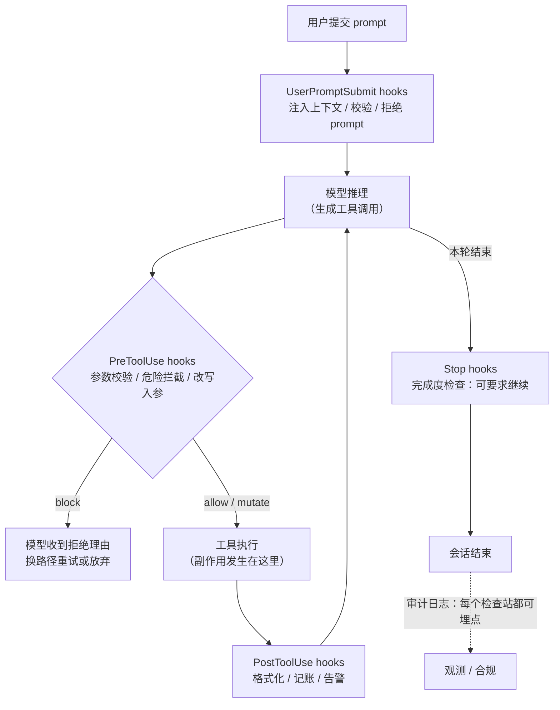

> **所在组**：Agent 系统 ｜ **上一组出口**：能搭出带停止条件与预算的最小 Agent 循环 ｜ **本页出口**：能在宿主生命周期点上挂自动化策略门（block / allow / mutate），为 hook 失败选对 fail-closed 与 fail-open，并分清 hook、Skill、HITL 各管什么
> **前置**：[Agent 运行时](agent-runtime.md) · [Agent 状态与记忆](state-memory.md) ｜ **下一步**：[恢复与人工批准](recovery-hitl.md)（人工门）、[Agent Skills](skills.md)（知识包）

## 1. 概述

**结论先讲**：当一条规则必须**保证执行**而不是**建议遵守**时，把它从指令（prompt / CLAUDE.md）升级为 hook——宿主在生命周期固定点自动调用的用户代码。Hooks 解决的是**自动化策略执行点问题**：它是 control-plane callback（控制面回调），不是知识、不是工具、不是协议。它不进上下文、不给模型新能力；它在「模型想做事」与「事真的发生」之间插入一段确定性代码。

### 心智模型：Agent 循环上的检查站



关键不变量：**hook 在副作用发生之前或之后立刻运行，且不依赖模型自觉**。PreToolUse 是唯一能「事前」改判的位置——错过它，工具已经执行，你只剩记账和补救。

### 何时使用 / 何时不用

- 用：
  - 每次工具调用都要做的确定性检查（危险命令拦截、敏感文件保护、参数规范）；
  - 审计与观测埋点（谁在何时调了什么工具，写合规日志）；
  - 事件驱动的自动化（编辑后自动格式化、会话开始注入环境状态、结束清理）；
  - 把「团队硬规则」从提示词建议变成可执行的门。
- 不用：
  - 规则本身需要语义判断 → 那是 prompt 指令或宿主的 LLM 评估；
  - 需要人工判断的高风险决策 → 人工批准门（见[恢复与人工批准](recovery-hitl.md)），hook 与 HITL 是分工不是替代；
  - 需要「模型按需加载的知识」 → [Skill](skills.md)。

### 决策表：与相邻机制对比

| 机制 | 本质 | 执行保证 | 谁判断 | 典型用途 |
| --- | --- | --- | --- | --- |
| 指令（prompt / CLAUDE.md） | 建议进上下文 | 无——模型可偏离 | 模型 | 风格偏好、领域背景 |
| **Hook（本页）** | **控制面回调** | **宿主保证调用** | **确定性代码** | **护栏、审计、自动化** |
| Skill | 知识包（渐进披露） | 触发靠语义匹配 | 模型 + 宿主 | 可复用流程步骤 |
| 权限系统（allowlist / deny 规则） | 宿主硬边界 | 强制 | 规则表 | 「绝不允许」清单 |
| HITL 批准门 | 人工判断点 | 强制暂停 | 人 | 不可逆 / 高成本 / 低置信度 |

与 [recovery-hitl 批准门](recovery-hitl.md)的分工：**hook 是自动化策略门**（规则可枚举、机器可判，如「`rm -rf` 一律拒绝」）；**HITL 是人工门**（规则不可枚举、代价不可逆，如「删除生产数据库前要人点头」）。成熟的宿主里两者串联：hook 先做机器能做的过滤，剩下的不确定流量升级给人。

### 历史版本里程碑

- Claude Code 于 2025 年引入 hooks（旧站文档存档于本仓 git 历史 `b00c69d8f` 之前的提交）；至 2026-09-01，官方参考已扩展到约 30 个事件、5 种 handler 类型（code.claude.com 核验）。
- 事件清单演进很快（PreCompact、PermissionRequest、TeammateIdle 等为后续新增）；本页只固化稳定核心，逐事件 schema 以官方参考为准。

## 2. 使用

最小实战：30 分钟内实现一个迷你 hook runner——注册 pre-tool hook 校验参数、post hook 记账，演示 **block / allow / mutate** 三种结果，并用一个自身抛错的 hook 对比 **fail-closed 与 fail-open**。零依赖、零 API key，Node ≥ 23.6（原生跑 TS）即可。

### 步骤 1：编写 hook runner

```typescript fixture
// hooks-runner.ts — 迷你 hook runner：pre/post 工具调用的生命周期拦截
// 零依赖；Node >= 23.6 原生跑 TS（node hooks-runner.ts）

// ---------- 类型：hook 是控制面回调，输入输出都是纯数据 ----------

type ToolCall = { tool: string; input: Record<string, unknown> };

type HookDecision =
  | { action: "allow" }
  | { action: "block"; reason: string }
  | { action: "mutate"; input: Record<string, unknown> };

type PreToolHook = {
  name: string;
  run: (call: ToolCall) => HookDecision;
};

type PostToolHook = {
  name: string;
  run: (call: ToolCall, result: unknown) => void; // 记账/观测：只产生副作用，不返回决策
};

// fail-closed / fail-open：hook 自身抛错时的策略
type FailPolicy = "closed" | "open";

// ---------- runner：把工具执行放进 hook 管道 ----------

const auditLog: string[] = [];

function runToolCall(
  execute: (input: Record<string, unknown>) => unknown,
  preHooks: PreToolHook[],
  postHooks: PostToolHook[],
  call: ToolCall,
  failPolicy: FailPolicy,
): { status: "ok" | "blocked"; result?: unknown; reason?: string } {
  let input = call.input;

  // ① pre 阶段：校验 / 拦截 / 改写参数（block 优先于后续 hook）
  for (const hook of preHooks) {
    let decision: HookDecision;
    try {
      decision = hook.run({ tool: call.tool, input });
    } catch (err) {
      // hook 自身失败 ≠ 工具调用失败：按显式策略决定放行还是熔断
      const msg = err instanceof Error ? err.message : String(err);
      if (failPolicy === "closed") {
        auditLog.push(`[hook-error:${hook.name}] fail-closed -> blocked (${msg})`);
        return { status: "blocked", reason: `hook ${hook.name} failed (fail-closed): ${msg}` };
      }
      auditLog.push(`[hook-error:${hook.name}] fail-open -> allowed (${msg})`);
      continue;
    }
    if (decision.action === "block") {
      auditLog.push(`[pre:${hook.name}] BLOCK ${call.tool} (${decision.reason})`);
      return { status: "blocked", reason: decision.reason };
    }
    if (decision.action === "mutate") {
      input = decision.input;
      auditLog.push(`[pre:${hook.name}] MUTATE ${call.tool} input`);
    }
  }

  // ② 执行工具本体（pre 全部放行/改写后才到达）
  const result = execute(input);

  // ③ post 阶段：记账与观测；post hook 抛错只降级为警告，不影响已发生的执行
  for (const hook of postHooks) {
    try {
      hook.run({ tool: call.tool, input }, result);
    } catch (err) {
      const msg = err instanceof Error ? err.message : String(err);
      auditLog.push(`[post:${hook.name}] DEGRADED (${msg})`);
    }
  }
  return { status: "ok", result };
}

// ---------- 演示：deploy 工具 + 三个 hook ----------

const deploy = (input: Record<string, unknown>) =>
  `deployed ${input.app} to ${input.region ?? "?"} (replicas=${input.replicas ?? 1})`;

const validateParams: PreToolHook = {
  name: "validate-params",
  run: (call) => {
    if (call.input.app === undefined) return { action: "block", reason: "missing required param: app" };
    if (!/^[a-z][a-z0-9-]*$/.test(String(call.input.app)))
      return { action: "block", reason: `app must be kebab-case, got "${call.input.app}"` };
    return { action: "allow" };
  },
};

const normalizeRegion: PreToolHook = {
  name: "normalize-region",
  run: (call) => {
    const region = String(call.input.region ?? "");
    if (region === "") return { action: "allow" };
    if (region !== region.toLowerCase()) return { action: "mutate", input: { ...call.input, region: region.toLowerCase() } };
    return { action: "allow" };
  },
};

const accounting: PostToolHook = {
  name: "accounting",
  run: (call, result) => {
    auditLog.push(`[post:accounting] OK ${call.tool}: ${String(result)}`);
  },
};

// ---------- 三种结果 + 一个 fail-closed 负例 ----------

console.log("1) ALLOW:", JSON.stringify(
  runToolCall(deploy, [validateParams, normalizeRegion], [accounting],
    { tool: "deploy", input: { app: "web", region: "AP-Southeast-1" } }, "closed")));

console.log("2) BLOCK:", JSON.stringify(
  runToolCall(deploy, [validateParams, normalizeRegion], [accounting],
    { tool: "deploy", input: { app: "Web", region: "sg" } }, "closed")));

console.log("3) MUTATE+ALLOW:", JSON.stringify(
  runToolCall(deploy, [normalizeRegion], [accounting],
    { tool: "deploy", input: { app: "api", region: "AP-NORTHEAST-1" } }, "closed")));

// 负例：一个自身会抛错的 pre hook —— 同一调用在两种策略下结局相反
const brokenHook: PreToolHook = {
  name: "flaky-policy",
  run: () => { throw new Error("policy service unreachable"); },
};

console.log("4a) fail-closed:", JSON.stringify(
  runToolCall(deploy, [brokenHook], [accounting],
    { tool: "deploy", input: { app: "web", region: "sg" } }, "closed")));

console.log("4b) fail-open:", JSON.stringify(
  runToolCall(deploy, [brokenHook], [accounting],
    { tool: "deploy", input: { app: "web", region: "sg" } }, "open")));

console.log("audit log:");
for (const line of auditLog) console.log("  " + line);
```

### 步骤 2：运行

```bash fixture
node hooks-runner.ts
```

输出（实测，Node 24）：

```text fixture
1) ALLOW: {"status":"ok","result":"deployed web to ap-southeast-1 (replicas=1)"}
2) BLOCK: {"status":"blocked","reason":"app must be kebab-case, got \"Web\""}
3) MUTATE+ALLOW: {"status":"ok","result":"deployed api to ap-northeast-1 (replicas=1)"}
4a) fail-closed: {"status":"blocked","reason":"hook flaky-policy failed (fail-closed): policy service unreachable"}
4b) fail-open: {"status":"ok","result":"deployed web to sg (replicas=1)"}
audit log:
  [pre:normalize-region] MUTATE deploy input
  [post:accounting] OK deploy: deployed web to ap-southeast-1 (replicas=1)
  [pre:validate-params] BLOCK deploy (app must be kebab-case, got "Web")
  [pre:normalize-region] MUTATE deploy input
  [post:accounting] OK deploy: deployed api to ap-northeast-1 (replicas=1)
  [hook-error:flaky-policy] fail-closed -> blocked (policy service unreachable)
  [hook-error:flaky-policy] fail-open -> allowed (policy service unreachable)
  [post:accounting] OK deploy: deployed web to sg (replicas=1)
```

读法：case 1 里 `AP-Southeast-1` 被 pre hook **改写**为小写后放行（mutate+allow）；case 2 违反命名规范被 **block**，模型会拿到 reason 换路径；case 4 同一个坏 hook，`closed` 熔断、`open` 放行——**策略字符串决定了安全属性**，这是第 3 节失败语义表的实证。

### 验收与清理

- 验收：五条输出与上面一致；audit log 里 BLOCK 与 fail-closed 各留痕一次。
- 清理：删除 `hooks-runner.ts`。
- 宿主接入（可选）：把 `validateParams` 的逻辑改写为读 stdin JSON、按宿主约定输出决策的独立脚本（Claude Code 的配置形态见第 4 节）。

### 场景矩阵

| 场景 | 输入 | 动作 | 输出 | 适用 | 不适用 |
| --- | --- | --- | --- | --- | --- |
| 基础：审计埋点 | 每次工具调用 | post hook 追加日志行 | 合规审计链 | 全量低风险记录 | 需要事前拦截 |
| 常见：护栏拦截 | 危险命令 / 敏感路径 | pre hook 返回 block | 调用不发生，模型收到理由 | 可枚举的确定性规则 | 需语义判断的规则 |
| 组合：参数规范化 | 大小写 / 默认值漂移 | pre hook 返回 mutate + allow | 修正后的入参执行 | 无损可逆的修正 | 有业务含义的改写（应让人确认） |
| 组合：hook + HITL | 高风险操作 | pre hook 拦截机器可判部分，其余升级人工门 | 双层防线 | 生产级危险操作 | 全自动低风险流水线 |

## 3. 原理

以下按 Claude Code 官方 hooks 参考核验（code.claude.com/docs/en/hooks，retrievedAt 2026-09-01）；它是目前最完整的公开实现，机制可作为跨宿主的心智模型。

### 事件模型：三类节拍 + 长尾

| 节拍 | 事件 | 能否改判 |
| --- | --- | --- |
| 每会话一次 | `SessionStart`（含 resume/fork 来源）、`SessionEnd` | Start 可注入上下文；End 只能清理，**不能阻止会话结束** |
| 每轮一次 | `UserPromptSubmit`、`Stop`、`StopFailure` | 前两者可拒绝/要求继续；StopFailure 仅告警 |
| 每次工具调用 | `PreToolUse`、`PostToolUse`、`PostToolUseFailure` | Pre 可 allow/deny/ask/改写入参；Post 可改写结果、反馈模型 |

长尾（部分）：`PreCompact`/`PostCompact`（压缩前后）、`Notification`、`PermissionRequest`（即将弹权限框时，hook 可代人 allow/deny）、`PermissionDenied`、`SubagentStop`、`FileChanged`、`ConfigChange`、`PreModelSwitch`/`PostModelSwitch`。清单演进快，以官方参考为准。

### 执行与通信模型

- **输入**：事件上下文以 JSON 经 stdin 交给 hook（command 类型）；含 `tool_name`、`tool_input`、`tool_use_id`、会话标识等。
- **过滤**：`matcher` 按事件字段（工具事件是 `tool_name`）过滤；正则风格如 `Edit|Write`。注意 matcher 是**缩小范围**的便利，不是安全边界。
- **输出**：exit code + stdout JSON 双通道——exit 2 = 阻断（stderr 为理由）；exit 0 + JSON 走结构化决策（`permissionDecision`、`updatedInput`、`additionalContext`、`systemMessage` 等）；其余 exit code = 非阻断错误，动作继续。
- **并发**：同一事件命中多个 hook 时**并行执行**；多个 PreToolUse 决策冲突时按 `deny > defer > ask > allow` 取优先级。
- **配置即代码**：hook 声明在版本化的 settings 文件里（用户级 / 项目级 / 托管策略 / 插件），合并而非互相覆盖。

### 决策语义：block / allow / ask / mutate

| 决策 | 含义 | 模型看到什么 | 副作用 |
| --- | --- | --- | --- |
| `allow` | 放行 | 无（或 `additionalContext` 提示） | 无 |
| `deny` / exit 2 | 拒绝 | 拒绝理由（stderr 或 reason） | 调用不发生 |
| `ask` | 升级人工确认 | 用户看到的确认框带 hook 来源标注 | 即使在自动模式也强制弹框 |
| `mutate`（`updatedInput`） | 改写后放行 | 无感（拿到改写后的执行结果） | PreToolUse 可改工具入参、PostToolUse 可改工具结果 |

`ask` 是 hook 与 HITL 的官方接缝：机器先过滤，不确定的一键升级给人。

### 失败语义：fail-closed vs fail-open 决策表

hook 自身出错（抛异常、超时、路径写错）时怎么办，是策略门设计的核心决策。Claude Code 的实测行为：

| 失败情形 | Claude Code 行为 | 属性 | 设计含义 |
| --- | --- | --- | --- |
| exit 2 | 阻断，JSON allow 也无法覆盖 | **fail-closed** | 显式拒绝永远是硬信号 |
| 其他非零 exit / JSON 解析失败 | 非阻断错误，动作继续，transcript 提示 | **fail-open** | 宿主默认可用性优先 |
| 脚本路径写错（exit 127） | 同上——非阻断，门**静默失效** | fail-open 陷阱 | 策略门必须监控自身的存活 |
| command/http/mcp_tool hook 超时（PreToolUse） | 取消、输出丢弃，调用继续走正常权限流 | **fail-open** | 官方明言：别指望卡死的 hook 当门 |
| Agent SDK 回调 hook 超时（PreToolUse） | 阻断调用 | **fail-closed** | 官方原话：回调可能「是不能 fail-open 的策略门」 |
| `UserPromptSubmit` 超时 | 输出丢弃（含 `additionalContext`），prompt 照常送达 | fail-open（上下文丢失） | 注入类 hook 丢失是降级不是事故 |

**选择规则**：拦截「不可逆副作用」的门（删除、外发、生产变更）→ fail-closed（宁可误杀，人工放行）；观测/记账/格式化类 hook → fail-open（监控流量不该有能力弄停业务）；上下文注入类 → fail-open + 对丢失静默容忍。Claude Code 把 command hook 默认做成 fail-open、把 SDK 回调做成 fail-closed，正是按「谁更可能是硬策略门」分的——自建 runner 时应显式给每个 hook 声明策略，而不是全局一刀切。

### hook 与权限系统、与 Skill 的边界

- **vs 权限系统**：宿主的 allow/deny 规则是硬边界；官方明确 matcher/if 过滤是 best-effort，**要硬性 allow/deny 应该用权限系统而不是 hook**。hook 的定位是权限系统之外的事件驱动自动化与策略增强。
- **vs Skill**：hook 是**控制面回调**——宿主保证在生命周期点执行你的代码，不占上下文；Skill 是**知识包**——渐进披露进上下文，靠语义匹配触发，模型可以不按它做。两者还能组合：Claude Code 的 skill frontmatter 可声明 hooks，技能被调用时注册、会话内持续生效。

## 4. 开发

### 集成与宿主差异

- **Claude Code**（已核验）：hook 声明在 settings JSON（用户 `~/.claude/settings.json`、项目 `.claude/settings.json`、托管策略）与插件/skill/agent frontmatter；结构三层——事件名 → matcher 组 → handler 数组；handler 有五种类型（`command` / `http` / `mcp_tool` / `prompt` / `agent`）。`/hooks` 命令打开只读浏览器查看已配置 hook 及其来源。调试日志：`claude --debug`（读 `~/.claude/debug/<session-id>.txt`）。
- **Devin CLI**（已核验存在）：官方文档提供 lifecycle hooks，含 matcher 字段（按 `tool_name` 正则过滤）——机制同构，字段名与事件集不同。
- **Cursor / Kiro**：旧站曾有对照表，**未在当前官方文档核验到等价机制，本页不复刻**；以各家官方文档为准。

### 症状 → 证据 → 处理 → 完成标准

**症状**：hook 误杀正常调用——合法操作被 block，模型反复换路径都被拒。
**证据**：transcript / 审计日志里同一工具的 block 记录集中出现；拒绝理由显示命中了过宽的规则（如 `rm *` 把 `rm temp.log` 也拦了）。
**处理**：收窄规则——从通配拦截改为参数级判断（先解析 stdin JSON 的 `tool_input` 再判）；能用 allowlist 就不用 denylist；对「可改写」的情况把 block 降级为 mutate（规范化后放行）；确认这确实是 hook 该管的，机器不可判的移交给 HITL 批准门。
**完成标准**：原误杀用例放行（或规范化后放行）；攻击用例仍被拦截；审计日志能区分两类结局。

### 症状 → 证据 → 处理 → 完成标准

**症状**：hook 自身超时——会话变慢，甚至每次 prompt 前都卡顿（`UserPromptSubmit` 类 hook 会阻塞模型处理直到完成）。
**证据**：transcript 出现 hook 超时提示、输出被丢弃的记录；宿主日志显示 hook 运行时长逼近或超过 timeout。
**处理**：给 hook 设显式 `timeout` 并把重活移出关键路径——慢检查改成 `async` 后台跑（结果只用于告警不用于拦截）、缓存依赖（如策略服务响应）、拆分「快拦截 + 慢审计」两个 hook；拦截门必须同步且快，做不到就重新划分 hook 与权限系统/HITL 的职责。
**完成标准**：会话不再被 hook 阻塞；超时路径下拦截门的 fail-closed/fail-open 行为与第 3 节决策表的声明一致；被降级的 hook 只丢观测不丢防线。

### 症状 → 证据 → 处理 → 完成标准

**症状**：hook 静默失效——配置里明明有门，危险操作却直接通过了。
**证据**：transcript 从未出现该 hook 的任何记录（连错误都没有）；常见根因是脚本路径写错（exit 127 属非阻断错误）、matcher 拼写不匹配、或 Windows 下路径分隔符比较失效（`tool_input.file_path` 在 Windows 带反斜杠，正斜杠比较永不命中，调用照常通过）。
**处理**：用 `/hooks`（或等价宿主命令）核对配置生效与来源；跑一次应命中的测试调用验证门真的关着；路径比较前先归一化分隔符；给关键策略门加「心跳」自检（如 SessionStart 时验证依赖可达并 `systemMessage` 报告状态）。
**完成标准**：应命中的测试调用被拦截且理由正确；故意改错路径时能在下一次会话的可见提示或日志中发现门已失效，而不是靠事故发现。

### 版本与迁移

- 事件清单与决策字段演进快（本页核验日 2026-09-01 约 30 个事件）；升级宿主前 diff 官方 hooks 参考的事件表。
- 跨宿主迁移时，可移植的是**管道结构**（pre 校验 → 执行 → post 记账 + 显式失败策略），不是配置格式；把策略逻辑写成读 JSON、返回决策的纯脚本，配置层薄封装。

### 反模式清单

- **把 hook 当权限系统用**：matcher 是 best-effort 过滤；硬边界用宿主的 allow/deny 规则。
- **全局一种失败策略**：拦截门与观测 hook 需要相反的 fail-closed/fail-open；不声明就是把自己交给宿主默认值。
- **在 hook 里做慢调用**：同步 hook 阻塞的是整个会话；策略服务必须快或有缓存。
- **block 理由含糊**：拒绝理由是模型的下一轮输入；写「违反规范 B-12：app 名必须 kebab-case」而不是「不允许」。
- **post hook 里再拦截**：副作用已发生，PostToolUse 只能补救与记账；拦截必须前移到 PreToolUse。

## 5. 资料库

四级阅读路线：

- **Beginner**：读懂本页 + 在宿主里用别人写好的 hook；能复述 pre/post 的位置与三种决策结果。
- **Builder**：跑通第 2 节 runner；给一个真实宿主写一个 pre-tool 拦截 hook 和一个 post 审计 hook，并用负例验证失败策略。
- **Operator**：为团队建立 hook 评审清单（失败策略、超时、路径归一化、block 理由质量）；把「门失效自检」纳入例行检查。
- **Researcher**：通读官方 hooks 参考的事件 schema 与优先级规则，对比 Devin CLI 等第二实现的取舍。

### 资源表

| 名称 | 证据层级 | canonical URL | 用途 | 支持的断言 | 下一步 |
| --- | --- | --- | --- | --- | --- |
| Claude Code hooks 参考 | L0（官方参考） | https://code.claude.com/docs/en/hooks | 事件 schema、exit code 语义、决策字段 | 本页第 3 节全部机制断言（retrievedAt 2026-09-01） | 对照事件表 |
| Claude Code 指南：Automate actions with hooks | L0（官方指南） | https://code.claude.com/docs/en/hooks-guide | 场景化教程与示例 | 「用权限系统做硬性 allow/deny」的分工口径（retrievedAt 2026-09-01） | 抄示例 |
| Devin CLI lifecycle hooks | L1（官方文档） | https://docs.devin.ai/cli/extensibility/hooks/lifecycle-hooks | 第二实现对照 | matcher 按 tool_name 正则过滤的同构机制（检索摘要级核验 2026-09-01） | 对比事件集 |
| 本仓旧 hooks 页存档 | 内部证据 | `git show a1083a691:docs/zh/tech/patterns/agent/hooks.md` | 历史取材 | 旧版实现对照表的来源（已提炼，其中 Cursor/Kiro 部分未核验不复刻） | 考古 |

### 主动证伪与未决问题

- 证伪入口：若你在某宿主实测的失败行为与本页决策表相矛盾（例如 command hook 超时竟然阻断了调用），以该宿主官方文档为准，并在本页决策表加一行标注宿主与版本。
- 未决：Cursor / Kiro 是否有等价机制未核验（旧站对照表未移植）；Claude Code 事件清单持续扩张，逐事件 schema 不在本页维护；「30 个事件」是核验日快照，不是稳定承诺。

### learn-ai 到此为止 / 继续去哪

- 人工批准门与恢复策略（hook 拦下之后的另一半）：[恢复与人工批准](recovery-hitl.md)。
- 把「怎么做」打包成按需加载的知识：[Agent Skills](skills.md)。
- hook 挂在循环上，循环本身的停止条件与预算：[Agent 运行时](agent-runtime.md)。
- 工具执行侧的五道门（幂等、allowlist、校验、审批、超时）：[工具执行工程](../05-action/tool-execution.md)。
