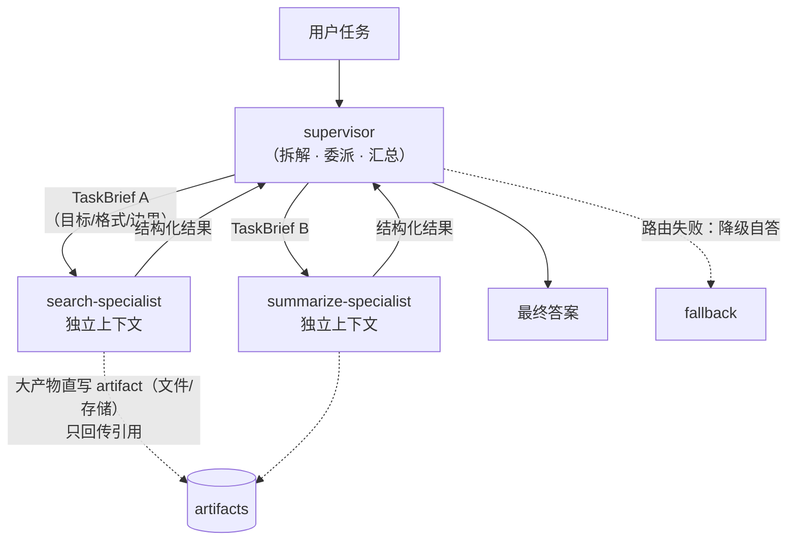

> **所在组**：Agent 系统 ｜ **上一组出口**（[行动组](../05-action/tool-calling)）：能安全执行单次工具调用 ｜ **本页出口**：能判断何时值得上多 agent，写出四要素委派契约，用 supervisor 拓扑委派专家并在路由失败时降级而不是崩溃
> **前置**：[Agent 运行时](agent-runtime.md)、[工作流模式](workflow.md) ｜ **下一步**：[A2A](../07-interoperability/a2a.md)（跨边界才需要协议）、[可观测性](../08-production/observability)、[成本与性能](../08-production/cost-performance)

## 1. 概述

**结论先讲**：多 agent 不是更强的单 agent，而是**用协调换容量**的架构。它用独立上下文窗口做并行探索与压缩（subagent 把海量原始材料蒸馏成结论回传），换来单 agent 无法企及的覆盖面；代价是约 **15 倍于聊天**的 token 消耗、协调复杂度与错误传播。判断式只有三条，全部命中才考虑：**任务价值高到付得起、子方向天然可并行、信息量超出单一上下文**。缺任何一条，先回到[工作流](workflow.md)或单 agent。

**范围先划清**：本页只讲**同一信任域内**（同 host / 同进程）spawn subagent 的编排；要把任务委派给**跨进程、跨组织、跨信任域**的 agent，不在本页展开——先过 [A2A](../07-interoperability/a2a.md)，按[协议地图](../07-interoperability/)选连接方向（判据见下文「关键边界」）。

### 心智模型：supervisor + 专家 + 产物



三个构件：**supervisor**（拆解任务、写委派契约、汇总结果）、**specialist**（各自拥有独立上下文窗口、工具集与提示词的 subagent）、**artifacts**（大产物落盘，只回传引用——避免多级转述造成信息损耗）。

### 何时使用 / 何时不用

- 用（Anthropic 生产口径）：高价值任务 + 重度并行 + 信息超出单上下文 + 需要对接大量复杂工具；典型是开放式研究（breadth-first 查询）。
- 不用：所有 agent 必须共享同一上下文、或 agent 间依赖密集的任务——多数**编码**任务并行度不足，不适合；实时互相协调委派仍是非擅长项。步骤可枚举的，回[工作流](workflow.md)；单上下文够用的，回单 agent。

### 决策表：梯级定位

| 方案 | 方向 | 控制权 | 状态 | 信任域 | 最低复杂度 |
| --- | --- | --- | --- | --- | --- |
| 单 agent（[Agent 运行时](agent-runtime)） | 读写循环 | 模型 + 停止条件 | 一个上下文 | host 内 | 默认起点 |
| 同域多 agent（本章） | 读写循环 × N | supervisor 委派与路由 | 各自上下文 + 汇总点 | 同一 host/进程内 | 并行与专业化收益 > 协调成本 |
| 跨边界协作（[协议地图](../07-interoperability/)） | 读写跨界 | 协议协商（A2A 等） | 任务/消息/artifact | 跨进程/组织/信任域 | 出现第二个信任域才需要 |

**关键边界**：同一进程内 spawn 的 subagent **不需要协议**——函数调用与结构化任务就够；只有协作要跨进程、跨组织、跨信任域时，才进入 [A2A](../07-interoperability/a2a.md) 等协议分支。

### 收益与代价

| 维度 | 收益 | 代价 |
| --- | --- | --- |
| 上下文 | 各自窗口并行探索，压缩后回传 | 汇总点信息瓶颈；转述损耗（game of telephone） |
| 专业化 | 独立工具集/提示词/轨迹，降低路径依赖 | 工具与提示的维护面 ×N |
| 并行 | 3–5 个 subagent 同时跑，耗时最高降 90% | token 总量约 15×聊天；需要预算护栏 |
| 可靠性 | 单个 subagent 失败可由 supervisor 补救 | 错误跨 agent 传播；行为涌现难预测 |
| 调试 | 委派 trace 天然分片 | 全局因果链要跨片拼装 |

### 编排拓扑

| 拓扑 | 结构 | 适用 | 失败模式 |
| --- | --- | --- | --- |
| **supervisor**（编排器-工人） | 中心 agent 拆解并委派，结果汇总 | 子任务无法预定义的开放任务 | supervisor 成为信息瓶颈；顺序等待 |
| **router**（路由） | 分类后转给专用 agent，无汇总 | 输入类别清晰的分流 | 误分类静默失败 |
| **pipeline**（流水线） | 固定顺序传递中间产物 | 阶段明确的加工链 | 中间产物损耗逐级放大 |
| **辩论/验证**（generator-verifier） | 生成与评估成对循环 | 有明确评估标准的质量关键输出 | 振荡不收敛，需最大迭代数 |

Anthropic 的五模式（generator-verifier / orchestrator-subagent / agent teams / message bus / shared state）是这四类的展开版，演进判据见资源库。

历史版本里程碑：本章整合自旧页《Multi-Agent Coordination Patterns》（Claude 博客的仓库存档，2026-04-10）；五模式原文保留在资源库，正文按四拓扑重组并补充委派契约与降级语义。更早时间线未验证，不编造。

## 2. 使用

最小实战：supervisor 模式 mock——两个 specialist agent 接收结构化任务（`TaskBrief` 四要素）并返回结果，演示正常路由、路由失败降级、契约拒绝三种输出。专家是确定性 mock 而非 LLM：验证的是**编排层**的契约与降级，不是模型能力。零 API key、零依赖。

**环境**：Node ≥ 22.18。保存为 `multi-agent.ts`，运行 `node multi-agent.ts`。

```ts
// multi-agent.ts — a supervisor-pattern mock: delegation contract + specialist routing + degraded fallback.
// Zero dependencies, zero API keys (specialists are deterministic mocks, not LLM calls).
// Runs natively on Node >= 22.18: node multi-agent.ts
import { setTimeout as sleep } from "node:timers/promises";

// ---------- Delegation contract: four required fields (objective / outputFormat / boundaries / taskType) ----------
interface TaskBrief {
  taskType: "search" | "summarize";
  objective: string;     // what question to answer
  outputFormat: string;  // what structure to return
  boundaries: string;    // what to do and what NOT to do
}

interface SpecialistResult {
  specialist: string;
  payload: unknown;
}

// ---------- Specialist agents: each with its own isolated context (mocked via closures) ----------
const specialists: Record<TaskBrief["taskType"], {
  name: string;
  handle: (brief: TaskBrief) => Promise<SpecialistResult>;
}> = {
  search: {
    name: "search-specialist",
    handle: async (brief) => {
      await sleep(10);
      // real system: this is a subagent loop with its own context window
      return { specialist: "search-specialist", payload: { query: brief.objective, hits: ["doc-a", "doc-b"] } };
    },
  },
  summarize: {
    name: "summarize-specialist",
    handle: async (brief) => {
      await sleep(10);
      return { specialist: "summarize-specialist", payload: { summary: "2 findings: cost is dominated by tool calls; retries need idempotency keys." } };
    },
  },
};

// ---------- Supervisor: validate the delegation contract -> route -> degrade on routing failure ----------
class Supervisor {
  private trace: string[] = [];

  async delegate(brief: TaskBrief): Promise<{ mode: "delegated" | "degraded" | "rejected"; result?: unknown; reason?: string }> {
    // 1) Delegation-contract check: a brief without an objective is rejected outright
    //    (prevents subagent spin-up with no steering, or duplicated work)
    if (!brief.objective || brief.objective.trim().length === 0) {
      this.trace.push("rejected: brief missing objective");
      return { mode: "rejected", reason: "brief missing objective — subagent cannot be steered" };
    }
    const specialist = specialists[brief.taskType];
    // 2) Degraded fallback on routing failure: the supervisor answers itself instead of crashing
    if (!specialist) {
      this.trace.push(`degraded: no specialist for taskType=${brief.taskType}`);
      return {
        mode: "degraded",
        result: { answer: `supervisor fallback for "${brief.objective}" (no specialist: ${brief.taskType})` },
      };
    }
    // 3) Normal delegation: structured task in, structured result out
    const result = await specialist.handle(brief);
    this.trace.push(`delegated: ${brief.taskType} -> ${result.specialist}`);
    return { mode: "delegated", result: result.payload };
  }

  getTrace() { return this.trace; }
}

async function main() {
  const supervisor = new Supervisor();

  console.log("== case 1: search task -> routed to search-specialist ==");
  const r1 = await supervisor.delegate({
    taskType: "search", objective: "find docs about agent cost",
    outputFormat: "list of doc ids", boundaries: "only internal wiki, max 5 queries",
  });
  console.log(JSON.stringify(r1));

  console.log("== case 2: summarize task -> routed to summarize-specialist ==");
  const r2 = await supervisor.delegate({
    taskType: "summarize", objective: "summarize search findings for the cost report",
    outputFormat: "3 sentences", boundaries: "no new searches",
  });
  console.log(JSON.stringify(r2));

  console.log("== case 3: unknown taskType=translate -> routing failure degrades gracefully ==");
  const r3 = await supervisor.delegate({
    taskType: "translate" as any, objective: "translate the report to English",
    outputFormat: "translated text", boundaries: "keep terminology",
  });
  console.log(JSON.stringify(r3));

  console.log("== case 4: negative — a brief missing its objective is rejected by the contract ==");
  const r4 = await supervisor.delegate({
    taskType: "search", objective: "", outputFormat: "list", boundaries: "wiki only",
  });
  console.log(JSON.stringify(r4));

  console.log("== supervisor trace (failure localization: who handled what) ==");
  for (const line of supervisor.getTrace()) console.log(`  ${line}`);
}

main();
```

**正常输出**（确定性）：

```text
== case 1: search task -> routed to search-specialist ==
{"mode":"delegated","result":{"query":"find docs about agent cost","hits":["doc-a","doc-b"]}}
== case 2: summarize task -> routed to summarize-specialist ==
{"mode":"delegated","result":{"summary":"2 findings: cost is dominated by tool calls; retries need idempotency keys."}}
== case 3: unknown taskType=translate -> routing failure degrades gracefully ==
{"mode":"degraded","result":{"answer":"supervisor fallback for \"translate the report to English\" (no specialist: translate)"}}
== case 4: negative — a brief missing its objective is rejected by the contract ==
{"mode":"rejected","reason":"brief missing objective — subagent cannot be steered"}
== supervisor trace (failure localization: who handled what) ==
  delegated: search -> search-specialist
  delegated: summarize -> summarize-specialist
  degraded: no specialist for taskType=translate
  rejected: brief missing objective
```

**看点**：case 3 的 `mode:"degraded"`——路由失败没有抛异常崩溃，supervisor 降级自答并留下 trace；case 4 的 `mode:"rejected"`——委派契约在 spawn 之前就把不可驾驭的任务挡回去。

**验收命令**：

```bash
node multi-agent.ts | grep -c '"mode"'   # 期望输出: 4（delegated ×2 / degraded / rejected）
```

**清理**：纯内存运行，无副作用。

### 场景推演

| 场景 | 输入 | 动作 | 输出 | 适用 | 不适用 |
| --- | --- | --- | --- | --- | --- |
| 开放研究 | 一个宽问题 | supervisor 拆 3–5 个子方向并行委派 | 汇总 + 引用 | breadth-first、超单上下文 | 有固定答案链的查询（单 agent 便宜） |
| 多维度评审 | 一份文档 | 每维度一个 specialist（安全/性能/风格） | 分维度结论 | 维度独立、可并行 | 维度间强依赖（会互相推翻） |
| 分流客服 | 用户请求 | router 分类转专用 agent | 专用路径处理 | 类别清晰可分类 | 类别模糊（误分类静默失败） |

## 3. 原理

### 为什么多 agent 有效：容量与压缩

Anthropic 的生产数据分析：在 BrowseComp 评测上，**token 使用量本身解释了 80% 的性能方差**（加上工具调用次数与模型选择共解释 95%）。多 agent 架构的本质是**为超出单 agent 限制的任务扩展 token 使用**：每个 subagent 在自己的上下文窗口里并行探索，再把最重要的 token 压缩后回传。内部评测中，Opus 4 主控 + Sonnet 4 subagent 的组合比单 Opus 4 高 **90.2%**（breadth-first 研究类查询）。

### 委派契约：教 supervisor 委派

subagent 的产出质量上限由委派描述决定。Anthropic 的最小契约四要素（缺项即 case 4 的 `rejected`）：

| 要素 | 回答的问题 | 缺失的后果 |
| --- | --- | --- |
| `objective` | 要回答什么 | subagent 无法被驾驭，空转或重复别人的工作 |
| `outputFormat` | 返回什么结构 | 汇总端解析失败，转述损耗放大 |
| 工具与来源指引 | 用什么、不用什么 | 拿搜索工具找只存在于 Slack 的事实 |
| `boundaries` | 做什么、不做什么 | 多个 subagent 撞车做同一件事 |

配套的**规模规则**（写进 supervisor 提示词）：简单事实查证 1 个 agent、3–10 次工具调用；直接对比 2–4 个 subagent、各 10–15 次；复杂研究 10 个以上、分工明确。没有规模规则的早期系统曾为简单查询 spawn 50 个 subagent。

### 状态：共享还是隔离

| 模式 | 机制 | 适用 | 风险 |
| --- | --- | --- | --- |
| 隔离 + 消息回传 | subagent 只通过结构化结果与 supervisor 通信 | 默认：探索型、可压缩的任务 | 汇总端瓶颈 |
| 共享存储 | 各 agent 读写同一文件/DB/knowledge base | 协作构建型（发现互相影响） | 重复劳动、**反应性循环**（A 写→B 应→A 再应，token 无限燃烧），需显式终止条件 |
| artifact 旁路 | 大产物直写文件系统，只回传引用 | 长报告、代码、数据集 | 引用失效需治理 |

### 失败定位

多 agent 的调试单位是**委派**：每次 `delegate` 记录 brief 摘要、路由结果、subagent 终态。行为是涌现的——supervisor 提示词的小改动会不可预测地改变 subagent 行为——所以评估以**终态**（end-state）为准而不是逐步骤路径：断言最终状态正确，而非路径符合预设。跨片因果链靠 trace 拼装（进[生产与运营](../08-production/)组的[可观测性](../08-production/observability)）。

### 规范要求 vs 本地实测

| 官方口径（Anthropic 多 agent 研究系统复盘） | 本地 fixture 对应 |
| --- | --- |
| orchestrator-worker 模式：lead agent 规划并 spawn 并行 subagent（retrievedAt 2026-09-01） | `Supervisor.delegate` 路由到 `specialists` |
| 委派描述需要 objective、输出格式、工具与来源指引、任务边界 | `TaskBrief` 四字段；缺 `objective` 即 `rejected` |
| 简单查询曾 spawn 50 个 subagent → 嵌入规模规则 | 本章把规模规则列进原理（fixture 未实现，属提示词层） |
| token 用量：agent ≈ 4× 聊天，多 agent ≈ 15× 聊天 | fixture 用 mock 专家，token 成本为零——正文决策表保留该约束 |
| 大产物写文件系统、回传引用，减少转述损耗 | 心智模型图的 artifacts 旁路 |

## 4. 开发

### 集成

1. supervisor 即[工具执行工程](../05-action/tool-execution.md)意义上的一个 `approval` 以下档工具：spawn subagent 的动作本身过 allowlist 与预算门。
2. 每个 specialist 是独立的 agent 循环（见 [Agent 运行时](agent-runtime)）：自己的上下文、工具集、提示词；互不共享内存。
3. 委派产物超阈值（如 2K token）时切 artifact 旁路：写文件、回传路径引用。
4. 预算护栏：per-run subagent 数上限、per-subagent 工具调用上限、总 token 上限——三者任一触顶即停止 spawn 并汇总现有结果。

### 测试

- **路由三分支**：delegated / degraded / rejected 各有确定性断言（fixture 即模板）。
- **契约负例**：缺每个要素的 brief 都要被拒。
- **终态评估**：端到端断言最终产物，而非中间路径（多 agent 路径非确定）。

### 回滚

编排层回滚 = 回退 supervisor 提示词与路由表。注意涌现性：小改动可能大改变 subagent 行为，回滚后必须重跑终态评估集，不能只看单例。

### 症状 → 证据 → 处理 → 完成标准

**症状**：两个 subagent 交回几乎相同的内容，第三个方向没人做。
**证据**：两条 brief 的 objective 高度重叠且都无 boundaries；trace 显示重复的搜索词。
**处理**：补齐委派契约——objective 互斥拆分、boundaries 显式写「不做 X」；在 supervisor 提示词里加「拆分后自查覆盖率」。
**完成标准**：同一任务的 brief 集两两 objective 不重叠；重复检索在 trace 中消失。

### 症状 → 证据 → 处理 → 完成标准

**症状**：简单问题也 spawn 十几个 subagent，账单爆炸。
**证据**：无规模规则；trace 里 subagent 数与问题复杂度无相关。
**处理**：把「1/3–10、2–4/10–15、10+」三级规模规则写进 supervisor 提示词；加 per-run spawn 上限硬门。
**完成标准**：简单查询的 subagent 数稳定为 1；上限门有测试覆盖。

### 症状 → 证据 → 处理 → 完成标准

**症状**：supervisor 汇总的结果丢细节、甚至曲解 subagent 的发现。
**证据**：subagent 原始输出很长，全部经 supervisor 上下文中转后失真（转述损耗）。
**处理**：大产物切 artifact 旁路——subagent 直写文件/存储，只回传引用与一段摘要；supervisor 按需读取。
**完成标准**：终产物中的关键事实可回溯到 artifact 原文；supervisor 上下文占用显著下降。

### 症状 → 证据 → 处理 → 完成标准

**症状**：多 agent 系统出错后无人能定位是哪个环节引入的。
**证据**：只有最终答案日志；无 per-delegation trace。
**处理**：每次 `delegate` 记录（brief 摘要、路由决策、subagent 终态、产物引用）；评估改终态断言 + trace 抽查。
**完成标准**：任一次失败可在 trace 中指认到具体委派；终态评估集全绿。

### 反模式清单

- **为规模而上多 agent**：并行度不足的任务（多数编码）只会得到协调开销。
- **委派一句话**：「研究一下半导体短缺」式的 brief 是重复劳动的温床——契约四要素缺一不可。
- **无预算护栏的 spawn**：任何「按需再开一个」的路径都必须有硬上限。
- **共享状态无终止条件**：反应性循环会把 token 烧到预算清零。
- **拿多 agent 修单 agent 的提示词问题**：先修单 agent 的工具描述与提示，再谈拆分——拆分会复制问题而不是解决问题。

## 5. 资料库

四级阅读路线：

- **Beginner**：读完本页 → 能复述「三条判断式 + 委派四要素」；跑通 fixture 的三分支输出。
- **Builder**：[Agent 运行时](agent-runtime)（specialist 的本体）+ 本页契约代码集成进 supervisor。
- **Operator**：多 agent 研究系统复盘的生产段落（checkpoint、rainbow deployment、终态评估）；[成本与性能](../08-production/cost-performance)的 token 预算。
- **Researcher**：五协调模式的演进判据；共享状态与反应性循环的形式化分析。

### 资源表

| 名称 | 证据层级 | canonical URL | 用途 | 支持的断言 | 下一步 |
| --- | --- | --- | --- | --- | --- |
| How we built our multi-agent research system（Anthropic） | L1（维护者） | https://www.anthropic.com/engineering/built-multi-agent-research-system | 架构、委派契约、规模规则、生产可靠性 | 「token 用量解释 80% 方差；agent ≈4×、多 agent ≈15× 聊天；并行化最高省 90% 时间」（retrievedAt 2026-09-01） | 精读生产可靠性一节 |
| Multi-agent coordination patterns（Claude 博客） | L1（维护者） | https://claude.com/blog/multi-agent-coordination-patterns | 五模式与两两演进判据 | 五种协调模式（本仓旧页存档核验 2026-04-10，本次未重验） | 对照本章四拓扑 |
| Building multi-agent systems: when and how | L1（维护者） | https://claude.com/blog/building-multi-agent-systems-when-and-how-to-use-them | 投入前判断 | 「何时值得上多 agent」（旧页转引，未在本次重验） | 作为判断式交叉验证 |
| Building Effective Agents（Anthropic） | L1（维护者） | https://www.anthropic.com/engineering/building-effective-agents | orchestrator-workers 模式定位 | 编排器动态分解子任务的边界（retrievedAt 2026-09-01） | [工作流模式](workflow.md) |
| Learn LLM（兄弟站） | sibling | https://llm.zenheart.site/ | 多 agent 行为的模型侧根源 | 模型机制归 Learn LLM（retrievedAt 2026-09-01） | 停止点见上文 |

### 主动证伪与未决问题

- 证伪入口：如果你有一条**依赖密集**的任务用多 agent 跑得又好又便宜——给出任务形态与账单对比，本章「三条判断式」需要修订。
- 未决：异步多 agent（subagent 并行中互相通信）的协调语义，Anthropic 自述仍在演进，本章只覆盖同步 supervisor 模式。
- 未决：跨组织多 agent 的身份、授权与结算如何映射到 A2A 任务模型，待[协议地图](../07-interoperability/)分支展开。

### learn-ai 到此为止 / 继续去哪

- specialist 的本体——单 agent 循环与状态记忆：[Agent 运行时](agent-runtime)。
- 跨进程/组织/信任域的 agent 协作：[A2A](../07-interoperability/a2a.md)（先读[协议地图](../07-interoperability/)按连接方向选）。
- 委派级 trace 与终态评估的落地：[可观测性](../08-production/observability)、[evals](https://evals.zenheart.site/)（生产与运营组）。
- 15× token 的账怎么算：[成本与性能](../08-production/cost-performance)。
