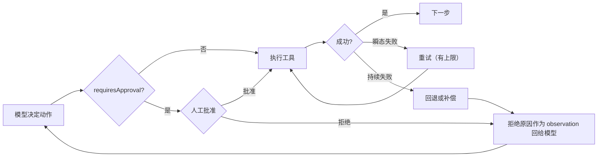

> **所在组**：Agent 系统 ｜ **上一组出口**：能用 checkpoint 保存与恢复 Agent 现场 ｜ **本页出口**：能为失败动作选出正确的恢复策略（重试 / 回退 / 补偿），并在不可逆、高成本、低置信度处架设 fail-closed 的人工批准门
> **前置**：[Agent 运行时](agent-runtime.md) · [Agent 状态与记忆](state-memory.md) ｜ **下一步**：[Computer Use](computer-use.md) · [安全](../08-production/security)

## 1. 概述

**结论先讲**：写世界的循环必然失败，问题不是「会不会」而是「失败后系统处于什么状态」。本页给两件东西：**恢复策略选择**（重试 / 回退 / 补偿，前提各不相同）与**人工批准门**（human-in-the-loop，HITL——在不可逆、高成本、低置信度的动作前暂停，等人决定后从断点继续）。门的默认语义是 **fail-closed**：没有批准者，动作不执行。

### 心智模型：门在循环里，恢复在门后



批准门插在「模型决定」与「世界改变」之间；恢复策略处理「世界已经改变但结果不对」的情况。

### 决策表：恢复与门控方案对比

| | 裸跑（无恢复） | + 重试 | + checkpoint 恢复 | + 批准门 | 全人工 |
| --- | --- | --- | --- | --- | --- |
| 方向 | 写，失败即烂 | 写，幂等可重试 | 写，可回到断点 | 写，高危前暂停 | 全部人做 |
| 控制权 | 模型 | 代码重试策略 | 快照粒度 | **人持有否决权** | 人 |
| 状态 | 无恢复语义 | 尝试计数 | 快照 + 已完成集 | 待决批准（可持久化） | 工单 |
| 信任域 | 进程内 | 进程内 | 存储边界 | 人 + 存储边界 | 人 |
| 最低复杂度 | 无 | 重试计数器 | 见[状态与记忆](state-memory.md) | 门 + 超时 | 无自动化 |

### 何时必须人工批准

三个触发条件，命中任一即架门：

1. **不可逆**：动作无法用反向操作撤销（删除数据、对外发送、支付）。
2. **高成本**：失败的影响半径大（批量操作、生产变更、金额超过阈值）。
3. **低置信度**：模型对参数或意图不确定、分类器边界输入、首次执行的新任务类型。

### 何时使用 / 何时不用

- 用：agent 写世界（[工具执行工程](../05-action/tool-execution.md)的延续）；副作用不可自动撤销；合规要求留人审批痕。
- 不用：只读任务（门只会拖慢）；可逆且低成本的动作（自动回退比等人便宜）；中断频率高到用户开始无脑点批准——那是门的失效信号，不是门的成功。

历史版本里程碑：OpenAI Agents SDK 将 HITL 产品化为 `needs_approval` + interruptions + 可序列化 `RunState`（当前形态 retrievedAt 2026-09-01）；LangGraph 把中断与恢复建在 checkpointer 原语上。更早的演化时间线未验证，不编造。

## 2. 使用

**最小实战**：≤15 分钟、零 API key。一个带批准门的执行循环，四个场景全覆盖：**批准 + 瞬态重试**、**拒绝并把原因回给模型**、**无批准者时 fail-closed**、**持续失败触发补偿**。模型响应由脚本回放。

### 步骤

1. 新建空目录，把下面的代码保存为 `approval-gate.ts`。
2. 运行 `node --experimental-strip-types approval-gate.ts`。

```ts
// approval-gate.ts
// Zero-key, deterministic loop with human approval gates, retry, and compensation.
// The "model" is scripted; the gate, retry, and compensation mechanics are real.
// Run: node --experimental-strip-types approval-gate.ts   (Node >= 22.6)

type ApprovalDecision = { approved: true } | { approved: false; reason: string };

interface Tool {
  name: string;
  requiresApproval: boolean;
  /** `attempt` lets a tool fail transiently on the first call (retry demo). */
  run: (args: Record<string, string>, attempt: number) => Promise<string>;
  compensate?: (args: Record<string, string>) => Promise<string>;
}

/** Policy: what a human must see before deciding. This is the approval UX contract. */
interface ApprovalRequest {
  tool: string;
  args: Record<string, string>;
  effect: string; // what will happen in the world
  reversible: boolean; // can it be undone automatically?
  cost: string; // money / blast radius
}

type HumanApprover = (req: ApprovalRequest) => ApprovalDecision;

/** Fail-closed gate: no decider => the action does not run. */
function gate(req: ApprovalRequest, approve: HumanApprover | null): ApprovalDecision {
  if (!approve) return { approved: false, reason: "no approver connected" };
  return approve(req);
}

async function withRetry(
  tool: Tool,
  args: Record<string, string>,
  maxAttempts = 2,
): Promise<string> {
  let lastError: unknown;
  for (let attempt = 1; attempt <= maxAttempts; attempt++) {
    try {
      return await tool.run(args, attempt);
    } catch (err) {
      lastError = err; // transient error: retry with backoff in a real system
      console.log(`retry: attempt ${attempt} failed (${(err as Error).message})`);
    }
  }
  throw lastError;
}

async function runTool(
  tool: Tool,
  args: Record<string, string>,
  approve: HumanApprover | null,
): Promise<string> {
  if (tool.requiresApproval) {
    const decision = gate(
      {
        tool: tool.name,
        args,
        effect: toolEffect(tool.name),
        reversible: Boolean(tool.compensate),
        cost: "USD 129.00 refund",
      },
      approve,
    );
    if (!decision.approved) {
      // The rejection reason is fed back to the model as the observation.
      return `approval_rejected: ${decision.reason}`;
    }
  }
  try {
    return await withRetry(tool, args);
  } catch (err) {
    if (tool.compensate) {
      await tool.compensate(args); // reverse side effects before surfacing
      return `tool_failed_and_compensated: ${(err as Error).message}`;
    }
    return `tool_failed: ${(err as Error).message}`;
  }
}

function toolEffect(name: string): string {
  return name === "issue_refund" ? "moves USD 129.00 from merchant to customer" : "reads data";
}

// --- fixture tools ---
const tools: Record<string, Tool> = {
  get_order: {
    name: "get_order",
    requiresApproval: false,
    run: async (args) => `order ${args.orderId}: delivered 2026-08-20, total 129.00`,
  },
  issue_refund: {
    name: "issue_refund",
    requiresApproval: true,
    // Fails transiently on attempt 1 to demonstrate retry.
    run: async (args, attempt) => {
      if (attempt === 1) throw new Error("payment gateway 503");
      return `refund ${args.orderId} issued`;
    },
    compensate: async (args) => `reversal queued for ${args.orderId}`,
  },
  ship_label: {
    name: "ship_label",
    requiresApproval: true,
    run: async () => {
      throw new Error("carrier API down"); // persistent failure
    },
    compensate: async (args) => `label ${args.labelId} voided`,
  },
};

// --- scripted model turns ---
type Turn = { tool: string; args: Record<string, string> } | { final: string };

async function run(script: Turn[], approve: HumanApprover | null): Promise<void> {
  for (const turn of script) {
    if ("final" in turn) {
      console.log(`model: ${turn.final}`);
      return;
    }
    const result = await runTool(tools[turn.tool], turn.args, approve);
    console.log(`${turn.tool} -> ${result}`);
  }
}

async function main() {
  // Scenario A: human approves; transient failure retries inside.
  console.log("== scenario A: approve ==");
  await run(
    [
      { tool: "get_order", args: { orderId: "A-42" } },
      { tool: "issue_refund", args: { orderId: "A-42" } },
      { final: "Refund issued for A-42 after human approval." },
    ],
    () => ({ approved: true }),
  );

  // Scenario B: human rejects; the model sees the reason and cancels.
  console.log("\n== scenario B: reject ==");
  await run(
    [
      { tool: "issue_refund", args: { orderId: "A-42" } },
      { final: "Refund cancelled: customer is outside the 30-day window." },
    ],
    () => ({ approved: false, reason: "delivery is older than 30 days" }),
  );

  // Scenario C: fail-closed — no approver connected.
  console.log("\n== scenario C: no approver (fail closed) ==");
  await run(
    [
      { tool: "issue_refund", args: { orderId: "A-42" } },
      { final: "Refund not executed." },
    ],
    null,
  );

  // Scenario D: persistent failure after approval triggers compensation.
  console.log("\n== scenario D: approve, then compensate ==");
  await run(
    [
      { tool: "ship_label", args: { labelId: "L-7" } },
      { final: "Shipping aborted; the label was voided." },
    ],
    () => ({ approved: true }),
  );
}

main();
```

### 正常输出

```text
== scenario A: approve ==
get_order -> order A-42: delivered 2026-08-20, total 129.00
retry: attempt 1 failed (payment gateway 503)
issue_refund -> refund A-42 issued
model: Refund issued for A-42 after human approval.

== scenario B: reject ==
issue_refund -> approval_rejected: delivery is older than 30 days
model: Refund cancelled: customer is outside the 30-day window.

== scenario C: no approver (fail closed) ==
issue_refund -> approval_rejected: no approver connected
model: Refund not executed.

== scenario D: approve, then compensate ==
retry: attempt 1 failed (carrier API down)
retry: attempt 2 failed (carrier API down)
ship_label -> tool_failed_and_compensated: carrier API down
model: Shipping aborted; the label was voided.
```

### 负例输出（错误示范）

把 `gate` 里的 fail-closed 分支改成「没有批准者就放行」（`return { approved: true }`）再跑 scenario C：动作在无人批准的情况下执行。这是生产事故的常见根因——**审批服务超时被当成默认批准**。正确语义只有一种：连不上决策者 = 拒绝。

### 验收命令

```bash
node --experimental-strip-types approval-gate.ts
```

通过标准：A 批准后重试一次成功；B 拒绝原因出现在 observation；C 未执行动作；D 两次重试后补偿并回报。

### 清理

删除整个目录即可。

## 3. 原理

### 恢复三策略：前提各不相同

| 策略 | 前提 | 成本 | 残留风险 |
| --- | --- | --- | --- |
| 重试 retry | 动作幂等，或失败在副作用发生前 | 最低 | 重试风暴放大负载 |
| 回退 rollback | 存在可恢复的快照 / 事务边界 | 中（回到 checkpoint） | 快照后、回退前的窗口丢失 |
| 补偿 compensation | 存在语义上的反向操作（退款 ↔ 收款） | 高（追加一次副作用） | 反向操作自身也可能失败 |

选择顺序从上到下：**能重试不回退，能回退不补偿**。补偿是 saga 模式的思想——分布式系统里没有原子回滚，只能追加反向动作把世界拉回一致。副作用边界与幂等键的工程细节见[工具执行工程](../05-action/tool-execution.md)；快照粒度见[状态与记忆](state-memory.md)。

### checkpoint 粒度与恢复点

恢复点必须落在**副作用之前**；恢复流程先查「该动作是否已发生」。粒度选择（每步 / 每阶段 / 每副作用边界）在[状态与记忆](state-memory.md)已给表，本页只补一条：**批准门本身是天然的 checkpoint 边界**——OpenAI 的 `RunState` 正是这样用的：运行暂停在待批准处，状态序列化落盘，人决定后反序列化续跑，批准决策（含 always-approve 粘性决定）随状态一起持久化。

### 批准门的 UX 契约：给批准者看什么

一个可决策的批准请求至少包含五项（fixture 的 `ApprovalRequest` 即最小实现）：

| 字段 | 回答的问题 | 缺失后果 |
| --- | --- | --- |
| intent / tool + args | 要做什么、对谁做 | 批准者盲签 |
| effect | 世界会发生什么改变 | 批准者低估影响 |
| reversible | 能否自动撤销 | 不可逆动作被当可逆处理 |
| cost | 金额 / 影响半径 | 高成本动作无差别批准 |
| provenance | 模型为什么要这么做（trace 摘要） | 无法识别注入或跑偏 |

拒绝必须**带原因**回给模型（fixture 的 `approval_rejected: <reason>`）——否则模型只会原样重提同一调用。

### 超时与升级路径

批准是异步等待，必须有超时语义：

1. **SLA**：待决批准设时限（分钟到天，按业务）。
2. **超时默认拒绝**：与 fail-closed 同一语义——超时不是批准。
3. **升级**：超时后通知第二审批人 / 升级队列 / 降级为人工任务；记录升级原因进审计。

OpenAI 的 fail-closed 细节值得抄：当 SDK 无法安全解析工具参数（非法 JSON、非对象、含 `NaN` 等非常量）时，**不调用审批回调、直接要求人工批准**——解析失败本身就是低置信度信号。

### 规范要求 vs 本地实测

| 断言 | 来源（厂商口径） | 本地实测 |
| --- | --- | --- |
| 工具声明 `needs_approval`，运行以 interruption 暂停，人决定后从断点续跑 | OpenAI Agents SDK HITL 文档 | fixture 的 `requiresApproval` + `gate` + observation 回填 |
| 无法安全解析参数时 fail-closed、强制人工批准 | 同上 | scenario C：`approve = null` 时动作不执行 |
| 拒绝信息可定制并回给模型 | 同上 | scenario B：`approval_rejected: <reason>` |
| 待决状态可序列化、跨进程恢复 | 同上 | fixture 用脚本回放替代序列化；序列化本体见[状态与记忆](state-memory.md) |
| 重试需幂等前提 | [工具执行工程](../05-action/tool-execution.md) | `withRetry` 上限 2 次，失败转补偿 |

## 4. 开发

### 集成要点

- **门的位置**：声明在工具上（`requiresApproval`），不是散在业务代码里——这样门随工具定义走，任何循环调用同一工具都过同一道门。
- **粘性批准**：同一工具的「本次运行内始终批准」要显式（OpenAI 的 `always_approve`），且只作用于当前运行；跨会话不继承。
- **审计**：每个批准 / 拒绝 / 超时决定连同请求五要素落审计日志，进[生产与运营](../08-production/)组的[可观测性](../08-production/observability)。

### 症状 → 证据 → 处理 → 完成标准

**症状**：批准请求发出后无人响应，任务挂了一夜。
**证据**：待决队列里该请求超过 SLA 无 decision 记录；没有超时语义。
**处理**：给批准请求加超时，超时默认拒绝并升级（通知第二审批人 / 转人工队列）；任务侧把「批准超时」当作普通拒绝处理。
**完成标准**：注入「永不响应」的批准者，任务在 SLA 内以「拒绝 + 升级记录」终止。

### 症状 → 证据 → 处理 → 完成标准

**症状**：人拒绝后，模型下一轮原样重提同一个调用，循环五次。
**证据**：trace 里连续多轮 `approval_rejected` 且 args 完全相同；拒绝原因没有进模型输入。
**处理**：确保拒绝原因作为 observation 回填；同一工具 + 同一 args 的被拒调用设次数上限，超限即转告用户而不是再试。
**完成标准**：被拒调用在重提一次内改道或终止；重复重提案例进回归测试。

### 症状 → 证据 → 处理 → 完成标准

**症状**：网关超时重试后，客户收到两笔退款。
**证据**：支付侧两笔成功记录时间相近；工具无幂等键，重试盲发。
**处理**：给非幂等工具加幂等键（runId + stepId）；重试前先查询外部系统「该键是否已成功」；查询不确定时走补偿而不是再发一次。
**完成标准**：故障注入下同一幂等键恰好一笔成功；第二笔被外部系统去重或被本地查询拦截。

### 症状 → 证据 → 处理 → 完成标准

**症状**：任务从 checkpoint 恢复后，已批准的退款又执行了一遍。
**证据**：快照点在副作用之后；恢复流程没有「已发生」检查。
**处理**：快照点移到副作用之前（见[状态与记忆](state-memory.md)）；恢复流程先按幂等键查询再执行；批准决定本身随快照持久化，避免恢复后重复打扰批准者。
**完成标准**：崩溃注入重放后，同一副作用恰好一次，且批准只请求一次。

### 反模式清单

- 审批服务超时当默认批准——只有 fail-closed 一种正确语义。
- 拒绝不带原因——模型的唯一纠错输入就是这条 observation。
- 无上限重试非幂等工具——重试风暴 + 重复副作用。
- 批准界面只显示参数不显示后果与可逆性——那是让人类当橡皮图章。
- 用提高中断频率换安全感——批准疲劳后所有门形同虚设。

## 5. 资料库

四级阅读路线：

- **Beginner**：跑通本页 fixture，对照四个场景理解门 + 重试 + 补偿的协作。
- **Builder**：给自己的高危工具加 `requiresApproval` 与幂等键；实现拒绝原因回填。
- **Operator**：给待决批准定 SLA 与升级路径；批准审计接入[可观测性](../08-production/observability)。
- **Researcher**：读 OpenAI HITL 文档与 saga 模式文献，理解补偿事务的一致性论证。

### 资源表

| 名称 | 证据层级 | canonical URL | 用途 | 支持的断言 | 下一步 |
| --- | --- | --- | --- | --- | --- |
| Human-in-the-loop（OpenAI Agents SDK） | L1（维护者） | https://openai.github.io/openai-agents-python/human_in_the_loop/ | needs_approval / interruptions / RunState 的生产语义 | fail-closed 解析、粘性批准、可序列化待决状态（retrievedAt 2026-09-01） | 官方示例仓库 |
| Persistence（LangGraph） | L1（维护者） | https://docs.langchain.com/oss/python/langgraph/persistence | 中断与恢复建在 checkpoint 原语上 | HITL 需要 thread 级状态持久化（retrievedAt 2026-09-01，页面已迁至 docs.langchain.com） | [状态与记忆](state-memory.md) |
| Building Effective Agents（Anthropic） | L1（维护者） | https://www.anthropic.com/research/building-effective-agents | agent 在检查点暂停等人反馈的定位 | 「检查点暂停 / 遇阻塞返回人类」（retrievedAt 2026-09-01） | [Agent 运行时](agent-runtime.md) |
| Computer use tool（Anthropic docs） | L0（官方文档） | https://docs.anthropic.com/en/docs/agents-and-tools/tool-use/computer-use-tool | 敏感动作批准要插在批执行每个块之前 | batch 内后果性动作需逐块确认（retrievedAt 2026-09-01） | [Computer Use](computer-use.md) |
| 本仓 · 工具执行工程 | 本仓 | [tool-execution](../05-action/tool-execution.md) | 幂等 / 超时 / 取消 / 副作用 | 重试与补偿的前提工程 | [安全](../08-production/security) |

### 主动证伪与未决问题

- 证伪入口：如果你的场景里「自动回退」总能替代人工批准且验收不降级（错误率、成本、恢复时间），该场景的门是多余的——记录案例并撤门。
- 未决：批准 SLA 的合理时长与升级链路深度依赖组织结构，本页不给默认值；用自家批准日志的响应时间分布实测。

### learn-ai 到此为止 / 继续去哪

- 界面自动化里的敏感操作批准：[Computer Use](computer-use.md)。
- 注入与越权的攻击面：[生产与运营组的安全](../08-production/security)。
- saga / 补偿事务的分布式一致性理论：见分布式事务文献（本仓不展开）。
