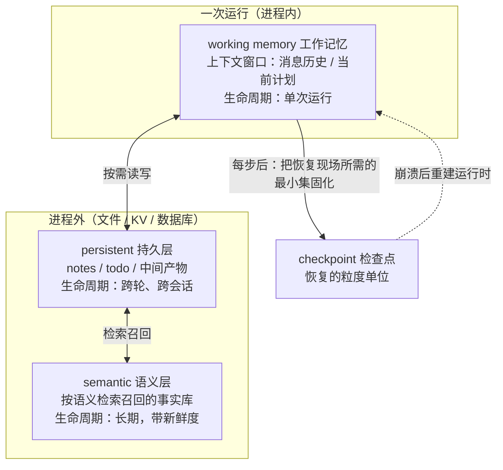

> **所在组**：Agent 系统 ｜ **上一层出口**：能搭出带停止条件与预算的最小 Agent 循环 ｜ **本层出口**：能为跨步状态选对存放层（working / persistent / semantic），用 checkpoint 做到崩溃后无重复地恢复
> **前置**：[Agent 运行时](agent-runtime.md) · [上下文工程](../03-context/context-engineering) ｜ **下一步**：[恢复与人工批准](recovery-hitl.md)

## 1. 概述

**结论先讲**：状态是「跨步存活的数据」，记忆是「跨轮存活的数据」。本页回答三个问题：状态放哪（三层结构）、崩溃后怎么恢复（checkpoint）、放久了会怎么坏（膨胀与腐烂）。它与[上下文工程](../03-context/context-engineering)的边界：那页管**单次调用**进窗口的 token 构成；本页管**跨步 / 跨轮**状态的生命周期——放哪、活多久、怎么恢复、怎么淘汰。

### 心智模型：三层状态加一条检查点线



三层判据只有两个问题：**活多久**（单次运行 / 跨轮 / 长期）与**怎么进上下文**（回放 / 按需读取 / 检索召回）。

### 决策表：状态方案对比

| | 只用上下文回放 | + persistent notes | + semantic 检索 | + checkpoint 恢复 |
| --- | --- | --- | --- | --- |
| 方向 | 读（重放历史） | 读写（落盘） | 读（召回） | 读写（快照） |
| 控制权 | 运行时全控 | 运行时决定写什么 | 你控索引与更新节奏 | 你控快照粒度 |
| 状态 | 内存内消息历史 | 进程外 KV / 文件 | 向量库 / 索引 | 每快照一份完整现场 |
| 信任域 | 进程内 | 存储边界 | 数据源边界 | 存储边界（必须可信） |
| 最低复杂度 | 无 | NOTES.md / todo 文件 | → [知识接地](../04-grounding/) | 每步序列化 |

升级规则：**上一层失效才加下一层**——历史放不进窗口才落 notes；notes 多到翻不动才上检索；任务长到崩溃不可承受才做 checkpoint。

### 何时使用 / 何时不用

- 用：任务跨多步且中间产物有价值；运行可能被崩溃 / 超时 / 人工批准中断；历史长度逼近上下文预算。
- 不用：单次调用可完成的任务；无状态即可满足验收——为想象中的长任务预建记忆系统是投机建设。

历史版本里程碑：LangGraph 把这套结构产品化为 checkpointer（线程内短期）与 store（跨线程长期）两类原语（文档 retrievedAt 2026-09-01）；Anthropic 2025 年的上下文工程文提出 compaction / 结构化笔记 / 子 agent 三种长任务技术。更早的记忆系统演化时间线未验证，不编造。

## 2. 使用

**最小实战**：≤15 分钟、零 API key。一个带 checkpoint 的状态机：每步后固化快照，第 2 步后模拟进程崩溃（丢弃全部内存态），从快照重建运行时继续跑完——**无重复步骤**。另附「恢复不存在的运行」负例。

### 步骤

1. 新建空目录，把下面的代码保存为 `checkpoint-resume.ts`。
2. 运行 `node --experimental-strip-types checkpoint-resume.ts`。

```ts
// checkpoint-resume.ts
// Zero-key, deterministic agent state machine with checkpoint + crash + resume.
// "Disk" is a Map of serialized snapshots; a crash is simulated by discarding
// the live runtime and rebuilding it from the last checkpoint.
// Run: node --experimental-strip-types checkpoint-resume.ts   (Node >= 22.6)

interface AgentState {
  goal: string;
  completedSteps: string[];
  notes: Record<string, string>; // persistent layer: survives restarts
  nextStepIndex: number;
}

/** Fake durable storage: survives "process crashes" in this simulation. */
const disk = new Map<string, string>();

function saveCheckpoint(runId: string, state: AgentState): void {
  disk.set(`checkpoint:${runId}`, JSON.stringify(state));
}

function loadCheckpoint(runId: string): AgentState {
  const raw = disk.get(`checkpoint:${runId}`);
  if (!raw) throw new Error(`no_checkpoint: nothing saved for run ${runId}`);
  return JSON.parse(raw) as AgentState;
}

/** Working memory: only lives inside one runtime instance. */
class WorkingMemory {
  readonly recent: string[] = [];
  push(entry: string): void {
    this.recent.push(entry);
    if (this.recent.length > 2) this.recent.shift(); // bounded window
  }
}

/** The plan is fixed here; a real runtime would let the model choose steps. */
const PLAN: Array<{ id: string; note: string }> = [
  { id: "fetch-orders", note: "fetched 3 orders" },
  { id: "classify", note: "1 order needs a refund" },
  { id: "draft-reply", note: "reply drafted for order A-42" },
];

function runToCompletion(runId: string, crashAfter: number | null): AgentState {
  let state = loadCheckpoint(runId); // resume if a checkpoint exists
  const memory = new WorkingMemory(); // working memory does NOT survive

  while (state.nextStepIndex < PLAN.length) {
    const step = PLAN[state.nextStepIndex];
    state.completedSteps.push(step.id);
    state.notes[step.id] = step.note; // persistent layer
    state.nextStepIndex += 1;
    memory.push(step.id); // working layer
    saveCheckpoint(runId, state); // checkpoint after every step

    if (crashAfter !== null && state.nextStepIndex === crashAfter) {
      console.log(
        `-- crash simulated after ${crashAfter} steps; live state discarded --`,
      );
      return runToCompletion(runId, null); // fresh runtime resumes from disk
    }
  }
  return state;
}

// --- first attempt: crash after step 2; rebuilt attempt: resume and finish ---
const runId = "run-001";
saveCheckpoint(runId, {
  goal: "process today's refund queue",
  completedSteps: [],
  notes: {},
  nextStepIndex: 0,
});

const final = runToCompletion(runId, 2);
console.log("completedSteps:", final.completedSteps.join(", "));
console.log("notes:", JSON.stringify(final.notes));
// completedSteps has no duplicates: checkpoints make the run step-idempotent.

// --- negative: resuming a run that never checkpointed ---
try {
  loadCheckpoint("run-404");
} catch (err) {
  console.log(`expected failure: ${(err as Error).message}`);
}
```

### 正常输出

```text
-- crash simulated after 2 steps; live state discarded --
completedSteps: fetch-orders, classify, draft-reply
notes: {"fetch-orders":"fetched 3 orders","classify":"1 order needs a refund","draft-reply":"reply drafted for order A-42"}
expected failure: no_checkpoint: nothing saved for run run-404
```

### 负例输出（错误示范）

把 `saveCheckpoint(runId, …)` 的初始化调用删掉再运行：第一步 `loadCheckpoint` 即抛出

```text
Error: no_checkpoint: nothing saved for run run-001
```

含义：**恢复的前提是快照先行**。没有任何持久化就谈不上恢复——生产等价物是「任务先跑起来、以后再加持久化」，这类任务的第一崩溃就是最后一次进展。

### 验收命令

```bash
node --experimental-strip-types checkpoint-resume.ts
```

通过标准：崩溃后 `completedSteps` 恰好三项且无重复；`notes` 三条齐全；`run-404` 抛 `no_checkpoint`。

### 清理

删除整个目录即可。

## 3. 原理

### 三层各自的生命周期与失效方式

| 层 | 容量 | 进上下文的方式 | 失效方式 |
| --- | --- | --- | --- |
| working（上下文窗口） | 有限，随 token 计费 | 每轮全量回放 | context rot：token 越多召回越差 |
| persistent（notes / 文件） | 进程外，近无限 | 按需读取（next-step 前 load） | 腐烂：旧事实覆盖新事实 |
| semantic（检索库） | 近无限 | 检索召回 top-k | 召回错：检回过时或不相关条目 |

context rot 是 working 层的硬约束：Anthropic 引用 needle-in-a-haystack 类研究的结论——**窗口内 token 增多，模型准确召回其中信息的能力下降**。所以「把窗口塞满」不是免费的。

### 压缩与记忆的边界（本页 vs 上下文工程页）

- **裁剪 / 压缩（compaction）**属于[上下文工程](../03-context/context-engineering)：窗口快满时摘要旧内容、清掉早已消费过的工具原始输出，然后**在同一次任务内**继续。取舍是保真——压缩过狠会丢掉后来才显出重要的细节。
- **记忆（persistent / semantic）**属于本页：把「下次还要用」的事实写进窗口外，跨轮再读回。判据是**复用次数**：只用一次的中间结果留在 transcript；会反复引用的事实（决策、约束、术语表）才值得落 notes。

Anthropic 对长任务给的三件工具正好覆盖三层：compaction（working 层）、structured note-taking（persistent 层）、子 agent 隔离（把噪音挡在主 working 层之外）。

### checkpoint 的粒度

快照粒度是最重要的设计决策，三个选项：

| 粒度 | 恢复成本 | 重复执行风险 | 适用 |
| --- | --- | --- | --- |
| 每步 | 低（重放少） | 低 | 有副作用的步骤（fixture 默认） |
| 每阶段 | 中 | 中（阶段内步骤要幂等） | 长而纯计算的阶段 |
| 仅副作用边界 | 高 | 最低 | 高危动作前后必须留痕 |

规则：**快照点放在副作用之前**，恢复时先查「该副作用是否已发生」（见[恢复与人工批准](recovery-hitl.md)的幂等键）。fixture 采用每步快照，`nextStepIndex` 单调递增保证步级幂等。

### 状态膨胀与腐烂

- **膨胀**：快照与 notes 只增不减——LangGraph 文档把「checkpoints 无限增长拖慢存储」列为常见故障，对策是保留策略（retention）与定期修剪。注意修剪要**成批**进行：逐轮改动历史前缀会打穿提示缓存。
- **腐烂**：旧事实覆盖新事实。对策：每条 note 带来源与写入时间戳，读取时校验新鲜度；冲突时后写覆盖要显式（版本号或单写者），不要默默 last-write-wins。

### 并发与一致性

两个循环写同一份状态会出现丢失更新。最低成本的两种解法：

1. **单写者**：同一 runId 的状态只允许一个运行时持有写权（锁 / 队列 / 主从）。
2. **版本号乐观锁**：读时记版本，写时版本不符即拒绝并重读。fixture 用递归单线程回避了该问题——生产上多 worker 恢复同一任务是真实场景。

### 规范要求 vs 本地实测

| 断言 | 来源（厂商口径） | 本地实测 |
| --- | --- | --- |
| checkpointer 承担线程内短期记忆，store 承担跨线程长期记忆 | LangGraph Persistence 文档 | fixture 的 `AgentState`（run 内）与 `notes`（跨重建存活）对应两层 |
| 崩溃后从 checkpoint 恢复、继续任务 | 同上 | 崩溃模拟后从 `nextStepIndex=2` 续跑到完成 |
| compaction 在窗口接近上限时摘要并重开窗口 | Anthropic 上下文工程文 | fixture 未实现（属于上下文工程页范围） |
| notes 让 agent 跨上下文重置继续多阶段工作 | 同上 | `notes` 在「进程重建」后仍可读 |

## 4. 开发

### 集成要点

- **存储选型**：开发用 SQLite / 文件，生产用 Postgres 级别——LangGraph 文档明确警告内存版 checkpointer 重启即失。语义层选型回到[知识接地](../04-grounding/)组，不在本页重复。
- **序列化契约**：快照必须包含**重建运行时所需的一切**（状态、计划游标、工具结果摘要）。OpenAI 的口径是序列化运行状态 + 给待决任务打版本标记，防模型 / 提示变更后反序列化错位。

### 症状 → 证据 → 处理 → 完成标准

**症状**：任务恢复后，同一个退款执行了两次。
**证据**：trace 显示恢复点在 `issue_refund` 之后，但快照里没有「副作用已发生」标记。
**处理**：把快照点移到副作用**之前**；恢复流程先查询外部系统确认该动作是否已发生（幂等键）；已发生则跳过。
**完成标准**：注入「快照后、恢复前」崩溃的混沌测试，重放后外部副作用恰好一次。

### 症状 → 证据 → 处理 → 完成标准

**症状**：长跑任务的延迟随运行时长线性上升。
**证据**：存储里 checkpoint 数量与任务步数成正比且从不删除；每步恢复都要扫描全量快照。
**处理**：加保留策略（如只留最近 N 个快照 + 关键里程碑）；修剪成批执行以保住缓存前缀。
**完成标准**：步延迟与任务总长解耦（平稳）；存储占用有上界。

### 症状 → 证据 → 处理 → 完成标准

**症状**：agent 用三小时前的「库存充足」结论下单，下单失败。
**证据**：notes 里该条目无时间戳；读取方从未校验新鲜度。
**处理**：所有 note 落盘时带 `writtenAt` 与来源；读取规则按数据类别设 TTL（库存类即时查，政策类长期有效）。
**完成标准**：过期事实读取即触发重查而不是直接使用；腐烂案例进回归测试。

### 症状 → 证据 → 处理 → 完成标准

**症状**：两个 worker 同时恢复同一任务，notes 互相覆盖。
**证据**：存储里同一 key 出现交错写入；双方各自丢了对方的更新。
**处理**：同 runId 单写者（队列或锁）；或版本号乐观锁——读时记版本、写时不符即重读合并。
**完成标准**：并发恢复测试中更新无丢失；输家显式重试而不是默默覆盖。

### 反模式清单

- 把整个消息历史当记忆——那是 working 层，窗口一满就 rot。
- 为想象中的长任务预建三层记忆——先用 transcript 跑出真实长度再说。
- 快照点全放在副作用之后——恢复即重复执行。
- 逐轮修剪历史前缀——每轮都打穿提示缓存。

## 5. 资料库

四级阅读路线：

- **Beginner**：跑通本页 checkpoint fixture；能复述三层的「活多久 / 怎么进上下文」判据。
- **Builder**：给自己的 agent 加 persistent notes 与每步快照；注入一次崩溃验证恢复。
- **Operator**：读 LangGraph Persistence 文档的故障清单，给生产存储定保留策略。
- **Researcher**：读 Anthropic 上下文工程文与 Learn LLM 第 16 章，看 compaction 与记忆的机制推导。

### 资源表

| 名称 | 证据层级 | canonical URL | 用途 | 支持的断言 | 下一步 |
| --- | --- | --- | --- | --- | --- |
| Persistence（LangGraph） | L1（维护者） | https://docs.langchain.com/oss/python/langgraph/persistence | checkpointer vs store 的原语划分 | 线程内短期 / 跨线程长期二分；快照膨胀故障（retrievedAt 2026-09-01，本轮复核时页面已迁至 docs.langchain.com，旧 langchain-ai.github.io 地址重定向中） | 生产存储选型 |
| Effective context engineering for AI agents（Anthropic） | L1（维护者） | https://www.anthropic.com/engineering/effective-context-engineering-for-ai-agents | 长任务三技术：compaction / 笔记 / 子 agent | context rot；子 agent 回传蒸馏摘要（retrievedAt 2026-09-01） | [上下文工程](../03-context/context-engineering) |
| Human-in-the-loop（OpenAI Agents SDK） | L1（维护者） | https://openai.github.io/openai-agents-python/human_in_the_loop/ | `RunState` 的可序列化运行状态与待决任务版本标记 | 运行状态可序列化续跑；模型 / 提示变更前给待决任务打版本标记（retrievedAt 2026-09-01） | [恢复与人工批准](recovery-hitl.md) |
| Learn LLM 第 16 章 | sibling | https://llm.zenheart.site/chapters/ | LangGraph 状态机制推导 | 机制推导归 Learn LLM（retrievedAt 2026-09-01） | [multi-agent](multi-agent.md) |
| 本仓 · 知识接地组 | 本仓 | [04-grounding](../04-grounding/) | 语义层的检索与新鲜度 | 语义记忆 = 检索问题 | [嵌入与检索](../04-grounding/) |

### 主动证伪与未决问题

- 证伪入口：如果你的任务在「只用 transcript、无任何持久层」下就能通过全部验收，本页三层结构对该任务是过度设计——记录案例并降级。
- 未决：语义层记忆的更新节奏（实时 vs 定时批量）依赖业务对新鲜度的容忍度，本页不给默认值。

### learn-ai 到此为止 / 继续去哪

- 恢复策略（重试 / 回退 / 补偿）与人工批准：[恢复与人工批准](recovery-hitl.md)。
- 单次调用进窗口的 token 构成：[上下文工程](../03-context/context-engineering)。
- 语义记忆的检索机制：Learn LLM 第 11 章与本仓[知识接地组](../04-grounding/)。
