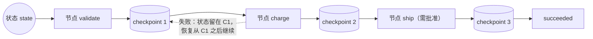

> **所在组**：Agent 系统 ｜ **上一层出口**（[行动组](../05-action/tool-calling)）：能安全执行单次工具调用 ｜ **本层出口**：能实现带 checkpoint 的多步流程——失败后从持久化状态恢复而不重做副作用，不可逆步骤前有人工批准节点
> **前置**：[工具执行工程](../05-action/tool-execution.md) ｜ **下一步**：[Agent 运行时](agent-runtime.md)、[恢复与人工批准](recovery-hitl.md)、[可观测性](../08-production/observability)

## 1. 概述

**结论先讲**：workflow（工作流）是「LLM 与工具通过**预定义代码路径**编排」的系统；agent 是「模型**动态主导**自己的过程与工具使用」的系统（Anthropic 口径）。这个边界决定一切：**步骤能静态枚举、失败恢复路径能预先写全，就用 workflow**——它可预测、可测试、可重放；只有当步骤数量与顺序本身取决于中间发现时，才把控制权交给 agent 循环。本章交付一个带 checkpoint 的最小引擎：失败后从持久化状态恢复、重放已完成步骤而不重做副作用、在不可逆节点前暂停等人。

### 心智模型：节点、状态与 checkpoint



三个构件：**节点**（一步工作：一次 LLM 调用、一次工具执行或一次纯代码判断）、**状态**（跨节点共享的业务数据）、**checkpoint**（每个节点完成后的持久化快照）。恢复 = 从头**重放**（replay）事件/checkpoint，已完成的节点直接复用记录的输出，副作用不再执行。

### 何时使用 / 何时不用

- 用：多步流程且步骤可枚举——起草→审查→润色、提取→校验→入库、审批链。
- 不用：单步能解决的（直接[工具执行](../05-action/tool-execution.md)）；步骤无法预测、需要模型自主探索的（进 [Agent 运行时](agent-runtime)）。

### 决策表一：代码 workflow vs agent loop

| 维度 | 代码 workflow | agent loop |
| --- | --- | --- |
| 控制权 | 在你手里：步骤、顺序、分支都是代码 | 在模型手里：每步由模型决定下一步 |
| 可预测性 | 高：同输入同路径，可精确测试 | 低：非确定，需停止条件约束 |
| 成本 | 每步一次受控调用，token 可预算 | 循环次数上不封顶，需预算上限 |
| 调试 | 断点在节点上，看 checkpoint 即知位置 | 需要全链路 trace 还原模型决策 |
| 失败恢复 | 从 checkpoint 重放，成熟方案多 | 靠 agent 自身纠错 + 外层护栏 |

**判据一句话**：你能画出整张流程图，就选 workflow；你画不出（图取决于运行中会发现什么），才选 agent。

### 决策表二：梯级定位

| 方案 | 方向 | 控制权 | 状态 | 信任域 | 最低复杂度 |
| --- | --- | --- | --- | --- | --- |
| 单次工具调用（[前一章](../05-action/tool-execution.md)） | 写（单次） | 五道门 | 单次调用记录 | 进程内 | 一次动作 |
| 代码 workflow（本章） | 写（多次） | 你编排步骤 | 多步状态 + checkpoint | 进程内 | 步骤可枚举的多步 |
| agent loop（[下一章](agent-runtime)） | 读写循环 | 模型决策 + 停止条件 | 会话/记忆/checkpoint | host 内 | 步骤不可预测 |
| 多 agent（[再下一章](multi-agent.md)） | 读写循环 × N | 委派与路由 | 各自上下文 + 共享点 | host 内/跨边界 | 并行与专业化收益 > 协调成本 |

### 五种工作流模式（Anthropic 命名）

| 模式 | 解决的问题 | 例子 |
| --- | --- | --- |
| Prompt chaining（提示链） | 任务可分解为固定子步骤，逐步简化 | 生成文案 → 翻译 |
| Routing（路由） | 输入有类别，分类后走专用路径 | 客服查询分流；简单问题走小模型 |
| Parallelization（并行化：sectioning / voting） | 子任务独立或需要多视角 | 分区评审；多提示投票 |
| Orchestrator-workers（编排器-工人） | 子任务**无法预定义**，由中心 LLM 动态分解 | 多文件代码修改 |
| Evaluator-optimizer（评估-优化） | 有明确评估标准，迭代有可度量收益 | 文学翻译打磨 |

注意边界：orchestrator-workers 已经站在 workflow 与 agent 的过渡带上——「编排器动态决定子任务」正是 agent 式控制权，只是整体路径仍由代码收口。生产系统常组合使用（外层 workflow、内层 agent 节点）。

历史版本里程碑：本章整合自旧页《AI Agent 工作流模式与高级工具调用》；其中「高级工具调用」部分（tool search 等）已移入[工具执行工程](../05-action/tool-execution.md)的资源库。三种执行模式（顺序/并行/评估优化）对应上表 chaining / parallelization / evaluator-optimizer。更早时间线未验证，不编造。

## 2. 使用

最小实战：一个迷你 workflow 引擎——步骤注册 + 内存 checkpoint 存储 + 失败重放 + 人工批准节点。三步订单流程（校验 → 扣款 → 发货），演示：两步成功路径中第二步失败、从 checkpoint 恢复、批准收尾、拒绝批准的负例。零 API key、零依赖。

**环境**：Node ≥ 22.18。保存为 `workflow-engine.ts`，运行 `node workflow-engine.ts`。

```ts
// workflow-engine.ts — a mini workflow engine: step registry + in-memory checkpoints + failure replay + human approval.
// Zero dependencies. Runs natively on Node >= 22.18: node workflow-engine.ts
import { setTimeout as sleep } from "node:timers/promises";

// ---------- Contracts ----------
type RunStatus = "running" | "succeeded" | "failed" | "awaiting_approval" | "cancelled";
type StepStatus = "pending" | "running" | "done" | "failed" | "skipped";

interface OrderState {
  orderId: string;
  amount: number;
  validated?: boolean;
  paymentId?: string;
  shipped?: boolean;
}

interface StepDef {
  name: string;
  requiresApproval?: boolean; // human-approval node: pause instead of pass-through
  run: (state: OrderState) => Promise<Partial<OrderState>>;
}

interface RunRecord {
  status: RunStatus;
  state: OrderState;
  steps: Map<string, { status: StepStatus; output?: Partial<OrderState> }>;
  waitingOn?: string; // which node an awaiting_approval run is paused at
}

// ---------- Engine: in-memory checkpoint store (swap for a DB/file in production) ----------
class WorkflowEngine {
  private runs = new Map<string, RunRecord>();

  private checkpoint(runId: string, step: string, output: Partial<OrderState>) {
    const run = this.runs.get(runId)!;
    run.steps.set(step, { status: "done", output });
    Object.assign(run.state, output);
    console.log(`  [checkpoint] run=${runId} step=${step} saved ${JSON.stringify(output)}`);
  }

  // Start or resume: steps already marked done reuse their checkpointed output; side effects are NEVER re-executed
  async start(runId: string, steps: StepDef[], input: OrderState): Promise<RunRecord> {
    if (!this.runs.has(runId)) {
      this.runs.set(runId, { status: "running", state: input, steps: new Map() });
      console.log(`[run ${runId}] start`);
    } else {
      console.log(`[run ${runId}] resume: replay from checkpoint`);
    }
    const run = this.runs.get(runId)!;

    for (const step of steps) {
      const saved = run.steps.get(step.name);
      if (saved?.status === "done") {
        console.log(`  [replay] step=${step.name} reused (side effect NOT re-executed)`);
        continue;
      }
      // Human-approval node: persist the pause point first, continue only on a decision
      if (step.requiresApproval && run.waitingOn !== step.name) {
        run.status = "awaiting_approval";
        run.waitingOn = step.name;
        run.steps.set(step.name, { status: "pending" });
        console.log(`  [pause] step=${step.name} awaiting human approval (persisted)`);
        return run;
      }
      run.steps.set(step.name, { status: "running" });
      console.log(`  [exec] step=${step.name}`);
      try {
        const output = await step.run(run.state);
        this.checkpoint(runId, step.name, output);
      } catch (err: any) {
        run.steps.set(step.name, { status: "failed" });
        run.status = "failed";
        console.log(`  [fail] step=${step.name} error=${err.message}`);
        return run; // state is persisted: recovery resumes from the checkpoint
      }
    }
    run.status = "succeeded";
    console.log(`[run ${runId}] ${run.status}`);
    return run;
  }

  // Approve/reject: continue from the pause point, or wind down
  async decide(runId: string, steps: StepDef[], approve: boolean): Promise<RunRecord> {
    const run = this.runs.get(runId)!;
    const stepName = run.waitingOn!;
    if (!approve) {
      run.steps.set(stepName, { status: "skipped" });
      run.status = "cancelled";
      run.waitingOn = undefined;
      console.log(`[run ${runId}] ${run.status} (step=${stepName} rejected)`);
      return run;
    }
    run.waitingOn = undefined;
    const step = steps.find((s) => s.name === stepName)!;
    console.log(`  [approved] step=${stepName}`);
    const output = await step.run(run.state);
    this.checkpoint(runId, stepName, output);
    run.status = "succeeded";
    console.log(`[run ${runId}] ${run.status}`);
    return run;
  }
}

// ---------- Step definitions: all side effects mocked, outputs deterministic ----------
const steps: StepDef[] = [
  {
    name: "validate_order",
    run: async (s) => {
      await sleep(10);
      if (!s.orderId.startsWith("ORD-")) throw new Error("invalid orderId format");
      return { validated: true };
    },
  },
  {
    name: "charge_payment",
    run: async (s) => ({ paymentId: `PAY-${s.orderId.slice(4)}` }),
  },
  {
    name: "ship_order",
    requiresApproval: true, // shipping is irreversible: a human-approval node
    run: async () => ({ shipped: true }),
  },
];

async function main() {
  const engine = new WorkflowEngine();
  const input: OrderState = { orderId: "ORD-1042", amount: 199 };

  console.log("== drill 1: step 2 fails (injected transient fault), run stops at a checkpoint ==");
  const origCharge = steps[1].run;
  steps[1].run = async () => { throw new Error("payment gateway 503"); };
  const r1 = await engine.start("run-1", steps, input);
  console.log(`result: status=${r1.status}, validate saved=${r1.steps.get("validate_order")?.status}`);

  console.log("\n== drill 2: fault recovered, resume; validate replays from checkpoint, not re-executed ==");
  steps[1].run = origCharge;
  const r2 = await engine.start("run-1", steps, input); // same runId: continue from persisted state
  console.log(`result: status=${r2.status}, waitingOn=${r2.waitingOn}`);

  console.log("\n== drill 3: approve the human-approval node, run finishes ==");
  const r3 = await engine.decide("run-1", steps, true);
  console.log(`result: status=${r3.status}, state=${JSON.stringify(r3.state)}`);

  console.log("\n== negative: approval rejected; run cancelled with side effects stopped before shipping ==");
  const r4 = await engine.start("run-2", steps, { orderId: "ORD-2088", amount: 59 });
  const r5 = await engine.decide("run-2", steps, false);
  console.log(`result: status=${r5.status}, ship=${r5.steps.get("ship_order")?.status}, state=${JSON.stringify(r5.state)}`);
}

main();
```

**正常输出**（确定性）：

```text
== drill 1: step 2 fails (injected transient fault), run stops at a checkpoint ==
[run run-1] start
  [exec] step=validate_order
  [checkpoint] run=run-1 step=validate_order saved {"validated":true}
  [exec] step=charge_payment
  [fail] step=charge_payment error=payment gateway 503
result: status=failed, validate saved=done

== drill 2: fault recovered, resume; validate replays from checkpoint, not re-executed ==
[run run-1] resume: replay from checkpoint
  [replay] step=validate_order reused (side effect NOT re-executed)
  [exec] step=charge_payment
  [checkpoint] run=run-1 step=charge_payment saved {"paymentId":"PAY-1042"}
  [pause] step=ship_order awaiting human approval (persisted)
result: status=awaiting_approval, waitingOn=ship_order

== drill 3: approve the human-approval node, run finishes ==
  [approved] step=ship_order
  [checkpoint] run=run-1 step=ship_order saved {"shipped":true}
[run run-1] succeeded
result: status=succeeded, state={"orderId":"ORD-1042","amount":199,"validated":true,"paymentId":"PAY-1042","shipped":true}

== negative: approval rejected; run cancelled with side effects stopped before shipping ==
[run run-2] start
  [exec] step=validate_order
  [checkpoint] run=run-2 step=validate_order saved {"validated":true}
  [exec] step=charge_payment
  [checkpoint] run=run-2 step=charge_payment saved {"paymentId":"PAY-2088"}
  [pause] step=ship_order awaiting human approval (persisted)
[run run-2] cancelled (step=ship_order rejected)
result: status=cancelled, ship=skipped, state={"orderId":"ORD-2088","amount":59,"validated":true,"paymentId":"PAY-2088"}
```

**看点**：drill 2 的 `[replay]` 行——恢复时 `validate_order` 的输出从 checkpoint 复用，副作用未重跑；`[pause]` 行——批准暂停点本身被持久化，进程重启后仍可 `decide`。

**验收命令**：

```bash
node workflow-engine.ts | grep -c "\[checkpoint\]"   # 期望输出: 5（两个 run 共落 5 个检查点）
```

**清理**：纯内存运行，无文件副作用。

### 场景推演

| 场景 | 输入 | 动作 | 输出 | 适用 | 不适用 |
| --- | --- | --- | --- | --- | --- |
| 内容管线 | 文档 | chaining：提取→校验→入库 | 每步 checkpoint | 步骤固定的转换 | 需按发现动态加步骤 |
| 审批流 | 订单 | approval 节点暂停 + `decide` | awaiting_approval → succeeded/cancelled | 不可逆动作前 | 可自动回滚的步骤（不必打扰人） |
| 瞬态故障恢复 | 503/超时 | 同 runId 重跑 `start` | 从 checkpoint 续跑 | 副作用不可重做的流程 | 纯只读流程（重跑无害，简单重试即可） |

## 3. 原理

### 状态与恢复的三种语义

| 恢复语义 | 做法 | 适用 | 代价 |
| --- | --- | --- | --- |
| **重放（replay）** | 从头重跑代码，用记录的事件/checkpoint 还原状态，已完成节点的副作用不重做 | 有持久化事件流的系统（Temporal 的 Event History；本 fixture 的 step 记录） | 节点代码必须确定性 |
| **checkpoint 续跑** | 从最近快照直接继续执行 | 快照成本低于重放 | 快照一致性要设计 |
| **补偿（saga）** | 为每个写步骤登记反向动作，失败时逆序执行 | 无法原子提交的跨服务写 | 补偿本身也可能失败，需重试与人工兜底 |

Temporal 把「重放」做成了体系：Event History 是唯一事实源，恢复时**从重跑代码开始**，用历史事件引导代码回到崩溃前状态；因此 workflow 代码必须**确定性**——时间从上下文读、随机数记录后复用、一切外部交互（API/DB/LLM/文件）放进 Activity，Activity 结果记录一次、重放时复用而不重算。本 fixture 的 `[replay]` 是这个语义的最小版。

### 人工批准节点 = 持久化暂停

批准不是 UI 弹窗，而是**状态机的一个持久化状态**：`awaiting_approval` 连同 `waitingOn`（卡在哪个节点）一起落盘。进程崩溃、部署重启（Anthropic 生产经验：用 rainbow deployment 避免打断运行中的 agent）都不应丢失暂停点。LangGraph 把这一族能力统称 checkpointer：按 `thread_id` 存图状态快照，支撑对话续接、human-in-the-loop、time travel 与容错；并明确内存版 `MemorySaver` 重启即失，生产换 `SqliteSaver`/`PostgresSaver`。

### 可观测性：每步一条 trace

多步流程的调试单位是「步」而不是「次」：每个节点记录 runId、step、输入摘要、输出摘要、耗时与终态。没有 per-step trace，「流程卡住了」只能靠猜；有了它，卡点直接定位到节点与决策分支（细节进[生产与运营](../08-production/)组的[可观测性](../08-production/observability)）。

### 规范要求 vs 本地实测

| 官方口径 | 来源 | 本地 fixture 对应 |
| --- | --- | --- |
| workflow = 预定义代码路径编排 LLM 与工具；agent = 模型动态主导 | Building Effective Agents（L1，retrievedAt 2026-09-01） | `steps` 数组即预定义路径；本章不含模型自主分支 |
| Workflow 恢复 = 重跑代码 + 重放事件历史；workflow 必须确定性，外部交互放 Activity 且结果只记录一次 | Temporal 文档（L1，retrievedAt 2026-09-01） | `[replay]` 复用已存输出；mock 步骤输出确定 |
| checkpointer 按 thread 持久化图状态，支撑 HITL 与容错；内存版不跨重启 | LangGraph persistence 文档（L1，retrievedAt 2026-09-01） | fixture 用内存 `Map`，正文明确标注生产需换持久存储 |
| 五种工作流模式命名 | Building Effective Agents（L1，retrievedAt 2026-09-01） | 决策表一/概述复述 |

### 控制权的本质

workflow 与 agent 的差异不是「有没有 LLM」，而是**控制流住在哪**：workflow 里控制流是代码（LLM 是被调用的节点）；agent 里控制流是模型（代码只是循环壳）。由此推出所有次生差异——可预测性、测试方式（workflow 可单测节点；agent 只能 eval 整条轨迹）、失败恢复（workflow 靠 checkpoint；agent 靠停止条件与外层护栏）。

## 4. 开发

### 集成

1. **LLM 节点化**：把每次模型调用包成 `StepDef`，输出（结构化，见[工具调用契约](../05-action/tool-calling)）进 state；prompt 由代码拼装。
2. **工具节点化**：写世界节点内部走[工具执行工程](../05-action/tool-execution.md)的受控 executor，幂等键用 `runId + step`。
3. **存储**：`runs` Map 换成 DB 表（runId 主键、state JSON 列、steps 明细表）；「同 runId 重入」靠主键唯一约束。
4. **触发**：入口幂等——同一业务单据重复触发时复用已有 run 而不是新建。

### 版本 pin 与兼容

- Node ≥ 22.18 原生 `.ts`；逻辑零依赖，降版本时去类型即可。
- 升级 workflow 定义时注意**在途 run**：已完成节点记录的是旧版输出，新代码重放时必须兼容旧记录（Temporal 用 versioning 解同一问题；最小做法是步骤名不变、只追加可选字段）。

### 测试

- **失败注入**：如 fixture，替换 `run` 注入 503；断言失败后 checkpoint 完整、恢复后 `[replay]` 命中。
- **批准两分支**：approve/reject 都有确定性断言。
- **重入**：同 runId 双重触发只产生一条副作用链。

### 回滚

流程定义回滚 = 代码回滚；**在途 run 不回滚**——让它们按旧定义跑完（或显式 `cancelled`），新 run 用新定义。切忌「热改定义 + 重放在途 run」：重放语义要求代码与记录的历史一致。

### 症状 → 证据 → 处理 → 完成标准

**症状**：流程跑一半进程崩溃，重启后不知道哪些步骤已执行，运维手工对账。
**证据**：无 checkpoint 存储（或只在内存）；日志无法回答「run X 走到了哪一步」。
**处理**：引入持久化 checkpoint（每步 done 即写）；恢复入口统一为「同 runId 重入 start，靠重放跳过已完成步骤」。
**完成标准**：kill -9 后重启，同 runId 恢复，日志出现 `[replay]` 且无重复副作用；人工对账步骤删除。

### 症状 → 证据 → 处理 → 完成标准

**症状**：同一订单被处理两次（扣款两次/发两封邮件）。
**证据**：两个不同 runId 携带同一业务单据号；入口无幂等检查。
**处理**：入口按业务键查已有 run；工具层再叠一层幂等键（双保险，见[工具执行工程](../05-action/tool-execution.md)）。
**完成标准**：重复触发集成测试只有一个活跃 run；第二个请求返回第一个的结果。

### 症状 → 证据 → 处理 → 完成标准

**症状**：人工批准节点挂了三天没人点，流程状态丢失，只能整个重跑。
**证据**：`awaiting_approval` 存在内存里；或审批无超时策略。
**处理**：暂停点持久化（`waitingOn` 落盘）+ 审批超时策略（超时自动 reject 转人工工单，而非静默等待）。
**完成标准**：重启后仍能 `decide`；超时路径有测试覆盖且产生告警。

### 症状 → 证据 → 处理 → 完成标准

**症状**：恢复重放后流程走岔（分支判断与崩溃前不一致）。
**证据**：节点代码里有 `Date.now()`/随机数/未记录的外部调用——重放时值变了，代码走不同分支。
**处理**：节点代码确定性化：时间与随机数从 state/记录读；外部交互全部走「记录一次、重放复用」的 Activity 模式。
**完成标准**：固定事件历史重放 N 次路径完全一致（重放一致性测试）。

### 反模式清单

- **「重试 = 从头再来」**：无 checkpoint 的整流程重试，会把可枚举的副作用变成不可枚举。
- **批准节点不持久化**：暂停点只活在内存/UI 会话里，重启即丢。
- **把动态性塞进 workflow**：为了「灵活」在节点里让模型改流程图——那是 agent 的职责，混写后两种调试手段都失效。
- **热改在途定义**：重放语义要求代码与历史一致，热改等于伪造历史。
- **「跑了就行」无 per-step trace**：多步系统没有步骤级 trace，故障定位退化为玄学。

## 5. 资料库

四级阅读路线：

- **Beginner**：读完本页 → 能复述 workflow vs agent 边界与三种恢复语义；跑通 fixture 的失败-恢复演练。
- **Builder**：Building Effective Agents 的五种模式 + 本仓[工具执行工程](../05-action/tool-execution.md)（节点内执行）。
- **Operator**：Temporal 的 Event History / replay / 确定性约束；LangGraph checkpointer 的线程模型与生产存储选型。
- **Researcher**：saga / 补偿事务的原始文献脉络；orchestrator-workers 向 agent 的过渡带（[Agent 运行时](agent-runtime)）。

### 资源表

| 名称 | 证据层级 | canonical URL | 用途 | 支持的断言 | 下一步 |
| --- | --- | --- | --- | --- | --- |
| Building Effective Agents（Anthropic） | L1（维护者） | https://www.anthropic.com/engineering/building-effective-agents | workflow/agent 定义、五种模式、最简原则 | 「workflows 通过预定义代码路径编排；agents 动态主导自身过程」（retrievedAt 2026-09-01） | [Agent 运行时](agent-runtime) |
| Temporal Workflows（官方文档） | L1（维护者） | https://docs.temporal.io/workflows | Event History、replay、确定性约束、Activity | 「恢复 = 重跑代码并重放历史；activity 结果记录一次、重放复用」（retrievedAt 2026-09-01） | 研究 durable execution 全家桶 |
| LangGraph Persistence（官方文档） | L1（维护者） | https://docs.langchain.com/oss/python/langgraph/persistence | checkpointer/store 分工、thread_id、HITL | 「checkpointers 支撑 human-in-the-loop 与容错；MemorySaver 不跨重启」（retrievedAt 2026-09-01，页面已迁至 docs.langchain.com） | 对照本 fixture 的内存存储 |
| How we built our multi-agent research system | L1（维护者） | https://www.anthropic.com/engineering/built-multi-agent-research-system | 生产系统对 checkpoint 与部署的要求 | 「用重试逻辑与定期 checkpoint 从出错处恢复；rainbow deployment 防止部署打断」（retrievedAt 2026-09-01） | [多 Agent 系统](multi-agent.md) |
| Multi-agent coordination patterns（Claude 博客） | L1（维护者） | https://claude.com/blog/multi-agent-coordination-patterns | 模式间演进判断 | 五种协调模式（本仓旧页存档核验 2026-04-10，本次未重验） | [多 Agent 系统](multi-agent.md) |

### 主动证伪与未决问题

- 证伪入口：如果你的某条流程**无法**静态枚举步骤、却用 workflow 跑得很稳——说明枚举判据过严，需要给出该流程的形态修订决策表一。
- 未决：分布式 checkpoint 的一致性协议（跨服务 saga 的补偿失败处理）本章只给语义未给实现；属于后端工程与[部署](../08-production/deployment)交叉。
- 未决：workflow 引擎的选型对比（Temporal vs LangGraph vs 自研）未做基准测试，本页不断言优劣，只列恢复语义差异。

### learn-ai 到此为止 / 继续去哪

- 步骤不可预测、需要模型主导控制流：[Agent 运行时](agent-runtime)。
- 批准、暂停、恢复的 agent 侧完整闭环：[恢复与人工批准](recovery-hitl.md)。
- per-step trace 的采集与查询：[可观测性](../08-production/observability)（生产与运营组）。
- 流程正确性的证明（回放测试、金路径断言）：[测试](../08-production/testing)与 [evals](https://evals.zenheart.site/)。
