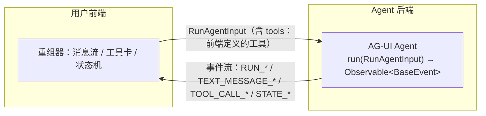
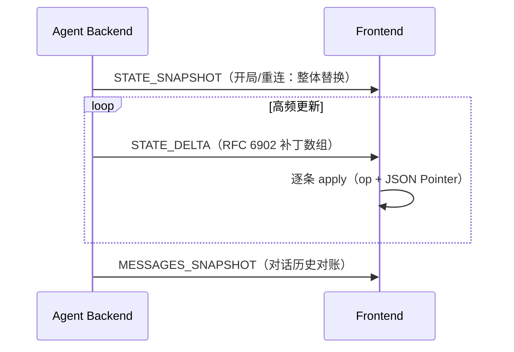

> **在哪一层**：层 4 · 行动与协作 ｜ **上一层出口**：能构建可追溯的检索链和更新路径 ｜ **本层出口**：能把一个 Agent 后端的事件流接进前端并正确重组状态，知道它与「直接吐 SSE」和 A2UI 的分工
> **前置**：[协议地图](index.md) ｜ **下一步**：[A2UI 与 MCP Apps](a2ui-mcp-apps.md)

## 1. 概述

**结论先讲**：AG-UI（Agent–User Interaction Protocol）是**开放、轻量、基于事件**的协议，标准化「面向用户的前端应用 ↔ 任意 Agent 后端」的双向连接。它解决的问题是：每个团队都在用私有 SSE/WebSocket 格式把 Agent 输出推给前端，前端每接一个后端就要重写一次解析。AG-UI 把这些事件标准化——生命周期、文本增量、工具调用、状态同步、中断——前端一次实现，处处可接。

> **与 A2UI 的区别（官方消歧）**：名字相近但不同层。A2UI 是生成式 UI **规范**（Agent 交付 UI 组件描述）；AG-UI 是 Agent↔用户应用的**交互协议**（连接与事件语义）。二者可以搭配：AG-UI 负责传，A2UI 负责传什么 UI。（见 [A2UI 与 MCP Apps](a2ui-mcp-apps.md)）

### 心智模型：一条事件流，两端各取所需



- **核心抽象**：`run(input: RunAgentInput) -> Observable<BaseEvent>`；标准 HTTP 客户端 `HttpAgent` 向任意「接受 POST `RunAgentInput`、返回 `BaseEvent` 流」的端点发起调用。
- **传输不绑定**：SSE、webhook、WebSocket、HTTP binary 都行——AG-UI 规范的是**事件语义**，不是管道。
- **三方互补**（官方定位）：MCP 连接 Agent↔工具/数据；A2A 连接 Agent↔Agent；AG-UI 连接 Agent↔用户（经用户应用）。一个 Agent 可以同时用三个。

### 事件族（以 docs.ag-ui.com 为准）

| 事件族 | 事件 | 关键字段 |
| --- | --- | --- |
| 生命周期 | `RUN_STARTED` / `RUN_FINISHED` / `RUN_ERROR`；`STEP_STARTED` / `STEP_FINISHED` | `threadId`、`runId`（`parentRunId` 支持分支/时间旅行）、`stepName` |
| 文本消息 | `TEXT_MESSAGE_START` / `TEXT_MESSAGE_CONTENT` / `TEXT_MESSAGE_END` | `messageId`、`role`（developer/system/assistant/user/tool）、`delta`（非空增量） |
| 工具调用 | `TOOL_CALL_START` / `TOOL_CALL_ARGS` / `TOOL_CALL_END`；`TOOL_CALL_RESULT` | `toolCallId`、`toolCallName`、`parentMessageId`、参数 `delta`（JSON 片段） |
| 状态管理 | `STATE_SNAPSHOT` / `STATE_DELTA` / `MESSAGES_SNAPSHOT` | `snapshot`（全量替换）；`delta` = RFC 6902 JSON Patch 数组 |
| 活动 | `ACTIVITY_SNAPSHOT` / `ACTIVITY_DELTA` | `messageId`、`activityType`（如 PLAN/SEARCH）、结构化 `content` |
| 特殊 | `RAW` / `CUSTOM` | 原样透传 / 自定义命名事件 |

所有事件继承 `BaseEvent`：`type`（必有）、可选 `timestamp`、`rawEvent`、`metadata`；多数事件可带 `subagentRunId` 标注产出者（子 Agent 归因）。

**状态同步语义**（前端最容易做错的部分）：

- `STATE_SNAPSHOT`：**整体替换**本地状态——用于开局、断线重连、重大重置。
- `STATE_DELTA`：只发变化，前端按 RFC 6902 JSON Patch（op: add/remove/replace/move/copy/test + JSON Pointer 路径）应用——用于高频小更新。

### 何时使用 / 何时不用

- 用：把 Agent 接进聊天/工作台类前端；需要流式文本 + 工具调用可见性 + 前端状态镜像；需要人类在环（中断/恢复、前端工具审批）。
- 不用：Agent ↔ 工具（→ [MCP](mcp.md)）；Agent ↔ Agent（→ [A2A](a2a.md)）；编辑器 ↔ 编码 Agent（→ [ACP](acp-agent-client.md)）；只交付静态 UI 组件描述（→ [A2UI](a2ui-mcp-apps.md)，可与 AG-UI 组合）。

### 决策表：AG-UI vs 「直接 SSE 吐 token」

| 维度 | 直接 SSE（私有格式） | **AG-UI** |
| --- | --- | --- |
| 方向 | 后端→前端单向为主 | 双向：`RunAgentInput`（含前端工具）+ 事件流 |
| 语义 | 每家自定义：文本、进度、错误混在一串字符串 | 标准事件族：生命周期/文本/工具/状态/中断各有类型 |
| 状态 | 前端自己猜怎么拼 | SNAPSHOT/Delta(JSON Patch) 显式同步 |
| 中断/恢复 | 自造协议 | Run 以 interrupt 结束 + 新 Run 携带 `resume[]` 回答 |
| 前端成本 | 每换一个后端重写解析 | 一次实现，接任意兼容后端 |

### 历史版本里程碑

官方文档未标注协议版本号（2026-09-01 检索）；事件类型与 `RunFinished.outcome`、`resume` 等语义以 docs.ag-ui.com 当前页为准，`drafts/` 目录公示未定稿变更。更早历史与发布日期：未验证。

### 本章 DoD 自检

- [ ] 15 分钟跑通 §2 fixture（SSE mock + 状态重组客户端）
- [ ] 能说出 SNAPSHOT 与 Delta 的应用规则差别
- [ ] 能解释 RUN_STARTED→RUN_FINISHED 之间允许出现哪些事件族
- [ ] 能描述中断（interrupt）后新 Run 如何携带 `resume[]` 恢复

## 2. 使用

**最小实战**：一个 SSE mock 发 AG-UI 风格事件序列，一个客户端解析并重组消息与状态。Node ≥ 18，零依赖，无 API key。
（说明：真实 `HttpAgent` 用 **POST** `RunAgentInput` 拿事件流；fixture 用 GET 简化握手，事件负载格式不变。标 fixture。）

`agui-agent.mjs`（事件流 mock）：

```javascript fixture
// agui-agent.mjs — AG-UI 风格 SSE 事件流 mock（Node ≥ 18，零依赖）
import { createServer } from "node:http";

const ev = (o) => `data: ${JSON.stringify(o)}\n\n`;
const threadId = "thread_demo", runId = "run_1";

createServer((req, res) => {
  if (req.url !== "/agent") { res.writeHead(404); return res.end(); }
  res.writeHead(200, {
    "Content-Type": "text/event-stream",
    "Cache-Control": "no-cache",
    Connection: "keep-alive",
  });
  const push = (o) => res.write(ev(o));
  const wait = (ms) => new Promise((r) => setTimeout(r, ms));

  (async () => {
    push({ type: "RUN_STARTED", threadId, runId });
    await wait(50);
    // —— 文本消息流 ——
    push({ type: "TEXT_MESSAGE_START", messageId: "msg_1", role: "assistant" });
    for (const delta of ["整理需求…", "检索中…", "产出方案。"])
      push({ type: "TEXT_MESSAGE_CONTENT", messageId: "msg_1", delta }), await wait(50);
    push({ type: "TEXT_MESSAGE_END", messageId: "msg_1" });
    // —— 状态：先全量，再增量 ——
    push({ type: "STATE_SNAPSHOT",
      snapshot: { todos: ["parse input", "call tool"], done: 0 } });
    push({ type: "STATE_DELTA",
      delta: [{ op: "replace", path: "/done", value: 1 }] });
    // —— 工具调用（参数以 JSON 片段流式给出）——
    push({ type: "TOOL_CALL_START", toolCallId: "call_1", toolCallName: "search_docs" });
    push({ type: "TOOL_CALL_ARGS", toolCallId: "call_1", delta: '{"query":"a2a"}' });
    push({ type: "TOOL_CALL_END", toolCallId: "call_1" });
    await wait(50);
    push({ type: "RUN_FINISHED", threadId, runId });
    res.end();
  })();
}).listen(3124, "127.0.0.1", () => console.log("AG-UI mock on :3124/agent"));
```

`agui-client.mjs`（SSE 解析 + 消息/状态重组，含最小 JSON Patch 应用器）：

```javascript fixture
// agui-client.mjs — 解析 AG-UI 事件流并重组状态（Node ≥ 18，零依赖）
const messages = new Map(); // messageId -> {role, text}
let state = null;           // STATE_SNAPSHOT 整体替换；STATE_DELTA 打补丁

function applyPatch(doc, { op, path, value }) {
  const parts = path.split("/").filter(Boolean);
  let node = doc;
  for (let i = 0; i < parts.length - 1; i++) node = node[parts[i]];
  const key = parts.at(-1);
  if (op === "add" || op === "replace") node[key] = value;
  else if (op === "remove") delete node[key];
  return doc;
}

const onEvent = (e) => {
  switch (e.type) {
    case "RUN_STARTED":
      return console.log(`[run] started thread=${e.threadId} run=${e.runId}`);
    case "TEXT_MESSAGE_START":
      return messages.set(e.messageId, { role: e.role, text: "" });
    case "TEXT_MESSAGE_CONTENT":
      return messages.get(e.messageId).text += e.delta;
    case "TEXT_MESSAGE_END":
      return console.log(`[message] (${messages.get(e.messageId).role}) ${
        messages.get(e.messageId).text}`);
    case "STATE_SNAPSHOT":
      state = e.snapshot; // 整体替换
      return console.log("[state] snapshot", JSON.stringify(state));
    case "STATE_DELTA":
      for (const p of e.delta) applyPatch(state, p); // 逐个补丁
      return console.log("[state] after delta", JSON.stringify(state));
    case "TOOL_CALL_START":
      return console.log(`[tool] ${e.toolCallName}(${e.toolCallId}) …`);
    case "TOOL_CALL_ARGS":
      return console.log(`[tool] args chunk: ${e.delta}`);
    case "RUN_FINISHED":
      return console.log("[run] finished");
    case "RUN_ERROR":
      return console.log(`[run] ERROR ${e.message}`);
    default:
      console.log(`[event] ${e.type}`);
  }
};

const res = await fetch("http://127.0.0.1:3124/agent");
if (!res.ok || !res.headers.get("content-type")?.includes("text/event-stream"))
  throw new Error(`unexpected: ${res.status}`);
const reader = res.body.getReader();
const decoder = new TextDecoder();
let buf = "";
for (;;) {
  const { done, value } = await reader.read();
  if (done) break;
  buf += decoder.decode(value, { stream: true });
  const frames = buf.split("\n\n");
  buf = frames.pop(); // 最后一帧可能不完整，留给下一轮
  for (const f of frames) {
    const line = f.split("\n").find((l) => l.startsWith("data: "));
    if (line) onEvent(JSON.parse(line.slice(6)));
  }
}
if (!state || state.done !== 1) throw new Error("state not reconciled");
console.log("[verify] final state ok:", JSON.stringify(state));
```

**运行命令**（两个终端）：

```bash fixture
node agui-agent.mjs   # 终端 1
node agui-client.mjs  # 终端 2
```

**正常输出**：

```text fixture
[run] started thread=thread_demo run=run_1
[message] (assistant) 整理需求…检索中…产出方案。
[state] snapshot {"todos":["parse input","call tool"],"done":0}
[state] after delta {"todos":["parse input","call tool"],"done":1}
[tool] search_docs(call_1) …
[tool] args chunk: {"query":"a2a"}
[event] TOOL_CALL_END
[run] finished
[verify] final state ok: {"todos":["parse input","call tool"],"done":1}
```

**负例**：把 mock 中 `STATE_DELTA` 的 `path` 改成 `/missing/deep`——客户端 `applyPatch` 会在 `node[key]` 上把值写到 `undefined` 抛 `TypeError`，这正是真实前端需要在补丁应用处做防御与告警的点。
**验收命令**：客户端以 `[verify] final state ok:` 结尾且 `done === 1`。
**清理**：`Ctrl+C` 两终端，删除两个脚本。

### 场景矩阵

| 场景 | 输入 / 动作 | 输出 | 适用 | 不适用 |
| --- | --- | --- | --- | --- |
| 流式对话 | 普通 prompt | TEXT_MESSAGE_* 增量重组 | 聊天/报告生成 | 一次性 JSON 输出 |
| 状态镜像 | Agent 推 SNAPSHOT+Delta | 前端状态与后端一致 | 表单/看板类协同 | 无状态问答 |
| 工具可见 | TOOL_CALL_* 事件 | 工具卡 + 参数流 | 展示执行过程、审批 | — |
| 中断/恢复 | Run 以 `outcome:interrupt` 结束 | 新 Run 带 `resume[]` 回答 | HITL 审批、结构化输入 | 本 fixture 未实现 |
| 前端工具 | `RunAgentInput.tools` 传入定义 | Agent 回调前端执行 | UI 动作、审批工作流 | 本 fixture 未实现 |

## 3. 原理

### 运行模型与不变量

- **Run 边界**：一次 Run 以 `RUN_STARTED` 开始，以 `RUN_FINISHED`（成功）或 `RUN_ERROR`（失败）结束；`RunFinished` 可带 `outcome`（判别联合），其中 `type: "interrupt"` 携带 interrupts 列表——**中断是终态模型**：本 Run 结束，用户回答后由新 Run 的 `resume: [{interruptId, status, payload?}]` 链回上一 Run。
- **消息增量不变量**：同一 `messageId` 的 CONTENT 增量按序拼接等于该消息全文；换 `messageId` 即新消息。
- **工具双向性**：后端定义的工具留在后端；**前端定义的工具放在 `RunAgentInput.tools` 里传给 Agent**，Agent 调用回调前端执行——这是「审批、UI 动作」类 HITL 的通道。前端工具失败要用协议的 error 通道表达，否则成功与失败不可区分。
- **分支/时间旅行**：`RunStarted.parentRunId` 指向同线程内先前 Run，形成 append-only 日志。
- **传输**：官方 `HttpAgent` 支持 HTTP SSE（文本、易调试）与 HTTP binary（高性能）；协议本身传输无关。

### 状态同步（规范的深水区）



设计动机（官方）：snapshot 用于建立基线（开局、断线重连、大变更）；delta 省带宽（流式期间小改动、大状态对象）。前端实现要点：**先有基线再打补丁**、补丁应用要做防御（路径缺失不能崩）、重连后先强制 snapshot 再续 delta。

### 规范要求 vs 本地实测

| 断言 | 官方文档（docs.ag-ui.com） | 本地 fixture 实测 |
| --- | --- | --- |
| 事件类型枚举（六族） | events 页逐一定义 | mock 发出五族（Activity 未演示） |
| STATE_SNAPSHOT 整体替换 | 必须 | 一致 |
| STATE_DELTA = RFC 6902 补丁数组 | 必须 | 一致（最小 add/replace/remove 应用器） |
| SSE 帧格式 `data: {json}` | HttpAgent SSE 传输 | 一致 |
| 传输：POST RunAgentInput → 事件流 | HttpAgent 定义 | fixture 用 GET 简化（标 fixture） |
| interrupt + resume 语义 | interrupts 页 | 未实测 |
| `parentRunId` 分支 | events 页 | 未实测 |

## 4. 开发

### 集成要点

- **传输选择**：默认 SSE（可读、可抓包）；吞吐敏感再切 HTTP binary。
- **事件去重与顺序**：SSE 自身按序；binary/WebSocket 场景确认传输保序后再假设顺序。
- **重连策略**：断线后不要从旧 state 续 delta——重新触发 snapshot 基线，再接增量。
- **子 Agent 归因**：多 Agent 后端给事件带 `subagentRunId`，前端按归因分栏展示。
- **版本意识**：AG-UI 文档无版本号标注；升级前后 diff 官方 events 页与 `drafts/` 页。

### 调试 runbook

```markdown
### 症状 → 证据 → 处理 → 完成标准
**症状**：前端文本缺字/乱序
**证据**：抓包事件流；比对同一 messageId 的 CONTENT 序列与最终全文
**处理**：检查是否丢帧（SSE 缓冲/代理截断）；检查拼接是否按到达序而非字段序；TEXT_MESSAGE_END 才算定稿
**完成标准**：拼接文本与 MESSAGES_SNAPSHOT（若有）逐字一致
```

```markdown
### 症状 → 证据 → 处理 → 完成标准
**症状**：前端状态与后端不一致
**证据**：最后一条 STATE 事件是 snapshot 还是 delta；delta 的 path 是否命中现有结构
**处理**：缺失基线→先等/请求 snapshot；补丁路径异常→在 apply 处防御并上报，不静默吞掉；重连后强制重新快照
**完成标准**：重放完整事件序列后，前端状态与后端终态一致
```

```markdown
### 症状 → 证据 → 处理 → 完成标准
**症状**：RUN_ERROR 后界面卡在加载态
**证据**：是否收到 RUN_FINISHED 或 RUN_ERROR；RUN_STARTED 与终结事件是否配对
**处理**：前端把「收到任一终结事件」作为唯一加载态退出条件，并加超时兜底
**完成标准**：任何错误路径下加载态都能退出并展示 e.message/e.code
```

### 反模式清单

- 用 `RUN_STARTED` 后第一帧就渲染「成功」——Run 结果要看终结事件与 `outcome`。
- 对 delta 打补丁前没有 snapshot 基线（或重连后沿用旧基线）。
- 把前端工具失败塞进 `content` 而不用 error 通道——Agent 无法区分成败。
- 自定义事件不发 `CUSTOM` 而是复用既有类型加魔法字段——破坏消费方升级路径。

## 5. 资料库

### 四级阅读路线

- **Beginner**：官方 Overview（定位与三方互补图）→ 本页 §1。
- **Builder**：Events（事件族全表）→ Messages / Tools → 本页 fixture 加 `RunAgentInput.tools` 与前端工具回调。
- **Operator**：State Management（snapshot/delta 细则）→ Interrupts（HITL）→ Serialization（历史恢复/分支/压缩）。
- **Researcher**：Subagents（归因）→ Capabilities（能力发现）→ drafts/（未定稿提案跟踪）。

### 资源表

| 名称 | 层级 | canonical URL | 用途 | 支持的断言 | 下一步 |
| --- | --- | --- | --- | --- | --- |
| AG-UI Overview | L0 | https://docs.ag-ui.com/introduction | 协议定位、A2UI 消歧、MCP/A2A 互补 | 本页 §1 全部定位断言 | 读 agentic-protocols |
| Events | L0 | https://docs.ag-ui.com/concepts/events | 事件族与字段 SSOT | 事件表、BaseEvent、state 语义 | 实现重组器时对照 |
| Architecture | L1 | https://docs.ag-ui.com/concepts/architecture | run 抽象、HttpAgent、传输 | `RunAgentInput`→`Observable<BaseEvent>` | 换官方 SDK |
| MCP, A2A, and AG-UI | L1 | https://docs.ag-ui.com/agentic-protocols | 三协议互补与 handshake 说明 | 「一个 Agent 可同时用三个」 | 对照本仓 mcp/a2a 章 |
| Interrupts | L1 | https://docs.ag-ui.com/concepts/interrupts | HITL 中断/恢复语义 | outcome:interrupt + resume[] | 实现审批流前必读 |

以上条目均于 2026-09-01 检索。SDK 安装量/采用率：无官方数据，不写。

### 主动证伪与未决问题

- **证伪入口**：事件名/字段以 docs.ag-ui.com/concepts/events 当前页为准；不一致提 issue。
- 未决 1：协议无版本号标注，跨版本兼容策略未检索到——生产依赖前自行锁定文档快照。
- 未决 2：`drafts/` 中的 generative-ui 提案仍在演进，不作为既成能力引用。
- 未决 3：官方与 MCP/A2A 的「handshake」机制细节（announced 但未在本轮核验页面展开）——标未验证。

**learn-ai 到此为止**：事件契约、状态重组、可运行 fixture。**继续去哪**：流式传输基础（SSE 生命周期）→ 层 2 流式响应；UI 组件描述 → [A2UI 与 MCP Apps](a2ui-mcp-apps.md)；前端实现 → [生成式 UI](../02-inference-interface/ui)。
