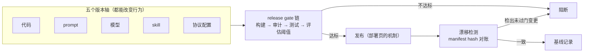

> **在哪一层**：Production 组 · 可靠运营 ｜ **上一层出口**：能限制权限、暂停/恢复任务 ｜ **本层出口**：能列出自己系统的五个版本轴，并对每轴回答「版本化什么 / 怎么回滚 / 怎么追溯」，且漂移可被机器检出
> **前置**：[部署与发布](deployment.md)（机制与回滚）、[评估（桥接）](evaluation.md)（门阈值）、[可观测性](observability.md)（trace 对账） ｜ **下一步**：[资料库](../../resources.md)（出层）

## 1. 概述

**结论先讲**：[部署与发布](deployment.md)回答「**怎么发**」——流水线、灰度、优雅关停；本页回答「**发的是什么**」。传统应用只有一个变更面（代码）；AI / Agent 系统有**五个**：代码、prompt、模型、skill、协议配置。每一轴都能独立改变系统行为，也就都能独立引发事故。AgentOps 的核心纪律只有一句话：**五个轴同样版本化、同样过门、同样可回滚**——任何一轴例外，它就会成为「改一句没人审的提示词，线上炸一片」的那个入口。

### 心智模型：五轴同过一道门



### 决策表：五个版本轴各答三问

| 轴 | 版本化什么 | 怎么回滚 | 怎么追溯 |
| --- | --- | --- | --- |
| 代码 | 行为逻辑：业务代码、校验器、执行器 | 切回上一构建/镜像 | git commit ↔ 构建号 ↔ 部署记录 |
| prompt | 行为规范：系统提示、任务指令、few-shot 样例 | 切回上一版目录（如 `v11/`） | manifest hash + trace 记录的 prompt 版本 |
| 模型 | 模型 ID、版本号、采样参数 | 改配置切回旧版本（分钟级） | trace 的模型属性（OTel `gen_ai.*`） |
| skill | 可复用知识资产：SKILL.md 与其引用文件 | 版本锁回退；skill 目录回滚 | skill 清单 hash + 变更评审记录 |
| 协议配置 | MCP server 列表、工具白名单、端点与开关 | 上一份配置重新下发 | 配置 diff + 白名单 hash 对账 |

### 何时使用 / 何时不用

- 用：任何有真实用户的 AI 功能——五轴里只要存在第二条轴（一定存在，至少有 prompt），本页的纪律就适用。
- 不用：纯本地一次性实验——但「密钥永不进版本」这条从第一行代码起就生效（见[部署与发布](deployment.md)的密钥注入）。

历史版本里程碑：本页为 2026-09 新增（Issue #116 Scope v6）；[部署与发布](deployment.md)已覆盖「代码/prompt/模型」三轴的回滚要点，本页把版本轴扩到五轴（新增 skill 与协议配置），并把「轴清单 + 漂移检测」上升为独立纪律。

## 2. 使用

最小实战：15 分钟、零 API key、Node 内置模块，做一个**五轴版本清单生成器**——扫描各轴目录产出 `manifest.json`（每个工件一条 sha256 指纹），`--check` 模式对账并演示「prompt 文件被改后告警」。

### 步骤 1：保存 `version-manifest.mjs`

```javascript
// version-manifest.mjs — 五轴版本清单生成器（零依赖，node >= 18）
import { createHash } from 'node:crypto';
import { readdirSync, readFileSync, writeFileSync, existsSync, statSync } from 'node:fs';
import { join, relative } from 'node:path';

// 五个版本轴 → 各自扫描的根目录。真实项目改成你的路径。
// 模型轴没有目录：它版本化的是配置文件本身（模型 ID 写在配置里，密钥写进环境变量）。
const AXES = [
  { axis: 'code',   roots: ['src'] },
  { axis: 'prompt', roots: ['prompts'] },
  { axis: 'skill',  roots: ['skills'] },
  { axis: 'model',  roots: [],            files: ['config/models.json'] },
  { axis: 'config', roots: ['config'],    files: [] },   // 协议配置轴：白名单/端点等
];
const MANIFEST = 'manifest.json';

function walk(dir, out = []) {
  if (!existsSync(dir)) return out;
  for (const name of readdirSync(dir)) {
    const full = join(dir, name);
    if (statSync(full).isDirectory()) walk(full, out);
    else out.push(full);
  }
  return out;
}

function fingerprint(path) {
  return {
    path: relative('.', path).split('\\').join('/'),
    sha256: createHash('sha256').update(readFileSync(path)).digest('hex').slice(0, 16),
  };
}

function current() {
  const axes = {};
  for (const { axis, roots = [], files = [] } of AXES) {
    const list = roots.flatMap((r) => walk(r)).concat(files.filter(existsSync));
    axes[axis] = Object.fromEntries(list.map(fingerprint).map((f) => [f.path, f.sha256]));
  }
  return axes;
}

if (process.argv.includes('--check')) {
  const was = JSON.parse(readFileSync(MANIFEST, 'utf8')).axes;
  const now = current();
  const drift = [];
  for (const { axis } of AXES) {
    const a = was[axis] ?? {}, b = now[axis] ?? {};
    for (const [p, h] of Object.entries(b))
      if (a[p] !== h) drift.push(`${axis}: ${p} ${a[p] ? `变更 ${a[p]} → ${h}` : `新增`}`);
    for (const p of Object.keys(a)) if (!(p in b)) drift.push(`${axis}: ${p} 删除`);
  }
  if (drift.length) {
    console.error(`DRIFT 检出 ${drift.length} 处（工件在门外被改）：\n  ${drift.join('\n  ')}`);
    process.exit(1); // 接 CI：非零退出码阻断发布
  }
  console.log('OK：五轴与 manifest 一致，无漂移');
} else {
  writeFileSync(MANIFEST, JSON.stringify({ axes: current() }, null, 2));
  const n = Object.values(current()).reduce((s, a) => s + Object.keys(a).length, 0);
  console.log(`manifest 写入 ${MANIFEST}：5 轴 ${n} 个工件`);
}
```

### 步骤 2：搭一个最小五轴目录并生成基线

```bash
mkdir -p src prompts skills config
echo 'console.log("app v1")' > src/app.mjs
echo '把工单分类为 billing / technical / other，只输出 JSON。' > prompts/classify.txt
echo '# triage skill v1：先看金额，再看模块。' > skills/triage.md
echo '{ "model": "provider/model-a", "modelVersion": "2026-08-01" }' > config/models.json
node version-manifest.mjs
```

正常输出：

```text
manifest 写入 manifest.json：5 轴 5 个工件
```

### 步骤 3：对账（一致路径）

```bash
node version-manifest.mjs --check
```

```text
OK：五轴与 manifest 一致，无漂移
```

退出码 0——这一步接进 CI 就是漂移门。

### 步骤 4：负例观察（prompt 被改，静默回归的起点）

模拟「有人绕过评审直接改了一句提示词」：

```bash
echo '把工单分类为 billing / tech / other，只输出 JSON。' > prompts/classify.txt
node version-manifest.mjs --check
```

stderr 打出告警、退出码 1：

```text
DRIFT 检出 1 处（工件在门外被改）：
  prompt: prompts/classify.txt 变更 0029e3fdca115cf0 → 15e47ef4bdec1c34
```

这就是**静默回归的机器可检出形态**：代码零改动、测试全绿，但行为已经变了——没有 manifest 对账，这次改动要到用户投诉才会被发现。（指纹值取决于文件字节内容，以本机实际输出为准。）

### 验收与清理

- 验收：能复现步骤 4 的 `DRIFT` 与退出码 1；能口头回答「五轴里哪一轴在你的项目里目前没有版本化，风险是什么」。
- 清理：删除演示目录与 `manifest.json`、`version-manifest.mjs`。

## 3. 原理

### 为什么是五个轴，而不是三个

[部署与发布](deployment.md)已确立代码/prompt/模型三轴。Agent 系统再添两轴：

- **skill 轴**：skill 是「打包进 agent 的流程知识」（SKILL.md + 引用文件 + 可执行脚本）。它不是代码（不走代码评审），也不是 prompt（不随每次调用手写）——但它的内容直接改变 agent 在相关任务上的行为。skill 的设计方明确把「evaluation first / versioning」列为开发准则（见资料库），理由与本页相同：**知识资产也是工件**。
- **协议配置轴**：MCP server 列表、工具白名单、端点开关。工具面变了等于能力边界变了——多接一个 server，攻击面与失败模式都随之改变（→[安全](security.md)）。这类配置散落在运行环境里最容易被「手动先改一下」。

### release gate 链：五轴一视同仁

门的机制在[部署与发布](deployment.md)（构建 → 审计 → 测试 → 评估阈值 → 灰度）；本页补的是**门的覆盖面**：

| 变更类型 | 走门形式 | 检测手段 |
| --- | --- | --- |
| 代码 | 常规 PR + CI | 构建、测试套件 |
| prompt | PR（prompt 入库如代码） | golden set 评估阈值（→[评估](evaluation.md)） |
| 模型 | 配置变更 PR | golden set 前后对比 + 双写切流 |
| skill | skill 仓库 PR + 版本锁 | skill 行为的专项评估集 |
| 协议配置 | 配置 PR + 白名单评审 | 白名单 hash 对账 + conformance 测试 |

多数「提示词事故」与「工具面事故」的根源不是没有门，而是**门只对代码轴生效**。

### 漂移检测：静默回归的对账逻辑

静默回归的定义：**代码没变、部署没发生，行为却变了**。五轴模型下它的来源几乎总在代码轴之外——prompt 被人改了、skill 被更新了、模型版本被厂商推进了、配置被手动调了。对账逻辑因此极简：给每轴工件算指纹（hash），「上次过门时的指纹」与「现在的指纹」逐轴比对，任何不一致都是漂移。指纹比对是**必要条件**而非充分：它抓「变了」，不抓「变坏了」——变坏要靠评估门，两者缺一不可。

### 配置与密钥的版本边界

- **配置进版本**：模型选择、路由开关、白名单、预算上限都是配置文件，入库、过门、可 diff。
- **密钥永不进版本**：凭据只经环境变量/密钥管理服务注入运行时（本仓全局规则）。manifest 也只记**文件指纹**，不记文件内容——指纹足以对账，内容才有泄漏风险。
- 判据一句话：**可以被 diff 和评审的是配置，必须被注入和轮换的是密钥**。两者混在同一文件里时，先拆开再谈版本化。

### 规范要求 vs 本地实测

本页无协议规范可实现测。「规范」侧为 OpenTelemetry GenAI 语义约定对 trace 属性的要求（如模型识别属性，Development 级）；「实测」侧为本页清单生成器行为（hash 稳定性、`--check` 退出码 0/1、增删改三类漂移均可检出）。

## 4. 开发

### 症状 → 证据 → 处理 → 完成标准

**症状**：输出质量突然下降，但本周没有任何代码发布。
**证据**：跑五轴 manifest 对账，定位漂移轴与具体工件；[可观测性](observability.md) trace 抽样确认行为变化的时间点与该工件改动时间吻合。
**处理**：按轴回滚——prompt 轴切回上一版目录；skill 轴解除版本锁回退；模型轴改回旧版本配置；协议配置轴下发上一份白名单。回滚后把该轴补进门（此前它在门外）。
**完成标准**：指标回到基线；事故记录含「哪一轴、漂移了什么、为什么没被门拦住」；该轴下次改动必走 PR + 评估。

### 症状 → 证据 → 处理 → 完成标准

**症状**：升级了一个 skill，agent 在相关任务上开始出错。
**证据**：skill 版本号/目录 hash 与上次评估通过时不一致；专项评估集上前后版本对比分数下滑。
**处理**：版本锁回退到旧 skill（skill 目录回滚，不改代码）；新版本留在预发，按失败案例补评估用例后再走门。skill 引用的脚本变更同样算 skill 轴变更。
**完成标准**：回退后评估分数恢复；skill 升级流程成文（版本锁 → 预发评估 → 门 → 灰度）。

### 症状 → 证据 → 处理 → 完成标准

**症状**：模型厂商推进了默认版本（或弃用旧版本），同一配置的行为悄然变化。
**证据**：trace 里记录的模型版本与配置声明不一致，或厂商状态公告确认版本变动；golden set 通过率下滑但五轴 manifest 全部一致——漂移在「轴外」，是供应商侧变更。
**处理**：配置里固定到显式版本号（不跟 `latest`）；切到新版本前按[部署与发布](deployment.md)的双写切流流程做新旧对比。
**完成标准**：配置中无隐式版本引用；厂商版本变更进入运行手册的监控项。

### 反模式清单

- **门只对代码生效**：五个轴里四个在门外——事故的期望值反而比传统应用更高。
- **prompt 活在代码字符串和聊天记录里**：没有文件就没有版本，没有版本就没有回滚。
- **密钥进配置文件「方便一下」**：配置要 diff、要入库、要给评审者看——密钥一条都不能满足。
- **manifest 记内容而不是指纹**：对账只需要 hash；记录内容等于给泄漏多留一份副本。
- **漂移检出后直接改 manifest 消音**：先问「这次变更该不该过门」，再更新基线；顺序反了门就形同虚设。

## 5. 资料库

四级阅读路线：

- **Beginner**：跑通本页清单生成器，复现一次 `DRIFT`；对着决策表说出自己系统的五轴各是什么。
- **Builder**：把五轴目录接进自己的仓库，`--check` 进 CI；prompt 与 skill 开始入库版本化。
- **Operator**：为 skill 升级与模型版本变更建运行手册条目；演练「漂移 → 定位轴 → 回滚」全流程。
- **Researcher**：读 OTel GenAI 语义约定与 Agent Skills 工程文，对照自己的门与清单补缺口。

### 资源表

| 名称 | 证据层级 | canonical URL | 用途 | 支持的断言 | 下一步 |
| --- | --- | --- | --- | --- | --- |
| 本仓部署工作流 | 内部工件 | https://github.com/zenHeart/learn-ai/blob/tech/.github/workflows/deploy.yml | 门 1 的活例 | 本仓以 CI 构建三组件后合并部署（retrievedAt 2026-09-01） | 按本页补五轴覆盖 |
| OpenTelemetry GenAI 语义约定 | L0（官方规范） | https://github.com/open-telemetry/semantic-conventions-genai | 模型轴追溯的属性命名 | `gen_ai.*` 属性集（Development 级，retrievedAt 2026-09-01） | [可观测性](observability.md) |
| Agent Skills 工程文 | L1（设计方一手） | https://www.anthropic.com/engineering/equipping-agents-for-the-real-world-with-agent-skills | skill 轴的版本化依据 | Skills 以文件目录为载体、开发准则强调 evaluation 与版本管理；2025-12 已发布为开放标准（retrievedAt 2026-09-01） | [Skills](../06-agent-systems/skills.md) |
| 部署与发布 | 内部章 | [deployment](deployment.md) | 三轴回滚与发布门机制 | — | 先读它再读本页 |

### 主动证伪与未决问题

- 证伪入口：如果你的系统 prompt 只有寥寥数条且从不改动、模型版本固定、无 skill 无外部工具，五轴会退化为一点五轴（代码 + 一份静态配置）——此时全套清单机制可以简化为「配置入库 + 密钥注入」两条。
- 未决：manifest 基线应存在哪（仓库内 vs CI 产物缓存）以及与部署工件的绑定方式，本仓尚无真实案例，待生产实践回填。
- 未决：数据轴（索引/记忆）不在五轴之内，沿用[部署与发布](deployment.md)的口径归[接地](../04-grounding/)的更新链路处理；若实践中数据变更事故频发，需评估是否升格为第六轴。

### learn-ai 到此为止 / 继续去哪

- 评估阈值与门的方法论：[evals](https://evals.zenheart.site/)。
- skill 的构建与使用：[Skills](../06-agent-systems/skills.md)；协议配置的选型：[协议地图](../07-interoperability/)。
- 出层资源索引：[资料库](../../resources.md)。
