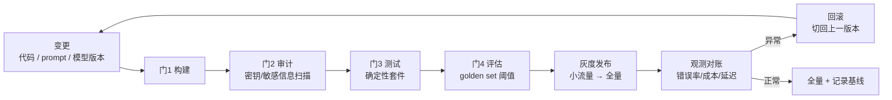

> **在哪一层**：层 5 · 可靠运营 ｜ **上一层出口**：能限制权限、暂停/恢复任务 ｜ **本层出口**：能定义发布门、回滚路径与运行责任人，并跑通健康检查与优雅关停
> **前置**：[测试](testing.md)、[评估（桥接）](evaluation.md)、[可观测性](observability.md)、[安全](security.md)、[成本与性能](cost-performance.md) ｜ **下一步**：[资料库](../../resources.md)（出层）

## 1. 概述

**结论先讲**：把「上线」当一次性事件，是 AI 应用最常见的运营事故源。发布应当是**一条带门的流水线 + 一套可执行的回滚**：每次变更过同一串门（构建 → 审计 → 测试 → 评估阈值），失败即拦；上线后出问题按预演过的路径切回上一版。AI 应用比传统应用多两个发布物——**prompt 与模型版本**——它们的回滚必须与代码同等便捷，否则「改一句提示词」就成了不可逆操作。

### 心智模型：发布是环，不是箭头



### 决策表：三种部署形态

| 形态 | 方向 | 控制权 | 状态 | 信任域 | 最低复杂度 |
| --- | --- | --- | --- | --- | --- |
| 无服务器函数 | 读写 | 平台调度，冷启动 | 请求级无状态 | 云厂商边界 | 一个函数 + 环境变量 |
| 容器（本仓 CI 形态） | 读写 | 你管镜像与编排 | 进程 + 健康检查 | 集群边界 | Dockerfile + 探针 |
| 专用 serving（自托管模型） | 读写 | 全自管（GPU/队列） | 显存/批处理状态 | 自有设施 | 运维团队 + 容量规划 |

调外部模型 API 的应用，前两形态足够；只有自托管推理（→[Learn LLM](https://llm.zenheart.site/) 的推理引擎知识）才需要第三形态。

### 何时使用 / 何时不用

- 用：任何有真实用户、需要值班与回滚的系统。
- 不用：本地实验与一次性脚本——但密钥环境注入这一条从第一行代码就该遵守。

历史版本里程碑：本页为 2026-09 新增（slug-map `deployment`，无旧页合并）；发布门链与本仓 `deploy.yml` 的 CI 形态对齐（构建 → 部署到静态托管），评估门是本页为 AI 应用补齐的增量。

## 2. 使用

最小实战：15 分钟、零 API key、Node 内置模块，实现**健康检查端点 + 优雅关停**——容器探活与滚动更新的最小前提。脚本自带确定性自检。

### 步骤 1：保存 `server.mjs`

```javascript
// server.mjs — 健康检查 + 优雅关停的最小 server（零依赖，node >= 18）
import http from 'node:http';
import assert from 'node:assert/strict';

let inFlight = 0;
let draining = false;

const server = http.createServer((req, res) => {
  if (req.url === '/healthz') {
    res.writeHead(200, { 'content-type': 'application/json' });
    res.end(JSON.stringify({ status: draining ? 'draining' : 'ok', inFlight }));
    return;
  }
  inFlight++;
  setTimeout(() => { res.writeHead(200); res.end('done'); inFlight--; }, 300); // 模拟一次生成请求
});

async function shutdown(reason) {
  draining = true; // healthz 立刻报 draining，负载均衡摘除本实例
  console.log(`收到 ${reason}：停止接新请求，等待在途完成（当前 ${inFlight}）`);
  server.close();
  const deadline = Date.now() + 5000; // 最多等 5s：悬挂请求不能拖住关停
  while (inFlight > 0 && Date.now() < deadline) {
    await new Promise((r) => setTimeout(r, 10));
  }
  console.log(`优雅关停完成: 在途 ${inFlight}${inFlight === 0 ? '' : '（超时放弃，记为待重试）'}`);
  process.exit(inFlight === 0 ? 0 : 1);
}
process.on('SIGTERM', () => shutdown('SIGTERM')); // 容器编排的默认终止信号
process.on('SIGINT', () => shutdown('SIGINT'));   // 本地 Ctrl+C

const PORT = 18080; // 演示端口，可改
server.listen(PORT, async () => {
  // ---- 确定性自检 ----
  const h = await (await fetch(`http://127.0.0.1:${PORT}/healthz`)).json();
  assert.equal(h.status, 'ok');
  const busy = fetch(`http://127.0.0.1:${PORT}/chat`); // 发起一个在途请求（不等待）
  await new Promise((r) => setTimeout(r, 20));
  const h2 = await (await fetch(`http://127.0.0.1:${PORT}/healthz`)).json();
  assert.equal(h2.inFlight, 1); // 在途计数可见 → 关停决策有依据
  await busy;
  await shutdown('self-check'); // 注：Windows 无法投递 SIGTERM，自检直接调用；Linux 容器里走上面的信号
});
```

### 步骤 2：运行

```bash
node server.mjs
```

### 步骤 3：正常输出（退出码 0）

```text
收到 self-check：停止接新请求，等待在途完成（当前 0）
优雅关停完成: 在途 0
```

### 步骤 4：负例观察（有在途请求时关停）

在 `await busy;` 之前插入 `await shutdown('mid-flight');` 再运行：日志显示「等待在途完成（当前 1）」后等它清零、正常退出——把 300ms 的模拟请求换成永不返回的请求（`new Promise(() => {})`），则 5 秒超时后以退出码 1 放弃。这演示了**关停必须有期限**，否则一次悬挂就卡死滚动更新。改回后恢复全绿。

### 验收与清理

- 验收：正常路径退出码 0；能口头回答「healthz 为什么要在 draining 时也返回（供 LB 摘除）与不能返回什么（5xx，会被当作崩溃）」。
- 清理：删除文件即可（演示端口释放）。

## 3. 原理

### 配置与密钥：环境注入，不进代码

- 密钥只经**环境变量/密钥管理服务**注入运行时（本仓全局规则：凭据绝不入可提交文件）；代码读 `process.env`，仓库里只有变量名清单。
- 模型选择、路由开关、预算上限同属配置——**换模型不改代码**是后面「双写切流」的前提。
- 密钥泄漏的检测与轮换流程见[安全](security.md) runbook 3。

### 发布门链

| 门 | 检查内容 | 失败动作 | 本仓对应 |
| --- | --- | --- | --- |
| 门 1 构建 | 产物可构建、类型通过 | 阻断 | `pnpm docs:build` / `pnpm ppt:build` |
| 门 2 审计 | 密钥/敏感信息扫描、依赖审计 | 阻断 | 泄漏检测（[安全](security.md)）+ 依赖供应链检查 |
| 门 3 测试 | 确定性套件全绿 | 阻断 | [测试](testing.md) 的 `node --test` / `vitest run` |
| 门 4 评估 | golden set 通过率 ≥ 阈值 | 阻断 | [评估（桥接）](evaluation.md) 的非零退出码 |
| 灰度门 | 小流量观测窗口内指标无异常 | 自动/手动切回 | 本页「灰度」 |

门的价值在**一视同仁**：改一行 prompt 与改一个模块走同一条链——多数「提示词事故」源于 prompt 被当成配置随手改。

### 回滚：AI 应用的三个版本轴

1. **代码**：常规 CI/CD 回滚（上一镜像/上一构建）。
2. **prompt**：prompt 入库版本化（如 `prompts/v12/classify.txt`），运行时按配置选版；回滚 = 切回 `v11`。
3. **模型**：模型版本是配置项；回滚 = 改配置发布，分钟级。**双写切流**：新模型先影子运行（结果不返回用户，只记录对比），[评估](evaluation.md)对比达标后按百分比切流（1% → 10% → 100%），异常即回切。

三个轴独立回滚的组合覆盖绝大多数事故；只有当**数据**（索引/记忆）也被改坏时才需要数据层恢复——那是[层 3](../04-grounding/) 的更新链路问题。

### 灰度与观测对账

灰度不是「少放点量」，是**带对账的少放点量**：切流前后对比错误率、成本、延迟三张看板（→[可观测性](observability.md)、[成本与性能](cost-performance.md)），异常自动回切。窗口内必须有人看数，否则灰度只是慢动作事故。

### 运行手册（谁负责什么）

| 事项 | 第一责任人 | 升级路径 |
| --- | --- | --- |
| 模型厂商 5xx/限流 | 值班工程师（切备用模型配置） | 平台负责人 |
| 成本熔断触发 | 值班工程师（查失控循环/攻击） | 安全 + 财务 |
| 质量劣化告警 | 功能 owner（回滚 prompt/模型） | 产品 |
| 密钥泄漏 | 安全 owner（轮换 + 排查） | 法务/合规 |

运行手册的验收不是「写了」而是**演练过**：每条至少一次桌面推演或真实触发记录。

### 规范要求 vs 本地实测

本页无协议规范；「规范」侧为容器编排的通用约定（SIGTERM 触发优雅关停、healthz 语义），「实测」侧为本页 server 的行为（draining 状态上报、在途清零后退出码 0、超时放弃退出码 1）。

## 4. 开发

### 症状 → 证据 → 处理 → 完成标准

**症状**：发布后错误率上升。
**证据**：灰度看板（错误率/成本/延迟）对比切流前后；trace 抽样定位失败集中在哪段（→[可观测性](observability.md)）。
**处理**：按版本轴回滚——先判变更属于代码/prompt/模型哪一轴，切回该轴上一版；数据轴问题另按层 3 恢复。
**完成标准**：指标回到基线区间；事故记录含「哪一轴、切了几分钟、学到了什么门该加严」。

### 症状 → 证据 → 处理 → 完成标准

**症状**：模型厂商大面积 5xx/限流，请求堆积。
**证据**：厂商状态页 + 自身错误率看板；堆积是否触发了重试风暴（请求量放大系数）。
**处理**：值班按运行手册切备用模型配置；重试加指数退避与上限；预算熔断确认在位（防重试烧钱，→[成本与性能](cost-performance.md)）。
**完成标准**：错误率回落；复盘补上「厂商故障预案」条目（备用模型、切换动作、验证命令）。

### 症状 → 证据 → 处理 → 完成标准

**症状**：滚动更新期间出现 502 / 请求被掐断。
**证据**：实例日志——旧实例在在途请求清空前被强杀（没等 SIGTERM 流程完成）；healthz 是否在 draining 时仍返回 200（供 LB 摘除）。
**处理**：按本页最小 server 的模式补优雅关停；编排侧确认 terminationGracePeriod 大于最长请求。
**完成标准**：下一次发布零 502；`kill -TERM` 手测可见「等待在途 → 清零退出」日志。

### 反模式清单

- **prompt 不版本化**：提示词散在代码字符串与聊天记录里，「改一句话」无法回滚。
- **门只对代码生效**：模型切换/参数调整绕过发布门——两个最高频的事故源恰好在门外。
- **灰度无人看数**：切了 10% 就去睡觉，窗口期异常没人回切。
- **回滚靠记忆**：「上次好的版本大概是周三那个」——版本轴必须可枚举可一键切。

## 5. 资料库

四级阅读路线：

- **Beginner**：跑通本页最小 server；理解发布环（门 → 灰度 → 对账 → 回滚）。
- **Builder**：给自己的仓库接门链（构建/审计/测试/评估阈值）；prompt 入库版本化。
- **Operator**：演练双写切流与故障切换；写运行手册并桌面推演每条升级路径。
- **Researcher**：读 OWASP LLM06（无限制消耗）与 NIST AI RMF 的 MANAGE 函数，对照自己的门与手册。

### 资源表

| 名称 | 证据层级 | canonical URL | 用途 | 支持的断言 | 下一步 |
| --- | --- | --- | --- | --- | --- |
| 本仓部署工作流 | 内部工件 | https://github.com/zenHeart/learn-ai/blob/tech/.github/workflows/deploy.yml | 门 1（构建→部署）的活例 | 本仓以 CI 构建三组件后合并部署（retrievedAt 2026-09-01） | 对照补门 2–4 |
| OWASP GenAI LLM Top 10 2026 | L0（官方清单） | https://genai.owasp.org/resource/owasp-genai-llm-top-10-2026/ | 门 2 的风险基线 | LLM06 Unbounded Consumption 对应预算熔断（retrievedAt 2026-09-01） | [安全](security.md) |
| NIST AI RMF | L0（官方框架） | https://www.nist.gov/itl/ai-risk-management-framework | 运行手册的治理框架 | 四函数中 MANAGE 对应处置与责任分配（retrievedAt 2026-09-01） | 读 AI 600-1 |
| OpenTelemetry GenAI 语义约定 | L0（官方规范） | https://github.com/open-telemetry/semantic-conventions-genai | 灰度对账的指标命名 | `gen_ai.usage.*` 等属性（Development 级，retrievedAt 2026-09-01） | [可观测性](observability.md) |

### 主动证伪与未决问题

- 证伪入口：如果你的系统变更频率极低（季度级）且无值班，全自动门链的维护成本可能超过其收益——手工检查单 + 版本轴依然不可省。
- 未决：双写切流在非幂等输出场景（创作类）的「达标」判据需要人工评审介入，自动化阈值如何与人工对账尚无本仓案例。

### learn-ai 到此为止 / 继续去哪

- 自托管推理引擎的部署与容量知识：[Learn LLM](https://llm.zenheart.site/)。
- 各门的详细工程：[测试](testing.md)、[评估（桥接）](evaluation.md)、[安全](security.md)、[成本与性能](cost-performance.md)。
- 出层后的完整资源索引：[资料库](../../resources.md)。
