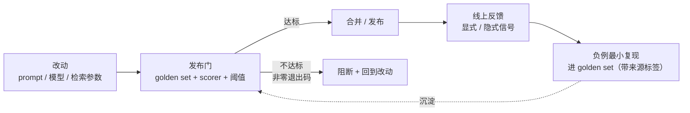

> **所在组**：Production ｜ **上一组出口**：能限制权限、暂停/恢复任务 ｜ **本组出口**：能判断何时需要评估证据，并把证据接入带阈值与阻断的发布门
> **前置**：[测试：确定性边界](testing.md) ｜ **下一步**：[部署与发布](deployment.md)（发布门落地点）；方法论继续去 [evals](https://evals.zenheart.site/)

## 1. 概述

**结论先讲**：本页是**桥接页**。评估（evaluation）回答「输出的质量好到什么程度」，其方法论——数据集构建、scorer 设计、LLM-as-judge、统计与红队——**全部由 [evals](https://evals.zenheart.site/) 拥有**。本仓只保留两个工程问题：**何时必须拿出评估证据**，以及**证据如何变成 CI 里可阻断发布的门**。这两个问题不解决，评估就只是报告，进不了交付链。

### 心智模型：证据接入点



门是闭环的中点：上线前的阻断靠它，上线后的回流养它（回流链路见「用户反馈闭环」）。

### 决策表：何时必须拿出评估证据

| 改动类型 | 测试够吗 | 需要评估吗 | 证据形态 |
| --- | --- | --- | --- |
| 校验器 / 执行器代码重构 | 够（确定性断言） | 不需要 | 全绿测试套件 |
| prompt 措辞 / 结构调整 | 不够 | 需要 | golden set 前后对比 + 阈值 |
| 换模型 / 换版本 | 不够 | 需要 | golden set + 分维度分数 + 方差 |
| 检索参数（chunk/topK/重排） | 不够 | 需要 | 检索命中 + 端到端联合评估 |
| 输出 schema 变更 | 部分够 | 兜底需要 | 测试（结构）+ 评估（内容质量） |

### 何时使用 / 何时不用

- 用：任何**影响输出质量**的改动要合并或发布之前。
- 不用：纯工程重构、UI 文案、不触碰生成路径的依赖升级——那是[测试](testing.md)的领地。

历史版本里程碑：本页 2026-09 由旧 `engineering/evals.md`、`evaluation/` 目录（含 Generative Benchmarking 摘要）收口为桥接页；benchmark 方法论细节归 evals 站。旧页曾指出「公开 benchmark 的强性能不能直接泛化到生产环境」（Chroma 研究摘要），该论点的完整论证与数据在 evals 站展开。

## 2. 使用

最小实战：15 分钟、零 API key，搭一个**门模式**的最小骨架——golden set 用录制件（recorded fixtures），scorer 用确定性断言。真实项目里把 scorer 换成 evals 站的方法，门骨架不变。

### 步骤 1：准备 golden set（录制件）

`golden.json`——每条 = 输入 + 期望断言（这里是录制好的真实输出）：

```json
[
  { "id": "g1", "input": "我的发票没收到", "expect": { "category": "billing" } },
  { "id": "g2", "input": "页面白屏了",      "expect": { "category": "technical" } },
  { "id": "g3", "input": "你们几点上班",    "expect": { "category": "other" } },
  { "id": "g4", "input": "退款多久到账",    "expect": { "category": "billing" } },
  { "id": "g5", "input": "登录报错 401",   "expect": { "category": "technical" } }
]
```

### 步骤 2：门脚本（scorer 占位为确定性断言）

`gate.mjs`——读 golden set，对每条跑**当前系统的输出解析**（此处用可替换的 `underTest` 函数模拟），统计通过率并与阈值比较：

```javascript
// gate.mjs — 门模式骨架：golden set + scorer + 阈值 + 阻断
import { readFileSync } from 'node:fs';

const THRESHOLD = 0.8; // 发布线：低于 80% 通过则阻断

// 被测系统的可替换入口。真实项目：调用你的 pipeline；
// 评估升级时：换成 evals 站的 scorer（judge / 语义匹配）。
async function underTest(input) {
  const map = {
    '我的发票没收到': { category: 'billing' },
    '页面白屏了':     { category: 'technical' },
    '你们几点上班':   { category: 'other' },
    '退款多久到账':   { category: 'billing' },
    '登录报错 401':  { category: 'technical' },
  };
  return map[input] ?? { category: 'unknown' };
}

const golden = JSON.parse(readFileSync(new URL('./golden.json', import.meta.url), 'utf8'));
const results = [];
for (const c of golden) {
  const got = await underTest(c.input);
  results.push({ id: c.id, pass: got.category === c.expect.category });
}
const rate = results.filter((r) => r.pass).length / results.length;

console.log(JSON.stringify({ threshold: THRESHOLD, passRate: rate,
  failures: results.filter((r) => !r.pass) }, null, 2));

if (rate < THRESHOLD) {
  console.error(`BLOCKED: pass rate ${rate} < threshold ${THRESHOLD}`);
  process.exit(1); // 阻断发布
}
```

### 步骤 3：运行与输出

```bash
node gate.mjs
```

正常输出（5/5 通过，退出码 0）：

```json
{
  "threshold": 0.8,
  "passRate": 1,
  "failures": []
}
```

负例输出（把 `underTest` 中一条映射改错，如白屏判成 `other`；0.8 恰在阈值边界，放行但失败被点名）：

```json
{
  "threshold": 0.8,
  "passRate": 0.8,
  "failures": [
    { "id": "g2", "pass": false }
  ]
}
```

再错一条（两条错 → 0.6，低于阈值）时：

```json
{
  "threshold": 0.8,
  "passRate": 0.6,
  "failures": [
    { "id": "g2", "pass": false },
    { "id": "g4", "pass": false }
  ]
}
```

随后 stderr 打出阻断行、退出码为 1：

```text
BLOCKED: pass rate 0.6 < threshold 0.8
```

退出码 1，CI 阻断——这就是「评估证据接入发布门」的全部机制。

### 验收与清理

- 验收：能制造一次 `BLOCKED`；能把阈值从 0.8 调到 0.6 后观察到放行（理解阈值即产品决策）。
- 清理：删除两个文件即可。

## 3. 原理

（本段刻意精简：scorer 设计、数据集抽样、judge 校准、统计功效**由 [evals 站](https://evals.zenheart.site/)拥有**，此处不复制。）

### 发布门的三要素

1. **golden set**：有代表性、带失败样本、随线上反馈增长的固定用例集（构建方法论 → evals 站 Golden Dataset 章）。
2. **scorer**：把一次输出映射为通过/失败或分数。确定性断言（本页示例）是 scorer 的退化形式；judge 与语义匹配是它的升级形式。
3. **阈值与阻断**：阈值是产品决策（宁可误杀还是放过），阻断靠非零退出码接进 CI——没有阻断的评估只是仪表。

### 证据分级

| 级别 | 形态 | 用途 |
| --- | --- | --- |
| 确定性断言 | schema/枚举/包含检查 | 回归门（本页示例） |
| 统计评估 | 分数 + 方差 + 显著性 | 模型/prompt 换代决策（→ evals 站） |
| 人工评审 | 抽样盲评 | 金标准与 judge 校准（→ evals 站） |

### 每层评什么：六个评估切面

「需要评估证据」的下一问是「评系统的哪一层」。同一个发布门可以接不同切面的证据，切面选错则分数与体感脱节：

| 切面 | 评什么 | 典型证据形态 | 边界与去向 |
| --- | --- | --- | --- |
| Model Eval（模型/推理） | 换模型、换版本后的基础能力与行为变化 | golden set 前后对比 + 分维度分数 + 方差 | 方法论 → evals 站模型评估章 |
| RAG Eval（检索接地） | 检索命中、忠实度、引用可追溯 | 命中率 + 端到端联合评估 | 方法论 → evals 站 RAG 章；工程侧 → [高级检索](../04-grounding/advanced-retrieval) |
| Tool Eval（工具行动） | 工具选择与参数正确性、失败路径行为 | 调用轨迹断言 + 回放 fixture | 可断言部分下沉[测试](testing.md)；概率部分 → evals 站 |
| Agent Eval（多步任务） | 任务成功率、步数效率、单位任务成本 | 端到端任务集 + trace 对账 | 方法论 → evals 站 Agent 章；轨迹 → [可观测性](observability.md) |
| Protocol Eval（协议一致性） | 实现是否符合 MCP/A2A 契约 | 规范方 TCK/校验器 | 属 conformance 测试（见下文该节），不属评估方法论 |
| App Eval（应用整体） | 用户可感质量与业务指标 | 线上指标 + 抽样人评 + A/B | 线上信号入口 → 用户反馈闭环（见下文该节） |

### 用户反馈闭环：从线上信号到下一版

发布门管**上线前**，反馈闭环管**上线后**——两者拼起来才是完整的数据飞轮。链路四步：

1. **采集反馈信号**：显式（点赞/点踩、用户改写、坐席修正）与隐式（重试、放弃、转人工、答案采纳率）两类。隐式信号量大但偏置强——愿意点踩的用户不代表全体，采样时要分层。采集点在[可观测性](observability.md)的 trace 与产品埋点，不另起炉灶。
2. **信号变成数据**：负例提炼为**最小复现**进 golden set（带来源标签：渠道/日期/场景），聚类去重防止高频场景淹没长尾。纪律是「每条最小化」——倾倒整段聊天记录进 set 等于污染它。
3. **数据驱动迭代**：三条出路按成本排序——prompt 措辞/结构（最便宜，走本页发布门验证）；检索与上下文修正（中，回[检索组](../04-grounding/)）；模型换代或微调（最贵，需统计级评估 + [Learn LLM](https://llm.zenheart.site/) 的训练知识）。
4. **回到同一个门验证**：无论改哪个切面，下一版仍过同一个发布门——闭环的出口不是「上线」，是「过门」。

闭环的健康指标：golden set 月度增长率、负例回流时延（线上发现→进 set 的天数）、回流案例修复率。参照结构：Chip Huyen《AI 工程》第 10 章把这一闭环组织为「反馈信号分析 → 数据迭代」（此处仅作结构参照，方法论细节归 [evals](https://evals.zenheart.site/) 站）。

### 协议的 conformance 测试

对协议类系统（MCP/A2A 等），「评估」的具体形态是**契约一致性（conformance）测试**——用规范方的 TCK/校验器验证实现，这属于[测试](testing.md)与各协议章的领地（如 [A2A 章](../07-interoperability/a2a)的规范一致性小节），不属评估方法论。

### 规范要求 vs 本地实测

本页无外部规范可实现测；实测仅为门骨架行为（退出码 0/1 与阈值比较），见「使用」段。

## 4. 开发

（集成细节以门骨架为准；评估器选型与调参归 evals 站。）

### 症状 → 证据 → 处理 → 完成标准

**症状**：golden set 全过，上线后质量却变差。
**证据**：golden set 覆盖分布与真实流量分布对比——新场景/长尾输入在 set 中占比为零。
**处理**：把线上负例按[可观测性](observability.md)的 trace 抽样回流进 golden set；给 set 加「来源标签」跟踪覆盖率。
**完成标准**：下一个版本发布前，set 中含最近两周线上负例的最小复现。

### 症状 → 证据 → 处理 → 完成标准

**症状**：同一版本跑两遍门，一次过一次不过（评估抖动）。
**证据**：分数方差大；失败用例集中在 judge 边界案例。
**处理**：区分来源——确定性断言抖动说明被测代码非确定（修代码）；judge 抖动按 evals 站的校准流程处理（多次采样/校准/换级）。
**完成标准**：连续 N 次运行方差在声明范围内；门对「真回归」与「抖动」的处置路径分别成文。

### 症状 → 证据 → 处理 → 完成标准

**症状**：团队争论阈值该定 0.8 还是 0.95，僵持。
**证据**：双方都没有「当前线上真实通过率」的基线数——阈值在真空里讨论。
**处理**：先测当前生产版本在 golden set 上的通过率，以此为基线，新版本只允许「不低于基线 − ε」。
**完成标准**：阈值表述为「相对基线的允许回退量」，基线数随版本记录在案。

### 症状 → 证据 → 处理 → 完成标准

**症状**：上线三个月，golden set 一条没涨，评估永远绿灯。
**证据**：set 的提交历史最后变更日期停在上线周；线上负例（客诉、转人工记录）与 set 条目对账为零交集。
**处理**：建立回流例程——每周从[可观测性](observability.md)的 trace 抽样负例，提炼最小复现进 set（带来源标签）；给「负例回流时延」定上限（如 7 天）。
**完成标准**：set 月度增长率大于零；最近一次发布门跑过的 set 含上月线上负例的最小复现。

### 反模式清单

- **报告式评估**：出了分数但无阻断、无回流——评估没有进入交付链。
- **一次性数据集**：set 建于上线前，此后不再增长，长期与流量脱节。
- **在 learn-ai 里复制方法论**：judge 提示词、统计公式在本仓二次维护必然漂移——指向 evals 站。

## 5. 资料库

四级阅读路线：

- **Beginner**：跑通本页门骨架；理解「证据 = 可阻断」。
- **Builder**：给自己的系统建首个 golden set（先 20 条，含负例），接进 CI。
- **Operator**：建立负例回流机制（用户反馈闭环）；按基线管理阈值；记录每版的门结果。
- **Researcher**：进 [evals](https://evals.zenheart.site/) 读方法论全文（数据集/judge/统计/红队）。

### 资源表

| 名称 | 证据层级 | canonical URL | 用途 | 支持的断言 | 下一步 |
| --- | --- | --- | --- | --- | --- |
| evals 站 | sibling（跨仓 owner） | https://evals.zenheart.site/ | 评估方法论唯一 owner | bridge-register 冻结分工：本仓只保留发布门接入（2026-09-01） | 其 RAG/Agent Eval、Golden Dataset、CI/CD 章 |
| bridge-register（evals 节） | 内部工件 | https://github.com/zenHeart/learn-ai/blob/tech/_phase0/bridge-register.md | 停止点登记 | 「何时需要证据 + 上线门接入」边界（2026-09-01） | — |
| 测试：确定性边界 | 内部章 | [testing](testing.md) | 确定性/概率性分界 | — | 先读它再读本页 |
| A2A 章（conformance） | 内部章 | [../07-interoperability/a2a](../07-interoperability/a2a) | 协议一致性测试形态 | TCK 与 conformance 属协议章 | — |

### 主动证伪与未决问题

- 证伪入口：如果你能把某类「质量判断」完全写成确定性断言（如温度 0 下输出稳定），它应下沉到[测试](testing.md)——桥接页的边界随之收窄。
- 未决：门结果与线上指标的长期对账（门过了但线上跌了多少）需要真实运营数据，待本仓案例回填。

### learn-ai 到此为止 / 继续去哪

- 一切评估方法论：[evals](https://evals.zenheart.site/)（本页刻意不展开）。
- 门的工程落地点（发布门链、阻断与回滚）：[部署与发布](deployment.md)。
- 出组资源索引：[资料库](../../resources.md)。
