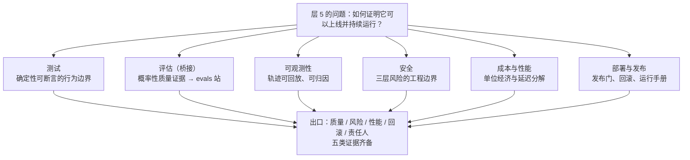

> **在哪一层**：层 5 · 可靠运营 ｜ **上一层出口**：能限制权限、暂停/恢复任务 ｜ **本层出口**：能用可回放证据说明质量、风险、性能、回滚和责任人
> **前置**：[恢复与人工批准](../06-agent-systems/recovery-hitl) ｜ **下一步**：[测试](testing.md)、[评估（桥接）](evaluation.md)、[可观测性](observability.md)、[安全](security.md)、[成本与性能](cost-performance.md)、[部署与发布](deployment.md)，出层后进[资料库](../../resources.md)

## 1. 概述

**结论先讲**：「功能已跑通」与「可以上线运营」之间隔着一整层工作。演示只需要一次成功；运营需要**可回放的证据**——出问题时能重放当时发生了什么、改动前能预测影响、故障时有明确的责任人和回滚路径。本层把前四层散落的工程手段收口为五类上线证据：质量、风险、性能、回滚、责任人。

### 心智模型：六条证据链

六条链不是六道顺序工序，而是同一批工件的六个切面：一条 trace 既是观测证据，也是成本证据，也是事故回放的素材。

### 症状路由表

| 症状（「功能已跑但……」） | 去哪章 | 那章给你的证据 |
| --- | --- | --- |
| 改一处 prompt，不知道坏了什么 | [测试](testing.md) | 确定性测试金字塔：改动的可断言影响面 |
| 「变好/变坏」只能靠感觉说 | [评估（桥接）](evaluation.md) | golden set + 阈值的发布门（方法论 → evals 站） |
| 线上出问题，只能看零散日志猜 | [可观测性](observability.md) | trace/span + correlation ID 的可回放轨迹 |
| 担心注入、越权、泄露，但只有「模型会拒绝」 | [安全](security.md) | 输入过滤 + 权限边界 + 输出扫描的组合防线 |
| 月账单和 P95 延迟没人能解释 | [成本与性能](cost-performance.md) | 每请求成本追踪 + 延迟分解 + 优化阶梯 |
| 发布靠手动拷贝，回滚靠记忆 | [部署与发布](deployment.md) | 发布门链、版本化回滚、运行手册 |

### 决策表：五类证据的取证方式对比

| 证据类型 | 方向 | 控制权 | 状态 | 信任域 | 最低复杂度 |
| --- | --- | --- | --- | --- | --- |
| 质量（测试 + 评估） | 读 | 你写断言/数据集 | fixture + golden set | CI 进程内 | 一个 node:test 文件 |
| 风险（安全） | 读写 | 过滤器 + 权限边界 + 审计 | 规则 + 审计日志 | 应用信任域 | 一层输入/输出过滤 |
| 性能（成本 + 延迟） | 读 | 采样与预算配置 | 时序指标 | 观测后端 | 每请求 usage 记账 |
| 回滚（部署） | 写 | 版本 + 切流开关 | 版本化工件 | 部署信任域 | 版本号 + 双写开关 |
| 责任人（运行手册） | — | 值班表 + 升级路径 | 文档 + 告警路由 | 组织 | 一页谁负责什么 |

### 横切声明

安全、成本、观测**不是本层才出现的话题**：权限边界在[工具执行](../05-action/tool-execution)就已引入，token 用量在[模型 API](../02-inference-interface/model-api) 的 usage 字段就已返回，脱敏在[上下文工程](../03-context/context-engineering)就要考虑。层 1–4 在各自场景里就地处理这些关注点；**层 5 把它们收口为系统性的上线证据**——不再是「某处做对了」，而是「处处可证明」。

### 何时使用 / 何时不用

- 用：任何要越过「个人 demo」进入「有用户、有值班、有账单」的系统。
- 不用：一次性脚本、本地实验、学习性玩具——为它们建设五类证据是过度工程。判断依据见[复杂度决策阶梯](../00-map/complexity-ladder)。

历史版本里程碑：本层结构于 2026-09 随 Issue #116 冻结，由旧 `engineering/`（testing/evals/observability/security/cost-optimization）与 `testing/`、`evaluation/` 目录合并升级；更早来源未验证，不编造。

## 2. 使用

本页是路由层，无可运行代码产物；「使用」= 上线就绪自检演练（纸面即可，≤15 分钟）。验收标准：对你要上线的系统，五类证据全部能落到「具体工件 + 责任人」，写不出的一栏就是你的缺口。

### 演练：五问审计

对目标系统依次回答，记录「证据在哪（文件/看板/文档）」与「谁负责」：

1. **质量**：最近一次 prompt 改动，CI 里哪些测试跑了？评估分数变了多少？（→ [测试](testing.md) / [评估](evaluation.md)）
2. **风险**：一条注入 payload 打进输入端点，会被哪一层拦住？拦截记录在哪？（→ [安全](security.md)）
3. **性能**：随机挑一条昨天的线上请求，能在一分钟内找到它的 token 成本和各段耗时吗？（→ [可观测性](observability.md) / [成本与性能](cost-performance.md)）
4. **回滚**：当前版本的上一版是什么？切回去要执行哪几个动作？（→ [部署与发布](deployment.md)）
5. **责任人**：凌晨两点模型厂商 5xx，值班的人第一眼看哪个仪表盘、第一个动作是什么？（→ [部署与发布](deployment.md) 的运行手册）

### 使用边界

- 本层不教你「怎么写测试/怎么埋点」——那是六个子章的内容；本页只负责把症状路由到正确的证据链。
- 五类证据的**深度**按业务风险缩放：内部工具不需要金融级审计日志，但需要能回答上面五问的最低版本。

## 3. 原理

### 为什么「收口」发生在层 5

层 1–4 的每一层都以「跑通」为出口：schema 校验通过、端到端可取消、检索可追溯、权限可暂停恢复。但「跑通」是**单次属性**；运营要求的是**持续属性**——第一百次请求和第一次一样可靠，第七次改动和第一次一样可预测。把单次属性升级为持续属性的手段就是证据化：

- 行为的可预测性 ← 测试 + 评估（改动前后可比）
- 故障的可解释性 ← 可观测性（轨迹可回放）
- 边界的可验证性 ← 安全（攻击路径有拦截记录）
- 资用的可核算性 ← 成本与性能（每请求可记账）
- 变更的可逆性 ← 部署（版本可切回）

### 可回放性是本层的统一不变量

五类证据共享同一个验收标准：**事后能重放**。测试可重跑、评估数据集可复现、trace 可导出重看、攻击样本可重放到过滤器、成本可按请求重算、版本可重新部署。任何「当时看到了、现在找不回」的观测都不算证据——这是区分真观测与「碰巧看见」的分界线。

### 与外部 owner 的分工

本层有两处刻意停止：评估方法论（数据集/scorer/judge/统计/红队）由 [evals](https://evals.zenheart.site/) 拥有，本仓只回答「何时需要证据、如何接入发布门」；模型对齐层的风险机理（reward hacking、越狱倾向）由 [Learn LLM](https://llm.zenheart.site/) 拥有，本仓只做应用侧工程。分工细节见 `_phase0/bridge-register.md`。

### 规范要求 vs 本地实测

本页是路由层，无规范可实现测；六个子章各自携带「规范 vs 实测」分栏（如 OTel GenAI 语义约定、OWASP 2026 清单、Vitest 版本要求）。

## 4. 开发

本页无代码集成；「开发」= 把五问审计用作上线评审门。

### 症状 → 证据 → 处理 → 完成标准

**症状**：评审被一句「你怎么证明它是对的？」打回，团队只能重演 demo。
**证据**：评审材料里没有五问审计表；改动历史与线上行为之间没有可对账的工件。
**处理**：填写五问审计，任何答不出的一栏先补最低版本（一个测试文件、一条 trace、一页运行手册都算）。
**完成标准**：评审材料包含五问审计表，每栏有具体工件路径与责任人姓名。

### 症状 → 证据 → 处理 → 完成标准

**症状**：事故复盘写了三页，结论是「模型抽风」。
**证据**：事故时间窗内没有可导出的 trace；请求只有状态码日志，没有 token 用量与工具调用记录。
**处理**：按[可观测性](observability.md)补 correlation ID 贯穿与 span 记录；把「事故时间窗重放」写进复盘模板。
**完成标准**：下次同类事故，复盘第一步是导出时间窗内 trace，而不是翻聊天记录。

### 症状 → 证据 → 处理 → 完成标准

**症状**：账单翻倍，没人知道是哪个功能、哪个用户、哪类请求造成的。
**证据**：成本只有厂商月账单一个数字；没有按请求/按功能维度的 usage 记账。
**处理**：按[成本与性能](cost-performance.md)建立每请求成本追踪（usage 字段 → 记录 → 聚合），先有分解再谈优化。
**完成标准**：能把当月成本拆到「功能 × 模型 × 输入/输出/缓存」三个维度，并指出最大单项。

### 反模式清单

- **证据表演**：为了过评审临时拼凑截图与数字，事后不可重放——这是「看似成功但证据不足」在层 5 的形态。
- **五链全上**：内部工具配上金融级审计与全量 trace 采样，把证据成本做成了新的运营负担。
- **证据与系统脱钩**：测试跑在 mock 上、trace 只在 staging 开——生产路径恰恰没有覆盖。

## 5. 资料库

四级阅读路线：

- **Beginner**：读本页症状路由表，对自己的系统做一次五问审计，找出最大缺口。
- **Builder**：进 [测试](testing.md) 与[可观测性](observability.md)——两条最先产生复利的证据链（改动安全 + 故障可解释）。
- **Operator**：进 [安全](security.md)、[成本与性能](cost-performance.md)、[部署与发布](deployment.md)，把风险、账单与回滚纳入日常。
- **Researcher**：读下面 L0/L1 级规范（OWASP、NIST、OTel），理解业界对「可靠 AI 运营」的框架化表达。

### 资源表

| 名称 | 证据层级 | canonical URL | 用途 | 支持的断言 | 下一步 |
| --- | --- | --- | --- | --- | --- |
| OWASP GenAI LLM Top 10 2026 | L0（官方清单） | https://genai.owasp.org/resource/owasp-genai-llm-top-10-2026/ | 风险证据的业界基线 | 2026-08-04 发布，风险排序基于 7,714 起真实事故语料（retrievedAt 2026-09-01） | [安全](security.md) |
| NIST AI RMF 1.0 | L0（官方框架） | https://www.nist.gov/itl/ai-risk-management-framework | 治理层风险管理的志愿框架 | 2023-01-26 发布，自愿采用；生成式 AI Profile（NIST AI 600-1）2024-07-26 发布（retrievedAt 2026-09-01） | [安全](security.md) 治理节 |
| OpenTelemetry GenAI 语义约定 | L0（官方规范） | https://github.com/open-telemetry/semantic-conventions-genai | 观测证据的属性命名基线 | GenAI 约定 2026-06 迁入独立仓库，覆盖 GenAI 客户端/MCP/厂商特定约定（retrievedAt 2026-09-01） | [可观测性](observability.md) |
| evals 站 | sibling（跨仓 owner） | https://evals.zenheart.site/ | 评估方法论唯一 owner | 本仓只保留发布门接入（bridge-register 2026-09-01） | [评估（桥接）](evaluation.md) |

### 主动证伪与未决问题

- 证伪入口：如果你找到一个「能稳定运营却缺五类证据之一」的真实系统，说明该类证据的必要性假设有漏洞——先检查它是否用了本表之外的等价证据形式，再考虑修订本层出口。
- 未决：六链深度如何按业务风险分级（哪些场景可以明确豁免哪类证据），待各子章运行手册积累案例后回填。

### learn-ai 到此为止 / 继续去哪

- 评估方法论、数据集构建、judge 与统计：[evals](https://evals.zenheart.site/)。
- 模型对齐与后训练如何影响风险行为：[Learn LLM](https://llm.zenheart.site/)。
- 出层之后的完整资源索引：[资料库](../../resources.md)。
