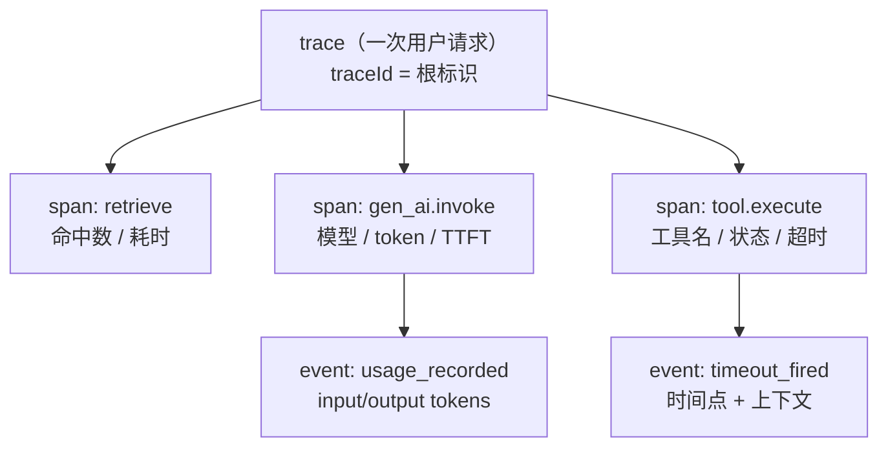

> **所在组**：Production ｜ **上一组出口**：能限制权限、暂停/恢复任务 ｜ **本组出口**：能让一次 AI 请求的完整轨迹可回放、可归因、可脱敏
> **前置**：[模型 API 契约](../02-inference-interface/model-api)（usage 字段）、[工具执行工程](../05-action/tool-execution) ｜ **下一步**：[成本与性能](cost-performance.md)（观测数据记账）、[部署与发布](deployment.md)（告警与运行手册）

## 1. 概述

**结论先讲**：传统软件记「请求进、响应出」就够，AI 应用不行——一次请求是「检索 → 生成 → 工具 → 再生成」的链，出错时你要回答**哪一段、什么输入、什么模型、花了多少 token**。可观测性就是把这棵执行树变成**事后可回放的轨迹**：trace（一次请求）→ span（一段操作）→ event（树内的时间点），外加贯穿全链的 correlation ID 与入库前的脱敏。

### 心智模型：trace → span → event



每棵树的根上拴着 correlation ID（messageId/taskId/traceId 任选一组贯穿），任何一段失败都能沿树定位到「哪个 span、什么输入、哪个模型、第几步」。

### 决策表：三种遥测信号对比

| 信号 | 方向 | 控制权 | 状态 | 信任域 | 最低复杂度 |
| --- | --- | --- | --- | --- | --- |
| 日志（log） | 读 | 你写每条 | 追加文件 | 日志后端 | `console.log` + 结构化 |
| 指标（metric） | 读 | 预定义聚合 | 时序序列 | 指标后端 | 一个计数器 |
| 轨迹（trace，本页主张） | 读 | span 埋点 | 树 + 因果 | 观测后端 | 最小 span 收集器（下文） |

AI 应用的失败归因大多是**结构问题**（哪一段、什么组合），不是单一数值问题——所以 trace 优先、指标从 trace 聚合、日志做 span 的补充。

### 何时使用 / 何时不用

- 用：任何多段链路（RAG、agent 循环、多工具编排）；需要成本归因（见[成本与性能](cost-performance.md)）的系统。
- 不用：单次无状态调用且无排障需求的脚本；trace 采样成本高于其价值的纯内部玩具。

历史版本里程碑：本页 2026-09 由旧 `engineering/observability.md`（TTFT/token 指标 + 工具代理思路）重写，并对齐 OpenTelemetry GenAI 语义约定的现状（见「原理」）。

## 2. 使用

最小实战：15 分钟、零 API key、Node 内置模块，实现一个最小 span 收集器——树状打印、耗时统计、correlation ID 贯穿、属性脱敏。

### 步骤 1：保存 `trace-demo.mjs`

```javascript
// trace-demo.mjs — 最小 span 收集器：树状输出 + 耗时统计 + 脱敏
// 命名式脱敏：按敏感键名模式匹配（api key/密码/各类凭据 token），
// 精确避开 gen_ai.usage.input_tokens 这类合法的「token 计数」属性。
const SENSITIVE = /(api_?key|secret|password|authorization|access_?token|refresh_?token|session_?token)/i;
const redact = (attrs) => Object.fromEntries(
  Object.entries(attrs).map(([k, v]) => [k, SENSITIVE.test(k) ? '[REDACTED]' : v]),
);

const spans = []; // 进程内收集；生产换 OTLP 导出
function startSpan(name, attrs = {}, parent = null) {
  const span = { name, attrs: redact(attrs), parentId: parent?.id ?? null,
    id: spans.length + 1, startedAt: process.hrtime.bigint(), status: 'ok', events: [] };
  spans.push(span);
  return span;
}
function endSpan(span, status = 'ok') {
  span.status = status;
  span.durationMs = Number(process.hrtime.bigint() - span.startedAt) / 1e6;
}
const addEvent = (span, name, attrs = {}) => span.events.push({ name, attrs: redact(attrs) });

// ---- 演示：一次带失败路径的请求轨迹 ----
const trace = { traceId: 'tr-' + Date.now().toString(36), messageId: 'msg-042' }; // correlation ID 组
const root = startSpan('chat.request', { ...trace });

const retrieve = startSpan('retrieve', { query: '发票 退款', topK: 3 }, root);
await new Promise((r) => setTimeout(r, 5));
addEvent(retrieve, 'hits_recorded', { hits: 2 });
endSpan(retrieve);

const invoke = startSpan('gen_ai.invoke',
  { 'gen_ai.request.model': 'demo-model', messageId: trace.messageId }, root);
await new Promise((r) => setTimeout(r, 8));
addEvent(invoke, 'usage_recorded',
  { 'gen_ai.usage.input_tokens': 1200, 'gen_ai.usage.output_tokens': 80 }); // OTel GenAI 属性名
endSpan(invoke);

const tool = startSpan('tool.execute', { tool: 'refund_api', args: { order: 'A1' } }, root);
await new Promise((r) => setTimeout(r, 12));
addEvent(tool, 'timeout_fired', { limitMs: 10 }); // 负例：工具超时
endSpan(tool, 'error');
endSpan(root, tool.status === 'error' ? 'error' : 'ok');

// ---- 树状输出 + 耗时统计 ----
const byParent = new Map();
for (const s of spans) byParent.set(s.parentId, [...(byParent.get(s.parentId) ?? []), s]);
const print = (span, depth = 0) => {
  console.log(`${'  '.repeat(depth)}${span.name} [${span.status}] ${span.durationMs.toFixed(1)}ms ${
    JSON.stringify(span.attrs)}`);
  span.events.forEach((e) => console.log(`${'  '.repeat(depth + 1)}· ${e.name} ${JSON.stringify(e.attrs)}`));
  (byParent.get(span.id) ?? []).forEach((c) => print(c, depth + 1));
};
print(root);
const total = spans.reduce((a, s) => a + s.durationMs, 0);
console.log(`spans=${spans.length} total=${total.toFixed(1)}ms errors=${
  spans.filter((s) => s.status === 'error').length}`);
```

### 步骤 2：运行

```bash
node trace-demo.mjs
```

### 步骤 3：正常输出（毫秒数随机器浮动，结构稳定）

```text
chat.request [error] 26.1ms {"traceId":"tr-mx8","messageId":"msg-042"}
  retrieve [ok] 5.3ms {"query":"发票 退款","topK":3}
    · hits_recorded {"hits":2}
  gen_ai.invoke [ok] 8.4ms {"gen_ai.request.model":"demo-model","messageId":"msg-042"}
    · usage_recorded {"gen_ai.usage.input_tokens":1200,"gen_ai.usage.output_tokens":80}
  tool.execute [error] 12.2ms {"tool":"refund_api","args":{"order":"A1"}}
    · timeout_fired {"limitMs":10}
spans=4 total=52.0ms errors=2
```

回放价值立刻可见：请求整体 error，但归因定位到 `tool.execute` 的超时，而模型调用本身正常。

### 步骤 4：负例验证（脱敏生效）

把 `gen_ai.invoke` 的属性改成 `{ 'gen_ai.request.model': 'demo', apiKey: 'sk-live-123' }` 重跑，输出中该字段显示 `"apiKey":"[REDACTED]"`——敏感属性在**入库前**被替换，日志与导出永远不见明文。

### 验收与清理

- 验收：输出树包含 4 个 span 与 2 层嵌套；错误状态沿树上传到根；脱敏负例生效。
- 清理：删除文件即可（进程内收集，无外部状态）。

## 3. 原理

### AI 特有信号清单

| 信号 | 来源 | 支持的归因 |
| --- | --- | --- |
| token 用量与成本 | 模型 API 的 usage 字段（[模型 API 契约](../02-inference-interface/model-api)） | 成本突增定位（→[成本与性能](cost-performance.md)） |
| 工具调用轨迹 | 工具执行 span（名、参数、状态、耗时） | 越权/超时/重试归因（→[工具执行](../05-action/tool-execution)） |
| 检索命中 | retrieve span 的 hits/分数 | 「答非所问」是检索问题还是生成问题 |
| agent 轨迹 | 循环每步一个 span（规划/执行/观察） | 多步任务在哪一步发散 |
| 幻觉信号 | 检索命中为空但输出笃定、引用与命中不匹配 | 忠实度问题的最小线索（验证归[评估](evaluation.md)） |
| TTFT / 吞吐 / 工具往返 | 流式首包与 span 时间戳 | 延迟分解（→[成本与性能](cost-performance.md)） |

### correlation ID 贯穿

一次用户消息从入口拿到标识（messageId；跨系统再加 taskId/traceId），此后**每个 span、每条日志、每次工具调用都携带它**。断链（某段 span 丢了 ID）等于那段执行在回放中失踪——这是下面 runbook 3 的病灶。

### 采样与脱敏

- **采样**：全量采集在成本上不可持续时，按 trace 采样（保错误、保慢、保随机基线），但**采样决定的是留多少，不是记什么**——属性设计不受采样影响。
- **脱敏**：密钥与个人数据在入库前替换（本页示例的 `redact`）；明文 prompt/补全默认不采集，确需采集时用开关显式打开（对应 OTel GenAI 的内容采集开关 `OTEL_INSTRUMENTATION_GENAI_CAPTURE_MESSAGE_CONTENT`）。

### 规范要求 vs 本地实测（OpenTelemetry GenAI 语义约定）

| 项 | 官方现状（2026-09-01 核验） | 本地实测（本页示例） |
| --- | --- | --- |
| 约定所在仓库 | 2026-06 随主仓库 v1.42.0 迁入独立仓库 `open-telemetry/semantic-conventions-genai`；旧 docs 页为迁移通告存根 | 自定义 span 名，未接 OTel SDK |
| 覆盖面 | GenAI 客户端、MCP、厂商特定约定的 spans/metrics/events | 覆盖 retrieve/invoke/tool 三类 span 的最小子集 |
| 属性命名 | `gen_ai.system`、`gen_ai.request.model`、`gen_ai.usage.*`、延迟类属性与 TTFT/TPOT 指标 | 演示采用同名属性（`gen_ai.request.model`、`gen_ai.usage.*`），为将来接 OTel 留兼容 |
| 成熟度 | 截至 2026 年中全部 genai.* 约定为 **Development** 稳定级，无已发布稳定时间表 | 视为命名参考而非硬契约；属性集可能变动 |

不重复 [Learn LLM](https://llm.zenheart.site/) 的模型内部机制；指标平台选型对比不在本仓范围。

## 4. 开发

### 症状 → 证据 → 处理 → 完成标准

**症状**：用户反馈「回答变差了」，无从下手。
**证据**：时间窗内导出 trace，按结果质量分组对比——差组的 retrieve span 命中数/命中分是否显著低于好组；差组的 `gen_ai.request.model` 是否混入了别的模型版本。
**处理**：命中数低 → 检索侧排查（索引更新/切块）；模型混杂 → 发布记录核对（→[部署与发布](deployment.md)）。
**完成标准**：给出「差在检索/生成/模型版本」之一的归因结论，附 trace 证据链。

### 症状 → 证据 → 处理 → 完成标准

**症状**：成本突增，但请求量没变。
**证据**：按 trace 聚合 token——input/output/缓存命中的分布变化；找出 input 均值暴涨的 span 模式（如某工具返回塞进上下文）。
**处理**：压缩该来源的上下文注入；给单请求 token 设上限并在超限时打 event。
**完成标准**：token 均值回落到基线区间；新增的上限 event 进入告警。

### 症状 → 证据 → 处理 → 完成标准

**症状**：回放时轨迹中间「断了一段」。
**证据**：断点前后 span 的 correlation ID 不一致（某异步分支没传 ID）或某组件根本没埋点。
**处理**：把 ID 提取到调用上下文强制传递（示例的 `parent` 链）；给未埋点的边界组件补最小 span。
**完成标准**：任取一条线上 trace，从入口到出口 ID 连续、无孤儿 span。

### 反模式清单

- **只记结果不记路径**：日志只有最终答案——回放时无法归因到段。
- **事后过滤敏感信息**：明文先落盘再清洗，泄漏已发生；脱敏必须在入库前。
- **观测与安全脱节**：trace 里的工具参数可能就是注入 payload 的现场证据（→[安全](security.md)），两边共享同一份脱敏规则。
- **指标孤立**：只有 P95 数字没有 trace，数字异常时仍要靠猜。

## 5. 资料库

四级阅读路线：

- **Beginner**：跑通本页收集器；理解 trace/span/event 与 correlation ID。
- **Builder**：把收集器接入自己的链路（retrieve/invoke/tool 三类 span 起步）；属性名对齐 OTel GenAI。
- **Operator**：定义采样策略与脱敏规则；建「时间窗导出 → 归因」的排障流程。
- **Researcher**：读 OTel GenAI 独立仓库的模型定义，跟踪 Development → Stable 的演进。

### 资源表

| 名称 | 证据层级 | canonical URL | 用途 | 支持的断言 | 下一步 |
| --- | --- | --- | --- | --- | --- |
| OpenTelemetry GenAI 语义约定（独立仓库） | L0（官方规范） | https://github.com/open-telemetry/semantic-conventions-genai | GenAI span/metric/event 命名基线 | 覆盖 GenAI 客户端、MCP 与厂商特定约定；扩展主仓库 semconv（retrievedAt 2026-09-01） | 读其 docs/ 目录 |
| OTel 语义约定旧文档页（迁移存根） | L0（官方） | https://opentelemetry.io/docs/specs/semconv/gen-ai/ | 迁移状态核对 | 页面为「已迁至独立仓库」通告，不再维护（retrievedAt 2026-09-01） | 以独立仓库为准 |
| OTel GenAI 稳定性状态分析 | L4（第三方分析） | https://praesidia.ai/blog/opentelemetry-genai-semantic-conventions-status | 采纳决策参考 | 截至 2026 年中 genai.* 均为 Development 级；2026-06 迁仓（retrievedAt 2026-09-01） | 评估是否暂缓硬依赖 |
| evals 站 | sibling（跨仓 owner） | https://evals.zenheart.site/ | 质量信号与评估的衔接 | 分工见 bridge-register（2026-09-01） | [评估（桥接）](evaluation.md) |

### 主动证伪与未决问题

- 证伪入口：如果你的系统单段、无状态、失败模式只有「调不通」，trace 的边际价值趋近于日志——降级为结构化日志即可，别维护 span 树。
- 未决：OTel GenAI 约定仍为 Development 级，属性集可能再动；本仓演示按当前命名对齐，硬契约化需等 Stable。

### learn-ai 到此为止 / 继续去哪

- 量化推理引擎（vLLM/SGLang）侧的指标与数学：[Learn LLM](https://llm.zenheart.site/)。
- 用观测数据做成本记账与延迟分解：[成本与性能](cost-performance.md)。
- 告警路由与值班手册：[部署与发布](deployment.md)。
