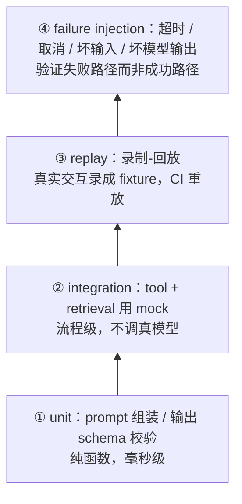

> **在哪一层**：层 5 · 可靠运营 ｜ **上一层出口**：能限制权限、暂停/恢复任务 ｜ **本层出口**：能为概率系统写出确定性测试，并说清哪些问题必须交给评估
> **前置**：[结构化输出](../02-inference-interface/structured-output)、[工具执行工程](../05-action/tool-execution) ｜ **下一步**：[评估（桥接）](evaluation.md)（概率性质量）、[可观测性](observability.md)（线上证据）

## 1. 概述

**结论先讲**：AI 应用不能整体确定性地测，但它**可以拆出确定性可测的边界**——输出校验器、工具执行的超时/取消/权限路径、prompt 组装逻辑、回放 fixture。把确定性部分交给测试（本页），把概率性质量交给评估（[评估桥接页](evaluation.md)，方法论归 [evals 站](https://evals.zenheart.site/)）。两者边界一句话：**能写出「给定输入必得出某断言」的用测试；只能写出「给定输入大概率更好」的用评估。**

### 心智模型：四级测试金字塔



越往上越接近真实、越贵越慢；**数量应越少**。①② 构成 CI 主力，③ 提供回归保护，④ 守住层 4 引入的失败模式（幂等、取消、超时）。

### 决策表：与相邻验证手段对比

| 手段 | 方向 | 控制权 | 状态 | 信任域 | 最低复杂度 |
| --- | --- | --- | --- | --- | --- |
| 确定性测试（本页） | 读 | 你写断言，全可控 | fixture 固定 | CI 进程内，零 key | 一个 node:test 文件 |
| 评估（evals） | 读 | 你定数据集与阈值，结果带方差 | golden set + 分数 | 评估站/CI 带 key | 一个 golden set + scorer |
| 手动验收 | 读 | 人的判断 | 无沉淀 | 个人记忆 | 一张截图 |
| 线上观测 | 读 | 被动采样 | 时序数据 | 生产流量 | 见[可观测性](observability.md) |

### 何时使用 / 何时不用

- 用：所有「你的代码」——校验器、执行器、组装器、编排逻辑；以及所有失败路径（超时、取消、坏输入）。
- 不用：模型输出的内容质量（→ 评估）；模型厂商 API 的可用性（→ 观测与部署的探活）；「模型今天心情好不好」。

### AI 特有的测试纪律

1. **快照测结构，不比内容**：对模型输出做 snapshot 时只断言 schema 形状（字段存在、类型对、枚举合法），不断言具体文字。
2. **fixture 固定且入库**：录制的请求/响应以文件入库，CI 永不依赖线上状态。
3. **无 key 测试**：CI 里用 mock provider（返回预置响应），真模型调用只出现在评估与手动验收。

历史版本里程碑：本页 2026-09 由旧 `engineering/testing.md` 与 `testing/` 目录（AI 自动化测试实践、MidScene UI 自动化）合并重写；工具案例移附录（他人负责）。Vitest 官方文档标注其要求 Vite >= v6.0.0 且 Node >= v20.0.0（retrievedAt 2026-09-01）；本页示例用 Node 内置 `node:test`，零依赖。

## 2. 使用

最小实战：15 分钟、零 API key、只用 Node 内置模块。覆盖金字塔的①（校验器）与④（故障注入）。

### 步骤 1：保存测试文件

把以下内容存为 `ai-deterministic.test.mjs`（自包含：被测代码 + 测试，真实项目中应拆开）：

```javascript
// ai-deterministic.test.mjs — node >= 20，零依赖，node --test 运行
import { test } from 'node:test';
import assert from 'node:assert/strict';

// ---- 被测 ①：结构化输出校验器（层 1 的失败验收落地）----
const CATEGORIES = ['billing', 'technical', 'other'];

export function validateClassification(raw) {
  let parsed;
  try {
    parsed = JSON.parse(raw);
  } catch {
    return { ok: false, errors: ['not_json'] };
  }
  const errors = [];
  if (typeof parsed !== 'object' || parsed === null) errors.push('not_object');
  else {
    if (!CATEGORIES.includes(parsed.category)) errors.push('bad_category');
    if (typeof parsed.confidence !== 'number'
        || parsed.confidence < 0 || parsed.confidence > 1) errors.push('bad_confidence');
    if (typeof parsed.reason !== 'string' || parsed.reason.length === 0) errors.push('bad_reason');
  }
  return errors.length ? { ok: false, errors } : { ok: true, value: parsed };
}

// ---- 被测 ②：工具执行器（层 4 的超时/取消/allowlist）----
export async function runTool(registry, name, args, { timeoutMs = 100, signal } = {}) {
  const tool = registry[name];
  if (!tool) return { ok: false, error: 'tool_not_allowed' };
  return await Promise.race([
    tool(args, signal),
    new Promise((resolve) =>
      setTimeout(() => resolve({ ok: false, error: 'timeout' }), timeoutMs).unref?.(),
    ),
  ]);
}

// ---- 测试：正常 + 负例，全部确定性 ----
test('校验器：合法输出通过', () => {
  const r = validateClassification('{"category":"billing","confidence":0.9,"reason":"发票问题"}');
  assert.equal(r.ok, true);
  assert.equal(r.value.category, 'billing');
});

test('校验器：非法 JSON 被拒', () => {
  assert.deepEqual(validateClassification('{oops'), { ok: false, errors: ['not_json'] });
});

test('校验器：越界置信度与未知类目被拒', () => {
  const r = validateClassification('{"category":"hack","confidence":7,"reason":"x"}');
  assert.equal(r.ok, false);
  assert.ok(r.errors.includes('bad_category'));
  assert.ok(r.errors.includes('bad_confidence'));
});

const registry = {
  echo: async (args) => ({ ok: true, output: args.text }),
  hang: () => new Promise(() => {}), // 永不返回：故障注入用
};

test('执行器：正常工具返回结果', async () => {
  const r = await runTool(registry, 'echo', { text: 'ping' });
  assert.deepEqual(r, { ok: true, output: 'ping' });
});

test('执行器：allowlist 外的工具被拒', async () => {
  const r = await runTool(registry, 'rm', { path: '/' });
  assert.equal(r.error, 'tool_not_allowed');
});

test('执行器：超时路径（20ms 内不返回则超时）', async () => {
  const r = await runTool(registry, 'hang', {}, { timeoutMs: 20 });
  assert.equal(r.error, 'timeout');
});

test('执行器：取消信号中断执行', async () => {
  const ac = new AbortController();
  const cancellable = (args, signal) => new Promise((resolve, reject) => {
    const t = setTimeout(() => resolve({ ok: true }), 1000);
    signal?.addEventListener('abort', () => { clearTimeout(t); resolve({ ok: false, error: 'cancelled' }); });
  });
  setTimeout(() => ac.abort(), 10);
  const r = await runTool({ slow: cancellable }, 'slow', {}, { signal: ac.signal });
  assert.equal(r.error, 'cancelled');
});
```

### 步骤 2：运行

```bash
node --test ai-deterministic.test.mjs
```

### 步骤 3：正常输出（全部通过）

```text
✔ 校验器：合法输出通过
✔ 校验器：非法 JSON 被拒
✔ 校验器：越界置信度与未知类目被拒
✔ 执行器：正常工具返回结果
✔ 执行器：allowlist 外的工具被拒
✔ 执行器：超时路径（20ms 内不返回则超时）
✔ 执行器：取消信号中断执行

# pass 7
# fail 0
```

### 步骤 4：负例输出（故意制造回归看失败形态）

把校验器中的 `CATEGORIES.includes(parsed.category)` 改成 `true`（即放开校验），重跑：

```text
✖ 校验器：越界置信度与未知类目被拒
  … assertion failure: expected array to include 'bad_category'
# fail 1
```

CI 以非零退出码阻断合并——这就是「确定性测试接入发布门」的最小形态。

### 验收与清理

- 验收：7 个用例全绿；`node --test` 退出码为 0。
- 清理：删除该文件即可（自包含，无外部状态）。

## 3. 原理

### 金字塔各层测什么、mock 什么

| 层级 | 被测对象 | 模型怎么处理 | 典型断言 |
| --- | --- | --- | --- |
| ① unit | prompt 组装、输出校验、参数序列化 | 不出现（纯代码） | 「给定输入，产出含 X 的字符串 / 拒绝坏输入」 |
| ② integration | 工具注册表、检索管道、编排循环 | mock provider 返回预置响应 | 「流程按序调用、失败在某步时整体行为正确」 |
| ③ replay | 真实交互的录制回放 | 录制件回放（不联网） | 「新版代码对同一录制输入的行为等价或显式升级」 |
| ④ failure injection | 超时/取消/坏输入/坏模型输出 | mock 返回畸形/超时 | 「失败被包裹为预期错误，不裸抛、不悬挂」 |

### 录制-回放（replay）的关键不变量

回放测的是**你的代码对固定输入的稳定性**，不是模型的稳定性：同一录制件在版本 A 与版本 B 下的解析、路由、工具选择逻辑必须等价；不等价时要么是修复（更新录制件并说明），要么是回归（阻断）。旧仓的 AI UI 自动化实践（录制大模型决策、回放优先、失败再决策并更新录制件）是同一模式在 UI 域的应用，案例细节移附录。

### 规范要求 vs 本地实测

| 项 | 规范/官方口径 | 本地实测（本页示例） |
| --- | --- | --- |
| 测试框架版本要求 | Vitest 要求 Node >= v20.0.0、Vite >= v6.0.0（vitest.dev，retrievedAt 2026-09-01） | `node:test` 内置于 Node >= 18，零安装 |
| 用例文件命名 | Vitest 默认识别 `.test.` / `.spec.` | node:test 亦按 `*.test.mjs` 识别 |
| 单次运行命令 | `vitest run` | `node --test <file>` |
| CI 接入 | 非零退出码阻断 | 同（`# fail 1` → 退出码 1） |

不重复 [Learn LLM](https://llm.zenheart.site/) 的模型内部机制；不复制 [evals](https://evals.zenheart.site/) 的评估方法论。

## 4. 开发

### 症状 → 证据 → 处理 → 完成标准

**症状**：CI 同一分支时而绿时而红（flaky）。
**证据**：`node --test --test-reporter=spec` 重跑 10 次，统计失败用例；失败集中在依赖真实时间/网络/模型的用例。
**处理**：把该用例降级——时序敏感的改用注入时钟；调真实 API 的改 mock provider 或移入评估；断言模型具体文字的改为断言 schema。
**完成标准**：连续 20 次 CI 全绿；被移出的用例在评估或 replay 层有对应归属。

### 症状 → 证据 → 处理 → 完成标准

**症状**：测试全绿，但线上 mock 与真实 API 行为不一致（如真实响应多了 stop_reason 分支）。
**证据**：mock fixture 与厂商 API 文档对比缺字段；对比[模型 API 契约](../02-inference-interface/model-api)的错误分支清单。
**处理**：按契约页补齐 fixture 的错误形态（429/5xx/截断/拒绝）；把「fixture 与契约 diff」做成 CI 检查。
**完成标准**：契约页列出的每个错误分支，在 mock fixture 中至少出现一例并被断言。

### 症状 → 证据 → 处理 → 完成标准

**症状**：回放测试大面积失败，但功能看起来正常（上游格式漂移）。
**证据**：失败 diff 全部集中在同一字段路径（如 `choices[0].message.content` 结构变化）；新录制件与旧录制件的结构 diff。
**处理**：确认是上游显式变更后整体迁移录制件，迁移提交单独走评审并附新旧结构 diff；不是显式变更则按回归处理。
**完成标准**：录制件版本化（目录带契约版本号），迁移记录可追溯；CI 恢复全绿。

### 反模式清单

- **快照比内容**：snapshot 存了整段模型输出文字，任何温度波动都导致红——应只快照 schema 形状。
- **CI 里调真模型**：慢、贵、非确定；这是「看似覆盖很高但证据不足」的典型。
- **只测成功路径**：超时/取消/坏输入一个不测，层 4 的失败模式在层 5 裸奔。
- **测试当评估用**：用正则断言「模型应道歉」这类概率性行为——那是[评估](evaluation.md)的领地。

## 5. 资料库

四级阅读路线：

- **Beginner**：跑通本页示例；理解「确定性=可断言，概率性→评估」的分界。
- **Builder**：把项目里的校验器与执行器补上负例测试；引入录制-回放保护一次真实交互。
- **Operator**：治理 flaky（重跑统计→降级→归因）；把 `node --test`/`vitest run` 接入 CI 发布门。
- **Researcher**：读 Vitest/Jest 官方文档对比测试模型；读 evals 站理解测试与评估的连续谱。

### 资源表

| 名称 | 证据层级 | canonical URL | 用途 | 支持的断言 | 下一步 |
| --- | --- | --- | --- | --- | --- |
| Vitest 官方文档 | L1（维护者） | https://vitest.dev/guide/ | 现代前端测试框架选择 | 要求 Vite >= v6.0.0、Node >= v20.0.0；`vitest run` 单次运行（retrievedAt 2026-09-01） | 迁移到 Vitest 时读快照/mock 章节 |
| Node.js 内置 test runner | L1（维护者） | https://nodejs.org/api/test.html | 零依赖测试基线 | node:test 为 Node 内置，无安装成本 | 本页示例即基于它 |
| evals 站 | sibling（跨仓 owner） | https://evals.zenheart.site/ | 概率性质量验证的唯一 owner | 测试与评估的边界由 bridge-register 冻结（2026-09-01） | [评估（桥接）](evaluation.md) |
| 测试与评估边界（bridge-register） | 内部工件 | https://github.com/zenHeart/learn-ai/blob/tech/_phase0/bridge-register.md | 跨仓分工登记 | 本仓保留确定性测试（2026-09-01） | — |

### 主动证伪与未决问题

- 证伪入口：若你发现一类「看似概率」的断言（如结构化输出的 JSON 合法率）在固定 seed/温度 0 下完全确定，它应下沉为本页的确定性测试——分界是可复现性，不是「像不像测试」。
- 未决：录制件的契约版本化格式尚无本仓统一约定；等 replay 实践案例积累后回填。

### learn-ai 到此为止 / 继续去哪

- 评估方法论（数据集、scorer、judge、统计功效）：[evals](https://evals.zenheart.site/)。
- 失败模式（幂等/补偿/人工批准）的工程处理：[工具执行工程](../05-action/tool-execution)。
- 测试通过后如何变成上线证据：[部署与发布](deployment.md) 的发布门。
