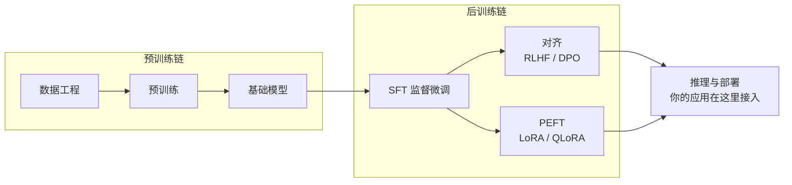

# 模型生命周期桥接

**本页是什么**：训练三页（SFT / RLHF / PEFT）的导航与总图。本仓对训练话题**只保留工程决策视角**——什么时候值得动权重、动权重会付出什么代价；训练目标与数学推导的 canonical 在 [Learn LLM](https://llm.zenheart.site/)。

**两条链在推理处汇合**（总图与完整论述见 [模型生命周期（桥接）](../../00-orientation/model-lifecycle-bridge)）：

你的应用开发发生在图的右端：**通过 API 消费训练好的模型**。左边两条链的内部机制属于 Learn LLM 的范围；本区三页桥接页只回答「工程上何时需要跨过那条线」。

## 三页导航

| 桥接页 | 回答的问题 | 一句话结论 |
| --- | --- | --- |
| [SFT（桥接）](./sft) | 何时需要用标注数据教模型新知识/新格式 | 先穷尽 prompt 与 RAG；SFT 是有明确数据与预算时才上的选项 |
| [RLHF（桥接）](./rlhf) | 模型的行为与「个性」从哪来 | 应用工程师不实施 RLHF；理解它即可解释拒绝、冗长等模型行为 |
| [PEFT（桥接）](./peft) | 如何低成本定制模型 | LoRA/QLoRA 把微调成本降一个量级，是「必须动权重」时的默认起点 |

## 与主线的连接

- 需要外部知识时，主线答案先永远是 [RAG](../../03-grounding/rag)（层 3）。
- 需要改变输出格式时，主线答案是 [结构化输出](../../01-contracts/structured-output)（层 1），不是微调。
- 只有当上述两层都给出「不够」的证据时，才带着本区的决策表去找 ML 工程师。
