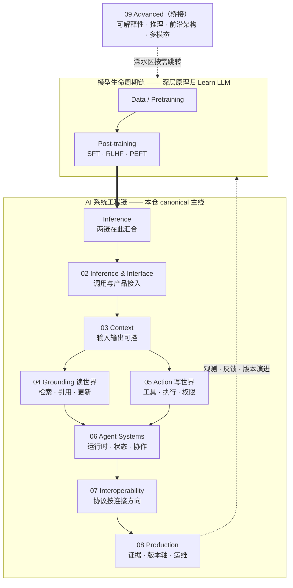

> **在哪一层**：层 0 · 方向与边界 ｜ **上一层出口**：无 ｜ **本层出口**：能定位问题域、说出它的依赖与出口，并进入正确的组
> **前置**：无（全站入口） ｜ **下一步**：[复杂度决策阶梯](00-map/complexity-ladder) · [站点边界与知识 ownership](00-map/site-boundaries) · [模型生命周期（桥接）](01-model-lifecycle/)

## 1. 概述

**结论先讲**：这是一张**依赖驱动的知识地图**。v6 的组织逻辑不是「按技术名词分类」，而是回答三个结构性问题：

1. **两条链在哪汇合**——模型生命周期链（数据 → 预训练 → 后训练）与 AI 系统工程链（接入 → 上下文 → 接地/行动 → …）在 **Inference** 处汇合：你写的每一行 AI 应用代码都从左链的末端开始。左链的深层原理归 [Learn LLM](https://llm.zenheart.site/)，右链是本仓 canonical 主线。
2. **读世界与写世界为什么分开**——Grounding（检索、引用、更新）与 Action（工具、执行、权限）都是「让模型接触模型之外的东西」，但失败模式相反：读的失败是**答错**，写的失败是**搞坏**。验收口径因此不同（引用正确 vs 权限受限），分组成 [04-grounding](04-grounding/) 与 [05-action](05-action/tool-calling)。
3. **协议为什么按连接方向分组**——MCP、A2A、ACP、AG-UI 不是竞品而是各占一条连接方向（Agent↔工具、Agent↔Agent、编辑器↔coding agent、Agent↔UI）。选型第一问是「我要连的两边是什么」，不是「哪个协议更热」——见 [07-interoperability](07-interoperability/)。

这张地图回答一个问题：**你现在卡在哪，下一步去哪。** 它不教你任何单项技术——每个组、每个主题都有自己的五段式章节（概述 → 使用 → 原理 → 开发 → 资料库）。

### 心智模型：两链汇合，读写分离

箭头表示**默认的依赖顺序**，不是硬性运行时约束：一个 RAG 服务可以只经过 02/03/04，一个工具脚本可以只经过 02/03/05。实现永远回退到满足验收的最低复杂度。

### 十组导航表

表中组按组号排序（00 → 09），主线之外的三类出口（附录/实战手册/资料库）殿后：

| 组 | 回答什么问题 | 核心主题 | 依赖 | 出口 |
| --- | --- | --- | --- | --- |
| [00-map](00-map/complexity-ladder) 方向与地图 | 我该从哪开始、哪些不在本仓？ | 地图、复杂度阶梯、站点边界 | 无 | 能定位问题域与下一入口 |
| [01-model-lifecycle](01-model-lifecycle/) 模型生命周期（桥接） | 手里的模型从哪来、影响我什么决策？ | SFT / RLHF / PEFT 的工程影响 | 00 | 知道何时 prompt 不够、深水区去 Learn LLM 哪章 |
| [02-inference-interface](02-inference-interface/) 推理与接口 | 怎么把一次模型调用接进产品？ | model-api、流式、结构化输出、会话与 UI、端侧 | 00–01 | 可取消、可观测的端到端交互 |
| [03-context](03-context/) 上下文 | 怎么让输入输出可控？ | prompt、上下文工程、会话记忆 | 02 | 能写并验证 schema，知道失败验收 |
| [04-grounding](04-grounding/) 知识接地（读世界） | 回答怎么有据？ | 嵌入与检索、RAG、高级检索 | 02–03 | 可追溯的检索链与可重跑的更新管道 |
| [05-action](05-action/tool-calling) 行动（写世界） | 怎么安全地执行动作？ | 工具调用契约、工具执行工程 | 03 | 权限受限、幂等且可撤销的动作 |
| [06-agent-systems](06-agent-systems/agent-runtime) Agent 系统 | 多步、可恢复、需审批的自主行为怎么做？ | 运行时、工作流、多 Agent、skills、状态与恢复 | 04–05 | 能限制权限、暂停/恢复任务 |
| [07-interoperability](07-interoperability/) 互操作 | 跨边界怎么连？ | MCP / A2A / ACP / AG-UI 按连接方向 | 05–06 | 按连接方向选协议并说清不选其余的理由 |
| [08-production](08-production/) 生产与运营 | 怎么证明可上线并持续运行？ | 测试、评估、可观测、安全、成本、部署、版本轴 | 02–06 | 五类证据齐备，五轴可回滚可追溯 |
| [09-advanced](09-advanced/interpretability) 进阶（桥接） | 深水区去哪学？ | 可解释性、推理与 TTC、MoE 与前沿架构、多模态 | 按需 | 知道停止点与跳转 Learn LLM 的章节 |
| [附录区](appendices/) | 还有什么可读？ | 训练桥接、案例、课程笔记、方法论存档 | 不参与主线顺序 | 主线之外的有位置阅读 |
| [实战手册](../cookbook/) | 按任务抄什么？ | 片段级代码配方 | 各组 | 打开就能抄 |
| [资料库](../resources.md) | 按问题找什么资源？ | 症状 → 章 → 资源的研究索引 | 各组 | 带着问题进来，带着下一问出去 |

### 症状驱动决策树

从症状出发，不从名词出发。找到你的症状，直接进入对应的组：

| 你的症状 | 去哪 |
| --- | --- |
| 输出不稳定 / 无法解析 | [03-context](03-context/)（落点：[结构化输出](02-inference-interface/structured-output)） |
| 回答稳定，但还没接入产品 | [02-inference-interface](02-inference-interface/) |
| 回答缺少私有或最新事实 | [04-grounding](04-grounding/) |
| 需要调用系统或执行动作 | [05-action](05-action/tool-calling)；多步/可恢复/需审批再进 [06-agent-systems](06-agent-systems/agent-runtime) |
| 需要跨 host / 组织 / Agent 边界协作 | [07-interoperability](07-interoperability/)（按连接方向选择） |
| 功能已跑，但不可证明 / 不可运营 | [08-production](08-production/) |
| 想懂模型内部 / 训练 / 前沿架构 | [01-model-lifecycle](01-model-lifecycle/) 与 [09-advanced](09-advanced/interpretability)（桥接 → Learn LLM） |

### 本仓不教什么（三条边界）

| 不在本仓展开 | canonical owner | 本仓保留什么 |
| --- | --- | --- |
| 模型内部机制：Transformer、训练数学、KV Cache 推导 | [Learn LLM](https://llm.zenheart.site/) | 决策影响 + 停止点 + 跳转，见[站点边界](00-map/site-boundaries) |
| 评估方法论：benchmark、judge、发布证据 | [evals](https://evals.zenheart.site/) | 何时需要证据 + 上线门如何接入 |
| 厂商 docs / blog 原文捕获与 EPUB 索引 | sites-epub（[epub.zenheart.site](https://epub.zenheart.site/)） | 跨厂商稳定概念的二次加工 + 阅读路线 |

### 何时使用 / 何时不用

- 用：第一次进入本栏、不确定该学什么、或带着具体症状找入口。
- 不用：想了解模型内部机制（→ [Learn LLM](https://llm.zenheart.site/)）；想找厂商产品的点击步骤（→ Products）；想要评估方法论（→ [evals](https://evals.zenheart.site/)）。

历史版本里程碑：本地图于 2026-09 按 Issue #116 Scope v6 重构为**十组依赖驱动**结构（两链汇合 / 读写分离 / 协议按方向）；v5 的六层金字塔（能力变换链）叙事被本版取代，其「症状决策树 + 两跳演练 + 三站边界」被继承。更早的演变史未验证，不编造。

## 2. 使用

本页是地图页，不产出运行产物；「使用」= 导航演练。验收标准只有一条：**从症状出发，两次导航内进入正确的组。**

### 演练 1：输出不稳定

- **症状**：「模型返回的 JSON，十次里有三次解析失败。」
- **第 1 跳**：查上方决策树 → 「输出不稳定 / 无法解析」→ [03-context](03-context/)。
- **第 2 跳**：组内症状路由 → 输出形状问题的落点是[结构化输出](02-inference-interface/structured-output)（契约族页面，挂载在 02 组）。
- **到达**：读完能写并验证输出 schema，知道失败如何验收。

### 演练 2：回答缺最新事实

- **症状**：「内部助手不知道我们上周更新的退款政策。」
- **第 1 跳**：决策树 → 「回答缺少私有或最新事实」→ [04-grounding](04-grounding/)。
- **第 2 跳**：组内主题表 → [RAG](04-grounding/rag)。
- **到达**：能构建可追溯的检索链和更新路径（读世界：失败模式是答错，不是搞坏）。

### 演练 3：想让系统动手

- **症状**：「想让 Agent 自动把处理完的工单标记为已解决，怕它改错。」
- **第 1 跳**：决策树 → 「需要调用系统或执行动作」→ [05-action](05-action/tool-calling)。
- **第 2 跳**：单次受控动作看[工具执行工程](05-action/tool-execution)；确认要多步、可恢复、需审批再进 [Agent 运行时](06-agent-systems/agent-runtime)。
- **到达**：能限制权限、把动作做成幂等且可撤销（写世界：验收口径是权限受限，不是引用正确）。

三步都走不通时：先读[复杂度决策阶梯](00-map/complexity-ladder)确认你面对的需求等级，再回决策树。

## 3. 原理

### 为什么按依赖组织，而不是按分类学

旧目录曾把 Fundamentals（知识抽象）、Prompt（交互手段）、Integrate（实现方式）、RAG / Agent（架构模式）、Skills / MCP（资产/协议）、Engineering（生命周期）放在同一层——六种分类轴混用，读者无法从「我卡在哪」推到「我该读哪页」。本地图只保留一条主轴：**知识按依赖排序，不按名词归类**。每个组回答一个问题，标明依赖与出口；其余维度（信任域、生命周期、证据层级、ownership）降为页面元数据和对照表，不再竞争成顶级栏目。

### 两链汇合：为什么第一条工程主题是接口而不是模型结构

你的代码从 Inference 开始，不从 Transformer 开始。左链（模型生命周期）决定「手里的模型是什么、会什么」，右链（系统工程）决定「你用它造什么」——汇合点在 Inference / Model Interface。因此工程主线的第一组是[推理与接口](02-inference-interface/)，模型侧知识以[桥接](01-model-lifecycle/)形式挂在其上游。

### 读写分离：两种相反的失败模式

Grounding 与 Action 共享「让模型接触外部世界」这个直觉，但验收口径相反：读世界的失败是**答错或该拒答没拒答**（无副作用），验收引用正确与拒答正确；写世界的失败是**破坏状态**（有副作用），验收权限受限与可恢复。混在一组会让两套验收互相稀释——这是 04/05 分组的根因，也是「先检索后生成」与「先白名单后执行」两种工程直觉的同源结构。

### 教学顺序不等于运行时依赖

箭头代表新人默认的学习与依赖递进顺序。实际工程可以从契约和 fixture 自下而上实现；Grounding、Action、接口可按场景独立组合。每个组 index 同时标注「默认先学什么」和「哪些场景可以跳过」。

## 4. 开发

本页不接代码；「开发」= 如何维护这张地图。

### 维护流程

1. **注册**：新主题先在 `_phase0/slug-map.json` 登记 topicId、组、slug 与 mergeSources；一个 topicId 只有一个 canonical owner。
2. **判组**：按「本页回答什么问题、依赖谁、出口给谁」归组，不按技术名词归组。归不进任何组的，先问它是不是 Products / appendices / sibling 的内容。
3. **接线**：新主题入组后，回本页核对：决策树是否需要新分支？十组表格的核心主题列是否要加词？
4. **双语**：中英页 topicId、结构、结论、图、链接一一对应；`bilingualParity: exact` 才算完成。
5. **收尾**：被合并的旧路径记入 `docs/public/redirects.json`，不留在侧栏。

### 盘点与验收

- 结构事实以 `node scripts/pyramid-inventory.mjs` 的输出为准，不以记忆为准；本页正文必须包含全部十个组目录名（00-map … 09-advanced）。
- 图谱级验收：从任一真实症状出发，两次导航内进入正确的组；任何孤立页面、无 owner 的协议页、只有链接没有问题上下文的资源卡，都算地图缺陷。

### 维护反模式

- 用「更多 / More」收纳归不了类的页面——垃圾桶分类法会重新污染依赖主轴。
- 为热门协议新增顶层入口——协议永远从连接方向进入。
- 中英页各自演化——发现 `bilingualParity: partial` 超过一个写作周期即视为缺陷。

## 5. 资料库

本页是入口，资料以「下一跳」为主。四级路线：

- **Beginner**：读本页 + [复杂度决策阶梯](00-map/complexity-ladder)，能定位自己的组。
- **Builder**：进 [03-context](03-context/)、[02-inference-interface](02-inference-interface/)，完成第一个无密钥 fixture。
- **Operator**：进 [08-production](08-production/)，学会用证据与版本轴证明可上线。
- **Researcher**：下沉到 sibling 站点拿深层原理（[01](01-model-lifecycle/)、[09](09-advanced/interpretability) 的桥接页是入口）。

### 三站入口表

| 站点 | canonical URL | 用途 | 状态 |
| --- | --- | --- | --- |
| Learn LLM | https://llm.zenheart.site/ | 模型内部机制、训练数学 | HTTP 200（retrievedAt 2026-09-01） |
| Learn LLM 章节目录 | https://llm.zenheart.site/chapters/ | 21 章全书地图，deep-link 入口 | HTTP 200（retrievedAt 2026-09-01） |
| evals | https://evals.zenheart.site/ | 评估方法、benchmark、发布证据 | HTTP 200（retrievedAt 2026-09-01） |
| sites-epub | https://epub.zenheart.site/ | 厂商原文捕获与 EPUB 索引 | warning：TLS 证书不匹配，HTTPS 当前不可达（retrievedAt 2026-09-01，引用前复核） |

各站分工细则、停止点与 bridge 元数据规范见[站点边界与知识 ownership](00-map/site-boundaries)。

### 主动证伪与未决问题

- 若你发现某个症状在决策树上找不到分支，或某分支把你带进了错误的组——这是地图缺陷，优先修地图而不是绕过。
- 未决：sites-epub 当前 HTTPS 不可达（证书不匹配），其所有权声明暂按 bridge-register 记录，待恢复后复核。
- 未决：[05-action](05-action/tool-calling)、[06-agent-systems](06-agent-systems/agent-runtime) 的组索引在 v6 迁移期间由并行任务补齐；在本页引用以组目录为准。

### learn-ai 到此为止 / 继续去哪

- 模型怎么「想」：[Learn LLM](https://llm.zenheart.site/) 的[章节目录](https://llm.zenheart.site/chapters/)。
- 怎么证明效果好：[evals](https://evals.zenheart.site/)。
- 厂商原文与离线阅读：sites-epub（恢复后）。
- 本仓下一步：[复杂度决策阶梯](00-map/complexity-ladder)。
