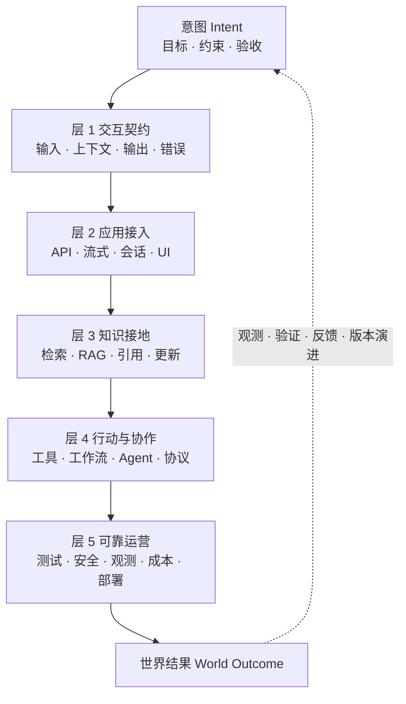

> **在哪一层**：层 0 · 方向与边界 ｜ **上一层出口**：无 ｜ **本层出口**：能定位问题域、受众和下一入口
> **前置**：无（全站入口） ｜ **下一步**：[复杂度决策阶梯](00-map/complexity-ladder) · [站点边界与知识 ownership](00-map/site-boundaries) · [模型生命周期（桥接）](01-model-lifecycle/)

## 1. 概述

**结论先讲**：AI 技术的工程本质，是把人的意图在不确定性、外部状态和权限约束下，逐级转换为可验证的系统结果。本栏按这条能力变换链组织教学；协议（MCP、A2A、ACP、AG-UI 等）只是特定边界的实现选择，不是学习顺序。

这张地图回答一个问题：**你现在卡在哪，下一步去哪。** 它不教你任何单项技术——每一层、每个主题都有自己的五段式章节（概述 → 使用 → 原理 → 开发 → 资料库）。

### 心智模型：一条能力变换链

箭头表示**默认的复杂度递增顺序**，不是硬性运行时依赖：一个 RAG 服务可以只经过层 1 和层 3，一个工具脚本可以只经过层 1 和层 4。实现永远回退到满足验收的最低复杂度。

### 何时使用 / 何时不用

- 用：第一次进入本栏、不确定该学什么、或带着具体症状找入口。
- 不用：想了解模型内部机制（→ [Learn LLM](https://llm.zenheart.site/)）；想找厂商产品的点击步骤（→ Products）；想要评估方法论（→ [evals](https://evals.zenheart.site/)）。

### 症状驱动决策树

从症状出发，不从名词出发。找到你的症状，直接进入对应层：

| 你的症状 | 去哪 |
| --- | --- |
| 回答不稳定 / 输出无法解析 | [层 1 · 交互契约](03-context/) |
| 回答稳定，但还没接入产品 | [层 2 · 应用接入](02-inference-interface/) |
| 回答缺少私有或最新事实 | [层 3 · 知识接地](04-grounding/) |
| 需要调用系统或执行动作 | [层 4 · 行动与协作](06-agent-systems/agent-runtime) |
| 需要跨 host / 组织 / Agent 边界协作 | [层 4 · 协议分支](07-interoperability)（按连接方向选择） |
| 功能已跑，但不可证明 / 不可运营 | [层 5 · 可靠运营](08-production/) |

### 六层金字塔

| 层 | 回答什么问题 | 核心主题 | 依赖 | 出口能力 |
| --- | --- | --- | --- | --- |
| [0 · 方向与边界](00-map/complexity-ladder) | 我该从哪里开始、哪些不在本仓？ | 地图、复杂度阶梯、站点边界 | 无 | 能定位问题域与下一入口 |
| [1 · 交互契约](03-context/) | 如何让输入 / 输出可控？ | Prompt、Context、结构化输出、工具调用契约 | 层 0 | 能写并验证 schema，知道失败验收 |
| [2 · 应用接入](02-inference-interface/) | 如何让能力成为产品交互？ | 模型 API、流式、会话与状态、生成式 UI | 层 1 | 能做一次可取消、可观测的端到端交互 |
| [3 · 知识接地](04-grounding/) | 如何让结果有数据依据？ | 嵌入与检索、RAG、高级检索 | 层 2 | 能构建可追溯的检索链和更新路径 |
| [4 · 行动与协作](06-agent-systems/agent-runtime) | 如何安全地做事或跨边界协作？ | 工具执行、工作流、Agent 运行时、协议 | 层 1–3 | 能限制权限、暂停 / 恢复任务、选最低复杂度协作方式 |
| [5 · 可靠运营](08-production/) | 如何证明可以上线并持续运行？ | 测试、可观测性、安全、成本、部署 | 层 1–4 | 能用可回放证据说明质量、风险、回滚、责任人 |
| [进阶](09-advanced/) | 前沿边界：可解释性、推理、新架构、多模态（桥接 → Learn LLM） | 概念定位与跳转 | 层 2–8 | 知道深水区去哪学 |

### 本仓不教什么（三条边界）

| 不在本仓展开 | canonical owner | 本仓保留什么 |
| --- | --- | --- |
| 模型内部机制：Transformer、训练数学、KV Cache 推导 | [Learn LLM](https://llm.zenheart.site/) | 决策影响 + 停止点 + deep-link，见[站点边界](00-map/site-boundaries) |
| 评估方法论：benchmark、judge、发布证据 | [evals](https://evals.zenheart.site/) | 何时需要证据 + 上线门如何接入 |
| 厂商 docs / blog 原文捕获与 EPUB 索引 | sites-epub（[epub.zenheart.site](https://epub.zenheart.site/)） | 跨厂商稳定概念的二次加工 + 阅读路线 |

历史版本里程碑：本地图于 2026-09 按 Issue #116 金字塔重构冻结；旧版按「基础 → Prompt → 集成 → RAG → Agent → 工程」组织的入口已合并进本页。更早的演变史未验证，不编造。

## 2. 使用

本页是地图页，不产出运行产物；「使用」= 导航演练。验收标准只有一条：**从症状出发，两次导航内进入正确的层。**

### 演练 1：输出不稳定

- **症状**：「模型返回的 JSON，十次里有三次解析失败。」
- **第 1 跳**：查上方决策树 → 「回答不稳定 / 输出无法解析」→ [层 1 · 交互契约](03-context/)。
- **第 2 跳**：层 1 主题表 → 该症状对应[结构化输出](02-inference-interface/structured-output)。
- **到达**：读完能写并验证输出 schema，知道失败如何验收。

### 演练 2：回答缺最新事实

- **症状**：「内部助手不知道我们上周更新的退款政策。」
- **第 1 跳**：决策树 → 「回答缺少私有或最新事实」→ [层 3 · 知识接地](04-grounding/)。
- **第 2 跳**：层 3 主题表 → [RAG](04-grounding/rag)。
- **到达**：能构建可追溯的检索链和更新路径。

### 演练 3：想让系统动手

- **症状**：「想让 Agent 自动把处理完的工单标记为已解决，怕它改错。」
- **第 1 跳**：决策树 → 「需要调用系统或执行动作」→ [层 4 · 行动与协作](06-agent-systems/agent-runtime)。
- **第 2 跳**：层 4 主题表 → 单次受控动作先看[工具执行工程](05-action/tool-execution)。
- **到达**：能限制权限、把动作做成幂等且可撤销。

三步都走不通时：先读[复杂度决策阶梯](00-map/complexity-ladder)确认你面对的需求等级，再回决策树。

## 3. 原理

### 为什么是这条主线

旧目录把 Fundamentals（知识抽象）、Prompt（交互手段）、Integrate（实现方式）、RAG / Agent（架构模式）、Skills / MCP（资产 / 协议）、Engineering（生命周期）放在同一层——这是六种分类轴混用，读者无法从「我卡在哪」推到「我该读哪页。」

本地图只保留一条主轴：**能力如何从意图变成结果。** 其余维度（语义层、信任域、生命周期、证据层级、ownership、载体视图）降为页面元数据和对照表，不再互相竞争成顶级栏目。

### 两条轴，一张图

- **能力主线（纵向）**：从「模型能回答什么」走到「系统能安全完成什么」——即上方变换链。
- **工程横切线（横向）**：每一层都经过概述 → 使用 → 原理 → 开发 → 资料库；安全、隐私、成本、可观测性、人工批准贯穿所有层。

### 协议为什么在层 4 而不是层 0

协议解决的是特定边界上的通信与能力发现：MCP 连 Agent 与工具 / 数据，A2A 连跨信任域的 Agent，ACP 连编辑器与 coding agent，AG-UI 连 Agent 与用户界面。它们是**边界确定之后**的实现选择。先学协议再找问题，等于先买螺丝刀再找螺丝——这正是旧结构「协议清单化」的根源。选型规则见[复杂度决策阶梯](00-map/complexity-ladder)梯级 6。

### 教学顺序不等于运行时依赖

箭头代表新人默认的学习与复杂度递增顺序。实际工程可以从契约和 fixture 自下而上实现；RAG、工具 / Agent、API / 流式可按场景独立组合。每个层 index 同时标注「默认先学什么」和「哪些场景可以跳过」。

## 4. 开发

本页不接代码；「开发」= 如何维护这张地图。

### 维护流程

1. **注册**：新主题先在 `_phase0/slug-map.json` 登记 topicId、层、slug 与 mergeSources；一个 topicId 只有一个 canonical owner。
2. **判层**：按「本页回答什么问题」归层，不按技术名词归层。归不进任何一层的，先问它是不是 Products / appendices / sibling 的内容。
3. **接线**：新主题入层后，回本页核对：决策树是否需要新分支？六层表格的核心主题列是否要加词？
4. **双语**：中英页 topicId、结构、结论、图、链接一一对应；`bilingualParity: exact` 才算完成。
5. **收尾**：被合并的旧路径记入 `docs/public/redirects.json`，不留在侧栏。

### 盘点与验收

- 结构事实以 `node scripts/pyramid-inventory.mjs` 的输出为准，不以记忆为准。
- 图谱级验收：从任一真实症状出发，两次导航内进入正确层；任何孤立页面、无 owner 的协议页、只有链接没有问题上下文的资源卡，都算地图缺陷。

### 维护反模式

- 用「更多 / More」收纳归不了类的页面——垃圾桶分类法会重新污染主轴。
- 为热门协议新增顶层入口——协议永远从边界问题进入。
- 中英页各自演化——发现 `bilingualParity: partial` 超过一个写作周期即视为缺陷。

## 5. 资料库

本页是入口，资料以「下一跳」为主。四级路线：

- **Beginner**：读本页 + [复杂度决策阶梯](00-map/complexity-ladder)，能定位自己的层。
- **Builder**：进 [层 1](03-context/)、[层 2](02-inference-interface/)，完成第一个无密钥 fixture。
- **Operator**：进 [层 5](08-production/)，学会用证据证明可上线。
- **Researcher**：下沉到 sibling 站点拿深层原理。

### 三站入口表

| 站点 | canonical URL | 用途 | 状态 |
| --- | --- | --- | --- |
| Learn LLM | https://llm.zenheart.site/ | 模型内部机制、训练数学 | HTTP 200（retrievedAt 2026-09-01） |
| Learn LLM 章节目录 | https://llm.zenheart.site/chapters/ | 21 章全书地图，deep-link 入口 | HTTP 200（retrievedAt 2026-09-01） |
| evals | https://evals.zenheart.site/ | 评估方法、benchmark、发布证据 | HTTP 200（retrievedAt 2026-09-01） |
| sites-epub | https://epub.zenheart.site/ | 厂商原文捕获与 EPUB 索引 | warning：TLS 证书不匹配，HTTPS 当前不可达（retrievedAt 2026-09-01，引用前复核） |

各站分工细则、停止点与 bridge 元数据规范见[站点边界与知识 ownership](00-map/site-boundaries)。

### 主动证伪与未决问题

- 若你发现某个症状在决策树上找不到分支，或某分支把你带进了错误的层——这是地图缺陷，优先修地图而不是绕过。
- 未决：sites-epub 当前 HTTPS 不可达（证书不匹配），其所有权声明暂按 bridge-register 记录，待恢复后复核。
- 未决：协议分支的「按连接方向」下钻在层 4 落地，入口以 [协议地图](07-interoperability) 为准。

### learn-ai 到此为止 / 继续去哪

- 模型怎么「想」：Learn LLM 的[章节目录](https://llm.zenheart.site/chapters/)。
- 怎么证明效果好：[evals](https://evals.zenheart.site/)。
- 厂商原文与离线阅读：sites-epub（恢复后）。
- 本仓下一步：[复杂度决策阶梯](00-map/complexity-ladder)。
