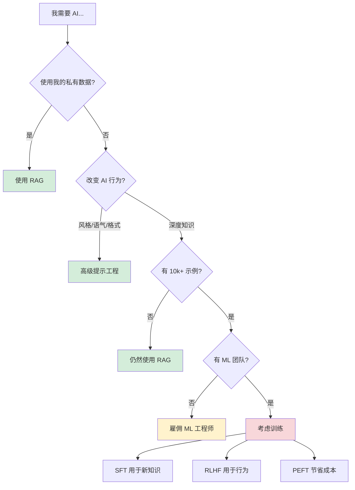

# 面向前段工程师的 AI 模型训练

**重要提示**: 本节仅**从高层次**解释训练概念。作为一名前端工程师，你很少需要自己实施训练。

## 黄金法则

> **99% 的前端 AI 用例应该使用 RAG，而不是训练。**

如果你正在考虑模型训练，请问自己：
- 我有 10,000+ 个高质量的标注示例吗？
- 我有 $10,000+ 的预算用于训练和实验吗？
- 我有机器学习工程专业知识或能雇佣到相关人员吗？

**如果你对其中任何一个回答“不”**，请改用 RAG。

---

## 何时使用什么：决策树

---

## 训练方法比较

| 方法 | 作用 | 公司何时使用 | 前端相关性 | 成本 |
|--------|-------------|----------------------|-------------------|------|
| **[RAG](/zh/tech/patterns/RAG)** | 检索文档 + 注入上下文 | 总是 (首选) | ✅ **你来实现这个** | $ |
| **[SFT](/zh/tech/training/SFT)** | 通过示例教授新知识 | 自定义领域 (法律, 医疗) | ❌ 雇佣 ML 工程师 | $$$ |
| **RLHF** 🚧 | 通过人类反馈完善行为 | ChatGPT 风格的对齐 | ❌ 仅限研究团队 | $$$$ |
| **PEFT** 🚧 | 高效微调 (LoRA) | 预算敏感的训练 | ❌ ML 工程师实现 | $$ |

🚧 = 仅概念文档 (即将推出)

---

## 为什么 RAG 是你的朋友

**RAG (检索增强生成)** 解决了 99% 的“我需要 AI 知道我的数据”的问题：

✅ **适用于任何 LLM** - 无需训练
✅ **即时更新** - 添加新文档，立即可用
✅ **成本极低** - 向量搜索 + API 调用 vs. 数千美元的训练
✅ **可调试** - 确切看到检索了哪些文档
✅ **前端友好** - 你控制整个栈

**RAG 处理的示例用例**:
- 产品文档的客户支持
- 内部知识库搜索
- 代码文档问答
- 法律/医疗文档分析

**阅读更多**: [RAG 完整指南](/zh/tech/patterns/RAG)

---

## 训练真正有意义的时候

只有当你满足**所有**这些标准时，才应考虑训练：

### 对于监督微调 (SFT)

- [ ] 你需要 AI 学习公共训练数据中不存在的**特定领域知识**
- [ ] 你有 **10,000+ 个高质量的标注示例** (不仅仅是文档 - 而是实际的输入/输出对)
- [ ] RAG 对于你的用例来说太慢或太贵
- [ ] 你有 **$5,000-$50,000** 的训练成本预算
- [ ] 你有可以实施和调试此过程的 ML 工程师

**示例**: 一家医疗公司使用 50,000 个带注释的示例训练 LLM 来解释专有的实验室报告。

### 对于 RLHF (基于人类反馈的强化学习)

- [ ] 你需要改变**行为** (语气, 风格, 安全性) 而不是增加知识
- [ ] 你有数百小时的人类反馈数据
- [ ] 你有具备 RLHF 专业知识的研究团队
- [ ] 预算: **$50,000+**

**示例**: OpenAI 对齐 GPT-4 以拒绝有害请求。

### 对于 PEFT (参数高效微调)

- [ ] 你已经在做 SFT 但需要降低成本
- [ ] 你需要部署多个专用模型
- [ ] 你有熟悉 LoRA/QLoRA 的 ML 工程师

**示例**: 初创公司创建客户特定的模型变体，而无需全量微调成本。

---

## "何时雇佣 ML 工程师" 清单

如果你是前端工程师并对其中任何一个回答“是”，那么是时候让 ML 专家参与进来了：

- [ ] 即使经过优化，RAG 的准确性也不够
- [ ] 你需要模型“记住”领域知识 (SFT)
- [ ] 你每月的 API 调用花费超过 $10k，训练可能会降低成本
- [ ] 你需要在设备上或受限环境中部署模型
- [ ] 你的公司想要专有的 AI 优势 (自定义模型)

**你应该先做什么**:
1. 穷尽所有 RAG 优化 (混合搜索, 重排序, 更好的分块)
2. 尝试高级提示技术 (few-shot, chain-of-thought)
3. 测试多个 LLM 提供商 (Claude, GPT-4, Gemini)
4. 计算 ROI: 训练节省的成本会超过 $50k+ 的实施成本吗？

---

## 训练概念概览

### 监督微调 (SFT)

**是什么**: 在输入-输出示例上训练模型以教授新知识或任务。

**优点**:
- 模型“学习”领域特定知识
- 在狭窄领域可以比 RAG 提高准确性
- 响应可能更快 (无检索步骤)

**缺点**:
- 需要 1,000-100,000+ 个示例
- 昂贵 ($1k-$100k 取决于规模)
- 静态 - 新数据需要重新训练
- 出错时难以调试

**阅读更多**: [SFT 指南](/zh/tech/training/SFT)

---

### RLHF (基于人类反馈的强化学习)

**是什么**: 人类标注者对模型输出进行排名 (好/坏)，模型学习偏好“好”的响应。

**使用者**: ChatGPT, Claude, Gemini (所有主要 LLM)

**前端相关性**: 你永远不会实施这个。这是 OpenAI/Anthropic 创建你通过 API 使用的安全、有用的模型的方式。

**仅概念文档即将推出**

---

### PEFT (参数高效微调)

**是什么**: 像 LoRA 这样的技术，只训练模型参数的一小部分，而不是整个模型。

**为什么存在**: 全量微调 GPT-3.5 成本 $10k+。LoRA 可以用 $100 完成。

**公司何时使用**:
- 创建客户特定的模型变体
- 预算有限的快速实验
- 部署多个专用模型

**前端相关性**: 如果你的公司有 ML 工程师做 SFT，他们可能会使用 PEFT 来降低成本。无论如何，你都将通过 API 使用模型。

**仅概念文档即将推出**

---

## 训练提供商 (如果你必须的话)

如果你决定必须进行训练，这些提供商提供无代码/低代码解决方案：

| 提供商 | 最适合 | 起始成本 |
|----------|----------|---------------|
| **OpenAI Fine-Tuning** | GPT-3.5/4 微调 | ~$1,200 (训练) + 使用费 |
| **Anthropic** | Claude 微调 (可用性有限) | 联系销售 |
| **HuggingFace AutoTrain** | 开源模型 (Llama, Mistral) | $100-$5,000 |
| **Replicate** | 一键微调 | 每次训练 $0.50-$5 |

**注意**: 即使使用这些工具，你也需要 ML 专业知识来：
- 准备高质量的训练数据
- 评估模型性能
- 调试问题
- 决定何时停止训练

---

## 前端工程师的训练思维模式

**你的角色**: 了解这些概念的存在，以便你可以：
- 与 ML 团队进行知情对话
- 做出自建与购买的决定
- 知道何时 RAG 就足够了 (99% 的时间)
- 识别何时升级给专家

**你的工作不是**:
- 实施训练管道
- 调试梯度下降
- 选择超参数
- 管理 GPU 基础设施

**你的工作是**:
- 构建出色的 RAG 系统
- 精通提示工程
- 通过 API 集成训练好的模型
- 为 AI 功能创建 UX

---

## 下一步

### 对于大多数前端工程师

1. 精通 RAG: [RAG 完整指南](/zh/tech/patterns/RAG)
2. 优化提示词: [提示工程](/zh/tech/prompt/)
3. 学习结构化输出: [类型安全 AI](/tech/structured-output) 🚧

### 如果你正在考虑训练

1. 阅读 [SFT 指南](/zh/tech/training/SFT) 了解要求
2. 审计你的数据: 你有 10k+ 高质量示例吗？
3. 计算成本: 比较 RAG 优化与训练投资
4. 在承诺之前咨询 ML 工程师

### 如果你正在构建 AI 产品

1. 总是从 RAG 开始
2. 测量: 优化后 RAG 准确率是否 <90%?
3. 探索: 更好的提示词/模型能解决吗？
4. 只有那时: 考虑与 ML 团队一起训练

---

## 总结

- **99% 的用例 → 使用 RAG** (无需训练)
- **训练很昂贵** ($5k-$100k) 且需要 ML 专业知识
- **前端工程师** 应该理解概念，而不是实施训练
- **如果有疑问**，在考虑训练之前优化 RAG

**黄金法则**: 如果你可以用 RAG 解决，不要训练。如果你可以用更好的提示词解决，不要用 RAG。

---

## 额外资源

- [RAG vs 微调: 何时使用哪个](https://www.pinecone.io/learn/rag-vs-finetuning/) (外部)
- [OpenAI 微调指南](https://platform.openai.com/docs/guides/fine-tuning) (外部)
- [LLM 微调的经济学](https://www.anthropic.com/research/economics) (外部 - 示例)

**有问题？** 如果你不确定是使用 RAG 还是训练，[发起讨论](https://github.com/zenheart/learn-ai/discussions)。