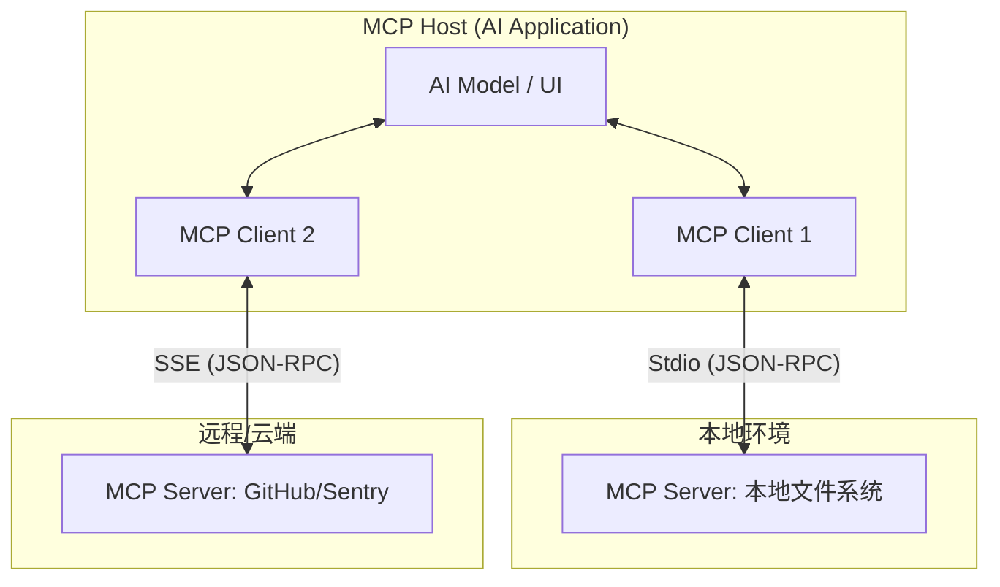
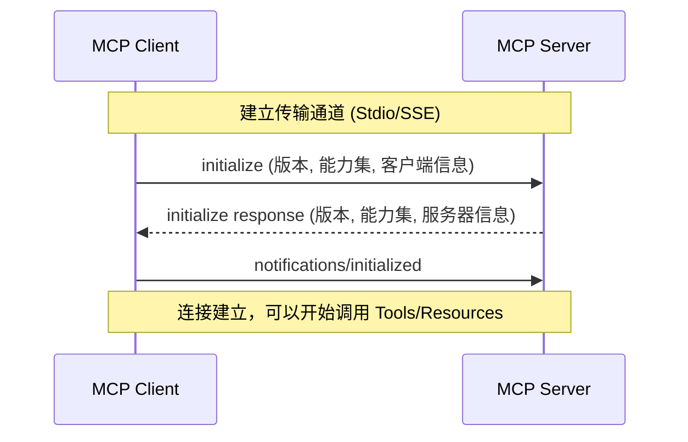
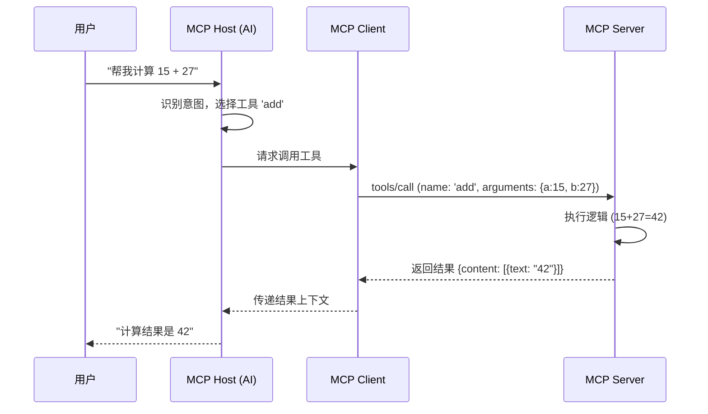

# Model Context Protocol (MCP) 深度实战指南

欢迎来到 **MCP 实验室**！本指南旨在通过“理论-视觉-实战”三位一体的方式，帮助你从零开始深度掌握 MCP。

---

## 1. 核心架构：谁在与谁对话？

理解 MCP 的第一步是分清它的三个核心角色。

### 1.1 三大参与者
- **MCP Host (宿主)**：AI 应用程序（如 Claude Desktop, Cursor, VS Code）。它是控制中心，决定何时调用哪个工具。
- **MCP Client (客户端)**：集成在 Host 内部的协议实现。每个 Client 负责维护与一个特定 Server 的连接。
- **MCP Server (服务器)**：能力的提供方。它通过资源、工具和提示词向外暴露功能。

### 1.2 架构图示


---

## 2. 协议原理：交互的艺术

MCP 基于 JSON-RPC 2.0 协议。所有的交互都遵循严格的生命周期。

### 2.1 初始化握手 (Handshake)
在任何操作开始前，Client 和 Server 必须先“对暗号”：


### 2.2 工具调用流程 (Tool Execution)
当你在 AI 界面输入指令时，背后发生了什么？


---

## 3. 渐进式实战任务

我们将通过三个任务，由浅入深地掌握 MCP 工程能力。

### 任务 1：接入与观察 (使用现有 Server)
**目标**：学会配置并观察 MCP 的运行状态。
1. 安装并启动 **Claude Desktop**。
2. 修改配置文件，接入本项目提供的 `mcp-lab-server`（参考第 4 节）。
3. 在 Claude 中输入：“你能做什么？”观察它如何列出 `add` 和 `get_current_time` 工具。

### 任务 2：调试与排障 (使用 Inspector)
**目标**：掌握不依赖 IDE 的独立调试能力。
1. 运行调试神器：
   ```bash
   npx @modelcontextprotocol/inspector node src/index.js
   ```
2. 在打开的 Web 界面中，手动点击 `List Tools`，查看 JSON 响应结构。
3. **实验**：尝试在 `src/index.js` 中故意写错一个 JSON 字段，观察 Inspector 如何报错。

### 任务 3：从零开发 (功能扩展)
**目标**：具备自行编写 MCP 能力。
1. 打开 `src/index.js`。
2. **挑战**：添加一个名为 `get_weather` 的工具。
   - 定义输入参数：`city` (string)。
   - 实现逻辑：返回一个模拟的天气字符串。
3. 重新启动 Server，验证 AI 是否能根据城市查询天气。

---

## 4. 工程配置指南

### 4.1 客户端接入
- **Claude Desktop**: 修改 `claude_desktop_config.json`。
- **Cursor**: 在 `Settings -> Models -> MCP` 中添加 `command` 类型。

### 4.2 核心禁忌 (Critical)
- **Stdio 模式下禁用 `console.log`**：它会污染 `stdout` 导致协议解析失败。
- **始终使用 `console.error`**：这是安全的日志通道。

---

## 5. 延伸阅读：通往专家之路

为了进一步深入，我们为你准备了分级阅读材料：

### 基础级 (入门必读)
- [MCP 官方文档：什么是 MCP？](https://modelcontextprotocol.io/docs/getting-started/intro)
- [快速开始：构建你的第一个 Server](https://modelcontextprotocol.io/docs/getting-started/build-server-node)

### 进阶级 (工程实践)
- [MCP 协议规范详解](https://modelcontextprotocol.io/docs/specification/)：深入 JSON-RPC 细节。
- [安全最佳实践](https://modelcontextprotocol.io/docs/learn/security)：如何保护你的 Server 不被恶意调用。

### 专家级 (生态与前沿)
- [Sampling 机制](https://modelcontextprotocol.io/docs/concepts/sampling)：让 Server 反向调用 LLM。
- [官方 Server 仓库](https://github.com/modelcontextprotocol/servers)：学习 GitHub、Slack 等复杂 Server 的源码实现。
