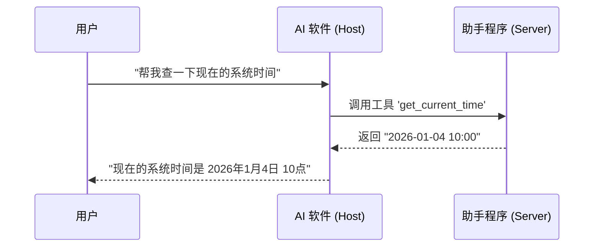

# Model Context Protocol (MCP) 从零到一实战指南

欢迎来到 **MCP 实验室**！如果你是第一次听说 MCP，或者觉得它听起来很深奥，别担心。本指南将带你像拼乐高一样，一步步理解并掌握这个改变 AI 生态的技术。

---

## 1. 初识 MCP：AI 的“万能翻译官”

### 1.1 一个生活中的类比
想象一下，你有一台最先进的电脑（AI 模型），但它的接口是特殊的。你想连接打印机、摄像头或硬盘，发现每个设备的插头都不一样。你不得不为每个设备买一个昂贵的转换器。

**MCP (Model Context Protocol)** 就像是电子世界的 **Type-C 标准**。它规定了一个统一的插口标准：
- **设备厂商**（数据源/工具）只需要做一个 Type-C 接口。
- **电脑厂商**（AI 软件）只需要支持 Type-C 协议。
- 结果：你的 AI 瞬间就能连接世界上所有的设备。

### 1.2 它解决了什么痛苦？
在没有 MCP 之前，如果你想让 Claude 访问你的 GitHub，开发者得写一套代码；想让 Cursor 访问 GitHub，又得写一套。
- **过去**：重复造轮子，累且低效。
- **现在**：**一次编写，到处运行**。你写一个 MCP Server，所有的 AI 软件都能直接用。

---

## 2. 核心角色：谁在干什么？

为了让这个“翻译官”工作，我们需要三个角色配合。我们每次只引入一个概念：

1.  **Host (宿主/大脑)**：这是你直接使用的 AI 软件（如 Claude Desktop, Cursor）。它负责思考，并决定什么时候需要向外求助。
2.  **Server (服务/手脚)**：这是具体干活的程序。它知道怎么查数据库、怎么发邮件。它把这些能力“打包”好，等着被调用。
3.  **Client (连接器)**：这是 Host 内部的一个小零件，专门负责给特定的 Server 打电话。

**简单来说**：你（用户）对 **Host** 下令，Host 通过 **Client** 呼叫 **Server**，Server 完成任务后把结果传回。

---

## 3. 深入一点点：它们怎么交流？

既然要交流，就得有共同语言。MCP 使用的是 **JSON-RPC**（一种简单的问答格式）。

### 3.1 握手：初次见面的礼仪
当 AI 软件启动时，它会先和 Server 握手：
- **Client**: “嘿，我是 Claude，我支持 2024-11-05 版本的协议，你能做什么？”
- **Server**: “你好，我是 GitHub 助手，我可以帮你创建 Issue 和列出仓库。”
- **Client**: “太棒了，连接成功！”

### 3.2 交互流程图

---

## 4. 动手实践：从观察到创造

我们准备了三个渐进式任务，带你从“使用者”变成“开发者”。

### 任务 1：接入并观察 (5分钟)
**目标**：亲眼看到 AI 是如何“发现”新能力的。
1. 按照本目录下的 `src/index.js` 示例，将其配置到你的 **Claude Desktop** 中。
2. 在 Claude 中问它：“你能帮我做加法吗？”
3. **观察**：你会看到 Claude 界面上出现一个“调用工具”的提示，这说明它已经识别到了你的 Server。

### 任务 2：独立调试 (5分钟)
**目标**：学会使用开发者的“显微镜”。
1. 运行命令：`npx @modelcontextprotocol/inspector node src/index.js`
2. 在弹出的网页中点击 `List Tools`。
3. **思考**：你看到的 JSON 数据，就是 AI 软件在后台看到的“能力清单”。

### 任务 3：添加你的第一个新技能 (10分钟)
**目标**：亲手编写代码扩展 AI 的能力。
1. 打开 `src/index.js`，找到 `listTools` 部分。
2. 模仿 `add` 工具，添加一个 `hello_world` 工具。
3. 在 `callTool` 部分编写逻辑：当收到 `hello_world` 请求时，返回“你好，这是我的第一个 MCP 工具！”。
4. 重启测试，看看 AI 是否学会了这项新技能。

---

## 5. 开发者必读：避坑指南

- **不要用 `console.log`**：这就像是在打电话时突然大喊大叫，会干扰信号。调试请用 `console.error`。
- **参数校验**：AI 有时会“胡言乱语”，给你的工具传错参数。始终检查它传进来的数据是否合法。

---

## 6. 进阶之路

当你掌握了以上内容，你就已经跨过了 MCP 的门槛。接下来可以探索：
- [官方文档](https://modelcontextprotocol.io/)：了解更复杂的“资源 (Resources)”和“提示词 (Prompts)”概念。
- [Server 仓库](https://github.com/modelcontextprotocol/servers)：看看大厂是怎么写生产环境的 Server 的。
- [Smithery.ai](https://smithery.ai/)：发现更多有趣的社区工具。

---
> **写在最后**：MCP 的核心不在于复杂的协议，而在于**连接**。祝你在 AI 协作的世界里玩得开心！
