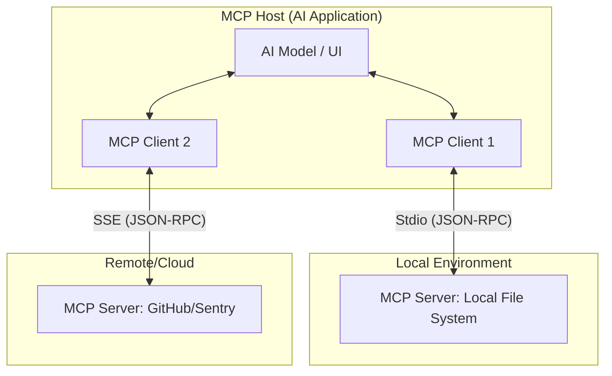
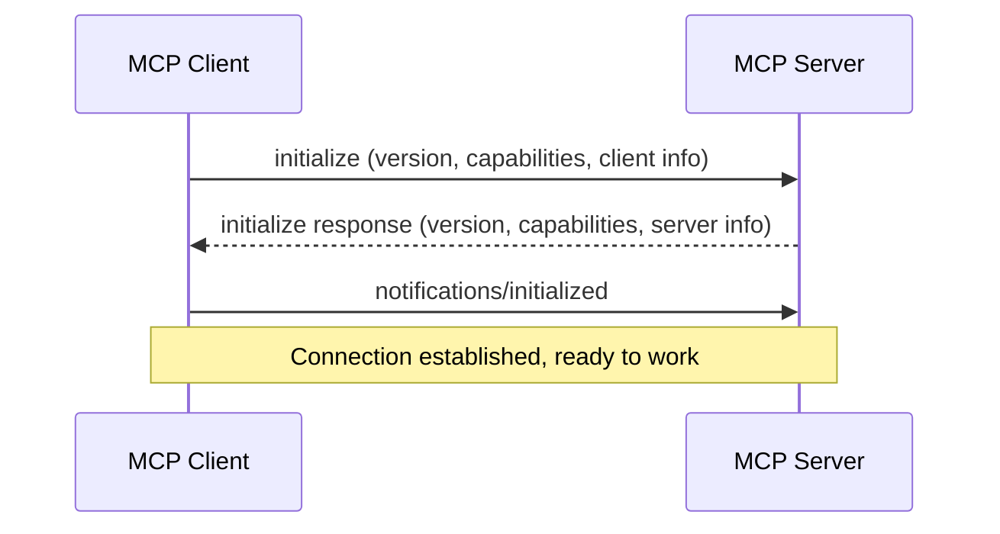
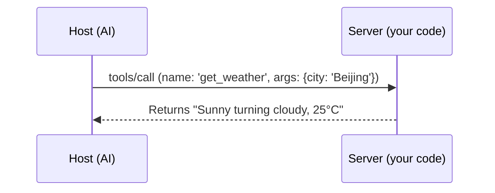

# Model Context Protocol (MCP) Complete Practical Guide: From Beginner to Expert

Welcome to the **MCP Lab**! This guide will take you from zero to mastery through analogies, principle analysis, and progressive practice of MCP's complete development and publishing workflow.

---

## 1. Introduction to MCP: The "Universal Adapter" of the AI World

### 1.1 Why Do We Need MCP?
Imagine wanting your AI to access GitHub, databases, or local files. Before MCP, you had to repeatedly write integration code for each AI software (like Claude, Cursor).
- **Pain Point**: N AI software × M data sources = N*M redundant work.
- **Solution**: **MCP (Model Context Protocol)** is like the **Type-C standard** in electronics. You only need to write one **MCP Server**, and all AI software (**MCP Hosts**) can immediately connect and use it.

### 1.2 Core Role Breakdown
For this adapter to work, we need three roles:
1. **Host (Brain)**: The AI software you directly use (like Claude Desktop, Cursor). It's responsible for thinking and deciding when to call tools.
2. **Server (Hands/Feet)**: The program that actually does the work. It packages capabilities (like checking weather, writing files) and waits to be called.
3. **Client (Connector)**: A component inside the Host responsible for establishing communication with the Server.

---

## 2. Interaction Principles: How Do They Communicate?

MCP is based on JSON-RPC 2.0 protocol, and all interactions follow a strict lifecycle.

### 2.1 Architecture Overview


### 2.2 Initialization Handshake
The first step in establishing a connection is to "exchange secret codes" and negotiate capabilities:


---

## 3. Progressive Practice: Complete Walkthrough

We'll take you through four stages from "using" to "publishing".

### Stage 1: Introduction & Integration (Using Existing Capabilities)
**Goal**: Learn to configure and make AI recognize your Server.
1. **Environment Setup**: `cd examples/mcp-lab && pnpm install`.
2. **Integrate with Claude Desktop**: Modify the config file and add:
   ```json
   "mcpServers": {
     "mcp-lab": {
       "command": "node",
       "args": ["/your/absolute/path/src/index.js"]
     }
   }
   ```
3. **Verification**: Ask Claude "Can you help me add numbers?" Success when you see tool call prompt.

### Stage 2: Debugging & Troubleshooting (Master Developer Tools)
**Goal**: Learn to use a "microscope" to observe protocol details.
1. **Use Inspector**:
   ```bash
   npx @modelcontextprotocol/inspector node src/index.js
   ```
2. **Pitfall Guide**:
   - **Disable `console.log`**: It breaks the protocol flow in Stdio mode.
   - **Use `console.error`**: This is a safe debugging log channel.

### Stage 3: Custom Development (Create New Skills)
**Goal**: Gain ability to write MCP capabilities yourself.
1. **Modify Code**: Open `src/index.js`.
2. **Task**: Following the `add` tool pattern, add a `get_weather` tool.
   - Define parameters in `listTools`.
   - Implement logic in `callTool`.
3. **Principle Review**:


### Stage 4: Publishing & Multi-Host Support (Production Ready)
**Goal**: Make your Server usable worldwide.
1. **Multi-Host Integration**:
   - **Cursor**: Add the same command in `Settings -> Models -> MCP`.
   - **Zed**: Configure `context_servers` in `settings.json`.
2. **Publishing Preparation**:
   - **Package**: Use `esbuild` or `tsc` to bundle code into a single file.
   - **Distribute**: Publish to npm or submit to [Smithery.ai](https://smithery.ai/) registry.
3. **Deployment Recommendations**:
   - Use **Stdio** for local tools.
   - Use **SSE** (HTTP-based) for remote services.

---

## 4. Advanced Core Concepts (Deep Dive)

- **Resources**: Read-only data exposed by the Server (like logs, documents).
- **Prompts**: Predefined interaction templates.
- **Sampling**: Server reverse-requests the Host to call LLM (enables Agent nesting).
- **Roots**: Host tells Server the working scope, enhancing security.

---

## 5. Further Reading: Path to Expertise

- [Official MCP Specification](https://modelcontextprotocol.io/docs/specification/): Deep dive into JSON-RPC details.
- [Official Server Repository](https://github.com/modelcontextprotocol/servers): Study complex implementations like GitHub, Slack.
- [FastMCP (Python)](https://github.com/jlowin/fastmcp): Preferred framework for Python developers.

---
> **Lab Suggestion**: After completing Stage 3, try integrating your Server with Cursor to experience the magic of "write once, run everywhere"!
