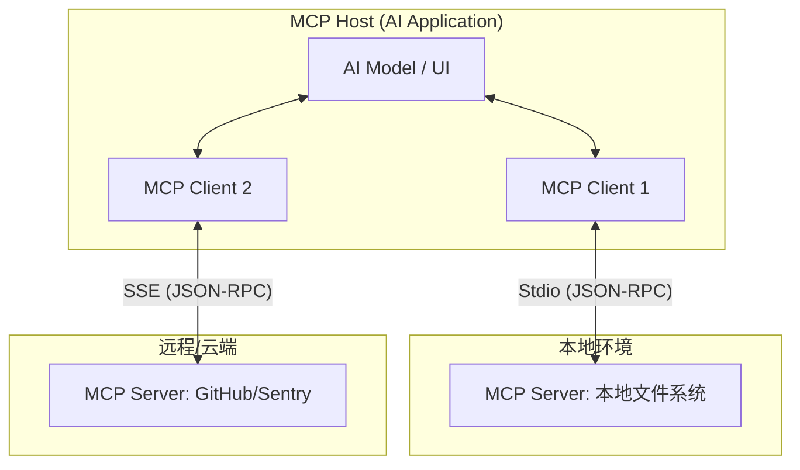
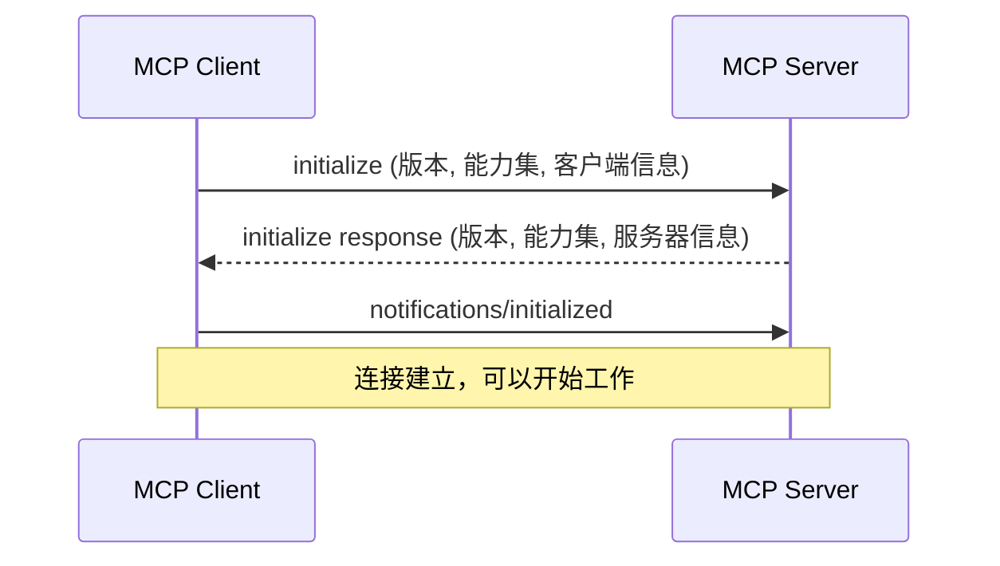
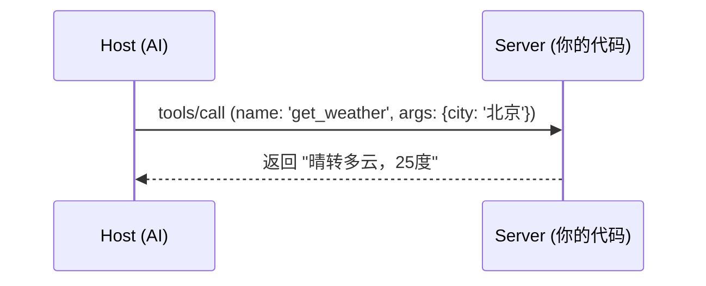

# Model Context Protocol (MCP) 全流程实战指南：从新手到专家

欢迎来到 **MCP 实验室**！本指南将带你从零开始，通过类比理解、原理拆解、渐进式实战，最终掌握 MCP 的全流程开发与发布能力。

---

## 1. 初识 MCP：AI 世界的“万能适配器”

### 1.1 为什么需要 MCP？
想象一下，如果你想让 AI 访问你的 GitHub、数据库或本地文件，在没有 MCP 之前，你必须为每个 AI 软件（如 Claude, Cursor）重复编写集成代码。
- **痛点**：N 个 AI 软件 × M 个数据源 = N*M 次重复劳动。
- **方案**：**MCP (Model Context Protocol)** 就像是电子世界的 **Type-C 标准**。你只需编写一个 **MCP Server**，所有的 AI 软件（**MCP Host**）都能立即连接并使用它。

### 1.2 核心角色拆解
为了让这个适配器工作，我们需要三个角色：
1.  **Host (宿主/大脑)**：你直接使用的 AI 软件（如 Claude Desktop, Cursor）。它负责思考并决定何时调用工具。
2.  **Server (服务/手脚)**：具体干活的程序。它把能力（如查天气、写文件）打包好，等待调用。
3.  **Client (连接器)**：Host 内部的组件，负责与 Server 建立通信。

---

## 2. 交互原理：它们是如何对话的？

MCP 基于 JSON-RPC 2.0 协议，所有的交互都遵循严格的生命周期。

### 2.1 架构全景图


### 2.2 初始化握手 (Handshake)
连接建立的第一步是“对暗号”，协商彼此的能力：


---

## 3. 渐进式实战：全流程通关

我们将通过四个阶段，带你走完从“使用”到“发布”的全流程。

### 阶段一：引入与接入 (使用现有能力)
**目标**：学会配置并让 AI 识别你的 Server。
1. **环境准备**：`cd examples/mcp-lab && pnpm install`。
2. **接入 Claude Desktop**：修改配置文件，添加以下内容：
   ```json
   "mcpServers": {
     "mcp-lab": {
       "command": "node",
       "args": ["/你的绝对路径/src/index.js"]
     }
   }
   ```
3. **验证**：在 Claude 中问：“你能帮我做加法吗？”看到工具调用提示即成功。

### 阶段二：调试与定位 (掌握开发者工具)
**目标**：学会使用“显微镜”观察协议细节。
1. **使用 Inspector**：
   ```bash
   npx @modelcontextprotocol/inspector node src/index.js
   ```
2. **避坑指南**：
   - **禁用 `console.log`**：Stdio 模式下它会破坏协议流。
   - **使用 `console.error`**：这是安全的调试日志通道。

### 阶段三：自定义开发 (创造新技能)
**目标**：具备自行编写 MCP 能力。
1. **修改代码**：打开 `src/index.js`。
2. **任务**：模仿 `add` 工具，添加一个 `get_weather` 工具。
   - 在 `listTools` 中定义参数。
   - 在 `callTool` 中实现逻辑。
3. **原理复习**：


### 阶段四：发布与多 Host 适配 (走向生产)
**目标**：让你的 Server 能够被全世界使用。
1. **多 Host 接入**：
   - **Cursor**: 在 `Settings -> Models -> MCP` 中添加同样的命令。
   - **Zed**: 在 `settings.json` 中配置 `context_servers`。
2. **发布准备**：
   - **打包**：使用 `esbuild` 或 `tsc` 将代码打包为单文件。
   - **分发**：发布到 npm，或提交到 [Smithery.ai](https://smithery.ai/) 注册表。
3. **部署建议**：
   - 本地工具使用 **Stdio**。
   - 远程服务使用 **SSE** (基于 HTTP)。

---

## 4. 进阶核心概念 (深入底层)

- **Resources (资源)**：Server 暴露的只读数据（如日志、文档）。
- **Prompts (提示词)**：预定义的交互模板。
- **Sampling (采样)**：Server 反向请求 Host 调用 LLM（实现 Agent 嵌套）。
- **Roots (根目录)**：Host 告知 Server 工作范围，增强安全性。

---

## 5. 延伸阅读：通往专家之路

- [MCP 官方规范](https://modelcontextprotocol.io/docs/specification/)：深入 JSON-RPC 细节。
- [官方 Server 仓库](https://github.com/modelcontextprotocol/servers)：学习 GitHub、Slack 等复杂实现。
- [FastMCP (Python)](https://github.com/jlowin/fastmcp)：Python 开发者的首选框架。

---
> **实验建议**：完成阶段三后，尝试将你的 Server 接入 Cursor，体验“一次编写，到处运行”的魅力！
