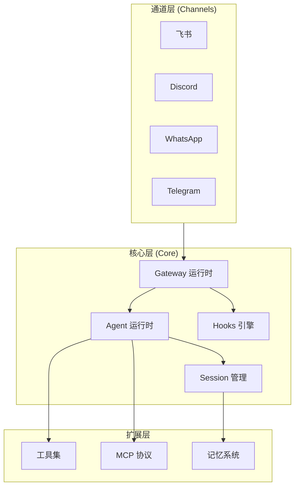

# OpenClaw 源码解析

本目录深入解析 OpenClaw 的核心架构与实现细节，帮助开发者从零复刻一个类似的 AI Agent 运行时系统。

## 核心原则

1. **插件化架构** - 通道(Channel)、工具(Tools)、协议(Protocol)全部通过插件扩展
2. **会话隔离** - 每个对话会话独立管理，支持多租户
3. **事件驱动** - 通过 Hooks 实现自动化响应
4. **流式处理** - 支持 LLM 流式输出和工具调用

## 目录结构

| 文件 | 职责 |
|------|------|
| [architecture.md](./architecture.md) | 整体系统架构 |
| [channels.md](./channels.md) | 通道机制（以飞书为例） |
| [agents.md](./agents.md) | Agent 运行时 |
| [sessions.md](./sessions.md) | 会话管理 |
| [plugins.md](./plugins.md) | 插件系统 |
| [hooks.md](./hooks.md) | Hooks 事件机制 |
| [mcp.md](./mcp.md) | MCP 协议实现 |
| [acp.md](./acp.md) | ACP 协议实现 |
| [tools.md](./tools.md) | 工具系统 |
| [memory.md](./memory.md) | 记忆系统 |
| [config.md](./config.md) | 配置系统 |
| [auth.md](./auth.md) | 认证体系 |

## 架构概览

OpenClaw 是一个**多通道 AI Agent 运行时**，其核心职责是：

1. 接收来自不同通道（飞书、Discord、WhatsApp 等）的消息
2. 将消息路由到对应的会话（Session）
3. 调用 Agent 运行时处理消息
4. 通过 Tools 扩展 Agent 能力
5. 将响应通过原通道发送回去

## 如何复刻其他通道

复刻一个新的消息通道（如微信、企业微信）需要实现：

1. **通道插件** - 实现 `ChannelPlugin` 接口
2. **消息接收** - Webhook 或长连接接收消息
3. **消息发送** - 调用平台 API 发送消息
4. **会话 Key** - 设计会话标识符生成规则
5. **认证** - 实现平台特定的认证机制

详见 [channels.md](./channels.md)
