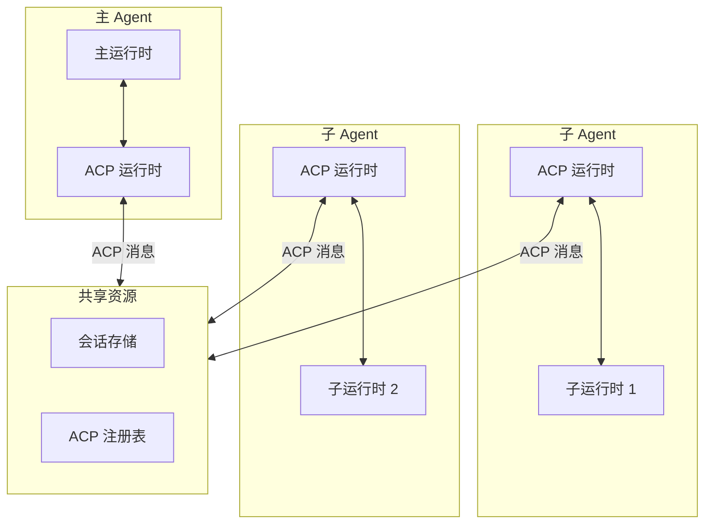

# ACP 协议（Agent Communication Protocol）

## 1. 协议概述

ACP（Agent Communication Protocol）是 OpenClaw 内部的** Agent 间通信协议**。与 MCP（扩展工具能力）不同，ACP 用于：

- Agent 之间的消息传递
- 子 Agent 的创建和管理
- 跨会话状态共享
- 分布式 Agent 协调



## 2. 核心概念

### 2.1 ACP vs MCP

| 特性 | ACP | MCP |
|------|-----|-----|
| **用途** | Agent 间通信 | 扩展工具能力 |
| **方向** | 双向对等 | 客户端-服务器 |
| **消息类型** | 命令、查询、响应、事件 | 工具调用、资源访问 |
| **状态共享** | 支持 | 不支持 |
| **子 Agent** | 支持 | 不支持 |

### 2.2 ACP 消息类型

```typescript
// ACP 消息类型
type ACPMessageType =
  | 'command'      // 命令请求
  | 'query'        // 查询请求
  | 'response'      // 响应
  | 'event'        // 事件通知
  | 'forward'      // 消息转发
  | 'delegate'     // 委托执行

// ACP 消息结构
interface ACPMessage {
  id: string           // 消息唯一 ID
  type: ACPMessageType
  from: AgentId         // 发送者
  to: AgentId           // 接收者
  payload: any          // 消息内容
  correlationId?: string // 关联 ID（用于响应匹配）
  timestamp: number
  ttl?: number          // 生存时间
}
```

## 3. 消息类型详解

### 3.1 Command（命令）

```typescript
// 命令消息
interface ACPCommand extends ACPMessage {
  type: 'command'
  payload: {
    action: string          // 操作类型
    target?: AgentId        // 目标 Agent
    args?: object           // 参数
    timeout?: number        // 超时时间
  }
}

// 示例：主 Agent 发送命令给子 Agent
{
  id: 'msg_001',
  type: 'command',
  from: 'agent:main',
  to: 'agent:sub-1',
  payload: {
    action: 'execute_task',
    args: {
      task: 'analyze_data',
      data: { source: 'sales_report' }
    },
    timeout: 30000
  },
  timestamp: 1709876543000
}
```

### 3.2 Query（查询）

```typescript
// 查询消息
interface ACPQuery extends ACPMessage {
  type: 'query'
  payload: {
    resource: string       // 资源路径
    filter?: object        // 过滤条件
  }
}

// 示例：查询子 Agent 状态
{
  id: 'msg_002',
  type: 'query',
  from: 'agent:main',
  to: 'agent:sub-1',
  payload: {
    resource: 'status',
    filter: { includeHistory: false }
  },
  timestamp: 1709876543000
}
```

### 3.3 Event（事件）

```typescript
// 事件消息
interface ACPEvent extends ACPMessage {
  type: 'event'
  payload: {
    name: string           // 事件名称
    data?: any            // 事件数据
    broadcast?: boolean    // 是否广播
  }
}

// 示例：子 Agent 广播任务完成
{
  id: 'msg_003',
  type: 'event',
  from: 'agent:sub-1',
  to: '*',               // * 表示广播
  payload: {
    name: 'task_completed',
    data: {
      taskId: 'task_123',
      result: { summary: 'Analysis complete' }
    },
    broadcast: true
  },
  timestamp: 1709876543000
}
```

## 4. ACP 运行时

### 4.1 核心接口

```typescript
interface ACPRuntime {
  // 发送消息
  send(message: ACPMessage): Promise<void>

  // 发送并等待响应
  sendAndWait(message: ACPMessage, timeout?: number): Promise<ACPMessage>

  // 订阅消息
  subscribe(
    filter: MessageFilter,
    handler: (message: ACPMessage) => Promise<void>
  ): SubscriptionId

  // 取消订阅
  unsubscribe(subscriptionId: SubscriptionId): void

  // 注册为接收者
  registerReceiver(receiver: AgentReceiver): void
}

interface AgentReceiver {
  agentId: AgentId
  handleMessage(message: ACPMessage): Promise<ACPMessage | null>
}

interface MessageFilter {
  from?: AgentId | AgentId[]
  to?: AgentId | AgentId[]
  type?: ACPMessageType | ACPMessageType[]
  action?: string
}
```

### 4.2 实现

```typescript
class DefaultACPRuntime implements ACPRuntime {
  private subscriptions: Map<SubscriptionId, Subscription> = new Map()
  private pendingRequests: Map<string, PendingRequest> = new Map()
  private messageQueue: ACPMessage[] = []
  private receivers: Map<AgentId, AgentReceiver> = new Map()

  async send(message: ACPMessage): Promise<void> {
    // 1. 验证消息
    this.validateMessage(message)

    // 2. 查找接收者
    const receiver = this.receivers.get(message.to)
    if (!receiver && message.to !== '*') {
      // 持久化到队列供后续投递
      this.persistToQueue(message)
      return
    }

    // 3. 投递消息
    if (receiver) {
      const response = await receiver.handleMessage(message)
      if (response && message.correlationId) {
        await this.deliverResponse(response)
      }
    } else {
      // 广播
      await this.broadcast(message)
    }
  }

  async sendAndWait(
    message: ACPMessage,
    timeout = 30000
  ): Promise<ACPMessage> {
    // 1. 生成关联 ID
    message.correlationId = generateUUID()

    // 2. 发送消息
    await this.send(message)

    // 3. 等待响应
    return new Promise((resolve, reject) => {
      const timer = setTimeout(() => {
        this.pendingRequests.delete(message.correlationId!)
        reject(new Error(`ACP message timeout: ${message.id}`))
      }, timeout)

      this.pendingRequests.set(message.correlationId, {
        resolve: (msg) => {
          clearTimeout(timer)
          resolve(msg)
        },
        reject
      })
    })
  }

  subscribe(
    filter: MessageFilter,
    handler: (message: ACPMessage) => Promise<void>
  ): SubscriptionId {
    const id = generateUUID()
    this.subscriptions.set(id, { filter, handler })
    return id
  }
}
```

## 5. 子 Agent 管理

### 5.1 创建子 Agent

```typescript
interface SubAgentSpec {
  id: string
  name?: string
  model?: string
  instructions?: string
  tools?: string[]
  maxConcurrent?: number
}

// 创建子 Agent
async function createSubAgent(spec: SubAgentSpec): Promise<AgentId> {
  const agentId = `agent:${spec.id}`

  // 1. 初始化子 Agent 会话
  const session = await sessionManager.create({
    key: `sub:${agentId}`,
    config: {
      model: spec.model,
      instructions: spec.instructions
    }
  })

  // 2. 注册到 ACP
  await acpRuntime.registerReceiver({
    agentId,
    handleMessage: async (msg) => {
      return await handleSubAgentMessage(agentId, msg)
    }
  })

  // 3. 返回 Agent ID
  return agentId
}

async function handleSubAgentMessage(
  agentId: AgentId,
  message: ACPMessage
): Promise<ACPMessage | null> {
  switch (message.type) {
    case 'command':
      return await executeCommand(agentId, message.payload)
    case 'query':
      return await handleQuery(agentId, message.payload)
    default:
      return null
  }
}
```

### 5.2 委托执行

```typescript
// 委托任务给子 Agent
async function delegateToSubAgent(
  subAgentId: AgentId,
  task: string,
  context: object
): Promise<TaskResult> {
  const command: ACPCommand = {
    id: generateUUID(),
    type: 'command',
    from: currentAgentId,
    to: subAgentId,
    payload: {
      action: 'execute_task',
      args: { task, context }
    },
    timestamp: Date.now()
  }

  // 发送并等待结果
  const response = await acpRuntime.sendAndWait(command, 60000)

  return response.payload.result
}
```

### 5.3 广播

```typescript
// 广播消息给所有子 Agent
async function broadcastToSubAgents(
  eventName: string,
  data: any
): Promise<void> {
  const event: ACPEvent = {
    id: generateUUID(),
    type: 'event',
    from: currentAgentId,
    to: '*',  // 广播
    payload: {
      name: eventName,
      data,
      broadcast: true
    },
    timestamp: Date.now()
  }

  await acpRuntime.send(event)
}
```

## 6. 消息队列

### 6.1 离线消息处理

```typescript
class MessageQueue {
  private storage: PersistentStorage

  // 入队
  async enqueue(message: ACPMessage): Promise<void> {
    await this.storage.append('acp_queue', message)
  }

  // 出队
  async dequeue(limit = 100): Promise<ACPMessage[]> {
    const messages = await this.storage.read('acp_queue', limit)
    await this.storage.delete('acp_queue', messages.map(m => m.id))
    return messages
  }

  // 重试失败的投递
  async retryFailed(maxAttempts = 3): Promise<void> {
    const failed = await this.storage.read('acp_queue_failed')

    for (const msg of failed) {
      if ((msg.attempts || 0) >= maxAttempts) {
        // 超过重试次数，移入死信队列
        await this.storage.move(msg, 'acp_queue_dlq')
        continue
      }

      try {
        await acpRuntime.send(msg)
        await this.storage.delete('acp_queue_failed', msg.id)
      } catch {
        msg.attempts = (msg.attempts || 0) + 1
        await this.storage.update('acp_queue_failed', msg)
      }
    }
  }
}
```

## 7. 安全性

### 7.1 消息签名

```typescript
// 签名消息
function signMessage(message: ACPMessage, privateKey: string): string {
  const payload = JSON.stringify({
    id: message.id,
    type: message.type,
    from: message.from,
    to: message.to,
    timestamp: message.timestamp
  })

  return crypto.sign('RSA-SHA256', payload, privateKey)
}

// 验证签名
function verifyMessage(message: ACPMessage, signature: string, publicKey: string): boolean {
  const payload = JSON.stringify({
    id: message.id,
    type: message.type,
    from: message.from,
    to: message.to,
    timestamp: message.timestamp
  })

  return crypto.verify('RSA-SHA256', payload, publicKey, signature)
}
```

### 7.2 访问控制

```typescript
// ACL 检查
async function checkACL(message: ACPMessage): Promise<boolean> {
  const fromAgent = message.from
  const toAgent = message.to

  // 主 Agent 可以给任何子 Agent 发消息
  if (fromAgent === 'agent:main') return true

  // 子 Agent 只能给主 Agent 或同级的子 Agent 发消息
  if (fromAgent.startsWith('agent:sub-')) {
    // 不能直接给另一个子 Agent 发消息，需要通过主 Agent 转发
    if (!toAgent.startsWith('agent:main')) {
      return false
    }
  }

  return true
}
```

## 8. 配置

### 8.1 ACP 配置

```yaml
# openclaw.yaml
acp:
  # 是否启用 ACP
  enabled: true

  # 消息队列路径
  queue_dir: ~/.openclaw/acp/queue

  # 默认超时时间
  default_timeout: 30000

  # 最大重试次数
  max_retries: 3

  # 子 Agent 配置
  sub_agents:
    max_count: 10
    default_model: claude-sonnet-4-20250514
```

## 9. 使用场景

### 9.1 并行任务处理

```typescript
// 主 Agent 并行委托多个子 Agent
async function parallelAnalysis(dataItems: any[]) {
  const subAgents = await Promise.all(
    dataItems.map((item, i) =>
      createSubAgent({ id: `analyzer-${i}` })
    )
  )

  // 并行发送任务
  const results = await Promise.all(
    subAgents.map((agentId, i) =>
      delegateToSubAgent(agentId, 'analyze', { data: dataItems[i] })
    )
  )

  // 合并结果
  return mergeResults(results)
}
```

### 9.2 工作流编排

```typescript
// 顺序执行工作流
async function executeWorkflow(steps: WorkflowStep[]) {
  let context = {}

  for (const step of steps) {
    const subAgent = await createSubAgent({ id: step.agent })

    const result = await delegateToSubAgent(
      subAgent,
      step.action,
      { ...context, ...step.input }
    )

    context = { ...context, ...result }
  }

  return context
}
```

## 10. 手把手复刻

### 最小实现

以下是 ACP 协议的核心实现：

```typescript
// === 1. ACP 消息类型 ===
type ACPMessageType = 'command' | 'query' | 'response' | 'event'

interface ACPMessage {
  id: string
  type: ACPMessageType
  from: string
  to: string
  payload: any
  correlationId?: string
  timestamp: number
}

// === 2. 最小 ACP 运行时 ===
class MinimalACPRuntime {
  private receivers: Map<string, (msg: ACPMessage) => Promise<ACPMessage | null>> = new Map()
  private pendingRequests: Map<string, any> = new Map()

  // 注册接收者
  registerReceiver(agentId: string, handler: (msg: ACPMessage) => Promise<ACPMessage | null>) {
    this.receivers.set(agentId, handler)
  }

  // 发送消息
  async send(message: ACPMessage): Promise<void> {
    const receiver = this.receivers.get(message.to)
    if (!receiver) {
      console.warn(`No receiver for ${message.to}`)
      return
    }

    const response = await receiver(message)
    
    // 如果有 correlationId，发送响应
    if (response && message.correlationId) {
      response.correlationId = message.correlationId
      await this.send(response)
    }
  }

  // 发送并等待响应
  async sendAndWait(message: ACPMessage, timeout = 30000): Promise<ACPMessage> {
    message.correlationId = crypto.randomUUID()
    
    return new Promise((resolve, reject) => {
      const timer = setTimeout(() => {
        this.pendingRequests.delete(message.correlationId!)
        reject(new Error('ACP message timeout'))
      }, timeout)

      this.pendingRequests.set(message.correlationId, { resolve, timer })
      this.send(message)
    })
  }

  // 处理响应
  private handleResponse(response: ACPMessage) {
    const pending = this.pendingRequests.get(response.correlationId!)
    if (pending) {
      clearTimeout(pending.timer)
      pending.resolve(response)
      this.pendingRequests.delete(response.correlationId!)
    }
  }
}

// === 3. 使用示例 ===
const acp = new MinimalACPRuntime()

// 注册子 Agent
acp.registerReceiver('agent:sub-1', async (msg) => {
  switch (msg.type) {
    case 'command':
      if (msg.payload.action === 'analyze') {
        const result = await analyze(msg.payload.args.data)
        return {
          id: crypto.randomUUID(),
          type: 'response',
          from: 'agent:sub-1',
          to: msg.from,
          payload: { result },
          timestamp: Date.now()
        }
      }
      break
  }
  return null
})

// 主 Agent 发送命令
const response = await acp.sendAndWait({
  id: crypto.randomUUID(),
  type: 'command',
  from: 'agent:main',
  to: 'agent:sub-1',
  payload: { action: 'analyze', args: { data: 'test' } },
  timestamp: Date.now()
})
```

### 关键接口

| 接口 | 参数 | 返回值 | 说明 |
|------|------|--------|------|
| `send()` | `message: ACPMessage` | `Promise<void>` | 发送消息 |
| `sendAndWait()` | `message, timeout` | `Promise<ACPMessage>` | 发送并等待响应 |
| `registerReceiver()` | `agentId, handler` | `void` | 注册接收者 |
| `broadcast()` | `message` | `Promise<void>` | 广播消息 |

### 常见陷阱

1. **消息 ID 重复**
   - 错误：使用简单计数器作为消息 ID
   - 正确：使用 UUID 确保唯一性

2. **超时处理不当**
   - 错误：不设置超时或超时后不清理
   - 正确：使用 `setTimeout` 并在超时时删除待处理请求

   ```typescript
   const timer = setTimeout(() => {
     this.pendingRequests.delete(correlationId)
     reject(new Error('Timeout'))
   }, timeout)
   ```

3. **会话绑定遗漏**
   - 错误：子 Agent 结果不关联父会话
   - 正确：使用 `correlationId` 追踪请求-响应对

### 实战练习

1. **练习一：实现简单命令分发**
   ```typescript
   acp.registerReceiver('agent:worker', async (msg) => {
     if (msg.type === 'command') {
       switch (msg.payload.action) {
         case 'process':
           return { type: 'response', payload: { result: 'processed' } }
         case 'stop':
           return { type: 'response', payload: { stopped: true } }
       }
     }
   })
   ```

2. **练习二：实现事件广播**
   ```typescript
   async function broadcast(event: ACPMessage) {
     event.to = '*' // * 表示广播
     for (const [agentId, handler] of receivers) {
       if (agentId !== event.from) {
         await handler(event)
       }
     }
   }
   ```

3. **练习三：实现消息队列**
   ```typescript
   class ACPMessageQueue {
     private queue: ACPMessage[] = []

     async enqueue(msg: ACPMessage) {
       this.queue.push(msg)
     }

     async process() {
       while (this.queue.length > 0) {
         const msg = this.queue.shift()!
         try {
           await acp.send(msg)
         } catch (err) {
           // 失败重新入队
           this.queue.unshift(msg)
           await sleep(1000)
         }
       }
     }
   }
   ```

## 11. 相关文档

- [Agent 运行时](./agents.md)
- [会话管理](./sessions.md)
- [工具系统](./tools.md)
