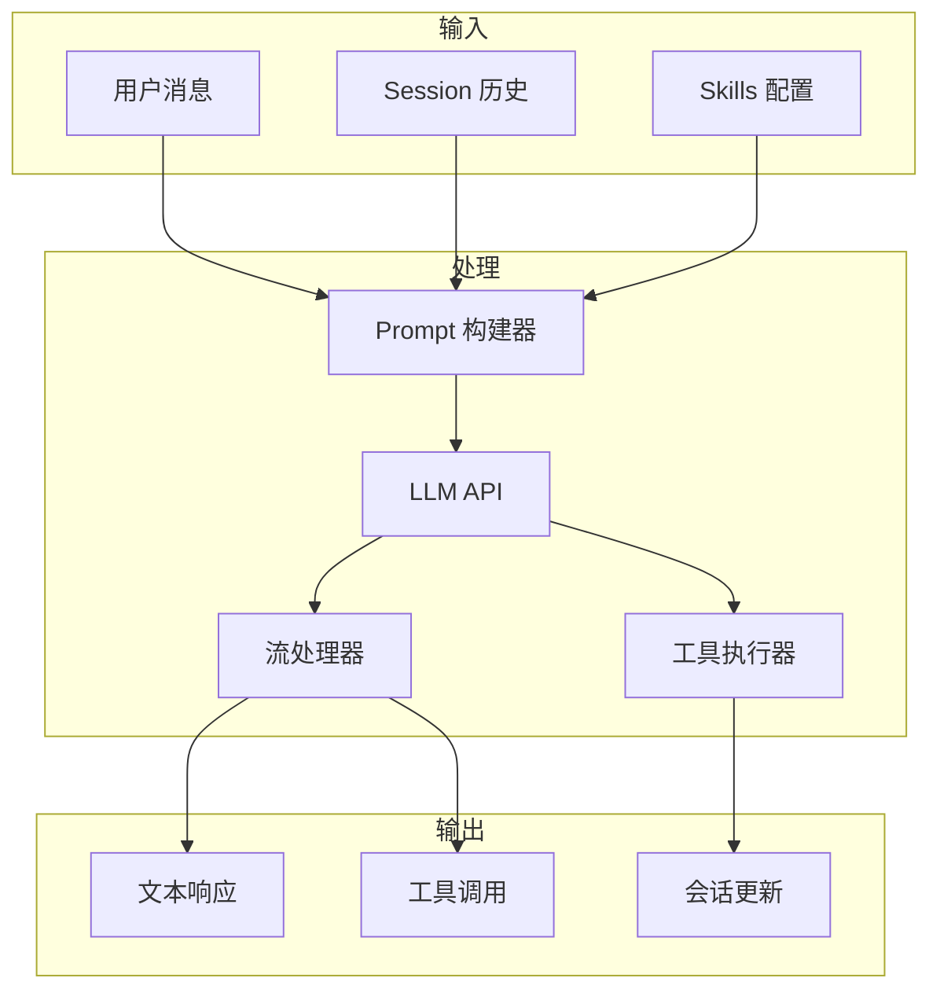
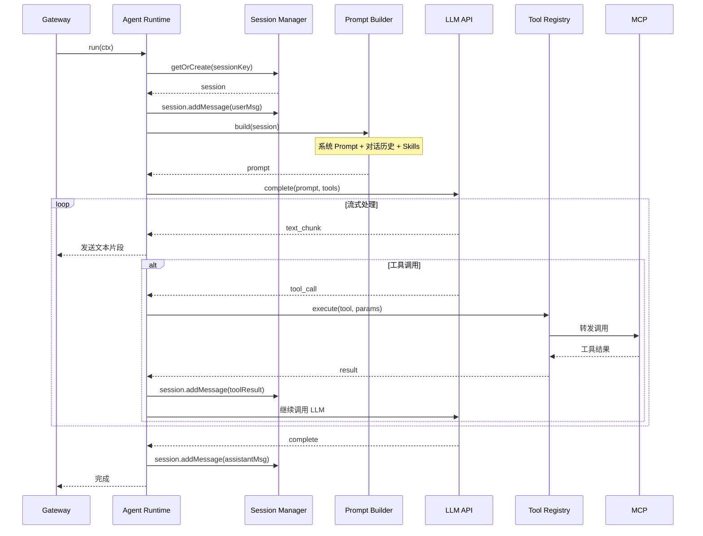

# Agent 运行时

## 1. 核心职责

Agent 运行时是 OpenClaw 的核心，负责：

1. **接收消息** - 从 Gateway 获取入站消息
2. **构建 Prompt** - 组装系统提示词和对话历史
3. **调用 LLM** - 与大语言模型交互
4. **执行工具** - 调用 Tools 扩展能力
5. **流式响应** - 支持实时流式输出
6. **会话更新** - 保存消息到会话历史



## 2. Agent 执行流程



## 3. 核心组件

### 3.1 AgentRuntime

```typescript
// 伪代码实现
class AgentRuntime {
  constructor(
    private sessionManager: SessionManager,
    private toolRegistry: ToolRegistry,
    private modelRouter: ModelRouter,
    private promptBuilder: PromptBuilder
  ) {}

  async run(ctx: InboundContext): Promise<void> {
    // 1. 获取会话
    const session = await this.sessionManager.getOrCreate(ctx.sessionKey)

    // 2. 添加用户消息
    const userMessage: Message = {
      role: 'user',
      content: ctx.content,
      timestamp: Date.now()
    }
    session.addMessage(userMessage)

    // 3. 构建 Prompt
    const prompt = await this.promptBuilder.build(session)

    // 4. 获取模型配置
    const modelConfig = await this.modelRouter.resolve(session)

    // 5. 流式执行
    const stream = await this.llm.complete({
      prompt,
      model: modelConfig,
      tools: this.toolRegistry.getToolDefinitions()
    })

    // 6. 处理流
    for await (const event of stream) {
      switch (event.type) {
        case 'text_delta':
          ctx.sendChunk(event.text)
          break
        case 'tool_call':
          await this.handleToolCall(event, session, ctx)
          break
        case 'complete':
          await this.handleComplete(event, session)
          break
      }
    }
  }

  private async handleToolCall(
    event: ToolCallEvent,
    session: Session,
    ctx: InboundContext
  ) {
    const tool = this.toolRegistry.get(event.toolName)
    if (!tool) {
      throw new Error(`Tool not found: ${event.toolName}`)
    }

    // 执行工具
    const result = await tool.execute(event.parameters)

    // 添加到会话
    session.addMessage({
      role: 'tool',
      name: event.toolName,
      content: JSON.stringify(result),
      toolCallId: event.id
    })

    // 继续 LLM 调用
    await this.continueLoop(session, ctx)
  }
}
```

### 3.2 PromptBuilder

```typescript
class PromptBuilder {
  constructor(
    private systemPrompt: string,
    private skillsLoader: SkillsLoader
  ) {}

  async build(session: Session): Promise<Prompt> {
    // 1. 加载 Skills
    const skills = await this.skillsLoader.load(session.agentId)

    // 2. 构建系统提示词
    const systemPrompt = this.buildSystemPrompt(skills)

    // 3. 获取上下文文件
    const contextFiles = await this.loadContextFiles(session)

    // 4. 组装完整 Prompt
    return {
      system: systemPrompt,
      messages: this.formatHistory(session.messages),
      context: contextFiles
    }
  }

  private buildSystemPrompt(skills: Skill[]): string {
    let prompt = this.systemPrompt

    // 添加 Skills
    for (const skill of skills) {
      prompt += `\n\n## ${skill.name}\n${skill.description}`
      if (skill.instructions) {
        prompt += `\n${skill.instructions}`
      }
    }

    return prompt
  }

  private formatHistory(messages: Message[]): FormattedMessage[] {
    return messages.map(msg => ({
      role: msg.role,
      content: msg.content
    }))
  }
}
```

### 3.3 ModelRouter

```typescript
class ModelRouter {
  // 模型选择
  async resolve(session: Session): Promise<ModelConfig> {
    // 1. 检查会话是否有覆盖
    if (session.model) {
      return this.parseModelRef(session.model)
    }

    // 2. 检查 Agent 默认配置
    const agentConfig = this.getAgentConfig(session.agentId)
    if (agentConfig?.model) {
      return this.parseModelRef(agentConfig.model)
    }

    // 3. 使用全局默认
    return this.parseModelRef('claude-sonnet-4-20250514')
  }

  // 解析模型引用（支持带 provider）
  parseModelRef(ref: string): ModelConfig {
    // 支持格式: "claude-sonnet-4", "anthropic/claude-sonnet-4", "openai/gpt-4o"
    const [provider, model] = ref.includes('/')
      ? ref.split('/')
      : ['anthropic', ref]

    return { provider, model }
  }
}
```

## 4. 流式处理

### 4.1 流式事件

```typescript
// 流式事件类型
type StreamEvent =
  | { type: 'text_delta'; text: string }
  | { type: 'text_complete' }
  | { type: 'tool_call'; id: string; name: string; params: object }
  | { type: 'tool_result'; id: string; result: any }
  | { type: 'usage'; inputTokens: number; outputTokens: number }
  | { type: 'error'; error: Error }

// 消息流式发送
class StreamingResponse {
  private chunks: string[] = []

  onText(handler: (text: string) => void): void {
    this.textHandler = handler
  }

  emit(event: StreamEvent) {
    if (event.type === 'text_delta') {
      this.chunks.push(event.text)
      this.textHandler?.(event.text)
    }
  }

  getFullText(): string {
    return this.chunks.join('')
  }
}
```

### 4.2 工具调用流式处理

```typescript
// 工具调用处理
async function processToolCalls(
  toolCalls: ToolCall[],
  toolRegistry: ToolRegistry,
  session: Session,
  llm: LLM
) {
  const results: ToolResult[] = []

  // 顺序执行工具（也可以并行）
  for (const call of toolCalls) {
    const tool = toolRegistry.get(call.name)
    if (!tool) {
      results.push({
        id: call.id,
        error: `Tool not found: ${call.name}`
      })
      continue
    }

    try {
      const result = await tool.execute(call.params)
      results.push({ id: call.id, result })
    } catch (err) {
      results.push({
        id: call.id,
        error: err.message
      })
    }
  }

  // 将工具结果追加到会话
  for (const result of results) {
    session.addMessage({
      role: 'tool',
      toolCallId: result.id,
      content: JSON.stringify(result)
    })
  }

  // 继续 LLM 调用以获取最终回复
  return await llm.continue(session)
}
```

## 5. 工具系统

### 5.1 工具定义

```typescript
interface Tool {
  // 工具名称
  name: string

  // 工具描述
  description: string

  // 输入参数 schema
  inputSchema: JsonSchema

  // 执行函数
  execute(params: any, context: ToolContext): Promise<ToolResult>
}

interface ToolContext {
  session: Session
  userId: string
  channelId: string
  // ... 其他上下文
}
```

### 5.2 内置工具

OpenClaw 提供丰富的内置工具：

| 工具 | 功能 |
|------|------|
| `read` | 读取文件 |
| `write` | 写入文件 |
| `exec` | 执行 Shell 命令 |
| `browser` | 浏览器自动化 |
| `web_search` | 网络搜索 |
| `image_generate` | 图片生成 |
| `calendar` | 日历管理 |
| `task` | 任务管理 |

### 5.3 工具注册

```typescript
class ToolRegistry {
  private tools: Map<string, Tool> = new Map()

  register(tool: Tool) {
    this.tools.set(tool.name, tool)
  }

  get(name: string): Tool | undefined {
    return this.tools.get(name)
  }

  getToolDefinitions(): ToolDefinition[] {
    return Array.from(this.tools.values()).map(tool => ({
      name: tool.name,
      description: tool.description,
      input_schema: tool.inputSchema
    }))
  }
}
```

## 6. 工具结果持久化

工具结果通过 `tool_result_persist` Hook 机制处理：

```typescript
// Hook: tool_result_persist
// 同步处理，在工具结果写入会话记录前调用

interface ToolResultPersistContext {
  toolName: string
  params: object
  result: any
  sessionId: string
}

// 可以修改结果后再返回
function toolResultPersistHook(ctx: ToolResultPersistContext): ToolResultPersistContext {
  // 例如：脱敏处理
  if (ctx.toolName === 'exec') {
    ctx.result.output = maskSensitiveData(ctx.result.output)
  }
  return ctx
}
```

## 7. 错误处理

### 7.1 重试机制

```typescript
async function withRetry<T>(
  fn: () => Promise<T>,
  options: {
    maxRetries?: number
    backoff?: number
    shouldRetry?: (err: Error) => boolean
  } = {}
): Promise<T> {
  const { maxRetries = 3, backoff = 1000, shouldRetry } = options

  for (let attempt = 0; attempt <= maxRetries; attempt++) {
    try {
      return await fn()
    } catch (err) {
      if (attempt === maxRetries || (shouldRetry && !shouldRetry(err))) {
        throw err
      }
      await sleep(backoff * Math.pow(2, attempt))
    }
  }
  throw new Error('Unreachable')
}
```

### 7.2 限流处理

```typescript
class RateLimitHandler {
  async handle(err: Error) {
    if (err.status === 429) {
      // Too Many Requests
      const retryAfter = err.headers?.['retry-after'] || 60
      await sleep(retryAfter * 1000)
      return true // 继续重试
    }
    return false // 不重试
  }
}
```

## 8. 超时控制

```typescript
class TimeoutController {
  private timeoutId?: NodeJS.Timeout

  setTimeout(ms: number, fn: () => void) {
    this.clearTimeout()
    this.timeoutId = setTimeout(fn, ms)
  }

  clearTimeout() {
    if (this.timeoutId) {
      clearTimeout(this.timeoutId)
      this.timeoutId = undefined
    }
  }

  async withTimeout<T>(ms: number, fn: () => Promise<T>): Promise<T> {
    return Promise.race([
      fn(),
      new Promise<T>((_, reject) =>
        setTimeout(() => reject(new Error('Timeout')), ms)
      )
    ])
  }
}
```

## 9. 相关文档

- [工具系统详解](./tools.md)
- [Agent Loop 文档](https://docs.openclaw.ai/concepts/agent-loop)
- [系统提示词](./system-prompt.md)
- [Compaction 机制](./compaction.md)
