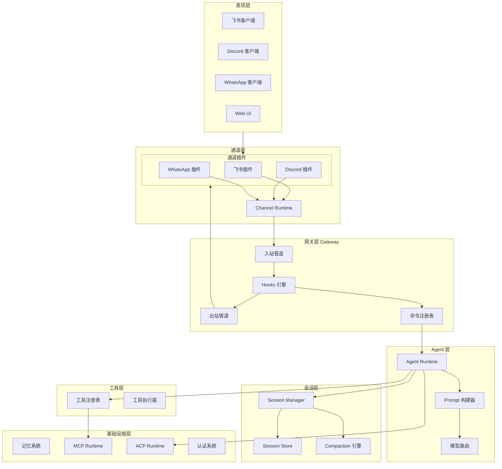
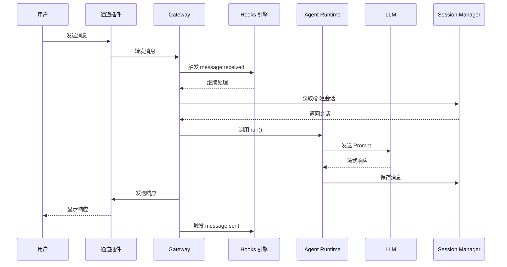
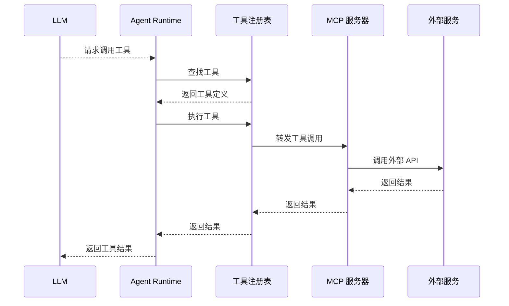

# OpenClaw 整体架构解析

## 1. 核心定位

OpenClaw 是一个**多通道 AI Agent 运行时（Multi-Channel Agent Runtime）**。它的核心价值在于：

- **抽象消息通道** - 统一处理来自不同平台（飞书、Discord、WhatsApp）的消息
- **会话管理** - 为每个用户/对话维护独立的会话状态
- **Agent 执行** - 调用 LLM 并通过 Tools 扩展能力
- **事件驱动** - 通过 Hooks 实现自动化

## 2. 分层架构



## 3. 核心组件

### 3.1 Gateway（网关）

Gateway 是 OpenClaw 的核心进程，负责：

- 加载和管理所有通道插件
- 接收和处理入站消息
- 协调 Agent 执行
- 管理会话生命周期
- 运行 Hooks

```typescript
// Gateway 核心职责（伪代码）
class Gateway {
  channels: ChannelPlugin[]
  sessionManager: SessionManager
  hooksEngine: HooksEngine
  agentRuntime: AgentRuntime

  async start() {
    // 1. 加载通道插件
    await this.loadChannels()

    // 2. 初始化会话存储
    await this.sessionManager.init()

    // 3. 注册 Hooks
    await this.hooksEngine.register()

    // 4. 启动通道（监听消息）
    for (const channel of this.channels) {
      await channel.start()
    }
  }

  async handleInboundMessage(ctx: InboundContext) {
    // 1. 触发 message:received hooks
    await this.hooksEngine.emit('message:received', ctx)

    // 2. 解析命令
    const command = this.parseCommand(ctx.content)

    // 3. 如果是命令（如 /new, /reset）
    if (command) {
      await this.handleCommand(command, ctx)
    } else {
      // 4. 触发 agent 处理
      await this.agentRuntime.run(ctx)
    }

    // 5. 触发 message:sent hooks
    await this.hooksEngine.emit('message:sent', ctx)
  }
}
```

### 3.2 Channel（通道）

通道是 OpenClaw 与外部消息系统交互的桥梁。每个通道插件负责：

- 接收消息（Webhook 或长连接）
- 发送消息
- 会话 Key 生成
- 身份解析

```typescript
interface ChannelPlugin {
  // 通道 ID（如 'feishu', 'discord'）
  id: string

  // 启动通道监听
  start(): Promise<void>

  // 停止通道
  stop(): Promise<void>

  // 发送消息
  send(ctx: OutboundContext): Promise<void>

  // 解析会话 Key
  resolveSessionKey(ctx: InboundContext): string

  // 解析发送者身份
  resolveSenderId(ctx: InboundContext): string
}
```

### 3.3 Agent Runtime（Agent 运行时）

Agent 运行时负责：

- 加载会话历史
- 构建 Prompt
- 调用 LLM
- 执行工具
- 处理流式输出

```typescript
// Agent 执行流程（伪代码）
class AgentRuntime {
  async run(ctx: InboundContext) {
    // 1. 获取或创建会话
    const session = await this.sessionManager.getOrCreate(ctx.sessionKey)

    // 2. 添加用户消息到会话
    session.addMessage({
      role: 'user',
      content: ctx.content
    })

    // 3. 构建 Prompt
    const prompt = this.promptBuilder.build(session)

    // 4. 调用 LLM（流式）
    const stream = await this.llm.complete(prompt, {
      tools: this.toolRegistry.getTools()
    })

    // 5. 处理流式响应
    for (const event of stream) {
      if (event.type === 'tool_call') {
        // 执行工具
        const result = await this.toolRegistry.execute(event.tool, event.params)
        session.addMessage({
          role: 'tool',
          content: JSON.stringify(result)
        })
      } else if (event.type === 'text') {
        // 发送文本片段
        ctx.sendChunk(event.text)
      }
    }

    // 6. 保存会话
    await this.sessionManager.save(session)
  }
}
```

### 3.4 Session（会话）

会话管理是 OpenClaw 的核心功能之一，每个会话维护：

- 消息历史
- 模型配置
- 会话标签
- 元数据

```typescript
interface Session {
  id: string
  key: string  // 路由 Key，如 'agent:main:user_123'
  messages: Message[]
  model?: string
  createdAt: Date
  updatedAt: Date
  metadata: Record<string, any>
}
```

### 3.5 Hooks（钩子）

Hooks 是事件驱动的自动化机制：

```typescript
// Hook 类型
type HookEvent =
  | 'message:received'  // 收到消息
  | 'message:preprocessed'  // 消息预处理后
  | 'message:sent'  // 消息发送后
  | 'command:new'  // /new 命令
  | 'command:reset'  // /reset 命令
  | 'agent:bootstrap'  // Agent 启动前
  | 'session:compact:before'  // 会话压缩前
  | 'session:compact:after'  // 会话压缩后
  | 'gateway:startup'  // 网关启动
  | 'gateway:stop'  // 网关关闭

interface Hook {
  name: string
  events: HookEvent[]
  handler: (event: HookEvent) => Promise<void>
}
```

## 4. 数据流

### 4.1 消息入站流程



### 4.2 工具调用流程



## 5. 关键设计模式

### 5.1 插件化架构

OpenClaw 大量使用插件化设计：

```typescript
// 插件接口
interface Plugin {
  id: string
  name: string
  version: string

  // 生命周期
  onLoad(ctx: PluginContext): Promise<void>
  onUnload(): Promise<void>

  // 扩展点
  registerTools(registry: ToolRegistry): void
  registerHooks(hooks: HooksEngine): void
  registerChannels(channels: ChannelRegistry): void
}
```

### 5.2 会话 Key 路由

会话 Key 是 OpenClaw 路由的核心：

```
agent:{agentId}:{channel}:{senderId}
```

例如：`agent:main:feishu:ou_123456`

### 5.3 事件驱动

所有操作都通过事件驱动：

```typescript
// 事件系统
class EventEmitter {
  on(event: string, handler: Handler): void
  off(event: string, handler: Handler): void
  emit(event: string, data: any): Promise<void>
}

// Hook 优先级
enum HookPriority {
  HIGH = 1,    // 最高优先级，可阻止后续处理
  NORMAL = 0,  // 普通优先级
  LOW = -1     // 低优先级
}
```

### 5.4 流式处理

所有 I/O 都是流式的：

```typescript
// 流式接口
interface StreamingResponse {
  // 文本片段
  onText(handler: (text: string) => void): void
  // 工具调用
  onToolCall(handler: (call: ToolCall) => void): void
  // 完成
  onComplete(handler: (usage: Usage) => void): void
  // 错误
  onError(handler: (error: Error) => void): void
}
```

## 6. 配置体系

OpenClaw 使用 JSON Schema 验证配置：

```typescript
// 配置结构
interface OpenClawConfig {
  agents: {
    [agentId: string]: {
      model?: string
      provider?: string
    }
  }
  channels: {
    [channelId: string]: ChannelConfig
  }
  hooks?: {
    internal?: {
      enabled: boolean
      entries?: Record<string, HookEntry>
    }
  }
  plugins?: {
    registry?: string[]
  }
}
```

## 7. 手把手复刻

### 最小实现

以下是实现 OpenClaw 核心功能的最小代码示例：

```typescript
// === 1. 最简 Gateway ===
class MinimalGateway {
  private channels: Map<string, ChannelPlugin> = new Map()
  private sessionManager: SessionManager
  private hooksEngine: HooksEngine
  private agentRuntime: AgentRuntime

  async start() {
    // 1. 初始化会话管理器
    this.sessionManager = new DefaultSessionManager(new FileSessionStore('./sessions'))

    // 2. 初始化 Hooks 引擎
    this.hooksEngine = new HooksEngine()
    await this.hooksEngine.register()

    // 3. 初始化 Agent 运行时
    this.agentRuntime = new AgentRuntime({
      sessionManager: this.sessionManager,
      toolRegistry: new ToolRegistry(),
      modelRouter: new ModelRouter()
    })

    // 4. 启动通道
    for (const channel of this.channels.values()) {
      await channel.start()
    }
  }

  async handleInboundMessage(ctx: InboundContext) {
    // 触发消息接收钩子
    await this.hooksEngine.emit('message:received', ctx)

    // 执行 Agent
    await this.agentRuntime.run(ctx)

    // 触发消息发送钩子
    await this.hooksEngine.emit('message:sent', ctx)
  }
}
```

### 关键接口

| 接口 | 参数 | 返回值 | 说明 |
|------|------|--------|------|
| `Gateway.start()` | - | `Promise<void>` | 启动网关 |
| `Gateway.handleInboundMessage()` | `ctx: InboundContext` | `Promise<void>` | 处理入站消息 |
| `AgentRuntime.run()` | `ctx: InboundContext` | `Promise<void>` | 执行 Agent |
| `SessionManager.getOrCreate()` | `key: string` | `Promise<Session>` | 获取或创建会话 |
| `HooksEngine.emit()` | `event: string, ctx: any` | `Promise<void>` | 触发钩子事件 |

### 常见陷阱

1. **缺少会话 Key 唯一性**
   - 错误：使用随机 ID 作为会话 Key
   - 正确：`agent:{agentId}:{channel}:{senderId}` 格式确保唯一且可路由

2. **Hook 执行顺序混乱**
   - 错误：不设置优先级，所有 Hook 无序执行
   - 正确：使用 `HookPriority` 枚举确保安全检查优先

3. **流式响应未处理**
   - 错误：等待完整响应后再发送
   - 正确：使用 `ctx.sendChunk()` 流式发送

### 实战练习

1. **练习一：实现一个回声 Bot**
   - 创建最简单的 Gateway
   - 实现回声通道，返回用户输入
   - 添加日志钩子记录消息

2. **练习二：添加会话记忆**
   - 实现 `FileSessionStore`
   - 在 Gateway 中集成会话管理
   - 验证消息历史被正确保存

3. **练习三：添加工具调用**
   - 实现 `ToolRegistry`
   - 注册一个简单工具（如 `echo`）
   - 实现工具执行流程

## 8. 复刻指南

要复刻 OpenClaw 的核心功能，建议按以下顺序：

1. **Session Manager** - 最基础，实现会话存储和加载
2. **Agent Runtime** - 实现 LLM 调用和工具执行
3. **Channel Plugin** - 实现第一个通道（如飞书）
4. **Hooks Engine** - 实现事件驱动机制
5. **Memory System** - 实现记忆持久化
6. **MCP Runtime** - 实现外部工具扩展

## 9. 相关文档

- [通道机制详解](./channels.md)
- [Agent 运行时](./agents.md)
- [会话管理](./sessions.md)
- [插件系统](./plugins.md)
- [Hooks 机制](./hooks.md)
