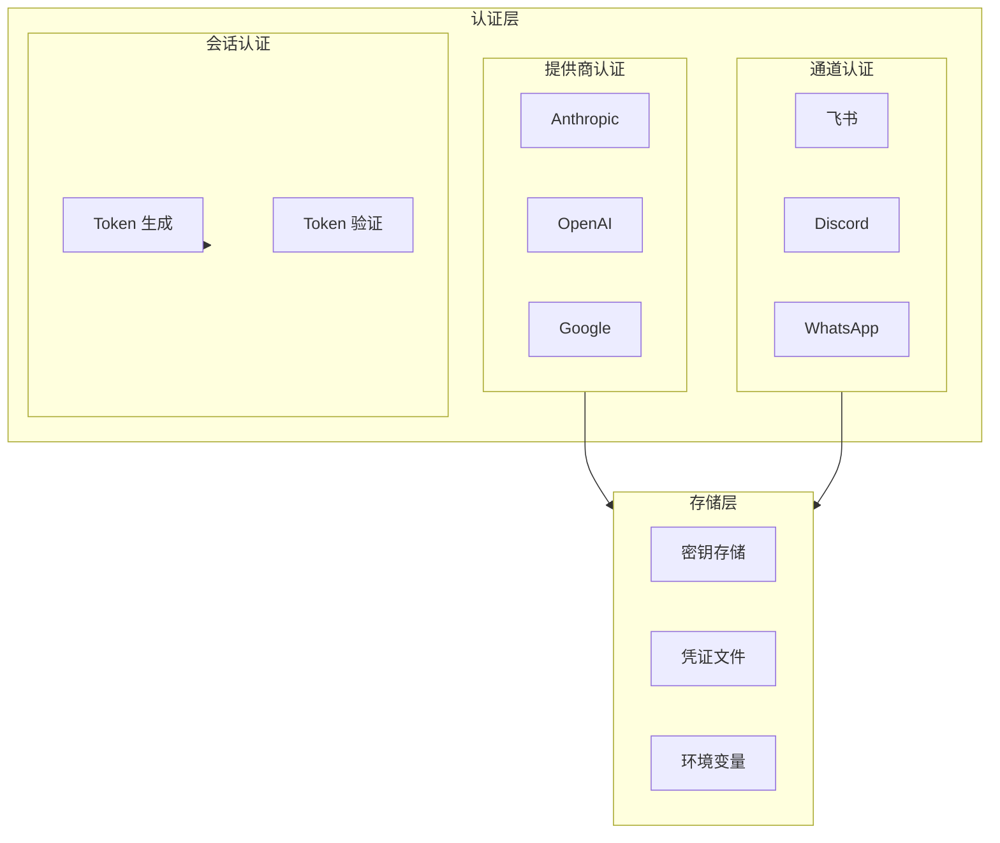
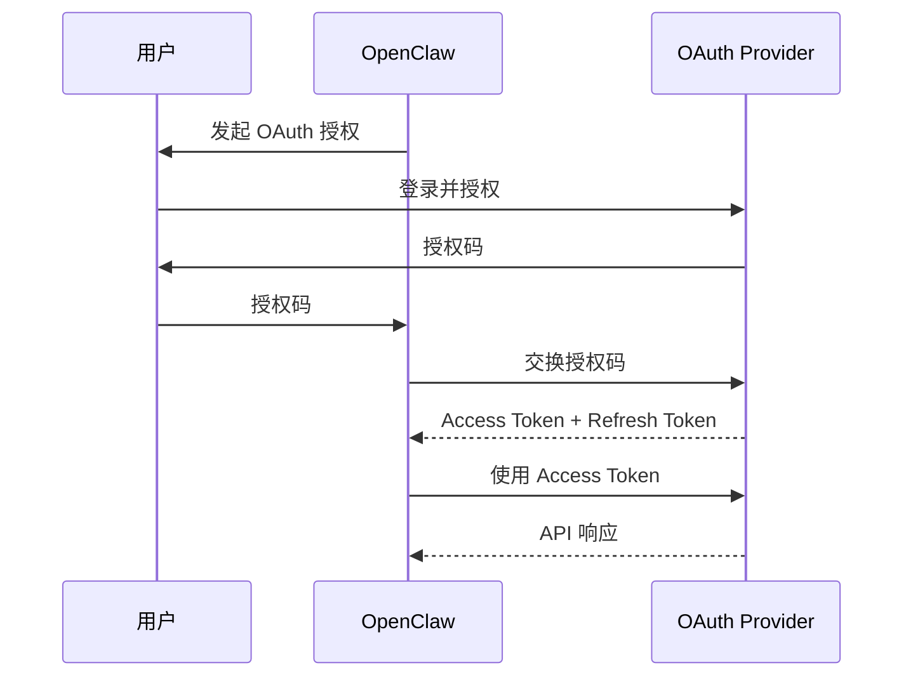

# 认证体系（Auth）

## 1. 核心概念

OpenClaw 的认证体系负责：

- **API 密钥管理** - 各 AI 提供商的 API 密钥
- **通道认证** - 飞书、Discord 等通道的 Bot Token
- **用户认证** - 用户身份验证（如 OAuth）
- **会话认证** - 确保会话安全



## 2. 认证类型

### 2.1 认证类型概览

| 类型 | 说明 | 示例 |
|------|------|------|
| **API Key** | 直接 API 密钥 | `sk-xxx` |
| **OAuth** | OAuth 2.0 授权 | 飞书 OAuth |
| **Bot Token** | 平台 Bot Token | Discord Bot Token |
| **User Token** | 用户访问令牌 | 飞书 User Token |
| **Device Auth** | 设备码认证 | GitHub Device Flow |

### 2.2 认证接口

```typescript
interface AuthProvider {
  // 提供商 ID
  id: string

  // 获取凭证
  getCredentials(): Promise<Credentials>

  // 刷新凭证（如果支持）
  refresh?(): Promise<Credentials>

  // 检查凭证是否有效
  isValid(): boolean
}

interface Credentials {
  // 凭证类型
  type: 'api_key' | 'oauth' | 'bot_token' | 'user_token'

  // 凭证值
  value: string

  // 过期时间（如果有）
  expiresAt?: Date

  // 刷新令牌（如果有）
  refreshToken?: string

  // 附加元数据
  metadata?: Record<string, any>
}
```

## 3. API 密钥管理

### 3.1 密钥解析

```typescript
// 支持的密钥格式
type ApiKeyFormat =
  | { type: 'env'; name: string }                    // ${ANTHROPIC_API_KEY}
  | { type: 'file'; path: string }                   // ${file:~/keys/anthropic.key}
  | { type: 'direct'; value: string }                // sk-xxx
  | { type: 'provider'; provider: string; key: string }  // ${provider:key}

function resolveApiKey(format: ApiKeyFormat): string {
  switch (format.type) {
    case 'env':
      return process.env[format.name] || ''

    case 'file':
      const path = format.path.replace('~', os.homedir())
      return fs.readFileSync(path, 'utf-8').trim()

    case 'direct':
      return format.value

    case 'provider':
      return secretManager.get(format.provider, format.key)

    default:
      throw new Error(`Unknown key format: ${JSON.stringify(format)}`)
  }
}
```

### 3.2 密钥存储

```typescript
// 凭证存储接口
interface CredentialsStore {
  // 保存凭证
  save(id: string, credentials: Credentials): Promise<void>

  // 获取凭证
  get(id: string): Promise<Credentials | null>

  // 删除凭证
  delete(id: string): Promise<void>

  // 列出所有凭证
  list(): Promise<{ id: string; type: string }[]>
}

// 文件存储实现
class FileCredentialsStore implements CredentialsStore {
  constructor(private dir: string) {}

  private getPath(id: string): string {
    return path.join(this.dir, `${id}.json`)
  }

  async save(id: string, credentials: Credentials): Promise<void> {
    const data = JSON.stringify({
      ...credentials,
      value: encrypt(credentials.value)  // 加密存储
    })
    await fs.promises.writeFile(this.getPath(id), data, 'utf-8')
  }

  async get(id: string): Promise<Credentials | null> {
    const filePath = this.getPath(id)
    if (!fs.existsSync(filePath)) return null

    const data = JSON.parse(await fs.promises.readFile(filePath, 'utf-8'))
    return {
      ...data,
      value: decrypt(data.value)  // 解密
    }
  }
}
```

## 4. 认证配置文件

### 4.1 配置结构

```yaml
# openclaw.yaml
providers:
  anthropic:
    apiKey: ${ANTHROPIC_API_KEY}

  openai:
    apiKey: ${OPENAI_API_KEY}
    organization: ${OPENAI_ORG_ID}

  google:
    apiKey: ${GOOGLE_API_KEY}
    # 或使用 OAuth
    oauth:
      clientId: ${GOOGLE_CLIENT_ID}
      clientSecret: ${GOOGLE_CLIENT_SECRET}
```

### 4.2 认证 Profile

```typescript
// 认证 Profile - 允许多套凭证
interface AuthProfile {
  id: string
  name: string
  providers: {
    [providerId: string]: {
      type: 'api_key' | 'oauth'
      credentials: ApiKeyFormat
    }
  }
}

// 配置示例
auth:
  profiles:
    default:
      name: Default
      providers:
        anthropic:
          type: api_key
          credentials:
            type: env
            name: ANTHROPIC_API_KEY

    work:
      name: Work Account
      providers:
        anthropic:
          type: oauth
          credentials:
            type: oauth
            config:
              clientId: ${ANTHROPIC_CLIENT_ID}
              clientSecret: ${ANTHROPIC_CLIENT_SECRET}
```

## 5. OAuth 认证

### 5.1 OAuth 流程



### 5.2 OAuth 实现

```typescript
class OAuthProvider implements AuthProvider {
  constructor(
    private config: OAuthConfig,
    private store: CredentialsStore
  ) {}

  async getCredentials(): Promise<Credentials> {
    // 1. 检查是否已有有效凭证
    const stored = await this.store.get(this.config.profileId)
    if (stored && stored.expiresAt && stored.expiresAt > new Date()) {
      return stored
    }

    // 2. 检查是否有刷新令牌
    if (stored?.refreshToken) {
      return await this.refresh(stored.refreshToken)
    }

    // 3. 需要重新授权
    throw new Error('OAuth re-authentication required')
  }

  async refresh(refreshToken: string): Promise<Credentials> {
    const response = await fetch('https://api.provider.com/oauth/token', {
      method: 'POST',
      headers: { 'Content-Type': 'application/x-www-form-urlencoded' },
      body: new URLSearchParams({
        grant_type: 'refresh_token',
        refresh_token: refreshToken,
        client_id: this.config.clientId,
        client_secret: this.config.clientSecret
      })
    })

    const data = await response.json()

    const credentials: Credentials = {
      type: 'oauth',
      value: data.access_token,
      expiresAt: new Date(Date.now() + data.expires_in * 1000),
      refreshToken: data.refresh_token,
      metadata: {
        scope: data.scope
      }
    }

    // 保存新凭证
    await this.store.save(this.config.profileId, credentials)

    return credentials
  }

  async startAuthFlow(): Promise<string> {
    // 生成状态码用于 CSRF 防护
    const state = generateState()

    // 构建授权 URL
    const authUrl = new URL('https://api.provider.com/oauth/authorize')
    authUrl.searchParams.set('client_id', this.config.clientId)
    authUrl.searchParams.set('redirect_uri', this.config.redirectUri)
    authUrl.searchParams.set('response_type', 'code')
    authUrl.searchParams.set('scope', this.config.scope)
    authUrl.searchParams.set('state', state)

    return authUrl.toString()
  }

  async completeAuthFlow(code: string, state: string): Promise<Credentials> {
    const response = await fetch('https://api.provider.com/oauth/token', {
      method: 'POST',
      headers: { 'Content-Type': 'application/x-www-form-urlencoded' },
      body: new URLSearchParams({
        grant_type: 'authorization_code',
        code,
        redirect_uri: this.config.redirectUri,
        client_id: this.config.clientId,
        client_secret: this.config.clientSecret
      })
    })

    const data = await response.json()

    const credentials: Credentials = {
      type: 'oauth',
      value: data.access_token,
      expiresAt: new Date(Date.now() + data.expires_in * 1000),
      refreshToken: data.refresh_token
    }

    await this.store.save(this.config.profileId, credentials)

    return credentials
  }
}
```

## 6. 飞书认证

### 6.1 飞书 OAuth

```typescript
// 飞书 OAuth 配置
interface FeishuOAuthConfig {
  appId: string
  appSecret: string
  redirectUri: string
}

class FeishuOAuthProvider {
  constructor(private config: FeishuOAuthConfig) {}

  // 获取 App Access Token
  async getAppAccessToken(): Promise<string> {
    const response = await fetch('https://open.feishu.cn/open-apis/auth/v3/app_access_token/internal', {
      method: 'POST',
      headers: { 'Content-Type': 'application/json' },
      body: JSON.stringify({
        app_id: this.config.appId,
        app_secret: this.config.appSecret
      })
    })

    const data = await response.json()
    if (data.code !== 0) {
      throw new Error(`Failed to get app access token: ${data.msg}`)
    }

    return data.app_access_token
  }

  // 获取 User Access Token
  async getUserAccessToken(code: string): Promise<FeishuUserToken> {
    const appToken = await this.getAppAccessToken()

    const response = await fetch('https://open.feishu.cn/open-apis/authen/v1/oidc/access_token', {
      method: 'POST',
      headers: {
        'Content-Type': 'application/json',
        'Authorization': `Bearer ${appToken}`
      },
      body: JSON.stringify({ grant_type: 'authorization_code', code })
    })

    const data = await response.json()
    if (data.code !== 0) {
      throw new Error(`Failed to get user access token: ${data.msg}`)
    }

    return {
      accessToken: data.data.access_token,
      refreshToken: data.data.refresh_token,
      expiresAt: new Date(Date.now() + data.data.expires_in * 1000),
      openId: data.data.open_id
    }
  }
}
```

### 6.2 飞书 Bot 认证

```typescript
// 飞书 Bot Token 获取
async function getFeishuBotToken(appId: string, appSecret: string): Promise<string> {
  const response = await fetch('https://open.feishu.cn/open-apis/auth/v3/app_access_token/internal', {
    method: 'POST',
    headers: { 'Content-Type': 'application/json' },
    body: JSON.stringify({ app_id: appId, app_secret: appSecret })
  })

  const data = await response.json()
  return data.app_access_token
}
```

## 7. 会话认证

### 7.1 会话 Token

```typescript
// 会话 Token 生成
class SessionTokenManager {
  private secret: string

  constructor(secret: string) {
    this.secret = secret
  }

  // 生成会话 Token
  generateToken(sessionId: string, userId: string): string {
    const payload = {
      sessionId,
      userId,
      iat: Math.floor(Date.now() / 1000),
      exp: Math.floor(Date.now() / 1000) + 24 * 60 * 60  // 24 小时
    }

    return jwt.sign(payload, this.secret)
  }

  // 验证会话 Token
  verifyToken(token: string): { sessionId: string; userId: string } {
    try {
      const payload = jwt.verify(token, this.secret)
      return {
        sessionId: payload.sessionId,
        userId: payload.userId
      }
    } catch (err) {
      throw new Error('Invalid session token')
    }
  }
}
```

### 7.2 Webhook 签名验证

```typescript
// 飞书 Webhook 签名验证
class FeishuWebhookVerifier {
  constructor(private appSecret: string) {}

  verify(
    timestamp: string,
    signature: string,
    body: string
  ): boolean {
    const str = timestamp + body
    const expectedSignature = crypto
      .createHmac('sha256', this.appSecret)
      .update(str)
      .digest('hex')

    return crypto.timingSafeEqual(
      Buffer.from(signature),
      Buffer.from(expectedSignature)
    )
  }
}

// 使用
const verifier = new FeishuWebhookVerifier(appSecret)
const isValid = verifier.verify(
  req.headers['x-lark-timestamp'],
  req.headers['x-lark-signature'],
  JSON.stringify(req.body)
)

if (!isValid) {
  return res.status(401).send('Invalid signature')
}
```

## 8. 密钥轮换

### 8.1 自动轮换

```typescript
class RotatingKeyManager {
  constructor(
    private store: CredentialsStore,
    private rotationInterval: number = 90 * 24 * 60 * 60 * 1000  // 90 天
  ) {}

  async getKey(provider: string): Promise<string> {
    const credentials = await this.store.get(provider)

    // 检查是否需要轮换
    if (credentials?.expiresAt &&
        credentials.expiresAt.getTime() - Date.now() < this.rotationInterval) {
      await this.rotateKey(provider)
    }

    return (await this.store.get(provider))!.value
  }

  private async rotateKey(provider: string): Promise<void> {
    console.log(`Rotating key for provider: ${provider}`)

    // 1. 生成新密钥
    const newKey = await this.generateNewKey(provider)

    // 2. 更新存储
    await this.store.save(provider, {
      type: 'api_key',
      value: newKey,
      updatedAt: new Date()
    })

    // 3. 验证新密钥有效
    if (!await this.validateKey(provider, newKey)) {
      throw new Error(`Key rotation failed: new key is invalid`)
    }
  }
}
```

## 9. 最佳实践

### 9.1 密钥安全

1. **不要硬编码密钥** - 使用环境变量或密钥管理服务
2. **加密存储** - 敏感数据加密后存储
3. **定期轮换** - 设置密钥过期策略
4. **最小权限** - 只授予必要的权限

### 9.2 OAuth 安全

1. **状态参数** - 使用随机 state 防止 CSRF
2. **安全存储** - 刷新令牌加密存储
3. **过期处理** - 正确处理 Token 过期

## 10. 手把手复刻

### 最小实现

以下是认证系统的最小实现：

```typescript
// === 1. 凭证接口 ===
interface Credentials {
  type: 'api_key' | 'oauth' | 'bot_token' | 'user_token'
  value: string
  expiresAt?: Date
  refreshToken?: string
}

// === 2. API Key 解析 ===
type ApiKeyFormat =
  | { type: 'env'; name: string }
  | { type: 'file'; path: string }
  | { type: 'direct'; value: string }

function resolveApiKey(format: ApiKeyFormat): string {
  switch (format.type) {
    case 'env':
      return process.env[format.name] || ''
    case 'file':
      const path = format.path.replace('~', os.homedir())
      return fs.readFileSync(path, 'utf-8').trim()
    case 'direct':
      return format.value
  }
}

// === 3. 最小认证提供者 ===
class MinimalAuthProvider {
  constructor(
    private providerId: string,
    private credentials: Credentials
  ) {}

  isValid(): boolean {
    if (this.credentials.expiresAt) {
      return this.credentials.expiresAt > new Date()
    }
    return true
  }

  async getCredentials(): Promise<Credentials> {
    if (!this.isValid() && this.credentials.refreshToken) {
      await this.refresh()
    }
    return this.credentials
  }

  private async refresh(): Promise<void> {
    // 实现刷新逻辑
    throw new Error('Not implemented')
  }
}

// === 4. Webhook 签名验证 ===
class WebhookVerifier {
  constructor(private secret: string) {}

  verify(timestamp: string, signature: string, body: string): boolean {
    const str = timestamp + body
    const expected = crypto
      .createHmac('sha256', this.secret)
      .update(str)
      .digest('hex')
    
    return crypto.timingSafeEqual(
      Buffer.from(signature),
      Buffer.from(expected)
    )
  }
}

// === 5. 使用示例 ===
const verifier = new WebhookVerifier('my-secret')

// 验证飞书 Webhook
app.post('/webhook', (req, res) => {
  const valid = verifier.verify(
    req.headers['x-lark-timestamp'],
    req.headers['x-lark-signature'],
    JSON.stringify(req.body)
  )
  
  if (!valid) {
    return res.status(401).send('Invalid signature')
  }
  
  // 处理消息...
  res.status(200).json({ received: true })
})
```

### 关键接口

| 接口 | 参数 | 返回值 | 说明 |
|------|------|--------|------|
| `resolveApiKey()` | `format: ApiKeyFormat` | `string` | 解析 API Key |
| `getCredentials()` | - | `Promise<Credentials>` | 获取凭证 |
| `isValid()` | - | `boolean` | 检查凭证有效性 |
| `verify()` | `timestamp, signature, body` | `boolean` | 验证 Webhook 签名 |

### 常见陷阱

1. **签名验证时序攻击**
   - 错误：使用 `===` 比较签名
   - 正确：使用 `crypto.timingSafeEqual` 防止时序攻击

   ```typescript
   // 错误
   return signature === expected
   
   // 正确
   return crypto.timingSafeEqual(
     Buffer.from(signature),
     Buffer.from(expected)
   )
   ```

2. **密钥硬编码**
   - 错误：将密钥直接写在代码中
   - 正确：从环境变量或密钥文件加载

3. **Token 过期未处理**
   - 错误：假设 Token 永不过期
   - 正确：检查 `expiresAt` 并在需要时刷新

### 实战练习

1. **练习一：实现 Bot Token 获取**
   ```typescript
   async function getFeishuBotToken(
     appId: string,
     appSecret: string
   ): Promise<string> {
     const response = await fetch(
       'https://open.feishu.cn/open-apis/auth/v3/app_access_token/internal',
       {
         method: 'POST',
         headers: { 'Content-Type': 'application/json' },
         body: JSON.stringify({ app_id: appId, app_secret: appSecret })
       }
     )
     
     const data = await response.json()
     if (data.code !== 0) {
       throw new Error(`Failed to get token: ${data.msg}`)
     }
     
     return data.app_access_token
   }
   ```

2. **练习二：实现 OAuth 流程**
   ```typescript
   class OAuthHandler {
     async startAuthFlow(clientId: string, redirectUri: string): Promise<string> {
       const state = crypto.randomUUID()
       const authUrl = new URL('https://api.provider.com/oauth/authorize')
       authUrl.searchParams.set('client_id', clientId)
       authUrl.searchParams.set('redirect_uri', redirectUri)
       authUrl.searchParams.set('response_type', 'code')
       authUrl.searchParams.set('state', state)
       return authUrl.toString()
     }

     async completeAuthFlow(
       code: string,
       clientId: string,
       clientSecret: string,
       redirectUri: string
     ): Promise<Credentials> {
       const response = await fetch('https://api.provider.com/oauth/token', {
         method: 'POST',
         body: new URLSearchParams({
           grant_type: 'authorization_code',
           code,
           redirect_uri: redirectUri,
           client_id: clientId,
           client_secret: clientSecret
         })
       })
       
       const data = await response.json()
       return {
         type: 'oauth',
         value: data.access_token,
         expiresAt: new Date(Date.now() + data.expires_in * 1000),
         refreshToken: data.refresh_token
       }
     }
   }
   ```

3. **练习三：实现会话 Token**
   ```typescript
   class SessionTokenManager {
     constructor(private secret: string) {}

     generateToken(sessionId: string, userId: string): string {
       const payload = {
         sessionId,
         userId,
         iat: Math.floor(Date.now() / 1000),
         exp: Math.floor(Date.now() / 1000) + 86400
       }
       return jwt.sign(payload, this.secret)
     }

     verifyToken(token: string): { sessionId: string; userId: string } {
       const payload = jwt.verify(token, this.secret) as any
       return {
         sessionId: payload.sessionId,
         userId: payload.userId
       }
     }
   }
   ```

## 11. 相关文档

- [配置系统](./config.md)
- [飞书通道](./channels.md)
