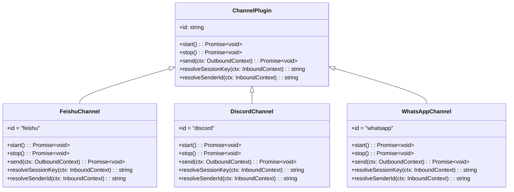
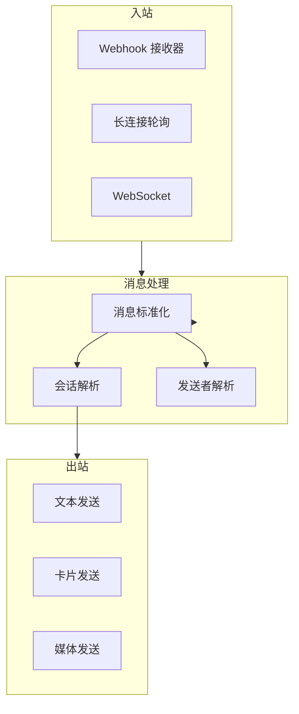

# 通道机制（Channel）

## 1. 核心概念

通道（Channel）是 OpenClaw 与外部消息系统交互的桥梁。每个通道实现 `ChannelPlugin` 接口，统一消息格式，使得上层逻辑与具体平台解耦。



## 2. 通道架构

### 2.1 通道运行时



### 2.2 消息上下文

```typescript
// 入站消息上下文
interface InboundContext {
  // 消息内容
  content: string

  // 通道 ID
  channelId: string

  // 发送者 ID（平台特定格式）
  senderId: string

  // 发送者名称
  senderName?: string

  // 会话 Key
  sessionKey: string

  // 原始消息 ID
  messageId?: string

  // 消息时间戳
  timestamp: number

  // 附加元数据
  metadata: {
    // 是否为群组消息
    isGroup?: boolean
    // 群组 ID
    groupId?: string
    // 线程 ID
    threadId?: string
    // 平台特定数据
    [key: string]: any
  }
}

// 出站消息上下文
interface OutboundContext {
  // 接收者 ID
  to: string

  // 消息内容
  content: string

  // 消息类型
  type: 'text' | 'card' | 'image' | 'file' | 'audio'

  // 通道 ID
  channelId: string

  // 会话 Key
  sessionKey: string

  // 回复的消息 ID
  replyToId?: string

  // 线程 ID
  threadId?: string
}
```

## 3. 飞书通道详解

飞书是 OpenClaw 最完善的通道实现，以下详细解析其架构。

### 3.1 目录结构

```
extensions/feishu/
├── index.js              # 插件入口
├── api.js                # 飞书 API 封装
├── session-key-api.js    # 会话 Key 解析
├── setup-api.js          # 设置向导 API
├── setup-entry.js       # 设置入口
└── openclaw.plugin.json  # 插件配置
```

### 3.2 插件入口

```javascript
// extensions/feishu/index.js 核心逻辑
import { defineChannelPluginEntry } from '../../core.js'
import { probeFeishu, listEnabledFeishuAccounts } from '../../probe.js'
import { feishuPlugin } from '../../channel.js'
import {
  createFeishuToolClient,
  sendMessageFeishu,
  sendCardFeishu,
  sendMediaFeishu,
  uploadFileFeishu,
  uploadImageFeishu,
  getMessageFeishu,
  editMessageFeishu,
  // ... 更多 API
} from '../../media.js'

// 定义飞书通道插件
export const feishu = defineChannelPluginEntry({
  id: 'feishu',
  name: '飞书',

  // 探测配置
  async probe(cfg) {
    return await probeFeishu(cfg)
  },

  // 列出已配置账号
  async listAccounts(cfg) {
    return await listEnabledFeishuAccounts(cfg)
  },

  // 创建通道运行时
  createRuntime(cfg, accountId) {
    return feishuPlugin(cfg, accountId)
  }
})
```

### 3.3 会话 Key 生成

飞书的会话 Key 格式：

```
agent:{agentId}:feishu:{openId}
```

例如：`agent:main:feishu:ou_abc123`

```typescript
// session-key-api.js
import { parseFeishuConversationId, buildFeishuConversationId } from '../../conversation-id.js'

export function resolveFeishuSessionKey(
  cfg: OpenClawConfig,
  accountId: string,
  senderId: string,
  chatId?: string
): string {
  // 构建会话 Key
  const agentId = resolveAgentId(cfg, accountId)
  return `agent:${agentId}:feishu:${senderId}`
}
```

### 3.4 消息接收

飞书使用 Webhook 接收消息：

```typescript
// Webhook 处理
async function handleFeishuWebhook(req, res) {
  // 1. 验证签名
  const signature = req.headers['x-lark-signature']
  if (!verifySignature(signature, req.body)) {
    return res.status(401).send('Unauthorized')
  }

  // 2. 解析事件
  const event = req.body.event
  const message = event.message

  // 3. 标准化消息
  const ctx: InboundContext = {
    content: extractTextContent(message),
    channelId: 'feishu',
    senderId: message.sender.sender_id.open_id,
    senderName: message.sender.sender_id.name,
    sessionKey: resolveFeishuSessionKey(cfg, accountId, message.sender.sender_id.open_id, message.chat_id),
    messageId: message.message_id,
    timestamp: message.create_time,
    metadata: {
      isGroup: message.chat_type === 'group',
      groupId: message.chat_id,
      threadId: message.root_id,
    }
  }

  // 4. 转发到 Gateway
  await gateway.handleInboundMessage(ctx)

  res.status(200).json({ code: 0 })
}
```

### 3.5 消息发送

飞书支持多种消息类型：

```typescript
// 出站消息发送
async function sendOutboundText(params: {
  cfg: OpenClawConfig
  to: string  // 接收者 open_id 或 chat_id
  text: string
  accountId: string
  replyToMessageId?: string
}) {
  const { cfg, to, text, accountId, replyToMessageId } = params

  // 判断是否使用卡片
  if (shouldUseCard(text)) {
    return sendMarkdownCardFeishu({ cfg, to, text, accountId, replyToMessageId })
  }

  return sendMessageFeishu({ cfg, to, text, accountId, replyToMessageId })
}

// 判断是否使用卡片
function shouldUseCard(text: string): boolean {
  // 代码块
  if (/```[\s\S]*?```/.test(text)) return true
  // Markdown 表格
  if (/\|.+\|[\r\n]+\|[-:| ]+\|/.test(text)) return true
  return false
}
```

### 3.6 飞书 API 封装

```typescript
// api.js - 飞书 API 封装
import axios from 'axios'

class FeishuClient {
  constructor(accessToken: string) {
    this.client = axios.create({
      baseURL: 'https://open.feishu.cn/open-apis',
      headers: {
        'Authorization': `Bearer ${accessToken}`,
        'Content-Type': 'application/json'
      }
    })
  }

  // 发送消息
  async sendMessage(chatId: string, msgType: string, content: object) {
    const res = await this.client.post('/im/v1/messages', {
      receive_id: chatId,
      msg_type: msgType,
      content: JSON.stringify(content)
    }, {
      params: { receive_id_type: 'chat_id' }
    })
    return res.data
  }

  // 上传文件
  async uploadFile(filePath: string) {
    const formData = new FormData()
    formData.append('file', fs.createReadStream(filePath))
    formData.append('file_name', path.basename(filePath))
    const res = await this.client.post('/im/v1/files', formData, {
      headers: { 'Content-Type': 'multipart/form-data' }
    })
    return res.data
  }
}
```

## 4. 复刻其他通道

### 4.1 Discord 通道

```typescript
// extensions/discord/index.js
export const discord = defineChannelPluginEntry({
  id: 'discord',
  name: 'Discord',

  async probe(cfg) { /* 探测配置 */ },
  async listAccounts(cfg) { /* 列出账号 */ },
  createRuntime(cfg, accountId) {
    return {
      // Discord 使用 Bot Token
      token: cfg.channels.discord.accounts[accountId].botToken,

      // 启动 - 使用 Discord.js
      async start() {
        const client = new Discord.Client({ intents: [...] })
        client.on('messageCreate', this.handleMessage.bind(this))
        await client.login(this.token)
      },

      // 解析会话 Key
      resolveSessionKey(ctx) {
        // 格式: agent:{agentId}:discord:{guildId}:{channelId}:{userId}
        return `agent:main:discord:${ctx.guildId}:${ctx.channelId}:${ctx.userId}`
      }
    }
  }
})
```

### 4.2 WhatsApp 通道

```typescript
// extensions/whatsapp/index.js
export const whatsapp = defineChannelPluginEntry({
  id: 'whatsapp',
  name: 'WhatsApp',

  createRuntime(cfg, accountId) {
    return {
      // WhatsApp 使用 WhatsApp Business API
      phoneNumberId: cfg.channels.whatsapp.accounts[accountId].phoneNumberId,
      accessToken: cfg.channels.whatsapp.accounts[accountId].accessToken,

      // 启动 - 使用 Webhook
      async start() {
        const webhook = express()
        webhook.post('/webhook', this.handleWebhook.bind(this))
        await webhook.listen(3000)
      },

      // 解析会话 Key
      resolveSessionKey(ctx) {
        // WhatsApp 使用电话号码作为用户标识
        return `agent:main:whatsapp:${ctx.from}`
      }
    }
  }
})
```

### 4.3 通用通道接口

```typescript
// 任何新通道都需要实现以下接口
interface ChannelPlugin {
  // === 必需属性 ===
  id: string              // 唯一标识
  name: string            // 显示名称

  // === 生命周期 ===
  start(): Promise<void>  // 启动监听
  stop(): Promise<void>   // 停止

  // === 消息处理 ===
  send(ctx: OutboundContext): Promise<SendResult>

  // === 解析 ===
  resolveSessionKey(ctx: InboundContext): string
  resolveSenderId(ctx: InboundContext): string

  // === 可选 ===
  setup?(): Promise<void>  // 设置向导
  healthCheck?(): Promise<HealthStatus>
}
```

## 5. 会话 Key 设计

### 5.1 格式规范

```
agent:{agentId}:{channel}:{identifiers...}
```

### 5.2 各通道标识

| 通道 | 格式 | 示例 |
|------|------|------|
| 飞书 | `agent:{agentId}:feishu:{openId}` | `agent:main:feishu:ou_abc123` |
| Discord | `agent:{agentId}:discord:{guildId}:{channelId}:{userId}` | `agent:main:discord:123:456:789` |
| WhatsApp | `agent:{agentId}:whatsapp:{phone}` | `agent:main:whatsapp:+8613812345678` |
| Telegram | `agent:{agentId}:telegram:{chatId}:{userId}` | `agent:main:telegram:123456:789` |

### 5.3 群组 vs 单聊

```typescript
// 单聊会话 Key
const singleChatKey = `agent:${agentId}:${channel}:${userId}`

// 群组会话 Key
const groupChatKey = `agent:${agentId}:${channel}:${chatId}`

// 群组 + 线程会话 Key
const threadChatKey = `agent:${agentId}:${channel}:${chatId}:${threadId}`
```

## 6. 消息队列

OpenClaw 支持三种消息队列模式：

```typescript
enum QueueMode {
  // 直接处理，不排队
  DIRECT = 'direct',

  // 收集模式，批量处理
  COLLECT = 'collect',

  // 引导模式，等待用户确认
  STEER = 'steer',

  // 跟进模式，稍后处理
  FOLLOWUP = 'followup'
}
```

## 7. 最佳实践

### 7.1 消息标准化

所有通道消息必须标准化为 `InboundContext`：

```typescript
// 标准化函数示例
function normalizeMessage(raw: any, channelId: string): InboundContext {
  return {
    content: extractText(raw),
    channelId,
    senderId: extractSenderId(raw),
    senderName: extractSenderName(raw),
    sessionKey: buildSessionKey(raw),
    messageId: extractMessageId(raw),
    timestamp: extractTimestamp(raw),
    metadata: extractMetadata(raw)
  }
}
```

### 7.2 重试机制

```typescript
async function sendWithRetry(
  sendFn: () => Promise<void>,
  maxRetries = 3
) {
  for (let i = 0; i < maxRetries; i++) {
    try {
      await sendFn()
      return
    } catch (err) {
      if (i === maxRetries - 1) throw err
      await sleep(Math.pow(2, i) * 1000) // 指数退避
    }
  }
}
```

### 7.3 限流处理

```typescript
class RateLimiter {
  private tokens: number
  private lastRefill: number

  constructor(private maxTokens: number, private refillRate: number) {
    this.tokens = maxTokens
    this.lastRefill = Date.now()
  }

  async acquire() {
    this.refill()
    if (this.tokens <= 0) {
      await this.waitForRefill()
    }
    this.tokens--
  }

  private refill() {
    const now = Date.now()
    const elapsed = now - this.lastRefill
    const newTokens = (elapsed / 1000) * this.refillRate
    this.tokens = Math.min(this.maxTokens, this.tokens + newTokens)
    this.lastRefill = now
  }
}
```

## 8. 手把手复刻

### 最小实现

以下是实现一个简单 Webhook 接收器的最小代码：

```typescript
// === 1. 最小 Channel Plugin ===
interface ChannelPlugin {
  id: string
  name: string
  start(): Promise<void>
  stop(): Promise<void>
  send(ctx: OutboundContext): Promise<void>
  resolveSessionKey(ctx: InboundContext): string
  resolveSenderId(ctx: InboundContext): string
}

// === 2. 简单 Webhook 通道实现 ===
class SimpleWebhookChannel implements ChannelPlugin {
  id = 'simple-webhook'
  name = 'Simple Webhook'
  
  private gateway!: Gateway
  private express!: any
  private cfg: ChannelConfig

  constructor(cfg: ChannelConfig, gateway: Gateway) {
    this.cfg = cfg
    this.gateway = gateway
  }

  async start() {
    const app = express()
    
    // Webhook 端点
    app.post('/webhook', async (req, res) => {
      // 1. 标准化消息
      const ctx: InboundContext = {
        content: req.body.message,
        channelId: this.id,
        senderId: req.body.userId,
        senderName: req.body.userName,
        sessionKey: this.resolveSessionKey(req.body),
        messageId: req.body.messageId,
        timestamp: Date.now(),
        metadata: {}
      }

      // 2. 转发到 Gateway
      await this.gateway.handleInboundMessage(ctx)
      
      res.status(200).json({ received: true })
    })

    app.listen(this.cfg.port || 3000)
  }

  async stop() {
    // 清理资源
  }

  async send(ctx: OutboundContext) {
    // 发送响应
    await fetch(ctx.to, {
      method: 'POST',
      body: JSON.stringify({ message: ctx.content })
    })
  }

  resolveSessionKey(ctx: any): string {
    return `agent:main:${this.id}:${ctx.userId}`
  }

  resolveSenderId(ctx: any): string {
    return ctx.userId
  }
}
```

### 关键接口

| 接口 | 参数 | 返回值 | 说明 |
|------|------|--------|------|
| `start()` | - | `Promise<void>` | 启动通道监听 |
| `stop()` | - | `Promise<void>` | 停止通道 |
| `send()` | `ctx: OutboundContext` | `Promise<void>` | 发送消息 |
| `resolveSessionKey()` | `ctx: InboundContext` | `string` | 解析会话 Key |
| `resolveSenderId()` | `ctx: InboundContext` | `string` | 解析发送者 ID |

### 常见陷阱

1. **签名验证遗漏**
   - 错误：直接处理请求，不验证来源
   - 正确：验证 Webhook 签名（如飞书的 `x-lark-signature`）

   ```typescript
   // 正确做法
   if (!verifySignature(req.headers['x-signature'], req.body)) {
     return res.status(401).send('Unauthorized')
   }
   ```

2. **会话 Key 格式不一致**
   - 错误：不同通道使用不同的 Key 格式
   - 正确：遵循 `agent:{agentId}:{channel}:{identifiers}` 规范

3. **消息类型处理不当**
   - 错误：所有消息都用文本处理
   - 正确：根据 `msgType` 分发到不同处理器

### 实战练习

1. **练习一：实现回声 Webhook**
   - 创建 Express 服务监听 `/webhook`
   - 将请求体转换为 `InboundContext`
   - 使用 `resolveSessionKey()` 生成会话 Key

2. **练习二：添加消息重试机制**
   ```typescript
   async function sendWithRetry(
     sendFn: () => Promise<void>,
     maxRetries = 3
   ) {
     for (let i = 0; i < maxRetries; i++) {
       try {
         await sendFn()
         return
       } catch (err) {
         if (i === maxRetries - 1) throw err
         await sleep(Math.pow(2, i) * 1000)
       }
     }
   }
   ```

3. **练习三：实现限流器**
   - 使用 Token Bucket 算法
   - 限制每分钟消息数
   - 超限时返回 429 状态码

## 9. 相关文档

- [飞书通道文档](https://docs.openclaw.ai/channels/feishu)
- [Discord 通道文档](https://docs.openclaw.ai/channels/discord)
- [WhatsApp 通道文档](https://docs.openclaw.ai/channels/whatsapp)
