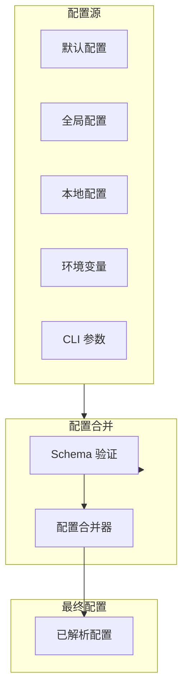

# 配置系统（Config）

## 1. 核心概念

OpenClaw 使用 JSON Schema 验证配置，支持多层级配置合并：

- 全局默认配置
- 用户配置（`~/.openclaw/config.yaml`）
- 工作目录配置（`./openclaw.yaml`）
- 环境变量覆盖
- 命令行参数覆盖



## 2. 配置结构

### 2.1 主配置

```typescript
interface OpenClawConfig {
  // 版本
  version?: string

  // Agent 配置
  agents: {
    [agentId: string]: AgentConfig
  }

  // 通道配置
  channels: {
    [channelId: string]: ChannelConfig
  }

  // Hooks 配置
  hooks?: {
    internal?: {
      enabled: boolean
      entries?: Record<string, HookEntry>
    }
  }

  // 插件配置
  plugins?: {
    registry?: string[]
    [pluginId: string]: any
  }

  // 记忆配置
  memory?: MemoryConfig

  // MCP 配置
  mcp?: {
    servers: {
      [serverName: string]: MCPConfig
    }
  }

  // 执行配置
  exec?: {
    approval?: ExecApprovalConfig
    security?: ExecSecurityConfig
  }

  // 模型配置
  models?: ModelConfig

  // 提供商配置
  providers?: ProviderConfig

  // 行为配置
  behaviors?: BehaviorsConfig
}
```

### 2.2 Agent 配置

```typescript
interface AgentConfig {
  // 模型
  model?: string

  // 模型提供商
  provider?: string

  // 认证配置
  authProfile?: string

  // 指令/提示词
  instructions?: string

  // 工具
  tools?: {
    enabled?: string[]
    disabled?: string[]
  }

  // 思考配置
  thinking?: {
    enabled?: boolean
    level?: 'off' | 'low' | 'medium' | 'high'
    budget?: number
  }

  // 执行配置
  exec?: {
    host?: 'gateway' | 'node' | 'sandbox'
    security?: 'deny' | 'allowlist' | 'full'
  }
}
```

### 2.3 通道配置

```typescript
interface ChannelConfig {
  // 是否启用
  enabled?: boolean

  // 账号配置
  accounts?: {
    [accountId: string]: AccountConfig
  }

  // 默认账号
  defaultAccount?: string

  // 行为配置
  behaviors?: {
    // 队列模式
    queueMode?: 'direct' | 'collect' | 'steer' | 'followup'

    // 响应延迟
    responseDelay?: number

    // 是否启用回复
    replyEnabled?: boolean
  }
}

interface AccountConfig {
  // 账号 ID
  id: string

  // 名称
  name?: string

  // 是否已配置（用于探测）
  configured?: boolean

  // 认证信息
  auth?: {
    // 类型
    type: 'bot_token' | 'user_token' | 'oauth' | 'api_key'

    // 凭证
    credentials: Record<string, string>
  }

  // 通道特定配置
  [key: string]: any
}
```

## 3. 配置加载

### 3.1 加载流程

```typescript
class ConfigLoader {
  async load(): Promise<OpenClawConfig> {
    // 1. 加载默认配置
    let config = this.loadDefaults()

    // 2. 合并全局配置
    const globalConfig = await this.loadGlobalConfig()
    config = this.merge(config, globalConfig)

    // 3. 合并本地配置
    const localConfig = await this.loadLocalConfig()
    config = this.merge(config, localConfig)

    // 4. 应用环境变量
    config = this.applyEnvOverrides(config)

    // 5. 验证配置
    this.validate(config)

    return config
  }

  private loadDefaults(): OpenClawConfig {
    return {
      agents: {
        main: {
          model: 'claude-sonnet-4-20250514',
          provider: 'anthropic'
        }
      },
      channels: {}
    }
  }

  private async loadGlobalConfig(): Promise<Partial<OpenClawConfig>> {
    const path = path.join(os.homedir(), '.openclaw', 'config.yaml')
    if (!fs.existsSync(path)) return {}
    return this.parseYaml(await fs.promises.readFile(path, 'utf-8'))
  }

  private async loadLocalConfig(): Promise<Partial<OpenClawConfig>> {
    const paths = ['./openclaw.yaml', './openclaw.yml', './.openclaw.yaml']
    for (const path of paths) {
      if (fs.existsSync(path)) {
        return this.parseYaml(await fs.promises.readFile(path, 'utf-8'))
      }
    }
    return {}
  }

  private applyEnvOverrides(config: OpenClawConfig): OpenClawConfig {
    // FEISHU_APP_ID -> channels.feishu.accounts.default.appId
    const envMappings: Record<string, (v: string) => void> = {
      'FEISHU_APP_ID': (v) => {
        config.channels = config.channels || {}
        config.channels.feishu = config.channels.feishu || {}
        config.channels.feishu.accounts = config.channels.feishu.accounts || {}
        config.channels.feishu.accounts.default =
          config.channels.feishu.accounts.default || {}
        config.channels.feishu.accounts.default.appId = v
      },
      'ANTHROPIC_API_KEY': (v) => {
        config.providers = config.providers || {}
        config.providers.anthropic = config.providers.anthropic || {}
        config.providers.anthropic.apiKey = v
      }
    }

    for (const [envKey, setter] of Object.entries(envMappings)) {
      const value = process.env[envKey]
      if (value) setter(value)
    }

    return config
  }
}
```

### 3.2 配置合并

```typescript
class ConfigMerger {
  merge(base: any, override: any): any {
    if (!override) return base
    if (!base) return override

    if (this.isPlainObject(base) && this.isPlainObject(override)) {
      const result: any = { ...base }
      for (const key of Object.keys(override)) {
        if (key in base) {
          result[key] = this.merge(base[key], override[key])
        } else {
          result[key] = override[key]
        }
      }
      return result
    }

    // 数组替换而非合并
    if (Array.isArray(override)) return override

    return override
  }

  private isPlainObject(value: any): boolean {
    return typeof value === 'object' && value !== null && !Array.isArray(value)
  }
}
```

## 4. Schema 验证

### 4.1 主 Schema

```typescript
const OpenClawConfigSchema = Type.Object({
  version: Type.Optional(Type.String()),

  agents: Type.Record(
    Type.String(),
    Type.Object({
      model: Type.Optional(Type.String()),
      provider: Type.Optional(Type.String()),
      authProfile: Type.Optional(Type.String()),
      instructions: Type.Optional(Type.String()),
      tools: Type.Optional(Type.Object({
        enabled: Type.Optional(Type.Array(Type.String())),
        disabled: Type.Optional(Type.Array(Type.String()))
      })),
      thinking: Type.Optional(Type.Object({
        enabled: Type.Optional(Type.Boolean()),
        level: Type.Optional(Type.Union([
          Type.Literal('off'),
          Type.Literal('low'),
          Type.Literal('medium'),
          Type.Literal('high')
        ])),
        budget: Type.Optional(Type.Number())
      })),
      exec: Type.Optional(Type.Object({
        host: Type.Optional(Type.Union([
          Type.Literal('gateway'),
          Type.Literal('node'),
          Type.Literal('sandbox')
        ])),
        security: Type.Optional(Type.Union([
          Type.Literal('deny'),
          Type.Literal('allowlist'),
          Type.Literal('full')
        ]))
      }))
    })
  ),

  channels: Type.Optional(Type.Record(Type.String(), Type.Any())),

  hooks: Type.Optional(Type.Object({
    internal: Type.Optional(Type.Object({
      enabled: Type.Optional(Type.Boolean()),
      entries: Type.Optional(Type.Record(Type.String(), Type.Any()))
    }))
  })),

  plugins: Type.Optional(Type.Record(Type.String(), Type.Any())),

  memory: Type.Optional(Type.Any()),

  mcp: Type.Optional(Type.Object({
    servers: Type.Optional(Type.Record(Type.String(), Type.Any()))
  }))
})
```

### 4.2 验证函数

```typescript
import { TypeCompiler } from '@sinclair/typebox'
import { Value } from '@sinclair/typebox/value'

const compiler = TypeCompiler.Compile(OpenClawConfigSchema)

function validateConfig(config: unknown): ValidationResult {
  const errors: ValidationError[] = []

  // 使用 TypeBox 验证
  if (!compiler.Check(config)) {
    for (const error of compiler.Errors(config)) {
      errors.push({
        path: error.path,
        message: error.message
      })
    }
  }

  // 额外验证
  if (config.agents) {
    for (const [agentId, agentConfig] of Object.entries(config.agents)) {
      if (agentConfig.model && !agentConfig.provider) {
        // 模型指定但提供商未指定，使用默认提供商
      }
    }
  }

  return {
    valid: errors.length === 0,
    errors
  }
}
```

## 5. 配置片段

### 5.1 飞书配置

```yaml
# openclaw.yaml
channels:
  feishu:
    enabled: true
    accounts:
      default:
        appId: ${FEISHU_APP_ID}
        appSecret: ${FEISHU_APP_SECRET}
        botName: OpenClaw
    behaviors:
      queueMode: direct
      replyEnabled: true
```

### 5.2 Agent 配置

```yaml
# openclaw.yaml
agents:
  main:
    model: claude-sonnet-4-20250514
    provider: anthropic
    thinking:
      enabled: true
      level: medium
    exec:
      host: sandbox
      security: deny

  coder:
    model: claude-sonnet-4-20250514
    instructions: |
      You are an expert programmer.
      Write clean, well-documented code.
      Always explain your reasoning.
    tools:
      enabled:
        - read
        - write
        - exec
        - browser
```

### 5.3 MCP 配置

```yaml
# openclaw.yaml
mcp:
  servers:
    feishu:
      type: stdio
      command: node
      args:
        - ./mcp-servers/feishu/dist/index.js
      env:
        FEISHU_APP_ID: ${FEISHU_APP_ID}
        FEISHU_APP_SECRET: ${FEISHU_APP_SECRET}
```

## 6. 密钥管理

### 6.1 密钥引用

```yaml
# 使用环境变量
channels:
  feishu:
    accounts:
      default:
        appId: ${FEISHU_APP_ID}
        appSecret: ${FEISHU_APP_SECRET}

# 使用密钥文件
providers:
  anthropic:
    apiKey: ${file:~/.openclaw/secrets/anthropic.key}
```

### 6.2 密钥解析

```typescript
function resolveSecret(value: string, secretsDir: string): string {
  // ${ENV_VAR} - 环境变量
  if (value.startsWith('${') && value.endsWith('}')) {
    const envKey = value.slice(2, -1)
    if (envKey.startsWith('file:')) {
      // ${file:path} - 文件内容
      const filePath = envKey.slice(5).replace('~', os.homedir())
      return fs.readFileSync(filePath, 'utf-8').trim()
    }
    return process.env[envKey] || ''
  }

  // ${provider:key} - 密钥管理服务
  if (value.startsWith('${provider:')) {
    const [_, provider, key] = value.slice(2, -1).split(':')
    return secretManager.get(provider, key)
  }

  return value
}
```

## 7. 配置迁移

```typescript
// 配置版本迁移
class ConfigMigrator {
  private migrations: Record<string, (config: any) => any> = {
    '1.0.0 -> 2.0.0': (config) => {
      // 重命名字段
      if (config.agent) {
        config.agents = { main: config.agent }
        delete config.agent
      }
      return config
    },

    '2.0.0 -> 3.0.0': (config) => {
      // 移动配置
      if (config.channel) {
        config.channels = { feishu: config.channel }
        delete config.channel
      }
      return config
    }
  }

  async migrate(config: any): Promise<any> {
    const currentVersion = config.version || '1.0.0'

    for (const [versionRange, migration] of Object.entries(this.migrations)) {
      const [from] = versionRange.split(' -> ')
      if (this.compareVersions(currentVersion, from) < 0) {
        config = migration(config)
      }
    }

    return config
  }
}
```

## 8. 手把手复刻

### 最小实现

以下是配置系统的最小实现：

```typescript
// === 1. 配置加载器 ===
class MinimalConfigLoader {
  async load(): Promise<OpenClawConfig> {
    // 1. 加载默认配置
    let config = this.loadDefaults()

    // 2. 合并全局配置
    const globalPath = path.join(os.homedir(), '.openclaw', 'config.yaml')
    if (fs.existsSync(globalPath)) {
      const globalConfig = this.parseYaml(await fs.promises.readFile(globalPath, 'utf-8'))
      config = this.merge(config, globalConfig)
    }

    // 3. 合并本地配置
    const localPaths = ['./openclaw.yaml', './openclaw.yml']
    for (const p of localPaths) {
      if (fs.existsSync(p)) {
        const localConfig = this.parseYaml(await fs.promises.readFile(p, 'utf-8'))
        config = this.merge(config, localConfig)
        break
      }
    }

    // 4. 应用环境变量
    config = this.applyEnvOverrides(config)

    return config
  }

  loadDefaults(): OpenClawConfig {
    return {
      agents: {
        main: {
          model: 'claude-sonnet-4-20250514',
          provider: 'anthropic'
        }
      },
      channels: {}
    }
  }

  merge(base: any, override: any): any {
    if (!override) return base
    if (!base) return override

    if (typeof base === 'object' && typeof override === 'object') {
      const result: any = { ...base }
      for (const key of Object.keys(override)) {
        result[key] = this.merge(base[key], override[key])
      }
      return result
    }

    return override
  }

  applyEnvOverrides(config: OpenClawConfig): OpenClawConfig {
    if (process.env.FEISHU_APP_ID) {
      config.channels = config.channels || {}
      config.channels.feishu = config.channels.feishu || {}
      config.channels.feishu.appId = process.env.FEISHU_APP_ID
    }
    if (process.env.ANTHROPIC_API_KEY) {
      config.providers = config.providers || {}
      config.providers.anthropic = config.providers.anthropic || {}
      config.providers.anthropic.apiKey = process.env.ANTHROPIC_API_KEY
    }
    return config
  }

  parseYaml(content: string): any {
    // 简化实现，实际使用 yaml 库
    return JSON.parse(content)
  }
}

// === 2. 最小配置验证 ===
function validateConfig(config: any): { valid: boolean; errors: string[] } {
  const errors: string[] = []

  if (!config.agents) {
    errors.push('agents is required')
  } else {
    for (const [id, agent] of Object.entries(config.agents)) {
      if (!agent.model) {
        errors.push(`agents.${id}.model is required`)
      }
    }
  }

  return { valid: errors.length === 0, errors }
}
```

### 关键接口

| 接口 | 参数 | 返回值 | 说明 |
|------|------|--------|------|
| `load()` | - | `Promise<OpenClawConfig>` | 加载配置 |
| `merge()` | `base, override` | `any` | 合并配置 |
| `applyEnvOverrides()` | `config` | `OpenClawConfig` | 应用环境变量 |
| `validateConfig()` | `config` | `ValidationResult` | 验证配置 |

### 常见陷阱

1. **深度合并缺失**
   - 错误：`Object.assign` 只做浅拷贝
   - 正确：递归合并嵌套对象

   ```typescript
   // 错误
   config = { ...base, ...override }
   
   // 正确
   merge(base, override) {
     const result = { ...base }
     for (const key of Object.keys(override)) {
       result[key] = this.merge(base[key], override[key])
     }
     return result
   }
   ```

2. **环境变量覆盖不完整**
   - 错误：只检查顶层环境变量
   - 正确：递归处理嵌套结构

3. **配置验证过于宽松**
   - 错误：不验证或只验证顶层字段
   - 正确：递归验证所有必需字段

### 实战练习

1. **练习一：实现环境变量映射**
   ```typescript
   const envMappings: Record<string, string[]> = {
     'FEISHU_APP_ID': ['channels', 'feishu', 'appId'],
     'FEISHU_APP_SECRET': ['channels', 'feishu', 'appSecret'],
     'ANTHROPIC_API_KEY': ['providers', 'anthropic', 'apiKey']
   }

   function applyEnvOverrides(config: any): any {
     for (const [envKey, path] of Object.entries(envMappings)) {
       const value = process.env[envKey]
       if (value) {
         let target = config
         for (const key of path.slice(0, -1)) {
           target = target[key] = target[key] || {}
         }
         target[path[path.length - 1]] = value
       }
     }
     return config
   }
   ```

2. **练习二：实现密钥引用解析**
   ```typescript
   function resolveSecrets(obj: any): any {
     if (typeof obj === 'string') {
       if (obj.startsWith('${') && obj.endsWith('}')) {
         const inner = obj.slice(2, -1)
         if (inner.startsWith('env:')) {
           return process.env[inner.slice(4)]
         }
         if (inner.startsWith('file:')) {
           return fs.readFileSync(inner.slice(5).replace('~', os.homedir()), 'utf-8').trim()
         }
       }
       return obj
     }
     if (Array.isArray(obj)) return obj.map(resolveSecrets)
     if (typeof obj === 'object') {
       const result: any = {}
       for (const key of Object.keys(obj)) {
         result[key] = resolveSecrets(obj[key])
       }
       return result
     }
     return obj
   }
   ```

3. **练习三：实现配置热重载**
   ```typescript
   class HotReloadConfig {
     private config: any
     private watchers: ((config: any) => void)[] = []

     async load() {
       this.config = await new MinimalConfigLoader().load()
       
       // 监听文件变化
       fs.watch('./openclaw.yaml', async () => {
         this.config = await new MinimalConfigLoader().load()
         this.notify()
       })
     }

     onchange(handler: (config: any) => void) {
       this.watchers.push(handler)
     }

     private notify() {
       for (const handler of this.watchers) {
         handler(this.config)
       }
     }
   }
   ```

## 9. 相关文档

- [架构总览](./architecture.md)
- [认证系统](./auth.md)
