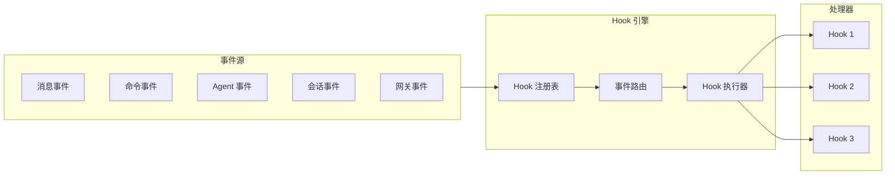
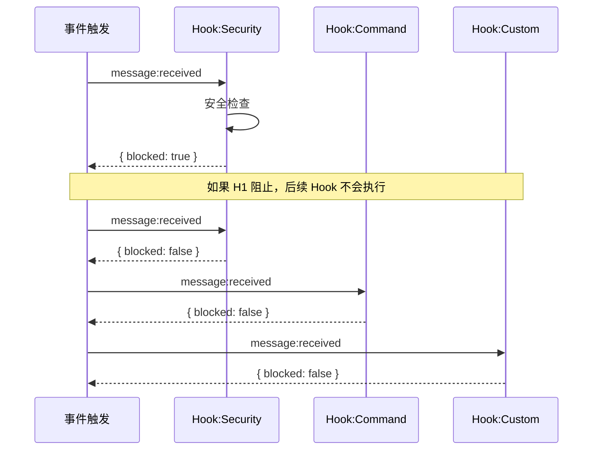

# Hooks 机制

## 1. 核心概念

Hooks 是 OpenClaw 的**事件驱动自动化引擎**。通过 Hooks，你可以在特定事件发生时执行自定义逻辑，实现自动化工作流。



## 2. Hook 类型

### 2.1 事件分类

| 类别 | 事件 | 说明 |
|------|------|------|
| **消息** | `message:received` | 收到消息 |
| | `message:preprocessed` | 消息预处理后 |
| | `message:sending` | 消息发送前（可取消） |
| | `message:sent` | 消息发送后 |
| **命令** | `command:new` | /new 命令 |
| | `command:reset` | /reset 命令 |
| | `command:stop` | /stop 命令 |
| | `command:search` | /search 命令 |
| **Agent** | `agent:bootstrap` | Agent 启动前 |
| | `agent:before_prompt` | 构建 Prompt 前 |
| | `agent:before_reply` | LLM 调用前 |
| | `agent:end` | Agent 执行结束 |
| **会话** | `session:start` | 会话开始 |
| | `session:end` | 会话结束 |
| | `session:compact:before` | 会话压缩前 |
| | `session:compact:after` | 会话压缩后 |
| **网关** | `gateway:startup` | 网关启动 |
| | `gateway:stop` | 网关关闭 |
| **工具** | `tool:before_call` | 工具调用前 |
| | `tool:after_call` | 工具调用后 |
| | `tool:result_persist` | 工具结果持久化前 |

### 2.2 事件详情

#### 消息事件

```typescript
// message:received
interface MessageReceivedEvent {
  type: 'message:received'
  channelId: string
  senderId: string
  content: string
  messageId: string
  sessionKey: string
  timestamp: number
}

// message:sending（可取消）
interface MessageSendingEvent {
  type: 'message:sending'
  channelId: string
  to: string
  content: string
  messageId?: string
  cancel(): void  // 取消发送
}
```

#### Agent 事件

```typescript
// agent:before_prompt
interface BeforePromptEvent {
  type: 'agent:before_prompt'
  sessionKey: string
  messages: Message[]
  // 可修改的字段
  prependContext?: string
  systemPrompt?: string
  prependSystemContext?: string
  appendSystemContext?: string
}

// agent:before_reply
interface BeforeReplyEvent {
  type: 'agent:before_reply'
  sessionKey: string
  messages: Message[]
  // 返回值决定是否继续
  // 返回 { reply: "..." } 跳过 LLM 调用
  // 返回 { silent: true } 静默跳过此轮
}
```

#### 工具事件

```typescript
// tool:before_call
interface BeforeToolCallEvent {
  type: 'tool:before_call'
  toolName: string
  params: object
  sessionKey: string
  // 返回 { block: true } 阻止调用
  block(): void
}

// tool:result_persist
interface ToolResultPersistEvent {
  type: 'tool:result_persist'
  toolName: string
  params: object
  result: any
  sessionId: string
  // 可修改结果
  result: any
}
```

## 3. Hook 注册

### 3.1 配置方式

```yaml
# openclaw.yaml
hooks:
  internal:
    enabled: true
    entries:
      my-automation:
        events:
          - message:received
        script: hooks/my-automation.js
        priority: high
```

### 3.2 编程方式

```typescript
// hooks/my-automation.ts
export default {
  name: 'my-automation',
  events: [
    'message:received',
    'message:sent',
    'agent:end'
  ],

  async handle(event: HookEvent) {
    switch (event.type) {
      case 'message:received':
        await this.onMessageReceived(event)
        break
      case 'message:sent':
        await this.onMessageSent(event)
        break
      case 'agent:end':
        await this.onAgentEnd(event)
        break
    }
  },

  async onMessageReceived(event: MessageReceivedEvent) {
    // 检查消息内容
    if (event.content.includes('关键词')) {
      // 执行自动化逻辑
      console.log(`Keyword found in message from ${event.senderId}`)
    }
  }
}
```

## 4. Hook 执行器

### 4.1 核心实现

```typescript
class HooksEngine {
  private handlers: Map<string, HookHandler[]> = new Map()
  private priorities: Map<string, number> = new Map()

  // 注册 Hook
  register(hook: HookDefinition) {
    for (const eventType of hook.events) {
      const handlers = this.handlers.get(eventType) || []
      handlers.push({
        name: hook.name,
        handler: hook.handler,
        priority: hook.priority || 0,
        blocking: hook.blocking || false
      })
      // 按优先级排序
      handlers.sort((a, b) => b.priority - a.priority)
      this.handlers.set(eventType, handlers)
    }
  }

  // 触发事件
  async emit<T extends HookEvent>(
    eventType: string,
    context: T['context']
  ): Promise<HookResult> {
    const handlers = this.handlers.get(eventType) || []

    for (const handler of handlers) {
      try {
        const result = await handler.handler(context)

        // 处理阻止行为
        if (handler.blocking && result?.blocked) {
          return { blocked: true, by: handler.name }
        }

        // 处理取消行为
        if (result?.cancelled) {
          return { cancelled: true, by: handler.name }
        }

        // 处理覆盖行为
        if (result?.override) {
          return { override: result.override }
        }
      } catch (err) {
        console.error(`Hook ${handler.name} failed:`, err)
        // 继续执行其他 Handler
      }
    }

    return { blocked: false }
  }
}
```

### 4.2 事件路由

```typescript
// 事件路由器
class EventRouter {
  constructor(private engine: HooksEngine) {}

  // 注册路由规则
  registerRoute(pattern: string, handler: HookHandler) {
    const eventTypes = this.expandPattern(pattern)
    for (const eventType of eventTypes) {
      this.engine.register({
        name: handler.name,
        events: [eventType],
        handler: handler.handler
      })
    }
  }

  // 展开模式
  private expandPattern(pattern: string): string[] {
    const patterns: Record<string, string[]> = {
      'message:*': [
        'message:received',
        'message:preprocessed',
        'message:sending',
        'message:sent'
      ],
      'command:*': [
        'command:new',
        'command:reset',
        'command:stop',
        'command:search'
      ],
      'session:*': [
        'session:start',
        'session:end',
        'session:compact:*'
      ],
      'tool:*': [
        'tool:before_call',
        'tool:after_call',
        'tool:result_persist'
      ]
    }
    return patterns[pattern] || [pattern]
  }
}
```

## 5. 优先级系统

### 5.1 优先级定义

```typescript
enum HookPriority {
  CRITICAL = 100,   // 关键操作，如安全检查
  HIGH = 50,        // 高优先级
  NORMAL = 0,       // 普通优先级
  LOW = -50         // 低优先级
}

// 优先级示例
const builtInHooks = [
  {
    name: 'security-check',
    events: ['message:received'],
    priority: HookPriority.CRITICAL,
    handler: securityCheckHandler  // 先执行安全检查
  },
  {
    name: 'command-parser',
    events: ['message:received'],
    priority: HookPriority.HIGH,
    handler: commandParserHandler  // 再解析命令
  },
  {
    name: 'custom-automation',
    events: ['message:received'],
    priority: HookPriority.NORMAL,
    handler: customHandler  // 最后执行自定义逻辑
  }
]
```

### 5.2 阻止链



## 6. 实用示例

### 6.1 关键词自动回复

```typescript
// hooks/keyword-reply.ts
export default {
  name: 'keyword-reply',
  events: ['message:received'],

  async handle(event: MessageReceivedEvent) {
    // 定义关键词映射
    const keywordMap: Record<string, string> = {
      'hello': 'Hi there! How can I help you?',
      'help': 'I can help you with: ...',
      'status': 'Everything is working fine!'
    }

    const content = event.content.toLowerCase()
    for (const [keyword, reply] of Object.entries(keywordMap)) {
      if (content.includes(keyword)) {
        // 通过网关发送回复
        await gateway.send({
          channelId: event.channelId,
          to: event.senderId,
          content: reply,
          sessionKey: event.sessionKey
        })
        break
      }
    }
  }
}
```

### 6.2 命令拦截

```typescript
// hooks/command-guard.ts
export default {
  name: 'command-guard',
  events: ['command:new', 'command:reset'],

  async handle(event: CommandEvent) {
    // 检查用户权限
    const user = await getUser(event.senderId)

    if (!user.hasPermission('admin')) {
      // 阻止非管理员执行敏感命令
      if (event.command === 'reset') {
        return {
          blocked: true,
          reason: 'Only admins can reset conversations'
        }
      }
    }

    return { blocked: false }
  }
}
```

### 6.3 工具结果处理

```typescript
// hooks/tool-sanitizer.ts
export default {
  name: 'tool-sanitizer',
  events: ['tool:result_persist'],

  async handle(event: ToolResultPersistEvent) {
    // 脱敏敏感信息
    if (event.toolName === 'exec') {
      const result = event.result
      if (result?.output) {
        // 移除敏感路径
        result.output = result.output.replace(
          /\/home\/[\w]+\//g,
          '/home/<user>/'
        )
      }
    }

    return { result }
  }
}
```

### 6.4 消息预处理

```typescript
// hooks/message-preprocessor.ts
export default {
  name: 'message-preprocessor',
  events: ['message:preprocessed'],

  async handle(event: MessagePreprocessedEvent) {
    // 翻译非中文消息
    if (!isChinese(event.content)) {
      const translated = await translate(event.content, 'zh')
      event.content = translated
    }

    // 添加心情检测
    const mood = detectMood(event.content)
    if (mood === 'angry') {
      event.metadata.priority = 'high'
    }

    return event
  }
}
```

### 6.5 会话压缩通知

```typescript
// hooks/compact-notify.ts
export default {
  name: 'compact-notify',
  events: ['session:compact:after'],

  async handle(event: SessionCompactAfterEvent) {
    // 记录压缩统计
    await logToAnalytics({
      sessionKey: event.sessionKey,
      compactedCount: event.context.compactedCount,
      tokensSaved: event.context.tokensBefore - event.context.tokensAfter
    })
  }
}
```

## 7. Hooks 与 Skills 对比

| 特性 | Hooks | Skills |
|------|-------|--------|
| **触发方式** | 事件驱动 | 指令触发 |
| **执行时机** | 事件发生时自动执行 | 用户显式调用 |
| **用途** | 自动化、拦截、增强 | 扩展能力、领域知识 |
| **阻塞能力** | 可阻止后续处理 | 无 |
| **配置方式** | YAML / 代码 | 目录结构 |

## 8. 最佳实践

### 8.1 错误处理

```typescript
export default {
  name: 'safe-handler',
  events: ['message:received'],

  async handle(event: MessageReceivedEvent) {
    try {
      await riskyOperation(event)
    } catch (err) {
      // 记录错误但不让 Hook 中断流程
      console.error('Hook error:', err)
      // 可选：返回错误信息
      return { error: err.message }
    }
  }
}
```

### 8.2 性能考虑

```typescript
export default {
  name: 'efficient-handler',
  events: ['message:received'],

  async handle(event: MessageReceivedEvent) {
    // 快速路径：不需要处理的情况直接返回
    if (!shouldProcess(event)) {
      return
    }

    // 耗时操作使用 Promise.all 并行
    const [result1, result2] = await Promise.all([
      operation1(event),
      operation2(event)
    ])

    return { processed: true, result1, result2 }
  }
}
```

### 8.3 测试

```typescript
// hooks/__tests__/my-hook.test.ts
import { createMockEvent } from '@openclaw/test-utils'

describe('my-hook', () => {
  it('should process message correctly', async () => {
    const hook = require('../my-hook').default
    const event = createMockEvent('message:received', {
      content: 'test message',
      senderId: 'user123'
    })

    const result = await hook.handle(event)

    expect(result.processed).toBe(true)
  })
})
```

## 9. 相关文档

- [架构总览](./architecture.md)
- [插件系统](./plugins.md)
- [自动化 Hooks 文档](https://docs.openclaw.ai/automation/hooks)
