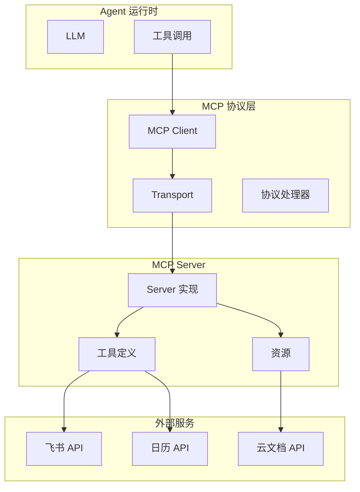

# MCP 协议（Model Context Protocol）

## 1. 协议概述

MCP（Model Context Protocol）是一种用于**扩展 AI Agent 工具能力**的协议。它允许 AI 模型通过统一的接口调用外部工具和服务。



## 2. 核心概念

### 2.1 MCP 架构

```
┌─────────────────────────────────────────────────────────┐
│                      AI Model                            │
│                   (Claude, GPT, etc.)                   │
└─────────────────────┬───────────────────────────────────┘
                      │ Tool Calls (JSON-RPC)
                      ▼
┌─────────────────────────────────────────────────────────┐
│                   MCP Client                             │
│  ┌─────────────┐  ┌─────────────┐  ┌─────────────────┐ │
│  │ Tool Handler│  │Resource Handler│ │Sampling Handler│ │
│  └─────────────┘  └─────────────┘  └─────────────────┘ │
└─────────────────────┬───────────────────────────────────┘
                      │ JSON-RPC over Transport
                      ▼
┌─────────────────────────────────────────────────────────┐
│                   MCP Server                             │
│  ┌─────────────┐  ┌─────────────┐  ┌─────────────────┐ │
│  │ Tool Registry│  │Resource Registry│ │ Prompt Registry│ │
│  └─────────────┘  └─────────────┘  └─────────────────┘ │
└─────────────────────┬───────────────────────────────────┘
                      │
                      ▼
┌─────────────────────────────────────────────────────────┐
│                   External Services                      │
│  (Feishu, Google Calendar, Slack, Custom APIs, etc.)   │
└─────────────────────────────────────────────────────────┘
```

### 2.2 核心组件

| 组件 | 说明 |
|------|------|
| **MCP Client** | 在 Agent 运行时中，负责与 MCP Server 通信 |
| **MCP Server** | 实现具体工具和资源的服务器 |
| **Transport** | 通信传输层（StdIO、WebSocket、HTTP） |
| **Tool** | 可调用的工具 |
| **Resource** | 可读取的资源 |
| **Prompt** | 预定义的提示模板 |

## 3. 协议消息

### 3.1 JSON-RPC 2.0

MCP 基于 JSON-RPC 2.0 协议：

```typescript
// 请求
interface JSONRPCRequest {
  jsonrpc: '2.0'
  id: string | number
  method: string
  params?: object
}

// 响应
interface JSONRPCResponse {
  jsonrpc: '2.0'
  id: string | number
  result?: any
  error?: {
    code: number
    message: string
    data?: any
  }
}

// 通知（无响应）
interface JSONRPCNotification {
  jsonrpc: '2.0'
  method: string
  params?: object
}
```

### 3.2 核心方法

```typescript
// === 初始化 ===
// 客户端 -> 服务器：初始化
{ method: 'initialize', params: {
    protocolVersion: '2024-11-05',
    capabilities: { tools: {}, resources: {} },
    clientInfo: { name: 'openclaw', version: '1.0.0' }
}}

// 服务器 -> 客户端：初始化结果
{ id: 1, result: {
    protocolVersion: '2024-11-05',
    capabilities: { tools: {}, resources: {} },
    serverInfo: { name: 'feishu-mcp', version: '1.0.0' }
}}

// === 工具调用 ===
// 客户端 -> 服务器：列出工具
{ method: 'tools/list', params: {} }

// 服务器 -> 客户端：工具列表
{ id: 2, result: {
    tools: [
      { name: 'send_message', description: 'Send a message', inputSchema: {...} },
      { name: 'create_event', description: 'Create calendar event', inputSchema: {...} }
    ]
}}

// 客户端 -> 服务器：调用工具
{ method: 'tools/call', params: {
    name: 'send_message',
    arguments: { chat_id: 'oc123', content: 'Hello!' }
}}

// 服务器 -> 客户端：工具结果
{ id: 3, result: {
    content: [
      { type: 'text', text: '{"message_id": "om123"}' }
    ]
}}

// === 资源 ===
// 客户端 -> 服务器：列出资源
{ method: 'resources/list', params: {} }

// 服务器 -> 客户端：资源列表
{ id: 4, result: {
    resources: [
      { uri: 'feishu://chats', name: 'Chats', mimeType: 'application/json' },
      { uri: 'feishu://contacts', name: 'Contacts', mimeType: 'application/json' }
    ]
}}

// 客户端 -> 服务器：读取资源
{ method: 'resources/read', params: { uri: 'feishu://chats/oc123' }}

// 服务器 -> 客户端：资源内容
{ id: 5, result: {
    contents: [
      { uri: 'feishu://chats/oc123', mimeType: 'application/json',
        blob: '{"name": "Test Group", "members": [...]}' }
    ]
}}
```

## 4. MCP 服务器实现

### 4.1 服务器结构

```typescript
import { Server } from '@modelcontextprotocol/sdk/server/index.js'
import { StdioServerTransport } from '@modelcontextprotocol/sdk/server/stdio.js'
import {
  CallToolRequestSchema,
  ListToolsRequestSchema,
  ListResourcesRequestSchema,
  ReadResourceRequestSchema
} from '@modelcontextprotocol/sdk/types.js'

// 创建服务器
const server = new Server(
  {
    name: 'feishu-mcp',
    version: '1.0.0'
  },
  {
    capabilities: {
      tools: {},
      resources: {}
    }
  }
)

// 注册工具列表处理器
server.setRequestHandler(ListToolsRequestSchema, async () => {
  return {
    tools: [
      {
        name: 'send_message',
        description: 'Send a message to a Feishu chat',
        inputSchema: {
          type: 'object',
          properties: {
            chat_id: { type: 'string', description: 'Chat ID' },
            content: { type: 'string', description: 'Message content' }
          },
          required: ['chat_id', 'content']
        }
      },
      {
        name: 'create_event',
        description: 'Create a calendar event',
        inputSchema: {
          type: 'object',
          properties: {
            summary: { type: 'string' },
            start_time: { type: 'string', format: 'date-time' },
            end_time: { type: 'string', format: 'date-time' }
          },
          required: ['summary', 'start_time', 'end_time']
        }
      }
    ]
  }
})

// 注册工具调用处理器
server.setRequestHandler(CallToolRequestSchema, async (request) => {
  const { name, arguments: args } = request.params

  switch (name) {
    case 'send_message':
      return await handleSendMessage(args)
    case 'create_event':
      return await handleCreateEvent(args)
    default:
      throw new Error(`Unknown tool: ${name}`)
  }
})

// 启动服务器
const transport = new StdioServerTransport()
await server.connect(transport)
```

### 4.2 飞书 MCP 服务器示例

```typescript
// feishu-mcp-server/index.ts
import { Server } from '@modelcontextprotocol/sdk/server/index.js'
import { FeishuClient } from './client.js'

const feishu = new FeishuClient({
  appId: process.env.FEISHU_APP_ID,
  appSecret: process.env.FEISHU_APP_SECRET
})

const server = new Server({ name: 'feishu', version: '1.0.0' }, {
  capabilities: { tools: {}, resources: {} }
})

// 工具：发送消息
server.setRequestHandler(CallToolRequestSchema, async (request) => {
  const { name, arguments: args } = request.params

  if (name === 'send_message') {
    const result = await feishu.im.message.create({
      receive_id: args.chat_id,
      msg_type: 'text',
      content: JSON.stringify({ text: args.content })
    })

    return {
      content: [{ type: 'text', text: JSON.stringify(result) }]
    }
  }

  if (name === 'get_chat_info') {
    const result = await feishu.im.chat.get({ chat_id: args.chat_id })
    return {
      content: [{ type: 'text', text: JSON.stringify(result.data) }]
    }
  }

  throw new Error(`Unknown tool: ${name}`)
})
```

## 5. MCP 客户端实现

### 5.1 客户端结构

```typescript
// mcp-client.ts
class MCPClient {
  private server: ChildProcess | null = null
  private transport: StdioTransport | null = null
  private pendingRequests: Map<string, PendingRequest> = new Map()

  // 启动 MCP 服务器
  async connect(command: string, args: string[]): Promise<void> {
    this.server = spawn(command, args)

    this.transport = new StdioTransport()
    await this.transport.connect(this.server.stdout, this.server.stdin)

    this.transport.onMessage((message) => {
      this.handleMessage(message)
    })

    // 发送初始化
    await this.sendRequest('initialize', {
      protocolVersion: '2024-11-05',
      capabilities: { tools: {} },
      clientInfo: { name: 'openclaw', version: '1.0.0' }
    })
  }

  // 列出可用工具
  async listTools(): Promise<Tool[]> {
    const response = await this.sendRequest('tools/list', {})
    return response.tools
  }

  // 调用工具
  async callTool(name: string, args: object): Promise<ToolResult> {
    const response = await this.sendRequest('tools/call', {
      name,
      arguments: args
    })
    return response.content
  }

  // 断开连接
  async disconnect(): Promise<void> {
    this.server?.kill()
    this.transport?.disconnect()
  }
}
```

### 5.2 与 Agent 集成

```typescript
// agent-runtime.ts
class AgentRuntime {
  private mcpClients: Map<string, MCPClient> = new Map()

  async loadMCPClients(config: MCPConfig[]) {
    for (const cfg of config) {
      const client = new MCPClient()

      if (cfg.type === 'stdio') {
        await client.connect(cfg.command, cfg.args)
      } else if (cfg.type === 'http') {
        await client.connectHttp(cfg.url)
      }

      this.mcpClients.set(cfg.name, client)
    }
  }

  async executeToolCall(toolCall: ToolCall): Promise<ToolResult> {
    const [serverName, toolName] = toolCall.name.split(':')

    if (serverName === 'mcp') {
      // 调用 MCP 工具
      const client = this.mcpClients.get(toolName)
      if (!client) throw new Error(`MCP client not found: ${toolName}`)

      return await client.callTool(toolCall.name, toolCall.arguments)
    }

    // 内置工具
    return await this.toolRegistry.execute(toolCall.name, toolCall.arguments)
  }

  // 获取工具定义
  async getToolDefinitions(): Promise<ToolDefinition[]> {
    const tools: ToolDefinition[] = []

    // 添加内置工具
    for (const tool of this.toolRegistry.list()) {
      tools.push(tool.toDefinition())
    }

    // 添加 MCP 工具
    for (const [name, client] of this.mcpClients) {
      const mcpTools = await client.listTools()
      for (const tool of mcpTools) {
        tools.push({
          name: `mcp:${name}:${tool.name}`,
          description: tool.description,
          inputSchema: tool.inputSchema
        })
      }
    }

    return tools
  }
}
```

## 6. 传输层

### 6.1 StdIO 传输

```typescript
// stdio-transport.ts
class StdioTransport {
  private stdin: Writable
  private stdout: Readable
  private writeQueue: string[] = []
  private writing = false

  async connect(stdout: Readable, stdin: Writable) {
    this.stdout = stdout
    this.stdin = stdin

    // 读取服务器输出
    this.stdout.on('data', (data) => {
      const messages = data.toString().split('\n').filter(Boolean)
      for (const msg of messages) {
        this.onMessage?.(JSON.parse(msg))
      }
    })
  }

  send(message: object): void {
    this.writeQueue.push(JSON.stringify(message))
    this.flush()
  }

  private async flush() {
    if (this.writing) return
    this.writing = true

    while (this.writeQueue.length > 0) {
      const msg = this.writeQueue.shift()!
      this.stdin.write(msg + '\n')
    }

    this.writing = false
  }
}
```

### 6.2 HTTP/SSE 传输

```typescript
// http-transport.ts
class HTTPTransport {
  constructor(private url: string) {}

  async send(message: object): Promise<any> {
    const response = await fetch(this.url, {
      method: 'POST',
      headers: { 'Content-Type': 'application/json' },
      body: JSON.stringify(message)
    })
    return response.json()
  }

  // SSE 用于服务端推送
  async listen(handler: (msg: object) => void) {
    const response = await fetch(this.url + '/events', {
      headers: { 'Accept': 'text/event-stream' }
    })

    const reader = response.body?.getReader()
    const decoder = new TextDecoder()

    while (reader) {
      const { done, value } = await reader.read()
      if (done) break

      const lines = decoder.decode(value).split('\n')
      for (const line of lines) {
        if (line.startsWith('data: ')) {
          handler(JSON.parse(line.slice(6)))
        }
      }
    }
  }
}
```

## 7. MCP 配置

### 7.1 配置格式

```yaml
# openclaw.yaml
mcp:
  servers:
    feishu:
      type: stdio
      command: node
      args:
        - ./mcp-servers/feishu/dist/index.js
      env:
        FEISHU_APP_ID: ${FEISHU_APP_ID}
        FEISHU_APP_SECRET: ${FEISHU_APP_SECRET}

    google-calendar:
      type: http
      url: https://calendar-mcp.example.com

    slack:
      type: stdio
      command: npx
      args:
        - -y
        - @slack/mcp-server
```

### 7.2 环境变量

```bash
# .env
FEISHU_APP_ID=cli_xxx
FEISHU_APP_SECRET=xxx

# MCP 服务器自动注入这些环境变量
```

## 8. MCP 工具封装

### 8.1 飞书工具封装

```typescript
// feishu-mcp-tools.ts
export const feishuTools = {
  // 消息
  'feishu.send_message': {
    description: 'Send a text message to a Feishu chat',
    parameters: {
      type: 'object',
      properties: {
        chat_id: { type: 'string', description: 'Chat ID' },
        content: { type: 'string', description: 'Message content' }
      },
      required: ['chat_id', 'content']
    }
  },

  'feishu.create_event': {
    description: 'Create a calendar event',
    parameters: {
      type: 'object',
      properties: {
        summary: { type: 'string' },
        start_time: { type: 'string' },
        end_time: { type: 'string' },
        attendees: {
          type: 'array',
          items: { type: 'string' }
        }
      },
      required: ['summary', 'start_time', 'end_time']
    }
  },

  'feishu.search_doc': {
    description: 'Search Feishu documents',
    parameters: {
      type: 'object',
      properties: {
        query: { type: 'string' },
        count: { type: 'integer', default: 10 }
      },
      required: ['query']
    }
  }
}
```

## 9. 最佳实践

### 9.1 错误处理

```typescript
server.setRequestHandler(CallToolRequestSchema, async (request) => {
  try {
    const result = await executeTool(request.params)
    return { content: [{ type: 'text', text: JSON.stringify(result) }] }
  } catch (error) {
    return {
      content: [{ type: 'text', text: error.message }],
      isError: true
    }
  }
})
```

### 9.2 进度报告

```typescript
// 对于长时间操作，支持进度报告
server.setRequestHandler(CallToolRequestSchema, async (request) => {
  const totalSteps = 10

  for (let i = 0; i < totalSteps; i++) {
    // 发送进度
    await server.sendNotification('notifications/progress', {
      progress: i / totalSteps,
      message: `Step ${i + 1} of ${totalSteps}`
    })

    await doStep(i)
  }

  return { content: [{ type: 'text', text: 'Done' }] }
})
```

## 10. 相关文档

- [工具系统](./tools.md)
- [Agent 运行时](./agents.md)
- [MCP 官方文档](https://modelcontextprotocol.io)
