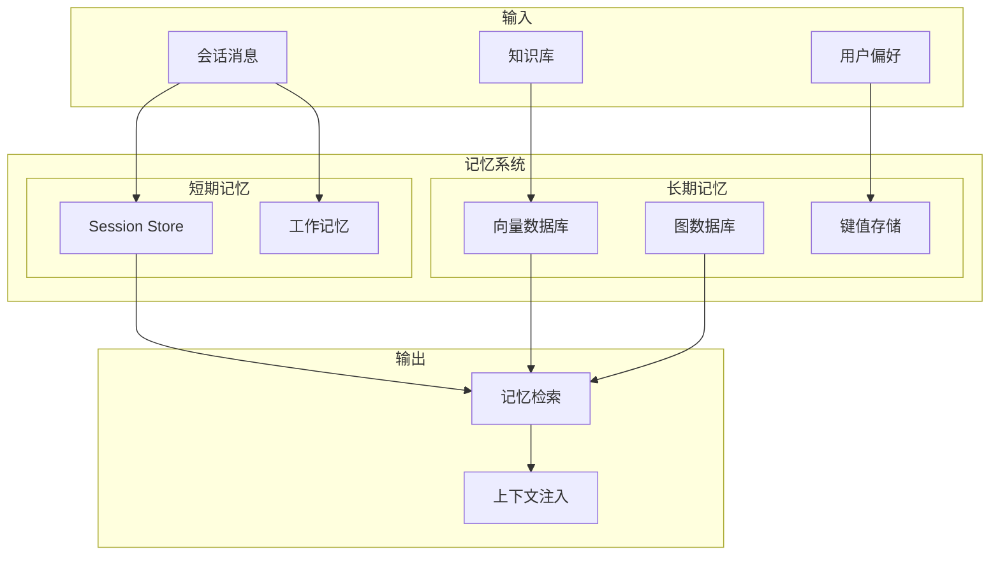
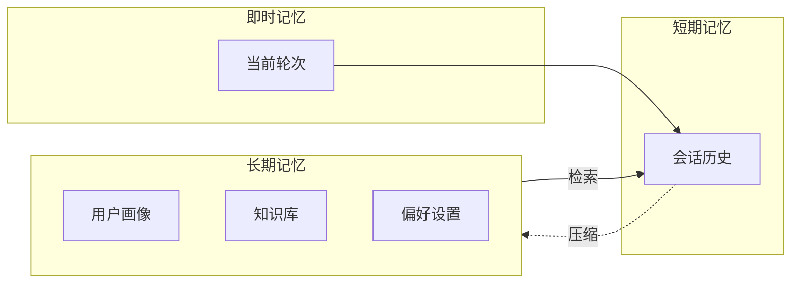

# 记忆系统（Memory）

## 1. 核心概念

OpenClaw 的记忆系统负责**持久化会话状态和跨会话学习**。它使 Agent 能够：

- 记住之前的对话
- 跨会话保持上下文
- 学习用户偏好
- 维护长期知识



## 2. 记忆层次

### 2.1 三层架构



### 2.2 各层特点

| 层次 | 容量 | 持久性 | 访问速度 | 用途 |
|------|------|--------|----------|------|
| **即时** | 1 条消息 | 毫秒级 | 最快 | 当前处理的消息 |
| **短期** | ~50 条消息 | 会话级 | 快 | 对话历史 |
| **长期** | 无限制 | 持久 | 较慢 | 用户偏好、知识 |

## 3. 核心组件

### 3.1 记忆引擎接口

```typescript
interface MemoryEngine {
  // 存储记忆
  store(key: string, value: MemoryValue, options?: StoreOptions): Promise<void>

  // 检索记忆
  retrieve(key: string, options?: RetrieveOptions): Promise<MemoryValue>

  // 搜索记忆
  search(query: string, options?: SearchOptions): Promise<MemorySearchResult[]>

  // 删除记忆
  delete(key: string): Promise<void>

  // 列出记忆
  list(options?: ListOptions): Promise<MemoryEntry[]>
}

interface MemoryValue {
  content: string
  metadata: Record<string, any>
  embedding?: number[]  // 向量表示
  createdAt: Date
  updatedAt: Date
  tags?: string[]
}

interface StoreOptions {
  ttl?: number           // 生存时间
  namespace?: string     // 命名空间
  tags?: string[]       // 标签
}

interface SearchOptions {
  limit?: number
  threshold?: number    // 相似度阈值
  namespace?: string
  tags?: string[]
}
```

### 3.2 存储后端

```typescript
// 存储后端接口
interface MemoryBackend {
  get(key: string): Promise<MemoryValue | null>
  set(key: string, value: MemoryValue): Promise<void>
  delete(key: string): Promise<void>
  list(prefix: string): Promise<MemoryEntry[]>
}

// === 文件存储 ===
class FileMemoryBackend implements MemoryBackend {
  constructor(private dir: string) {}

  async get(key: string): Promise<MemoryValue | null> {
    const path = this.getPath(key)
    if (!fs.existsSync(path)) return null
    return JSON.parse(fs.readFileSync(path, 'utf-8'))
  }

  async set(key: string, value: MemoryValue): Promise<void> {
    const path = this.getPath(key)
    await fs.promises.mkdir(path.dirname(path), { recursive: true })
    await fs.promises.writeFile(path, JSON.stringify(value), 'utf-8')
  }

  private getPath(key: string): string {
    return path.join(this.dir, key.replace(/:/g, '/') + '.json')
  }
}

// === Redis 存储 ===
class RedisMemoryBackend implements MemoryBackend {
  constructor(private client: RedisClient) {}

  async get(key: string): Promise<MemoryValue | null> {
    const data = await this.client.get(this.prefix + key)
    return data ? JSON.parse(data) : null
  }

  async set(key: string, value: MemoryValue): Promise<void> {
    await this.client.set(this.prefix + key, JSON.stringify(value))
  }
}

// === 向量存储 (LanceDB) ===
class VectorMemoryBackend implements MemoryBackend {
  constructor(private db: LanceDB) {
    this.table = db.openTable('memory_vectors')
  }

  async store(key: string, value: MemoryValue): Promise<void> {
    const embedding = await this.embed(value.content)
    await this.table.insert({
      key,
      content: value.content,
      embedding,
      metadata: JSON.stringify(value.metadata),
      created_at: value.createdAt
    })
  }

  async search(query: string, limit = 10): Promise<MemorySearchResult[]> {
    const queryEmbedding = await this.embed(query)
    const results = await this.table
      .query()
      .vector('embedding', queryEmbedding)
      .limit(limit)
      .execute()

    return results.map(r => ({
      key: r.key,
      content: r.content,
      score: 1 - r.distance,  // LanceDB 用距离
      metadata: JSON.parse(r.metadata)
    }))
  }
}
```

## 4. 会话记忆

### 4.1 会话消息存储

```typescript
class SessionMemory {
  constructor(
    private store: MemoryBackend,
    private maxMessages = 50
  ) {}

  async addMessage(
    sessionKey: string,
    message: Message
  ): Promise<void> {
    const key = `session:${sessionKey}:messages`
    const messages = await this.getMessages(sessionKey)

    messages.push({
      ...message,
      timestamp: new Date()
    })

    // 超过限制时触发压缩
    if (messages.length > this.maxMessages) {
      await this.compact(sessionKey, messages)
    } else {
      await this.store.set(key, {
        content: JSON.stringify(messages),
        metadata: { count: messages.length },
        createdAt: new Date(),
        updatedAt: new Date()
      })
    }
  }

  async getMessages(sessionKey: string): Promise<Message[]> {
    const key = `session:${sessionKey}:messages`
    const value = await this.store.get(key)
    if (!value) return []
    return JSON.parse(value.content)
  }

  private async compact(sessionKey: string, messages: Message[]): Promise<void> {
    // 保留最近的消息
    const keepCount = Math.floor(this.maxMessages * 0.3)
    const toKeep = messages.slice(-keepCount)
    const toSummarize = messages.slice(0, -keepCount)

    // 生成摘要
    const summary = await this.summarize(toSummarize)

    // 保存摘要和保留的消息
    const compacted = [
      { role: 'system', content: `【历史摘要】${summary}`, id: 'summary' },
      ...toKeep
    ]

    await this.store.set(`session:${sessionKey}:messages`, {
      content: JSON.stringify(compacted),
      metadata: {
        count: compacted.length,
        compactedFrom: messages.length,
        summary
      },
      createdAt: new Date(),
      updatedAt: new Date()
    })
  }
}
```

### 4.2 用户画像

```typescript
class UserProfileMemory {
  async updateProfile(
    userId: string,
    updates: Partial<UserProfile>
  ): Promise<void> {
    const key = `user:${userId}:profile`
    const current = await this.store.get(key)

    const profile: UserProfile = {
      ...current ? JSON.parse(current.content) : {},
      ...updates,
      updatedAt: new Date()
    }

    await this.store.set(key, {
      content: JSON.stringify(profile),
      metadata: { userId },
      createdAt: current ? new Date(current.createdAt) : new Date(),
      updatedAt: new Date()
    })
  }

  async getProfile(userId: string): Promise<UserProfile | null> {
    const key = `user:${userId}:profile`
    const value = await this.store.get(key)
    return value ? JSON.parse(value.content) : null
  }

  // 从对话中学习偏好
  async learnFromConversation(
    userId: string,
    messages: Message[]
  ): Promise<void> {
    const lastMessage = messages[messages.length - 1]
    if (!lastMessage || lastMessage.role !== 'user') return

    // 简单的偏好提取（实际可用 LLM）
    const preferences: Partial<UserProfile> = {}

    if (lastMessage.content.includes('叫我')) {
      const nameMatch = lastMessage.content.match(/叫我(.+)/)
      if (nameMatch) {
        preferences.name = nameMatch[1].trim()
      }
    }

    if (Object.keys(preferences).length > 0) {
      await this.updateProfile(userId, preferences)
    }
  }
}

interface UserProfile {
  name?: string
  language?: string
  timezone?: string
  preferences?: Record<string, any>
  updatedAt: Date
}
```

## 5. 知识记忆

### 5.1 知识存储

```typescript
class KnowledgeMemory {
  constructor(
    private vectorStore: VectorMemoryBackend,
    private graphStore: GraphMemoryBackend
  ) {}

  // 添加知识
  async addKnowledge(
    content: string,
    metadata: KnowledgeMetadata
  ): Promise<void> {
    // 1. 存储到向量数据库（用于语义搜索）
    await this.vectorStore.store(`kb:${metadata.id}`, {
      content,
      metadata,
      createdAt: new Date()
    })

    // 2. 提取实体并存储到图数据库
    const entities = await this.extractEntities(content)
    for (const entity of entities) {
      await this.graphStore.addEntity(entity)
    }

    // 3. 提取关系
    const relations = await this.extractRelations(content, entities)
    for (const relation of relations) {
      await this.graphStore.addRelation(relation)
    }
  }

  // 语义搜索
  async semanticSearch(
    query: string,
    limit = 5
  ): Promise<KnowledgeResult[]> {
    const results = await this.vectorStore.search(query, limit)
    return results.map(r => ({
      id: r.key.replace('kb:', ''),
      content: r.content,
      score: r.score,
      metadata: r.metadata
    }))
  }

  // 关系搜索
  async relationalSearch(
    entity: string,
    depth = 2
  ): Promise<GraphResult[]> {
    return await this.graphStore.traverse(entity, depth)
  }
}

interface KnowledgeMetadata {
  id: string
  source: string
  tags: string[]
  createdAt: Date
}
```

### 5.2 图数据库实现

```typescript
class GraphMemoryBackend {
  constructor(private store: MemoryBackend) {}

  async addEntity(entity: Entity): Promise<void> {
    const key = `graph:entity:${entity.id}`
    await this.store.set(key, {
      content: JSON.stringify(entity),
      metadata: { type: 'entity' }
    })
  }

  async addRelation(relation: Relation): Promise<void> {
    const key = `graph:relation:${relation.from}:${relation.type}:${relation.to}`
    await this.store.set(key, {
      content: JSON.stringify(relation),
      metadata: { type: 'relation' }
    })
  }

  async traverse(startEntity: string, depth: number): Promise<GraphResult[]> {
    const results: GraphResult[] = []
    const visited = new Set<string>()
    const queue: { entity: string; depth: number }[] = [
      { entity: startEntity, depth: 0 }
    ]

    while (queue.length > 0) {
      const { entity, depth: currentDepth } = queue.shift()!

      if (visited.has(entity) || currentDepth > depth) continue
      visited.add(entity)

      // 获取实体
      const entityData = await this.store.get(`graph:entity:${entity}`)
      if (entityData) {
        results.push({
          type: 'entity',
          data: JSON.parse(entityData.content)
        })
      }

      // 获取关联关系
      const relations = await this.store.list(`graph:relation:${entity}:`)
      for (const rel of relations) {
        results.push({
          type: 'relation',
          data: JSON.parse(rel.value.content)
        })

        const relData = JSON.parse(rel.value.content)
        queue.push({ entity: relData.to, depth: currentDepth + 1 })
      }
    }

    return results
  }
}
```

## 6. 上下文注入

### 6.1 上下文组装

```typescript
class ContextAssembler {
  constructor(
    private sessionMemory: SessionMemory,
    private userProfile: UserProfileMemory,
    private knowledge: KnowledgeMemory
  ) {}

  async assembleContext(
    sessionKey: string,
    options: {
      includeHistory?: boolean
      includeProfile?: boolean
      includeKnowledge?: boolean
      knowledgeQuery?: string
    } = {}
  ): Promise<Context> {
    const context: Context = {
      systemPrompt: [],
      prependContext: [],
      appendContext: []
    }

    // 1. 用户画像
    if (options.includeProfile) {
      const userId = extractUserId(sessionKey)
      const profile = await this.userProfile.getProfile(userId)
      if (profile) {
        context.systemPrompt.push({
          role: 'system',
          content: `User profile: ${JSON.stringify(profile)}`
        })
      }
    }

    // 2. 会话历史
    if (options.includeHistory) {
      const messages = await this.sessionMemory.getMessages(sessionKey)
      context.prependContext = messages.map(m => ({
        role: m.role,
        content: m.content
      }))
    }

    // 3. 知识检索
    if (options.includeKnowledge && options.knowledgeQuery) {
      const relevant = await this.knowledge.semanticSearch(
        options.knowledgeQuery,
        5
      )
      if (relevant.length > 0) {
        context.appendContext.push({
          role: 'system',
          content: `Relevant knowledge:\n${relevant.map(k => k.content).join('\n\n')}`
        })
      }
    }

    return context
  }
}
```

## 7. 记忆清理

### 7.1 过期清理

```typescript
class MemoryGC {
  constructor(
    private store: MemoryBackend,
    private ttl: number = 30 * 24 * 60 * 60 * 1000 // 30 天
  ) {}

  async cleanup(): Promise<CleanupResult> {
    const entries = await this.store.list()
    const now = Date.now()
    let deleted = 0

    for (const entry of entries) {
      if (entry.updatedAt && now - new Date(entry.updatedAt).getTime() > this.ttl) {
        await this.store.delete(entry.key)
        deleted++
      }
    }

    return { deleted, remaining: entries.length - deleted }
  }
}
```

### 7.2 LRU 缓存

```typescript
class LRUCache {
  constructor(
    private cache: Map<string, MemoryValue>,
    private maxSize: number = 1000
  ) {}

  get(key: string): MemoryValue | undefined {
    const value = this.cache.get(key)
    if (value) {
      // 移到末尾（最近使用）
      this.cache.delete(key)
      this.cache.set(key, value)
    }
    return value
  }

  set(key: string, value: MemoryValue): void {
    if (this.cache.has(key)) {
      this.cache.delete(key)
    } else if (this.cache.size >= this.maxSize) {
      // 删除最旧的
      const firstKey = this.cache.keys().next().value
      this.cache.delete(firstKey)
    }
    this.cache.set(key, value)
  }
}
```

## 8. 配置

```yaml
# openclaw.yaml
memory:
  # 会话消息限制
  session:
    max_messages: 50
    compact_threshold: 40

  # 用户画像 TTL
  profile:
    ttl: 365d  # 1 年

  # 知识库
  knowledge:
    enabled: true
    backend: lancedb
    path: ~/.openclaw/memory/knowledge

  # 向量嵌入
  embedding:
    provider: openai
    model: text-embedding-3-small
    dimension: 1536
```

## 9. 相关文档

- [会话管理](./sessions.md)
- [Compaction 机制](https://docs.openclaw.ai/concepts/compaction)
