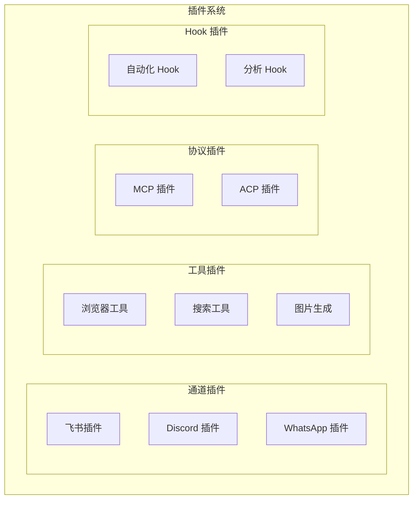

# 插件系统（Plugins）

## 1. 核心概念

OpenClaw 的插件系统是其可扩展性的核心。插件可以：

- 添加新的**通道**（Channel）
- 添加新的**工具**（Tool）
- 添加新的**协议实现**（MCP、ACP）
- 注册 **Hooks**
- 添加新的**认证方式**



## 2. 插件接口

```typescript
// 基础插件接口
interface Plugin {
  // 插件 ID（唯一标识）
  id: string

  // 插件名称
  name: string

  // 插件版本
  version: string

  // 插件描述
  description?: string

  // 依赖插件
  dependencies?: string[]

  // 加载时调用
  onLoad(ctx: PluginContext): Promise<void>

  // 卸载时调用
  onUnload(): Promise<void>
}

// 通道插件接口
interface ChannelPlugin extends Plugin {
  // 通道 ID
  channelId: string

  // 创建通道运行时
  createRuntime(cfg: ChannelConfig, accountId: string): ChannelRuntime
}

// 工具插件接口
interface ToolPlugin extends Plugin {
  // 注册工具
  registerTools(registry: ToolRegistry): void
}

// Hook 插件接口
interface HookPlugin extends Plugin {
  // 注册 Hooks
  registerHooks(hooks: HooksEngine): void
}
```

## 3. 插件上下文

```typescript
interface PluginContext {
  // OpenClaw 配置
  config: OpenClawConfig

  // 日志器
  logger: Logger

  // 文件系统
  fs: FileSystem

  // HTTP 客户端
  http: HttpClient

  // 存储
  store: PluginStore

  // 注册表访问
  registries: {
    tool: ToolRegistry
    channel: ChannelRegistry
    model: ModelRegistry
  }
}
```

## 4. 插件注册表

### 4.1 注册表接口

```typescript
interface PluginRegistry {
  // 注册插件
  register(plugin: Plugin): void

  // 卸载插件
  unregister(pluginId: string): void

  // 获取插件
  get(pluginId: string): Plugin | null

  // 列出所有插件
  list(): Plugin[]

  // 按类型查询
  find(predicate: (p: Plugin) => boolean): Plugin[]
}
```

### 4.2 实现

```typescript
class DefaultPluginRegistry implements PluginRegistry {
  private plugins: Map<string, Plugin> = new Map()

  async register(plugin: Plugin): Promise<void> {
    // 1. 检查依赖
    for (const depId of plugin.dependencies || []) {
      if (!this.plugins.has(depId)) {
        throw new Error(`Plugin ${plugin.id} depends on ${depId} which is not loaded`)
      }
    }

    // 2. 加载依赖
    for (const depId of plugin.dependencies || []) {
      const dep = this.plugins.get(depId)!
      if (!dep) continue
      // 确保依赖已加载
    }

    // 3. 调用 onLoad
    await plugin.onLoad(this.createContext(plugin))

    // 4. 添加到注册表
    this.plugins.set(plugin.id, plugin)
  }

  async unregister(pluginId: string): Promise<void> {
    const plugin = this.plugins.get(pluginId)
    if (!plugin) return

    // 1. 检查是否有其他插件依赖此插件
    for (const p of this.plugins.values()) {
      if (p.dependencies?.includes(pluginId)) {
        throw new Error(`Cannot unload ${pluginId}: required by ${p.id}`)
      }
    }

    // 2. 调用 onUnload
    await plugin.onUnload()

    // 3. 从注册表移除
    this.plugins.delete(pluginId)
  }
}
```

## 5. 插件发现与安装

### 5.1 插件发现

```typescript
interface PluginCatalog {
  // 搜索插件
  search(query: string): Promise<PluginInfo[]>

  // 获取插件详情
  getInfo(pluginId: string): Promise<PluginInfo>

  // 获取已安装版本
  getInstalledVersions(): Promise<Map<string, string>>
}

interface PluginInfo {
  id: string
  name: string
  version: string
  description: string
  author: string
  homepage: string
  repository: string
  keywords: string[]
  dependencies: Record<string, string>
}
```

### 5.2 插件安装

```typescript
async function installPlugin(
  registry: PluginRegistry,
  pluginId: string,
  version?: string
): Promise<void> {
  // 1. 下载插件包
  const packageUrl = resolvePluginUrl(pluginId, version)
  const packageData = await downloadPlugin(packageUrl)

  // 2. 验证签名
  if (!verifySignature(packageData)) {
    throw new Error(`Invalid signature for plugin ${pluginId}`)
  }

  // 3. 解压到插件目录
  const installDir = resolvePluginDir(pluginId)
  await extractPlugin(packageData, installDir)

  // 4. 安装依赖
  const packageJson = readPackageJson(installDir)
  for (const [dep, version] of Object.entries(packageJson.dependencies || {})) {
    await installDependency(dep, version)
  }

  // 5. 加载插件
  const plugin = await loadPlugin(installDir)
  await registry.register(plugin)
}
```

## 6. 插件配置

### 6.1 配置 Schema

```typescript
// 插件配置 Schema
interface PluginConfigSchema {
  type: 'object'
  properties: Record<string, PropertySchema>
  required?: string[]
}

interface PropertySchema {
  type: 'string' | 'number' | 'boolean' | 'object' | 'array'
  description?: string
  default?: any
  enum?: any[]
  minimum?: number
  maximum?: number
  pattern?: string
}

// 示例：飞书插件配置 Schema
const feishuPluginSchema: PluginConfigSchema = {
  type: 'object',
  properties: {
    appId: {
      type: 'string',
      description: '飞书应用 ID'
    },
    appSecret: {
      type: 'string',
      description: '飞书应用密钥'
    },
    botName: {
      type: 'string',
      default: 'OpenClaw'
    },
    endpoints: {
      type: 'object',
      properties: {
        message: { type: 'string' },
        event: { type: 'string' }
      }
    }
  },
  required: ['appId', 'appSecret']
}
```

### 6.2 配置验证

```typescript
function validatePluginConfig(
  config: any,
  schema: PluginConfigSchema
): ValidationResult {
  const errors: ValidationError[] = []

  // 检查必需字段
  for (const field of schema.required || []) {
    if (config[field] === undefined) {
      errors.push({
        path: field,
        message: `Required field missing: ${field}`
      })
    }
  }

  // 验证每个字段
  for (const [key, propSchema] of Object.entries(schema.properties)) {
    const value = config[key]
    if (value === undefined) continue

    const error = validateValue(value, propSchema, key)
    if (error) errors.push(error)
  }

  return {
    valid: errors.length === 0,
    errors
  }
}
```

## 7. 插件隔离

### 7.1 沙箱环境

插件在隔离环境中运行，防止恶意代码影响核心系统：

```typescript
interface SandboxConfig {
  // 是否启用沙箱
  enabled: boolean

  // 允许的系统调用
  allowedSyscalls?: string[]

  // 允许的网络访问
  allowedNetwork?: boolean

  // 允许的文件系统路径
  allowedPaths?: string[]

  // 内存限制（MB）
  memoryLimit?: number
}

// 插件运行时隔离
class IsolatedPluginRuntime {
  constructor(
    private plugin: Plugin,
    private sandbox: SandboxConfig
  ) {}

  async invoke(method: string, args: any[]): Promise<any> {
    // 1. 验证方法调用权限
    if (!this.isMethodAllowed(method)) {
      throw new Error(`Method not allowed: ${method}`)
    }

    // 2. 在沙箱中执行
    return await this.sandbox.execute(async () => {
      return await this.plugin[method](...args)
    })
  }
}
```

### 7.2 依赖注入

```typescript
// 插件上下文工厂
function createPluginContext(
  pluginId: string,
  config: OpenClawConfig
): PluginContext {
  return {
    config,
    logger: new Logger(pluginId),
    fs: createRestrictedFS(pluginId),
    http: createScopedHttpClient(pluginId),
    store: createPluginStore(pluginId),
    registries: {
      tool: globalToolRegistry,
      channel: globalChannelRegistry,
      model: globalModelRegistry
    }
  }
}
```

## 8. 内置插件

### 8.1 通道插件

| 插件 | ID | 说明 |
|------|-----|------|
| 飞书 | `feishu` | 飞书消息通道 |
| Discord | `discord` | Discord 机器人 |
| WhatsApp | `whatsapp` | WhatsApp Business |
| Telegram | `telegram` | Telegram 机器人 |
| Slack | `slack` | Slack 应用 |
| Matrix | `matrix` | Matrix 协议 |

### 8.2 工具插件

| 插件 | ID | 说明 |
|------|-----|------|
| Browser | `browser` | 浏览器自动化 |
| Web Search | `web-search` | 网络搜索 |
| Image Gen | `image-generation` | 图片生成 |
| Calendar | `calendar` | 日历管理 |
| Task | `task` | 任务管理 |
| File | `file` | 文件操作 |

### 8.3 协议插件

| 插件 | ID | 说明 |
|------|-----|------|
| MCP | `mcp` | Model Context Protocol |
| ACP | `acp` | Agent Communication Protocol |

## 9. 插件开发示例

### 9.1 创建简单工具插件

```typescript
// my-tool-plugin/index.js
export default {
  id: 'my-tool-plugin',
  name: 'My Tool Plugin',
  version: '1.0.0',
  description: 'A sample tool plugin',

  onLoad(ctx) {
    // 注册工具
    ctx.registries.tool.register({
      name: 'hello',
      description: 'Says hello',
      inputSchema: {
        type: 'object',
        properties: {
          name: { type: 'string', description: 'Name to greet' }
        }
      },
      execute: async (params, context) => {
        return { greeting: `Hello, ${params.name}!` }
      }
    })
  },

  onUnload() {
    // 清理资源
  }
}
```

### 9.2 创建通道插件

```typescript
// my-channel-plugin/index.js
export default {
  id: 'my-channel',
  channelId: 'my-channel',
  name: 'My Channel',

  async probe(cfg) {
    // 检查配置是否有效
    return {
      configured: !!(cfg.channels.myChannel?.appId)
    }
  },

  createRuntime(cfg, accountId) {
    return {
      async start() {
        // 启动监听
      },

      async stop() {
        // 停止监听
      },

      async send(ctx) {
        // 发送消息
      },

      resolveSessionKey(ctx) {
        return `agent:main:my-channel:${ctx.userId}`
      }
    }
  }
}
```

## 10. 插件安全

### 10.1 安装前检查

```typescript
async function scanPlugin(pluginDir: string): Promise<ScanResult> {
  const scanner = createScanner()

  // 1. 扫描代码
  const codeResult = await scanner.scanFiles(pluginDir)

  // 2. 检查敏感 API 使用
  const sensitiveApis = [
    'eval', 'Function', 'exec', 'spawn',
    'child_process.exec', 'fs.writeFileSync'
  ]
  const violations = codeResult.findSensitiveAPIs(sensitiveApis)

  // 3. 检查网络访问
  const networkCalls = codeResult.findNetworkCalls()

  // 4. 检查文件系统访问
  const fileAccess = codeResult.findFileAccess()

  return {
    safe: violations.length === 0,
    violations,
    networkCalls,
    fileAccess
  }
}
```

### 10.2 权限声明

```typescript
// plugin.json
{
  "id": "my-plugin",
  "name": "My Plugin",
  "version": "1.0.0",
  "permissions": {
    "network": ["api.example.com"],
    "filesystem": {
      "read": ["~/.openclaw/data/*"],
      "write": ["~/.openclaw/cache/*"]
    },
    "tools": ["browser", "web-search"]
  }
}
```

## 11. 手把手复刻

### 最小实现

以下是插件系统的最小实现：

```typescript
// === 1. 基础插件接口 ===
interface Plugin {
  id: string
  name: string
  version: string
  onLoad(ctx: PluginContext): Promise<void>
  onUnload(): Promise<void>
}

interface PluginContext {
  config: any
  logger: Logger
  registries: {
    tool: ToolRegistry
    channel: ChannelRegistry
    model: ModelRegistry
  }
}

// === 2. 最小插件注册表 ===
class MinimalPluginRegistry {
  private plugins: Map<string, Plugin> = new Map()

  async register(plugin: Plugin): Promise<void> {
    // 1. 检查依赖
    for (const depId of plugin.dependencies || []) {
      if (!this.plugins.has(depId)) {
        throw new Error(`Plugin ${plugin.id} depends on ${depId}`)
      }
    }

    // 2. 加载插件
    await plugin.onLoad(this.createContext(plugin))
    this.plugins.set(plugin.id, plugin)
  }

  async unregister(pluginId: string): Promise<void> {
    const plugin = this.plugins.get(pluginId)
    if (!plugin) return

    // 检查是否有其他插件依赖
    for (const p of this.plugins.values()) {
      if (p.dependencies?.includes(pluginId)) {
        throw new Error(`Cannot unload ${pluginId}: required by ${p.id}`)
      }
    }

    await plugin.onUnload()
    this.plugins.delete(pluginId)
  }

  get(pluginId: string): Plugin | null {
    return this.plugins.get(pluginId) || null
  }

  list(): Plugin[] {
    return Array.from(this.plugins.values())
  }
}

// === 3. 最小插件示例 ===
const minimalPlugin: Plugin = {
  id: 'hello-world',
  name: 'Hello World Plugin',
  version: '1.0.0',
  
  async onLoad(ctx) {
    // 注册一个工具
    ctx.registries.tool.register({
      name: 'hello',
      description: 'Says hello',
      inputSchema: {
        type: 'object',
        properties: {
          name: { type: 'string' }
        }
      },
      execute: async (params) => `Hello, ${params.name}!`
    })
    
    ctx.logger.info('Hello World plugin loaded')
  },

  async onUnload() {
    // 清理资源
  }
}
```

### 关键接口

| 接口 | 参数 | 返回值 | 说明 |
|------|------|--------|------|
| `register()` | `plugin: Plugin` | `Promise<void>` | 注册插件 |
| `unregister()` | `pluginId: string` | `Promise<void>` | 卸载插件 |
| `get()` | `pluginId: string` | `Plugin \| null` | 获取插件 |
| `list()` | - | `Plugin[]` | 列出所有插件 |
| `Plugin.onLoad()` | `ctx: PluginContext` | `Promise<void>` | 加载时回调 |
| `Plugin.onUnload()` | - | `Promise<void>` | 卸载时回调 |

### 常见陷阱

1. **循环依赖**
   - 错误：插件 A 依赖 B，B 又依赖 A
   - 正确：使用拓扑排序确保加载顺序，或合并为单个插件

2. **卸载时资源泄漏**
   - 错误：`onUnload()` 为空
   - 正确：清理定时器、关闭连接、移除事件监听器

   ```typescript
   async onUnload() {
     clearInterval(this.heartbeatInterval)
     this.ws.close()
     this.eventEmitter.removeAllListeners()
   }
   ```

3. **配置验证缺失**
   - 错误：直接使用配置不验证
   - 正确：在 `onLoad` 时验证必需配置项

### 实战练习

1. **练习一：创建一个工具插件**
   ```typescript
   const toolPlugin: Plugin = {
     id: 'my-tools',
     name: 'My Tools',
     version: '1.0.0',
     async onLoad(ctx) {
       ctx.registries.tool.register({
         name: 'greet',
         description: 'Greet someone',
         inputSchema: { type: 'object', properties: { name: { type: 'string' } } },
         execute: async ({ name }) => `Hi ${name}!`
       })
     },
     async onUnload() {}
   }
   ```

2. **练习二：创建通道插件**
   ```typescript
   const channelPlugin: ChannelPlugin = {
     id: 'my-channel',
     channelId: 'my-channel',
     name: 'My Channel',
     createRuntime(cfg, accountId) {
       return {
         async start() { /* 启动逻辑 */ },
         async stop() { /* 停止逻辑 */ },
         async send(ctx) { /* 发送消息 */ },
         resolveSessionKey(ctx) { return `agent:main:my-channel:${ctx.userId}` },
         resolveSenderId(ctx) { return ctx.userId }
       }
     },
     async onLoad(ctx) {},
     async onUnload() {}
   }
   ```

3. **练习三：实现插件热加载**
   ```typescript
   watch('./plugins', async (event, filename) => {
     if (event === 'change') {
       const pluginId = extractPluginId(filename)
       const plugin = await import(`./plugins/${filename}`)
       await registry.unregister(pluginId)
       await registry.register(plugin.default)
     }
   })
   ```

## 12. 相关文档

- [通道机制](./channels.md)
- [工具系统](./tools.md)
- [Hooks 机制](./hooks.md)
- [MCP 协议](./mcp.md)
- [ACP 协议](./acp.md)
