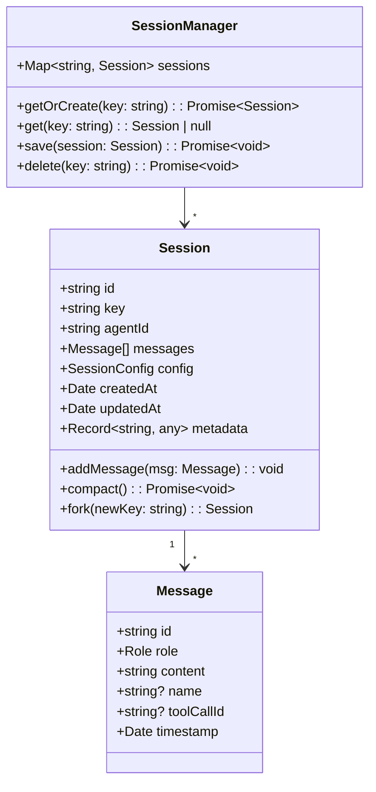
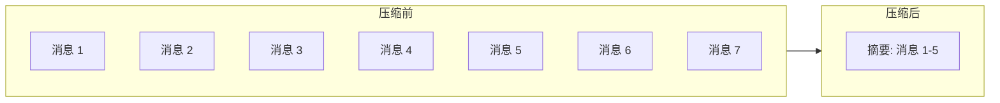

# 会话管理（Sessions）

## 1. 核心概念

会话（Session）是 OpenClaw 中对话上下文管理的基本单元。每个会话维护：

- **消息历史** - 对话中的所有消息
- **模型配置** - 当前会话使用的模型
- **元数据** - 标签、创建时间等
- **状态** - 会话是否活跃



## 2. 会话 Key

### 2.1 格式

会话 Key 是路由的核心标识：

```
agent:{agentId}:{channel}:{identifiers...}
```

### 2.2 示例

| 通道 | 会话 Key | 说明 |
|------|----------|------|
| 飞书单聊 | `agent:main:feishu:ou_abc123` | 用户 ou_abc123 与 Agent 单聊 |
| 飞书群聊 | `agent:main:feishu:oc_xyz789` | 群组 oc_xyz789 与 Agent 的会话 |
| Discord | `agent:main:discord:123:456:789` | 服务器 123, 频道 456, 用户 789 |
| WhatsApp | `agent:main:whatsapp:+8613812345678` | 电话号码标识的用户 |

### 2.3 解析

```typescript
// 解析会话 Key
function parseSessionKey(key: string): ParsedSessionKey {
  const parts = key.split(':')
  return {
    agentId: parts[1],   // 'main'
    channel: parts[2],    // 'feishu'
    identifiers: parts.slice(3)  // ['ou_abc123']
  }
}

// 构建会话 Key
function buildSessionKey(
  agentId: string,
  channel: string,
  ...identifiers: string[]
): string {
  return `agent:${agentId}:${channel}:${identifiers.join(':')}`
}
```

## 3. 会话数据结构

### 3.1 Session

```typescript
interface Session {
  // 唯一标识符（UUID）
  id: string

  // 路由 Key
  key: string

  // Agent ID
  agentId: string

  // 消息列表
  messages: Message[]

  // 配置
  config: SessionConfig

  // 创建时间
  createdAt: Date

  // 更新时间
  updatedAt: Date

  // 元数据
  metadata: SessionMetadata
}

interface SessionConfig {
  // 模型覆盖
  model?: string

  // 思考级别
  thinkingLevel?: 'off' | 'low' | 'medium' | 'high'

  // 详细输出级别
  verboseLevel?: number

  // 执行模式
  execHost?: 'sandbox' | 'gateway' | 'node'

  // 安全模式
  execSecurity?: 'deny' | 'allowlist' | 'full'
}

interface SessionMetadata {
  // 人类可读标签
  label?: string

  // 创建来源
  source?: string

  // 父会话 Key（用于 fork）
  parentKey?: string

  // 扩展字段
  [key: string]: any
}
```

### 3.2 Message

```typescript
interface Message {
  // 唯一标识符
  id: string

  // 角色
  role: 'user' | 'assistant' | 'tool' | 'system'

  // 内容
  content: string | ContentBlock[]

  // 工具调用名称
  name?: string

  // 工具调用 ID
  toolCallId?: string

  // 时间戳
  timestamp: Date

  // 令牌数（可选）
  tokenCount?: number
}

type ContentBlock =
  | { type: 'text'; text: string }
  | { type: 'image'; source: { type: 'url' | 'base64'; url?: string; media_type?: string } }
  | { type: 'tool_use'; id: string; name: string; input: object }
  | { type: 'tool_result'; tool_use_id: string; content: string }
```

## 4. 会话管理器

### 4.1 核心接口

```typescript
interface SessionManager {
  // 获取或创建会话
  getOrCreate(key: string, options?: CreateSessionOptions): Promise<Session>

  // 获取会话
  get(key: string): Session | null

  // 保存会话
  save(session: Session): Promise<void>

  // 删除会话
  delete(key: string): Promise<void>

  // 列出所有会话
  list(options?: ListSessionsOptions): Promise<Session[]>

  // Fork 会话
  fork(parentKey: string, newKey: string): Promise<Session>
}
```

### 4.2 实现

```typescript
class DefaultSessionManager implements SessionManager {
  private sessions: Map<string, Session> = new Map()
  private store: SessionStore

  constructor(store: SessionStore) {
    this.store = store
  }

  async getOrCreate(key: string, options?: CreateSessionOptions): Promise<Session> {
    // 1. 检查内存缓存
    let session = this.sessions.get(key)
    if (session) return session

    // 2. 从存储加载
    session = await this.store.load(key)
    if (session) {
      this.sessions.set(key, session)
      return session
    }

    // 3. 创建新会话
    session = this.createSession(key, options)
    this.sessions.set(key, session)
    await this.store.save(session)
    return session
  }

  async save(session: Session): Promise<void> {
    session.updatedAt = new Date()
    this.sessions.set(session.key, session)
    await this.store.save(session)
  }

  private createSession(key: string, options?: CreateSessionOptions): Session {
    const { agentId, channel, identifiers } = parseSessionKey(key)
    return {
      id: generateUUID(),
      key,
      agentId,
      messages: [],
      config: {},
      createdAt: new Date(),
      updatedAt: new Date(),
      metadata: {
        source: channel,
        ...options?.metadata
      }
    }
  }
}
```

## 5. 会话存储

### 5.1 存储接口

```typescript
interface SessionStore {
  // 加载会话
  load(key: string): Promise<Session | null>

  // 保存会话
  save(session: Session): Promise<void>

  // 删除会话
  delete(key: string): Promise<void>

  // 列出会话（支持分页）
  list(options?: ListOptions): Promise<Session[]>

  // 批量操作
  batchSave(sessions: Session[]): Promise<void>
}
```

### 5.2 文件存储实现

```typescript
class FileSessionStore implements SessionStore {
  constructor(private dir: string) {}

  private getPath(key: string): string {
    // 使用 key 的 hash 作为文件名
    const hash = crypto.createHash('md5').update(key).digest('hex')
    return path.join(this.dir, `${hash}.json`)
  }

  async load(key: string): Promise<Session | null> {
    const filePath = this.getPath(key)
    if (!fs.existsSync(filePath)) return null

    const data = fs.readFileSync(filePath, 'utf-8')
    const session = JSON.parse(data)
    // 反序列化日期
    session.createdAt = new Date(session.createdAt)
    session.updatedAt = new Date(session.updatedAt)
    session.messages = session.messages.map(m => ({
      ...m,
      timestamp: new Date(m.timestamp)
    }))
    return session
  }

  async save(session: Session): Promise<void> {
    const filePath = this.getPath(session.key)
    const data = JSON.stringify(session, null, 2)
    fs.writeFileSync(filePath, data, 'utf-8')
  }
}
```

### 5.3 数据库存储实现

```typescript
class DatabaseSessionStore implements SessionStore {
  constructor(private db: Database) {}

  async load(key: string): Promise<Session | null> {
    const row = await this.db.query(
      'SELECT * FROM sessions WHERE key = ?',
      [key]
    )
    if (!row) return null

    const messages = await this.db.query(
      'SELECT * FROM messages WHERE session_id = ? ORDER BY timestamp',
      [row.id]
    )

    return {
      ...row,
      messages: messages.map(m => ({
        ...m,
        timestamp: new Date(m.timestamp)
      }))
    }
  }

  async save(session: Session): Promise<void> {
    await this.db.transaction(async tx => {
      // 保存会话
      await tx.query(`
        INSERT INTO sessions (id, key, agent_id, config, created_at, updated_at, metadata)
        VALUES (?, ?, ?, ?, ?, ?, ?)
        ON CONFLICT(key) DO UPDATE SET
          config = ?, updated_at = ?, metadata = ?
      `, [
        session.id, session.key, session.agentId,
        JSON.stringify(session.config), session.createdAt, session.updatedAt,
        JSON.stringify(session.metadata),
        JSON.stringify(session.config), session.updatedAt,
        JSON.stringify(session.metadata)
      ])

      // 保存新消息
      for (const msg of session.messages) {
        await tx.query(`
          INSERT INTO messages (id, session_id, role, content, name, tool_call_id, timestamp)
          VALUES (?, ?, ?, ?, ?, ?, ?)
        `, [msg.id, session.id, msg.role, typeof msg.content === 'string' ? msg.content : JSON.stringify(msg.content), msg.name, msg.toolCallId, msg.timestamp])
      }
    })
  }
}
```

## 6. 会话压缩（Compaction）

### 6.1 背景

随着对话进行，消息历史会越来越长，超过 LLM 的上下文窗口限制。会话压缩通过总结旧消息来减少令牌数。



### 6.2 压缩接口

```typescript
interface CompactionEngine {
  // 检查是否需要压缩
  shouldCompact(session: Session): boolean

  // 执行压缩
  compact(session: Session): Promise<CompactionResult>
}

interface CompactionResult {
  // 压缩后的摘要
  summary: string

  // 被压缩的消息数
  compactedCount: number

  // 压缩前令牌数
  tokensBefore: number

  // 压缩后令牌数
  tokensAfter: number

  // 保留的第一条消息 ID
  firstKeptEntryId: string
}
```

### 6.3 压缩实现

```typescript
class DefaultCompactionEngine implements CompactionEngine {
  private llm: LLM

  // 压缩阈值：消息超过 50 条或令牌超过 80000
  private readonly MESSAGE_THRESHOLD = 50
  private readonly TOKEN_THRESHOLD = 80000

  shouldCompact(session: Session): boolean {
    if (session.messages.length > this.MESSAGE_THRESHOLD) {
      return true
    }

    const totalTokens = session.messages.reduce(
      (sum, m) => sum + estimateTokens(m.content),
      0
    )
    return totalTokens > this.TOKEN_THRESHOLD
  }

  async compact(session: Session): Promise<CompactionResult> {
    // 1. 获取需要压缩的消息（保留最近 15 条）
    const keepCount = 15
    const toCompact = session.messages.slice(0, -keepCount)
    const toKeep = session.messages.slice(-keepCount)

    // 2. 生成摘要
    const summary = await this.generateSummary(toCompact)

    // 3. 构建压缩后的消息列表
    const summaryMessage: Message = {
      id: generateUUID(),
      role: 'system',
      content: `【对话摘要】${summary}`,
      timestamp: new Date()
    }

    // 4. 更新会话
    session.messages = [summaryMessage, ...toKeep]

    return {
      summary,
      compactedCount: toCompact.length,
      tokensBefore: estimateTotalTokens(toCompact),
      tokensAfter: estimateTotalTokens([summaryMessage]),
      firstKeptEntryId: toKeep[0].id
    }
  }

  private async generateSummary(messages: Message[]): Promise<string> {
    const prompt = `请总结以下对话的要点：

${messages.map(m => `${m.role}: ${m.content}`).join('\n\n')}

请用简洁的语言总结对话的主题、关键决策和重要信息。`

    const response = await this.llm.complete(prompt)
    return response.text
  }
}
```

## 7. 会话 Fork

Fork 允许从现有会话创建一个分支：

```typescript
async fork(
  parentKey: string,
  newKey: string,
  options?: { includeHistory?: boolean }
): Promise<Session> {
  // 1. 获取父会话
  const parent = await this.get(parentKey)
  if (!parent) {
    throw new Error(`Parent session not found: ${parentKey}`)
  }

  // 2. 创建新会话
  const child = this.createSession(newKey, {
    metadata: {
      ...parent.metadata,
      parentKey: parent.key
    }
  })

  // 3. 复制历史（可选）
  if (options?.includeHistory !== false) {
    child.messages = [...parent.messages]
    child.config = { ...parent.config }
  }

  // 4. 保存
  await this.save(child)
  return child
}
```

## 8. 会话事件

```typescript
// 会话生命周期事件
type SessionEvent =
  | 'session:start'      // 会话开始
  | 'session:end'        // 会话结束
  | 'session:compact:before'  // 压缩前
  | 'session:compact:after'   // 压缩后
  | 'session:patch'      // 会话属性修改

// Hook 示例
const sessionCompactHook = async (event: SessionEvent) => {
  if (event.type === 'session:compact:after') {
    console.log(`Compacted ${event.context.compactedCount} messages`)
    console.log(`Tokens before: ${event.context.tokensBefore}`)
    console.log(`Tokens after: ${event.context.tokensAfter}`)
  }
}
```

## 9. 手把手复刻

### 最小实现

以下是会话管理的最小实现：

```typescript
// === 1. Session 接口 ===
interface Session {
  id: string
  key: string
  agentId: string
  messages: Message[]
  config: SessionConfig
  createdAt: Date
  updatedAt: Date
  metadata: Record<string, any>
  addMessage(msg: Message): void
}

// === 2. 最小 Session Manager ===
class MinimalSessionManager {
  private sessions: Map<string, Session> = new Map()

  async getOrCreate(key: string): Promise<Session> {
    // 1. 检查内存缓存
    let session = this.sessions.get(key)
    if (session) return session

    // 2. 创建新会话
    session = {
      id: crypto.randomUUID(),
      key,
      agentId: key.split(':')[1],
      messages: [],
      config: {},
      createdAt: new Date(),
      updatedAt: new Date(),
      metadata: {},
      addMessage(msg: Message) {
        this.messages.push({
          ...msg,
          id: crypto.randomUUID(),
          timestamp: new Date()
        })
      }
    }

    this.sessions.set(key, session)
    return session
  }

  async save(session: Session): Promise<void> {
    session.updatedAt = new Date()
    this.sessions.set(session.key, session)
  }

  async get(key: string): Promise<Session | null> {
    return this.sessions.get(key) || null
  }

  async delete(key: string): Promise<void> {
    this.sessions.delete(key)
  }
}

// === 3. 会话 Key 工具函数 ===
function buildSessionKey(
  agentId: string,
  channel: string,
  ...identifiers: string[]
): string {
  return `agent:${agentId}:${channel}:${identifiers.join(':')}`
}

function parseSessionKey(key: string) {
  const parts = key.split(':')
  return {
    agentId: parts[1],
    channel: parts[2],
    identifiers: parts.slice(3)
  }
}
```

### 关键接口

| 接口 | 参数 | 返回值 | 说明 |
|------|------|--------|------|
| `getOrCreate()` | `key: string` | `Promise<Session>` | 获取或创建会话 |
| `save()` | `session: Session` | `Promise<void>` | 保存会话 |
| `get()` | `key: string` | `Promise<Session | null>` | 获取会话 |
| `delete()` | `key: string` | `Promise<void>` | 删除会话 |
| `fork()` | `parentKey, newKey` | `Promise<Session>` | Fork 会话 |

### 常见陷阱

1. **会话 Key 不唯一**
   - 错误：相同用户每次对话生成新的随机 Key
   - 正确：使用 `agent:{agentId}:{channel}:{userId}` 确保同一用户复用会话

2. **内存泄漏**
   - 错误：会话只存在内存中，永不清理
   - 正确：实现定期持久化和过期清理

   ```typescript
   // 添加 TTL 清理
   setInterval(async () => {
     const now = Date.now()
     for (const [key, session] of this.sessions) {
       if (now - session.updatedAt.getTime() > 30 * 24 * 60 * 60 * 1000) {
         await this.delete(key)
       }
     }
   }, 60 * 60 * 1000) // 每小时检查一次
   ```

3. **消息顺序错乱**
   - 错误：直接 push 消息不检查时间戳
   - 正确：按 `timestamp` 排序确保消息顺序正确

### 实战练习

1. **练习一：实现文件持久化**
   ```typescript
   async save(session: Session): Promise<void> {
     const dir = './sessions'
     await fs.promises.mkdir(dir, { recursive: true })
     const hash = crypto.createHash('md5').update(session.key).digest('hex')
     await fs.promises.writeFile(
       `${dir}/${hash}.json`,
       JSON.stringify(session)
     )
   }
   ```

2. **练习二：实现简单压缩**
   ```typescript
   async compact(session: Session): Promise<void> {
     if (session.messages.length > 50) {
       // 保留最近 15 条，压缩旧消息为摘要
       const keepCount = 15
       const toCompact = session.messages.slice(0, -keepCount)
       const summary = `【压缩摘要】${toCompact.length}条旧消息`
       
       session.messages = [
         { role: 'system', content: summary },
         ...session.messages.slice(-keepCount)
       ]
     }
   }
   ```

3. **练习三：实现会话 Fork**
   ```typescript
   async fork(parentKey: string, newKey: string): Promise<Session> {
     const parent = await this.get(parentKey)
     if (!parent) throw new Error('Parent session not found')
     
     const child = await this.getOrCreate(newKey)
     child.messages = [...parent.messages]
     child.metadata.parentKey = parentKey
     return child
   }
   ```

## 10. 相关文档

- [Agent 运行时](./agents.md)
- [Compaction 机制](https://docs.openclaw.ai/concepts/compaction)
- [会话相关 Hooks](./hooks.md)
