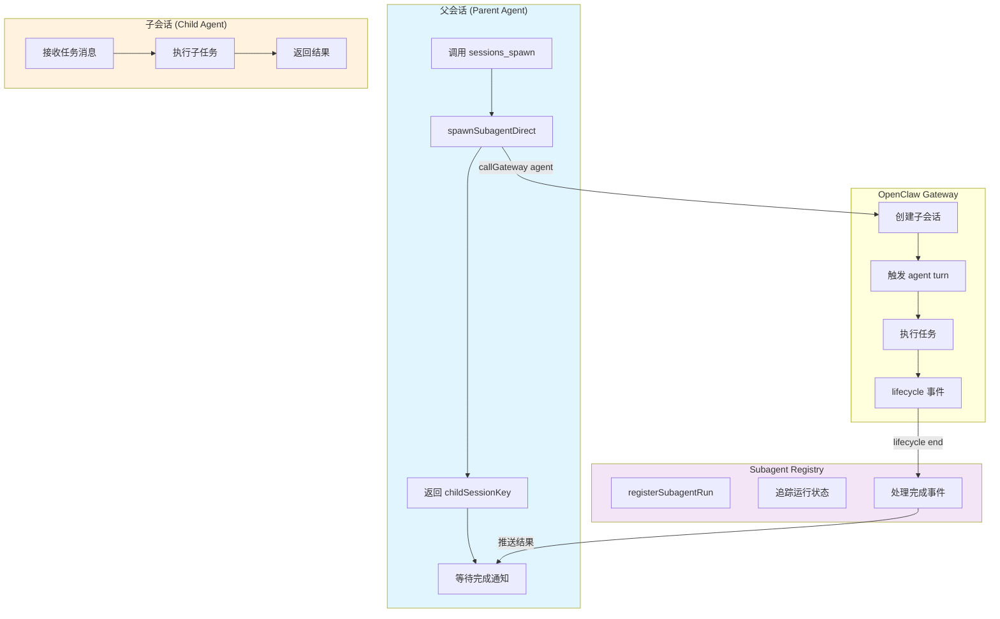
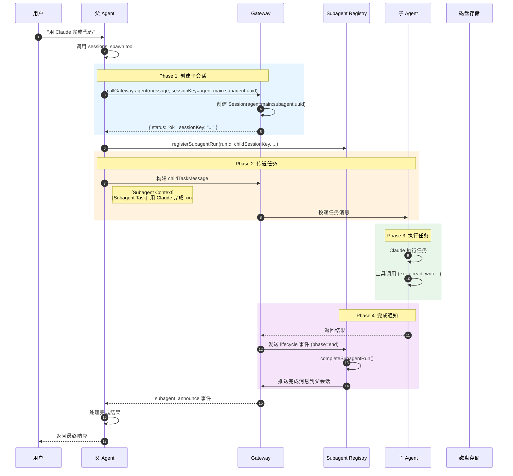
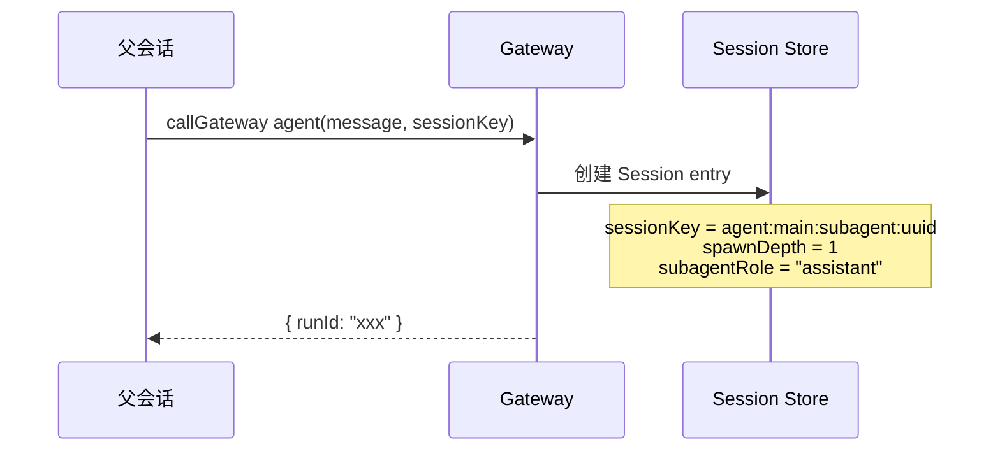
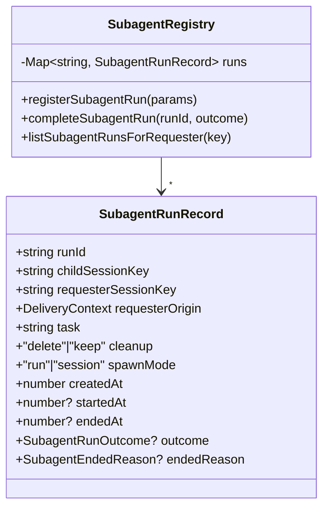
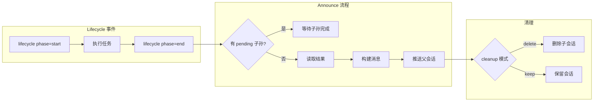
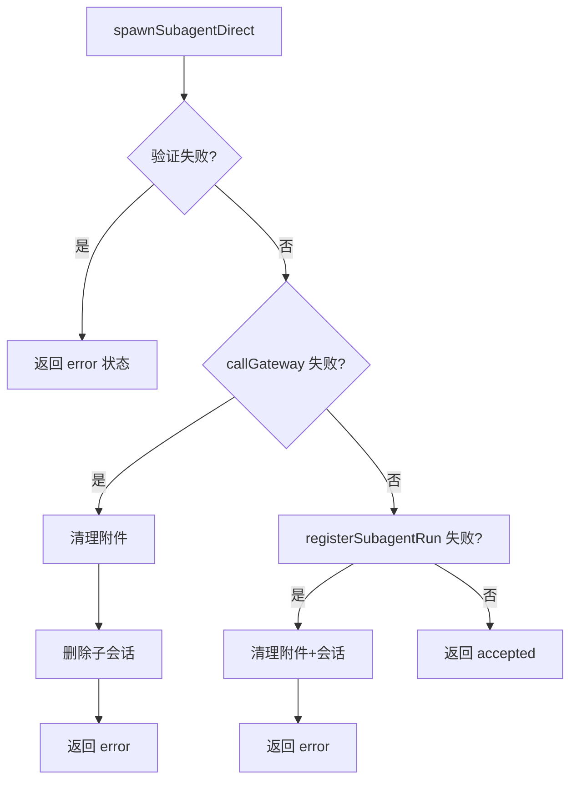
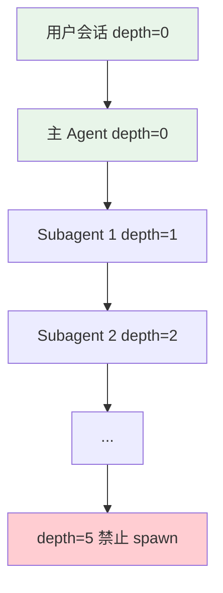

# Subagent 工作原理

## 1. 概述

Subagent 是 OpenClaw 的子任务执行机制，允许 Agent 在执行过程中 Spawn 独立的子 Agent 来并行处理复杂任务。核心设计基于**推送完成**（Push-based Completion），子任务完成后自动通知父会话。

## 2. 整体架构



## 3. 完整执行流程

### 3.1 时序图



### 3.2 核心源码位置

| 文件 | 职责 |
|------|------|
| `subagent-spawn.ts` | `spawnSubagentDirect()` - 创建子会话 |
| `subagent-registry.ts` | `registerSubagentRun()` - 注册追踪 |
| `subagent-announce.ts` | `runSubagentAnnounceFlow()` - 推送完成 |
| `subagent-announce-delivery.ts` | `deliverSubagentAnnouncement()` - 实际投递 |
| `subagent-registry-run-manager.ts` | 管理运行生命周期 |

## 4. 详细步骤解析

### 4.1 父会话调用 sessions_spawn

```typescript
// 用户说 "用 Claude 完成代码"
// 父 Agent 调用 sessions_spawn tool

const result = await spawnSubagentDirect(
  {
    task: "完成这个任务...",
    label: "代码生成",
    mode: "run",           // 或 "session" (持久)
    runtime: "subagent",    // 或 "acp" (Codex)
  },
  {
    agentSessionKey: "agent:main:feishu:ou_xxx",
    agentChannel: "feishu",
    // ...
  }
);

// 返回
// { status: "accepted", childSessionKey: "agent:main:subagent:uuid", runId: "..." }
```

### 4.2 创建子会话 Session



**子会话 Session Key 格式:**
```
agent:{targetAgentId}:subagent:{randomUUID}
```

**Session 特殊字段:**
- `spawnDepth` - 嵌套深度（防止无限spawn）
- `subagentRole` - 子角色（main/auxiliary）
- `spawnedBy` - 父会话 key
- `spawnedWorkspaceDir` - 工作区继承

### 4.3 任务传递机制

子 Agent 收到的消息格式:

```
[Subagent Context] You are running as a subagent (depth 1/5). Results auto-announce to your requester.

[Subagent Task]: 完成这个任务...
```

**System Prompt 关键规则:**
1. **Stay focused** - 只做分配的任务
2. **Complete the task** - 最终响应会自动报告给父
3. **Don't initiate** - 不主动心跳/轮询
4. **Be ephemeral** - 任务后可被终止
5. **Trust push-based** - 使用推送完成，不轮询状态

### 4.4 注册与追踪 (Registry)



**Registry 持久化:**
- 内存 Map 存储运行记录
- 定期刷盘到 `~/.openclaw/subagent-runs.json`
- 重启后自动恢复未完成的运行

### 4.5 完成通知机制



**推送消息格式:**
```typescript
{
  type: "task_completion",
  source: "subagent",
  childSessionKey: "agent:main:subagent:uuid",
  taskLabel: "代码生成",
  status: "completed successfully",
  result: "生成的代码...",
  statsLine: "runtime 5m • tokens 100k"
}
```

### 4.6 父会话接收完成

```typescript
// 父会话收到的消息示例
{
  source: "agent:tars:subagent:xxx",
  sourceChannel: "internal",
  sourceTool: "subagent_announce",
  // 消息内容包含:
  // "A completed subagent task is ready for user delivery.
  //  Convert the result above into your normal assistant voice..."
}
```

**处理逻辑:**
1. 识别 `sourceTool: "subagent_announce"` 事件
2. 提取子任务结果
3. 整合到父任务响应
4. 返回给用户

## 5. 失败处理

### 5.1 Spawn 失败



### 5.2 运行时失败

| 失败类型 | 处理方式 |
|---------|---------|
| **超时** | `outcome: { status: "timeout" }` |
| **错误** | `outcome: { status: "error", error: "..." }` |
| **进程崩溃** | Registry 监听 lifecycle 错误事件 |
| **推送失败** | 重试 + 最终回退到 keep 模式 |

### 5.3 重试机制

```typescript
// Announce 推送重试配置
const MAX_ANNOUNCE_RETRY_COUNT = 3;
const ANNOUNCE_EXPIRY_MS = 24 * 60 * 60 * 1000; // 24小时

// 重试延迟递增
function resolveAnnounceRetryDelayMs(retryCount: number): number {
  return Math.min(1000 * Math.pow(2, retryCount), 30000);
}
```

## 6. 深度限制



**默认最大深度: 5**
- 可通过 `agents.defaults.subagents.maxSpawnDepth` 配置
- 超出限制返回 `forbidden` 错误

## 7. 并发限制

```typescript
// 每个会话最多并发子任务数
const maxChildrenPerAgent = 5; // 默认值

// 检查活跃子任务
function countActiveRunsForSession(requesterSessionKey: string): number {
  // 统计 endedAt 为空的记录
}
```

## 8. 如何复刻类似功能

### 8.1 核心接口

```typescript
interface SubagentSpawnParams {
  task: string;                    // 任务描述
  label?: string;                  // 可读标签
  runtime: "subagent" | "acp";    // 运行时类型
  mode: "run" | "session";         // 执行模式
  thread?: boolean;                // 是否绑定线程
  cleanup: "delete" | "keep";     // 完成后清理策略
  model?: string;                  // 模型覆盖
  attachments?: Attachment[];      // 附件
}

interface SubagentSpawnResult {
  status: "accepted" | "forbidden" | "error";
  childSessionKey?: string;
  runId?: string;
  note?: string;  // 包含重要说明
}
```

### 8.2 最小实现

```typescript
async function mySpawnSubagent(params: SubagentSpawnParams): Promise<SubagentSpawnResult> {
  // 1. 验证参数和权限
  // 2. 创建子会话
  const childSessionKey = `agent:main:subagent:${crypto.randomUUID()}`;
  await callGateway({
    method: "agent",
    params: {
      message: buildTaskMessage(params.task),
      sessionKey: childSessionKey,
    }
  });

  // 3. 注册追踪
  registerSubagentRun({
    runId,
    childSessionKey,
    requesterSessionKey: currentSession,
    task: params.task,
    cleanup: params.cleanup,
  });

  // 4. 返回结果
  return { status: "accepted", childSessionKey, runId };
}
```

### 8.3 推送完成实现

```typescript
async function deliverCompletion(
  requesterSessionKey: string,
  result: string
): Promise<void> {
  // 构建内部事件
  const internalEvent = {
    type: "task_completion",
    result,
    replyInstruction: "转换为用户友好的回复..."
  };

  // 投递到父会话
  await callGateway({
    method: "message",
    params: {
      sessionKey: requesterSessionKey,
      content: JSON.stringify(internalEvent),
      inputProvenance: {
        kind: "inter_session",
        sourceTool: "subagent_announce"
      }
    }
  });
}
```

## 9. Session 模式 vs Run 模式

| 特性 | Run 模式 | Session 模式 |
|------|---------|-------------|
| 生命周期 | 一次性 | 持久化 |
| 线程绑定 | 否 | 是 (thread=true) |
| 后续消息 | 不支持 | 支持 follow-up |
| 清理策略 | 默认 delete | 必须 keep |
| 使用场景 | 独立任务 | 需交互的任务 |

## 10. ACP vs Subagent 运行时

| 特性 | runtime=subagent | runtime=acp |
|------|-----------------|-------------|
| 执行环境 | OpenClaw Agent | Codex/Claude Code |
| 消息路由 | subagent_announce | thread binding |
| 配置方式 | agents 配置 | acp 配置 |
| 适用场景 | OpenClaw 原生任务 | 外部 CLI 工具 |

## 11. 手把手复刻

### 最小实现

以下是 Subagent 的核心实现：

```typescript
// === 1. 核心接口 ===
interface SubagentSpawnParams {
  task: string
  label?: string
  runtime: 'subagent' | 'acp'
  mode: 'run' | 'session'
  cleanup: 'delete' | 'keep'
}

interface SubagentRunRecord {
  runId: string
  childSessionKey: string
  requesterSessionKey: string
  task: string
  cleanup: 'delete' | 'keep'
  createdAt: number
  startedAt?: number
  endedAt?: number
}

// === 2. 最小 Subagent Registry ===
class MinimalSubagentRegistry {
  private runs: Map<string, SubagentRunRecord> = new Map()

  registerSubagentRun(params: {
    runId: string
    childSessionKey: string
    requesterSessionKey: string
    task: string
    cleanup: 'delete' | 'keep'
  }): void {
    this.runs.set(params.runId, {
      ...params,
      createdAt: Date.now()
    })
  }

  completeSubagentRun(runId: string, outcome: any): void {
    const run = this.runs.get(runId)
    if (run) {
      run.endedAt = Date.now()
      this.runs.set(runId, run)
    }
  }

  getRun(runId: string): SubagentRunRecord | undefined {
    return this.runs.get(runId)
  }

  listRunsForRequester(requesterSessionKey: string): SubagentRunRecord[] {
    return Array.from(this.runs.values())
      .filter(r => r.requesterSessionKey === requesterSessionKey)
  }
}

// === 3. 最小 spawn 实现 ===
class MinimalSubagentSpawner {
  constructor(
    private registry: MinimalSubagentRegistry,
    private gateway: any
  ) {}

  async spawn(
    params: SubagentSpawnParams,
    requesterSessionKey: string
  ): Promise<{ status: string; childSessionKey: string; runId: string }> {
    const runId = crypto.randomUUID()
    const childSessionKey = `agent:main:subagent:${runId}`

    // 1. 创建子会话
    await this.gateway.createSession(childSessionKey)

    // 2. 注册运行记录
    this.registry.registerSubagentRun({
      runId,
      childSessionKey,
      requesterSessionKey,
      task: params.task,
      cleanup: params.cleanup
    })

    // 3. 投递任务消息
    await this.gateway.sendMessage(childSessionKey, {
      content: `[Subagent Context]\n[Subagent Task]: ${params.task}`
    })

    return {
      status: 'accepted',
      childSessionKey,
      runId
    }
  }
}

// === 4. 最小完成推送 ===
async function deliverCompletion(
  requesterSessionKey: string,
  result: string,
  metadata: any
): Promise<void> {
  // 构建推送消息
  const announcement = {
    type: 'task_completion',
    source: 'subagent',
    result,
    metadata
  }

  // 投递到父会话
  await gateway.sendMessage(requesterSessionKey, {
    content: JSON.stringify(announcement),
    inputProvenance: { kind: 'inter_session', sourceTool: 'subagent_announce' }
  })
}
```

### 关键接口

| 接口 | 参数 | 返回值 | 说明 |
|------|------|--------|------|
| `spawn()` | `params, requesterSessionKey` | `Promise<SpawnResult>` | Spawn 子 Agent |
| `registerSubagentRun()` | `params` | `void` | 注册运行记录 |
| `completeSubagentRun()` | `runId, outcome` | `void` | 标记运行完成 |
| `deliverCompletion()` | `requesterKey, result, metadata` | `Promise<void>` | 推送结果 |

### 常见陷阱

1. **缺少深度限制**
   - 错误：允许无限嵌套 spawn
   - 正确：检查 `spawnDepth` 防止超过最大深度

   ```typescript
   const MAX_SPAWN_DEPTH = 5
   
   if (currentDepth >= MAX_SPAWN_DEPTH) {
     return { status: 'forbidden', reason: 'Max spawn depth exceeded' }
   }
   ```

2. **会话清理遗漏**
   - 错误：只删除会话不清理 Registry
   - 正确：根据 `cleanup` 模式决定是否保留

3. **结果推送失败未处理**
   - 错误：推送失败就直接放弃
   - 正确：实现重试机制，最终保留会话（`cleanup: 'keep'`）

### 实战练习

1. **练习一：实现简单 spawn**
   ```typescript
   async function simpleSpawn(task: string): Promise<string> {
     const runId = crypto.randomUUID()
     const childKey = `agent:main:subagent:${runId}`
     
     await gateway.createSession(childKey)
     registry.registerSubagentRun({
       runId, childSessionKey: childKey,
       requesterSessionKey: currentSessionKey,
       task, cleanup: 'delete'
     })
     
     await gateway.sendMessage(childKey, `[Subagent Task]: ${task}`)
     return childKey
   }
   ```

2. **练习二：实现完成事件处理**
   ```typescript
   async function handleLifecycleEvent(event: any) {
     if (event.phase === 'end') {
       const run = registry.getRun(event.runId)
       if (!run) return
       
       // 读取结果
       const session = await sessionManager.get(run.childSessionKey)
       const result = extractResult(session)
       
       // 推送完成
       await deliverCompletion(run.requesterSessionKey, result, {
         runId: run.runId,
         label: run.task
       })
       
       // 清理
       registry.completeSubagentRun(run.runId, { status: 'success' })
       if (run.cleanup === 'delete') {
         await sessionManager.delete(run.childSessionKey)
       }
     }
   }
   ```

3. **练习三：实现并发限制**
   ```typescript
   const MAX_CONCURRENT_CHILDREN = 5
   
   function checkConcurrencyLimit(requesterSessionKey: string): boolean {
     const activeRuns = registry.listRunsForRequester(requesterSessionKey)
       .filter(r => !r.endedAt)
     return activeRuns.length < MAX_CONCURRENT_CHILDREN
   }
   
   if (!checkConcurrencyLimit(currentSessionKey)) {
     return { status: 'error', reason: 'Too many concurrent subagents' }
   }
   ```

## 12. 关键设计模式

### 12.1 推送完成 (Push-based Completion)
- 子任务完成后主动推送结果
- 不依赖父会话轮询
- 减少延迟，提高效率

### 12.2 注册中心追踪
- Registry 作为所有运行的中心
- 持久化支持重启恢复
- 支持复杂的嵌套场景

### 12.3 双模式设计
- Run 模式：简单高效
- Session 模式：灵活可交互
- 通过 thread 参数选择

### 12.4 生命周期钩子
- `subagent_spawning` - 线程绑定准备
- `subagent_spawned` - Spawn 完成
- `subagent_ended` - 运行结束
- 支持通道自定义行为
