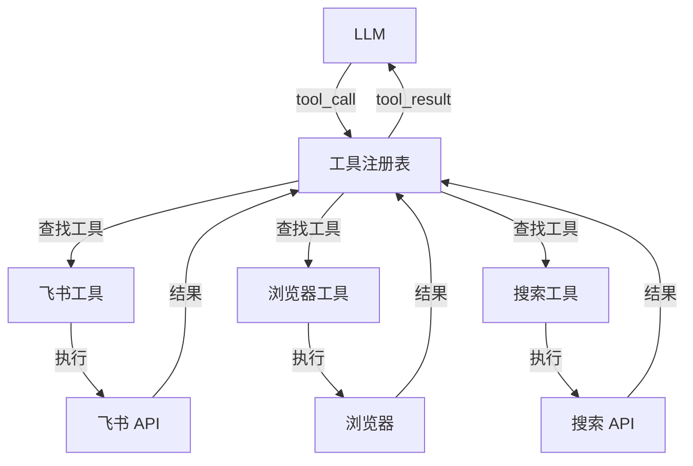
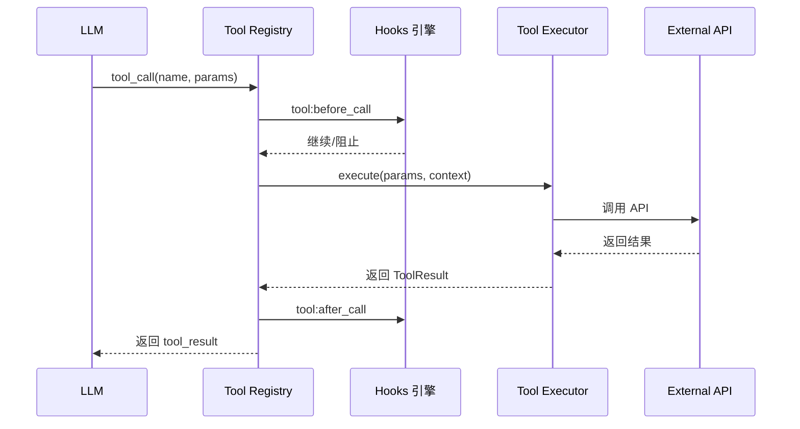

# 工具系统（Tools）

## 1. 核心概念

工具（Tools）是 OpenClaw 扩展 AI Agent 能力的核心机制。通过工具，Agent 可以：

- 执行代码
- 访问文件系统
- 调用外部 API
- 操作浏览器
- 生成图片
- 等等



## 2. 工具接口

### 2.1 基础接口

```typescript
interface Tool {
  // 工具名称（唯一标识）
  name: string

  // 工具描述（供 LLM 理解何时使用）
  description: string

  // 输入参数 schema（JSON Schema）
  inputSchema: JsonSchema

  // 执行函数
  execute(params: ToolParams, context: ToolContext): Promise<ToolResult>
}

interface ToolContext {
  // 会话信息
  session: Session

  // 用户信息
  userId: string

  // 通道信息
  channelId: string

  // 工具调用 ID
  toolCallId: string

  // 其他上下文
  [key: string]: any
}

interface ToolParams {
  // 参数以对象形式传递
  [paramName: string]: any
}

interface ToolResult {
  // 结果内容
  content: ToolResultContent[]

  // 是否为错误
  isError?: boolean

  // 附加元数据
  metadata?: Record<string, any>
}

type ToolResultContent =
  | { type: 'text'; text: string }
  | { type: 'image'; data: string; mimeType?: string }
  | { type: 'resource'; resource: Resource }
```

### 2.2 工具定义示例

```typescript
// 飞书发送消息工具
const sendMessageTool: Tool = {
  name: 'feishu_send_message',
  description: 'Send a text message to a Feishu chat or user. Use this when the user wants to send a message via Feishu.',
  inputSchema: {
    type: 'object',
    properties: {
      receive_id: {
        type: 'string',
        description: 'The recipient ID (user_open_id, chat_id, or email)'
      },
      receive_id_type: {
        type: 'string',
        enum: ['open_id', 'chat_id', 'union_id', 'email'],
        description: 'Type of the recipient ID'
      },
      content: {
        type: 'string',
        description: 'Message content (plain text or JSON for rich content)'
      },
      msg_type: {
        type: 'string',
        enum: ['text', 'post', 'image', 'file', 'audio', 'media'],
        default: 'text',
        description: 'Message type'
      }
    },
    required: ['receive_id', 'content']
  },

  async execute(params, context) {
    const client = createFeishuClient(context.session.config)

    const result = await client.im.message.create({
      receive_id: params.receive_id,
      receive_id_type: params.receive_id_type || 'open_id',
      msg_type: params.msg_type || 'text',
      content: params.msg_type === 'text'
        ? JSON.stringify({ text: params.content })
        : params.content
    })

    return {
      content: [{ type: 'text', text: JSON.stringify(result) }]
    }
  }
}
```

## 3. 工具注册表

### 3.1 注册表接口

```typescript
interface ToolRegistry {
  // 注册工具
  register(tool: Tool): void

  // 批量注册
  registerMany(tools: Tool[]): void

  // 获取工具
  get(name: string): Tool | undefined

  // 列出所有工具
  list(): Tool[]

  // 列出工具定义（用于 LLM）
  getDefinitions(): ToolDefinition[]

  // 移除工具
  unregister(name: string): void

  // 按命名空间列出
  listByNamespace(namespace: string): Tool[]
}
```

### 3.2 实现

```typescript
class DefaultToolRegistry implements ToolRegistry {
  private tools: Map<string, Tool> = new Map()

  register(tool: Tool): void {
    // 验证工具定义
    this.validateTool(tool)

    // 注册
    this.tools.set(tool.name, tool)
  }

  getDefinitions(): ToolDefinition[] {
    return Array.from(this.tools.values()).map(tool => ({
      name: tool.name,
      description: tool.description,
      input_schema: tool.inputSchema
    }))
  }

  private validateTool(tool: Tool): void {
    if (!tool.name) throw new Error('Tool name is required')
    if (!tool.description) throw new Error('Tool description is required')
    if (!tool.inputSchema) throw new Error('Tool inputSchema is required')
    if (!tool.execute) throw new Error('Tool execute function is required')
  }
}
```

## 4. 内置工具

### 4.1 文件操作

```typescript
// read 工具
const readTool: Tool = {
  name: 'read',
  description: 'Read the contents of a file from the local filesystem.',
  inputSchema: {
    type: 'object',
    properties: {
      path: { type: 'string', description: 'File path to read' },
      offset: { type: 'integer', description: 'Line offset to start reading from' },
      limit: { type: 'integer', description: 'Maximum number of lines to read' }
    },
    required: ['path']
  },

  async execute({ path, offset = 0, limit }, context) {
    const content = await fs.promises.readFile(path, 'utf-8')
    const lines = content.split('\n')
    const slice = lines.slice(offset, offset + limit)

    return {
      content: [{
        type: 'text',
        text: slice.join('\n') +
          (offset + limit < lines.length ? '\n...' : '')
      }]
    }
  }
}

// write 工具
const writeTool: Tool = {
  name: 'write',
  description: 'Write content to a file. Creates the file if it does not exist.',
  inputSchema: {
    type: 'object',
    properties: {
      path: { type: 'string', description: 'File path to write' },
      content: { type: 'string', description: 'Content to write' }
    },
    required: ['path', 'content']
  },

  async execute({ path, content }, context) {
    await fs.promises.writeFile(path, content, 'utf-8')
    return { content: [{ type: 'text', text: `Written to ${path}` }] }
  }
}
```

### 4.2 执行命令

```typescript
// exec 工具
const execTool: Tool = {
  name: 'exec',
  description: 'Execute a shell command and return the output.',
  inputSchema: {
    type: 'object',
    properties: {
      command: { type: 'string', description: 'Shell command to execute' },
      timeout: { type: 'integer', description: 'Timeout in seconds', default: 30 }
    },
    required: ['command']
  },

  async execute({ command, timeout = 30 }, context) {
    // 检查安全策略
    if (!context.session.canExec(command)) {
      return {
        content: [{ type: 'text', text: 'Exec not allowed by security policy' }],
        isError: true
      }
    }

    const result = await execAsync(command, { timeout })

    return {
      content: [{
        type: 'text',
        text: result.stdout + (result.stderr ? '\nSTDERR: ' + result.stderr : '')
      }],
      metadata: { exitCode: result.exitCode }
    }
  }
}
```

### 4.3 网络搜索

```typescript
// web_search 工具
const webSearchTool: Tool = {
  name: 'web_search',
  description: 'Search the web for information.',
  inputSchema: {
    type: 'object',
    properties: {
      query: { type: 'string', description: 'Search query' },
      count: { type: 'integer', description: 'Number of results', default: 5 }
    },
    required: ['query']
  },

  async execute({ query, count = 5 }, context) {
    const results = await searchService.search(query, { count })

    return {
      content: [{
        type: 'text',
        text: formatSearchResults(results)
      }]
    }
  }
}
```

### 4.4 图片生成

```typescript
// image_generate 工具
const imageGenerateTool: Tool = {
  name: 'image_generate',
  description: 'Generate an image from a text description using AI.',
  inputSchema: {
    type: 'object',
    properties: {
      prompt: { type: 'string', description: 'Image description' },
      size: {
        type: 'string',
        enum: ['1024x1024', '1024x1792', '1792x1024'],
        default: '1024x1024'
      },
      model: { type: 'string', description: 'Model to use' }
    },
    required: ['prompt']
  },

  async execute({ prompt, size = '1024x1024', model }, context) {
    const result = await imageService.generate({ prompt, size, model })

    return {
      content: [{
        type: 'image',
        data: result.url || result.base64,
        mimeType: 'image/png'
      }],
      metadata: { model: result.model }
    }
  }
}
```

### 4.5 飞书工具集

```typescript
// 飞书工具命名空间
const feishuTools = {
  // 消息
  'feishu.send_message': sendMessageTool,
  'feishu.reply_message': replyMessageTool,
  'feishu.update_message': updateMessageTool,

  // 群组
  'feishu.get_chat': getChatTool,
  'feishu.list_chats': listChatsTool,
  'feishu.create_chat': createChatTool,

  // 通讯录
  'feishu.get_user': getUserTool,
  'feishu.list_users': listUsersTool,
  'feishu.get_department': getDepartmentTool,

  // 日历
  'feishu.create_event': createEventTool,
  'feishu.list_events': listEventsTool,
  'feishu.update_event': updateEventTool,

  // 云文档
  'feishu.create_doc': createDocTool,
  'feishu.get_doc': getDocTool,
  'feishu.search_doc': searchDocTool,

  // 多维表格
  'feishu.create_bitable': createBitableTool,
  'feishu.query_bitable': queryBitableTool,

  // 任务
  'feishu.create_task': createTaskTool,
  'feishu.list_tasks': listTasksTool
}
```

## 5. 工具执行流程

### 5.1 执行管道



### 5.2 实现

```typescript
async function executeToolCall(
  toolCall: { name: string; params: object },
  context: ToolContext
): Promise<ToolResult> {
  const { name, params } = toolCall

  // 1. 获取工具
  const tool = toolRegistry.get(name)
  if (!tool) {
    return {
      content: [{ type: 'text', text: `Tool not found: ${name}` }],
      isError: true
    }
  }

  // 2. 触发 before_call hooks
  const beforeResult = await hooksEngine.emit('tool:before_call', {
    toolName: name,
    params,
    sessionKey: context.session.key
  })

  if (beforeResult.blocked) {
    return {
      content: [{ type: 'text', text: `Tool call blocked: ${beforeResult.reason}` }],
      isError: true
    }
  }

  try {
    // 3. 执行工具
    const result = await tool.execute(params, context)

    // 4. 触发 after_call hooks
    await hooksEngine.emit('tool:after_call', {
      toolName: name,
      params,
      result,
      sessionKey: context.session.key
    })

    // 5. 触发 result_persist hooks（可修改结果）
    const persistResult = await hooksEngine.emit('tool:result_persist', {
      toolName: name,
      params,
      result,
      sessionId: context.session.id
    })

    return persistResult.result || result
  } catch (error) {
    return {
      content: [{ type: 'text', text: error.message }],
      isError: true
    }
  }
}
```

## 6. 工具权限

### 6.1 权限级别

```typescript
enum ToolPermission {
  ALLOW = 'allow',       // 允许执行
  DENY = 'deny',         // 拒绝执行
  APPROVAL = 'approval'  // 需要审批
}

interface ToolPolicy {
  // 默认策略
  default: ToolPermission

  // 特定工具策略
  tools: Record<string, ToolPermission>

  // 用户特定策略
  users: Record<string, Record<string, ToolPermission>>
}

// 配置示例
const toolPolicy: ToolPolicy = {
  default: ToolPermission.DENY,
  tools: {
    'read': ToolPermission.ALLOW,
    'write': ToolPermission.DENY,
    'exec': ToolPermission.APPROVAL,
    'feishu.send_message': ToolPermission.ALLOW,
    'feishu.delete_message': ToolPermission.DENY
  }
}
```

### 6.2 审批流程

```typescript
// exec 审批
async function requestExecApproval(
  command: string,
  context: ToolContext
): Promise<ApprovalResult> {
  // 1. 创建审批请求
  const approval = await approvalService.create({
    type: 'exec',
    command,
    userId: context.userId,
    sessionKey: context.session.key,
    toolName: 'exec'
  })

  // 2. 通知审批者
  await notifyApprovers(approval)

  // 3. 等待审批结果
  const result = await approval.wait()

  return result
}

// 执行前检查
async function checkToolPermission(
  toolName: string,
  context: ToolContext
): Promise<boolean> {
  const policy = getToolPolicy(context.session)

  const toolPerm = policy.tools[toolName]
  if (toolPerm === ToolPermission.ALLOW) return true
  if (toolPerm === ToolPermission.DENY) return false

  // 需要审批
  if (toolPerm === ToolPermission.APPROVAL) {
    const approval = await requestApproval(toolName, context)
    return approval.approved
  }

  // 使用默认策略
  return policy.default === ToolPermission.ALLOW
}
```

## 7. 工具发现

### 7.1 动态发现

```typescript
// MCP 工具发现
async function discoverMCPtools(client: MCPClient): Promise<Tool[]> {
  const definitions = await client.listTools()

  return definitions.map(def => ({
    name: `mcp:${client.name}:${def.name}`,
    description: def.description,
    inputSchema: def.inputSchema,
    execute: async (params, context) => {
      const result = await client.callTool(def.name, params)
      return { content: [{ type: 'text', text: JSON.stringify(result) }] }
    }
  }))
}
```

### 7.2 工具分类

```typescript
interface ToolNamespace {
  name: string
  description: string
  tools: Tool[]
}

// 工具命名空间
const namespaces: ToolNamespace[] = [
  {
    name: 'file',
    description: 'File system operations',
    tools: [readTool, writeTool, listTool, mkdirTool]
  },
  {
    name: 'exec',
    description: 'Command execution',
    tools: [execTool, shellTool]
  },
  {
    name: 'web',
    description: 'Web operations',
    tools: [webSearchTool, webFetchTool, browserTool]
  },
  {
    name: 'image',
    description: 'Image operations',
    tools: [imageGenerateTool, imageEditTool]
  },
  {
    name: 'feishu',
    description: 'Feishu operations',
    tools: Object.values(feishuTools)
  }
]
```

## 8. 工具错误处理

### 8.1 错误类型

```typescript
enum ToolErrorCode {
  NOT_FOUND = 'TOOL_NOT_FOUND',
  INVALID_PARAMS = 'INVALID_PARAMS',
  EXECUTION_FAILED = 'EXECUTION_FAILED',
  TIMEOUT = 'TOOL_TIMEOUT',
  PERMISSION_DENIED = 'PERMISSION_DENIED',
  RATE_LIMITED = 'RATE_LIMITED',
  NETWORK_ERROR = 'NETWORK_ERROR'
}

interface ToolError extends Error {
  code: ToolErrorCode
  toolName: string
  params: object
  retryable: boolean
}
```

### 8.2 重试机制

```typescript
async function executeWithRetry(
  tool: Tool,
  params: object,
  context: ToolContext,
  options: { maxRetries?: number; backoff?: number } = {}
): Promise<ToolResult> {
  const { maxRetries = 3, backoff = 1000 } = options

  for (let attempt = 0; attempt <= maxRetries; attempt++) {
    try {
      return await tool.execute(params, context)
    } catch (error) {
      if (!error.retryable || attempt === maxRetries) {
        throw error
      }

      const delay = backoff * Math.pow(2, attempt)
      await sleep(delay)
    }
  }

  throw new Error('Unreachable')
}
```

## 9. 手把手复刻

### 最小实现

以下是工具系统的最小实现：

```typescript
// === 1. 工具接口 ===
interface Tool {
  name: string
  description: string
  inputSchema: JsonSchema
  execute(params: any, context: ToolContext): Promise<ToolResult>
}

interface ToolContext {
  session: Session
  userId: string
  channelId: string
  toolCallId: string
}

interface ToolResult {
  content: { type: 'text'; text: string }[]
  isError?: boolean
}

// === 2. 最小工具注册表 ===
class MinimalToolRegistry {
  private tools: Map<string, Tool> = new Map()

  register(tool: Tool): void {
    if (!tool.name || !tool.execute) {
      throw new Error('Invalid tool: name and execute required')
    }
    this.tools.set(tool.name, tool)
  }

  get(name: string): Tool | undefined {
    return this.tools.get(name)
  }

  getDefinitions() {
    return Array.from(this.tools.values()).map(tool => ({
      name: tool.name,
      description: tool.description,
      input_schema: tool.inputSchema
    }))
  }

  async execute(name: string, params: any, context: ToolContext): Promise<ToolResult> {
    const tool = this.tools.get(name)
    if (!tool) {
      return {
        content: [{ type: 'text', text: `Tool not found: ${name}` }],
        isError: true
      }
    }

    try {
      return await tool.execute(params, context)
    } catch (err) {
      return {
        content: [{ type: 'text', text: err.message }],
        isError: true
      }
    }
  }
}

// === 3. 最小工具实现 ===
const echoTool: Tool = {
  name: 'echo',
  description: 'Echoes the input back',
  inputSchema: {
    type: 'object',
    properties: {
      text: { type: 'string', description: 'Text to echo' }
    },
    required: ['text']
  },
  execute: async (params) => {
    return { content: [{ type: 'text', text: params.text }] }
  }
}

const addTool: Tool = {
  name: 'add',
  description: 'Add two numbers',
  inputSchema: {
    type: 'object',
    properties: {
      a: { type: 'number' },
      b: { type: 'number' }
    },
    required: ['a', 'b']
  },
  execute: async (params) => {
    return { content: [{ type: 'text', text: String(params.a + params.b) }] }
  }
}

// === 4. 使用示例 ===
const registry = new MinimalToolRegistry()
registry.register(echoTool)
registry.register(addTool)

const result = await registry.execute('echo', { text: 'Hello!' }, {
  session: { key: 'test' } as any,
  userId: 'user1',
  channelId: 'test',
  toolCallId: 'call_1'
})
console.log(result) // { content: [{ type: 'text', text: 'Hello!' }] }
```

### 关键接口

| 接口 | 参数 | 返回值 | 说明 |
|------|------|--------|------|
| `register()` | `tool: Tool` | `void` | 注册工具 |
| `get()` | `name: string` | `Tool \| undefined` | 获取工具 |
| `getDefinitions()` | - | `ToolDefinition[]` | 获取工具定义列表 |
| `execute()` | `name, params, context` | `Promise<ToolResult>` | 执行工具 |

### 常见陷阱

1. **参数验证缺失**
   - 错误：直接使用 params 不验证
   - 正确：使用 `inputSchema` 验证参数类型和必需字段

   ```typescript
   // 添加参数验证
   function validateParams(params: any, schema: JsonSchema): void {
     if (schema.required) {
       for (const field of schema.required) {
         if (params[field] === undefined) {
           throw new Error(`Missing required parameter: ${field}`)
         }
       }
     }
   }
   ```

2. **异步错误未捕获**
   - 错误：工具抛出异常导致 Agent 中断
   - 正确：在 `execute` 中 try-catch 并返回错误结果

3. **工具名称冲突**
   - 错误：多个工具使用相同名称
   - 正确：使用命名空间前缀（如 `feishu.send_message`）

### 实战练习

1. **练习一：实现文件读取工具**
   ```typescript
   const readTool: Tool = {
     name: 'read',
     description: 'Read file contents',
     inputSchema: {
       type: 'object',
       properties: { path: { type: 'string' } },
       required: ['path']
     },
     execute: async (params) => {
       const content = await fs.promises.readFile(params.path, 'utf-8')
       return { content: [{ type: 'text', text: content }] }
     }
   }
   ```

2. **练习二：实现带超时的工具**
   ```typescript
   async function executeWithTimeout(
     tool: Tool,
     params: any,
     context: ToolContext,
     timeoutMs: number = 30000
   ): Promise<ToolResult> {
     return Promise.race([
       tool.execute(params, context),
       new Promise<ToolResult>((_, reject) =>
         setTimeout(() => reject(new Error('Tool timeout')), timeoutMs)
       )
     ])
   }
   ```

3. **练习三：实现工具权限控制**
   ```typescript
   class SecureToolRegistry extends MinimalToolRegistry {
     private permissions: Map<string, Set<string>> = new Map()

     allow(userId: string, toolName: string) {
       if (!this.permissions.has(userId)) {
         this.permissions.set(userId, new Set())
       }
       this.permissions.get(userId)!.add(toolName)
     }

     async execute(name: string, params: any, context: ToolContext): Promise<ToolResult> {
       const allowed = this.permissions.get(context.userId)
       if (allowed && !allowed.has(name)) {
         return {
           content: [{ type: 'text', text: `Permission denied: ${name}` }],
           isError: true
         }
       }
       return super.execute(name, params, context)
     }
   }
   ```

## 10. 相关文档

- [Agent 运行时](./agents.md)
- [MCP 协议](./mcp.md)
- [飞书工具文档](https://docs.openclaw.ai/tools/feishu)
