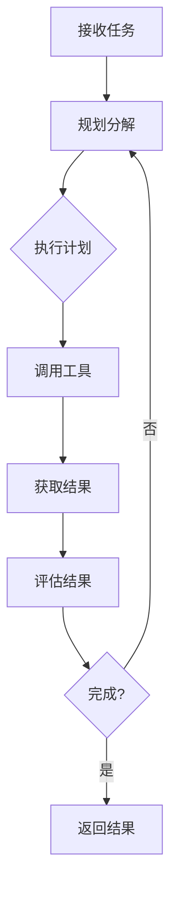

# 架构设计

## Agent 核心组件

```
┌─────────────────────────────────────────────────┐
│                    Agent                        │
├─────────────────────────────────────────────────┤
│  ┌─────────┐  ┌─────────┐  ┌─────────┐          │
│  │ Planner │  │ Memory  │  │  Tool   │          │
│  │         │  │         │  │  Use    │          │
│  └────┬────┘  └────┬────┘  └────┬────┘          │
│       │            │            │                │
│       └────────────┼────────────┘                │
│                    ▼                             │
│            ┌─────────────┐                       │
│            │  Executor   │                       │
│            └─────────────┘                       │
└─────────────────────────────────────────────────┘
```

---

# 核心组件详解

## 1. Planner（规划器）

<v-clicks>

* **任务分解**: 将复杂任务拆分为可执行的子任务
* **计划生成**: 创建执行步骤序列
* **动态调整**: 根据执行结果调整计划

</v-clicks>

---

## 2. Memory（记忆）

<v-clicks>

* **短期记忆**: 当前会话上下文
* **长期记忆**: 持久化知识和经验
* **向量存储**: 语义搜索和检索

</v-clicks>

---

## 3. Tool Use（工具使用）

<v-clicks>

* **工具注册**: 发现可用工具
* **参数生成**: 智能生成工具参数
* **结果处理**: 解析和处理工具输出

</v-clicks>

---

## 4. Executor（执行器）

<v-clicks>

* **循环控制**: 管理 Agent 运行周期
* **决策判断**: 决定下一步行动
* **错误处理**: 处理执行异常

</v-clicks>

---

# Agent Loop


