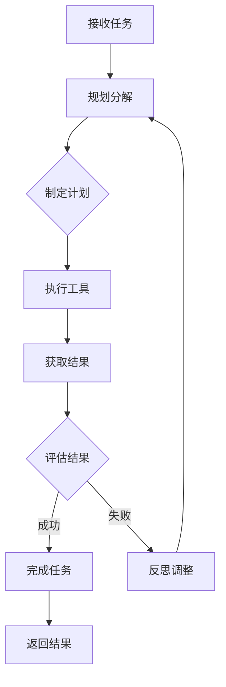

# 2. Agent Loop（核心）

## 什么是 Agent Loop？

> **Agent Loop** 是 Agent 完成任务的核心循环机制：规划 → 执行 → 评估 → 反思 → 重复

---

# Agent Loop 工作流程



---

# Agent Loop 详解

## 1. 规划（Planning）

<v-clicks>

* **任务分解**: 将复杂任务拆分为可执行的子任务
* **计划生成**: 创建执行步骤序列
* **目标设定**: 明确最终目标

</v-clicks>

## 2. 执行（Execution）

<v-clicks>

* **工具选择**: 根据任务选择合适工具
* **参数生成**: 智能生成工具参数
* **调用执行**: 执行工具并获取结果

</v-clicks>

---

## 3. 评估（Evaluation）

<v-clicks>

* **结果验证**: 检查工具返回结果
* **进度评估**: 评估是否达成目标
* **质量检查**: 验证输出质量

</v-clicks>

## 4. 反思（Reflection）

<v-clicks>

* **错误分析**: 分析失败原因
* **策略调整**: 动态调整执行计划
* **学习改进**: 从经验中学习

</v-clicks>

---

# Claude Code Agent 模式

## 1. Loop 模式

```
Agent 会在每个工具调用后分析结果，
自主决定下一步行动，直到任务完成
```

适用于需要多步执行的任务

## 2. Stop 模式

```
Agent 执行一步后停止，等待用户确认
```

适用于需要人工审核的关键步骤

## 3. Resume 模式

```
恢复之前暂停的 Agent 任务
```

适用于用户介入后继续执行

---

# Agent Loop 示例

## LangGraph 完整示例

```python
from langgraph.prebuilt import create_react_agent
from langgraph.checkpoint.memory import MemorySaver

# 创建 Agent，集成工具
agent = create_react_agent(
    model,
    tools=[search, calculator, file_read],
    checkpointer=MemorySaver(),  # 持久化状态
    state_modifier="你是一个专业的代码审查助手"
)

# Agent 自动执行 Loop
result = agent.invoke(
    {"messages": [("user", "审查这个 PR 的安全问题")]},
    config={"configurable": {"thread_id": "pr-123"}}
)

# 查看完整对话历史
for msg in result["messages"]:
    print(f"{msg.type}: {msg.content}")
```

<v-click>

## Claude Code Agent 模式

```typescript
// Claude Code Agent 模式配置
const agentConfig = {
  mode: "loop",  // loop | stop | resume
  maxTurns: 10,  // 最大循环次数
  tools: ["read", "write", "bash", "glob", "grep"],
  systemPrompt: `你是一个资深的软件工程师...`
};

// Loop 模式：自动执行直到完成
// Stop 模式：每步暂停等待确认
// Resume 模式：从点恢复执行断
```

</v-click>

<v-click>

## Agent Loop 核心流程代码

```python
async def agent_loop(task, agent):
    """Agent Loop 核心实现"""
    context = {"task": task, "history": []}

    while not is_complete(context):
        # 1. 规划：根据当前状态决定下一步
        plan = await agent.plan(context)

        # 2. 执行：调用工具
        result = await agent.execute(plan)

        # 3. 评估：检查结果
        evaluation = await agent.evaluate(result, context)

        # 4. 反思：决定下一步
        if evaluation.success:
            context["history"].append({"plan", result, "status": "success"})
            if evaluation.done:
                break
        else:
            # 反思调整策略
            context["plan"] = await agent.reflect(evaluation.error)
            context["history"].append({"error": evaluation.error})

    return context["result"]
```

</v-click>

<v-click>

**核心**: Agent 自动循环执行直到完成

</v-click>

---
layout: center
---
# 本章小结：Agent Loop

<v-clicks>

1. **规划**: 任务分解、计划生成
2. **执行**: 工具选择、参数生成
3. **评估**: 结果验证、进度评估
4. **反思**: 错误分析、策略调整
5. **Claude Mode**: Loop/Stop/Resume

</v-clicks>
