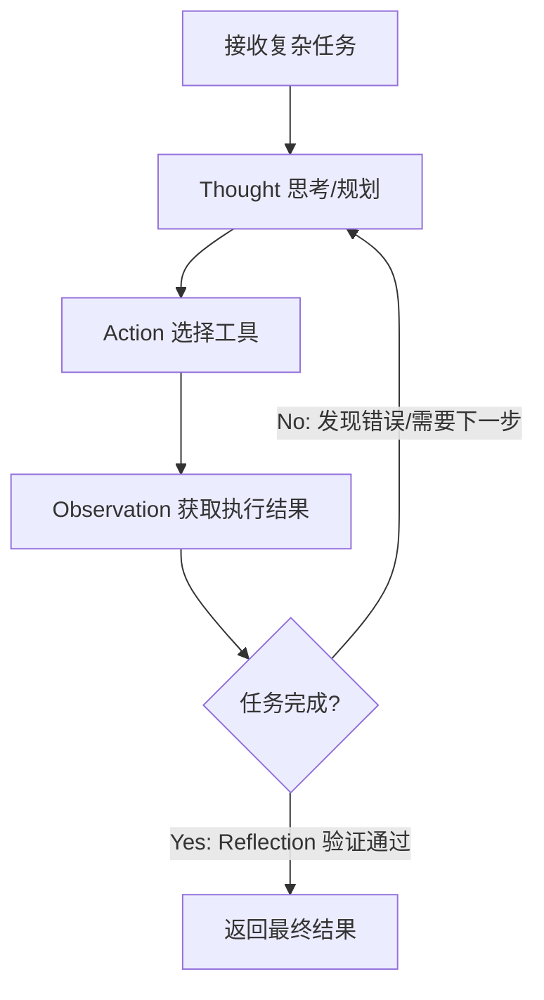

# 2. 底层基石：Agent 的四大设计模式

> 斯坦福大学吴恩达 (Andrew Ng) 教授在 2024 年总结了让 LLM 性能大幅提升的[四大 Agentic 设计模式](https://www.deeplearning.ai/the-batch/how-agents-can-improve-llm-performance/)。这也是所有工业级 Agent 框架的底层理论基石。

---
layout: two-cols-header
---

# 模式 1 与 2：自我进化与打破物理结界

::left::

<div class="mt-4 bg-blue-50 dark:bg-blue-900/30 p-6 rounded-xl border border-blue-200">

### 1. Reflection (反思)
**定义**: 让模型审查并修正自己的输出。
**核心机制**: 
- LLM 往往无法一次性生成完美代码。
- 通过 "Critic (批评者)" 角色，让 LLM 审视自己的回答，发现逻辑漏洞并自我迭代。
- **价值**: "小模型 + 充分的反思迭代" 往往能击败 "大模型的 Zero-shot"。

</div>

::right::

<div class="mt-4 bg-green-50 dark:bg-green-900/30 p-6 rounded-xl border border-green-200">

### 2. Tool Use (工具使用)
**定义**: 让 LLM 能够调用外部 API、执行代码或查询数据库。
**核心机制**:
- 也就是我们在 MCP / Skill 课程中讲到的核心能力。
- 克服大模型的知识截止期和计算能力弱的缺陷。
- **价值**: 让 Agent 拥有了与物理/数字世界交互的“手”。

</div>

---
layout: two-cols-header
---

# 模式 3 与 4：运筹帷幄与协同作战

::left::

<div class="mt-4 bg-purple-50 dark:bg-purple-900/30 p-6 rounded-xl border border-purple-200">

### 3. Planning (规划)
**定义**: 面对复杂目标，让 Agent 自主拆解步骤。
**核心机制**:
- 大模型不仅生成最终结果，首先生成一个 Step-by-Step 的执行计划。
- 在每一步执行后，根据环境反馈决定继续还是重新规划 (Re-plan)。
- **典型实现**: ReAct 框架 (Reasoning and Acting)。

</div>

::right::

<div class="mt-4 bg-orange-50 dark:bg-orange-900/30 p-6 rounded-xl border border-orange-200">

### 4. Multi-agent Collaboration (多智能体)
**定义**: 多个扮演不同角色的 Agent 协同完成复杂任务。
**核心机制**:
- 一个模型很难兼顾所有要求（又写代码、又找漏洞、又查文档）。
- 将任务分配给：Coder Agent, Reviewer Agent, Tester Agent。
- **价值**: 通过博弈和辩论，大幅降低单一模型的“幻觉”。

</div>

---

# 经典 ReAct 工作流 (Reasoning + Acting)

> 这是最经典的将四大模式融合在一起的底层 Loop 循环。



<div class="mt-4 text-sm text-slate-500">
注：ReAct 是单体 Agent 的经典循环，但当任务复杂度超过一定阈值，单体 ReAct 极易陷入 "Thought -> Action -> 报错 -> 继续相同的 Thought" 的死循环。这就引出了我们下一章的架构升级。
</div>

---

# 渐进式递进：Anthropic 五大工作流模式

> 根据 [Anthropic 官方研究](https://www.anthropic.com/research/building-effective-agents)，工作流模式分为五个层级。

## 层级 1：增强型 LLM（基础构建块）

```
┌─────────────────────────────────────────┐
│            增强型 LLM                    │
│  ┌─────────┐  ┌─────────┐  ┌─────────┐ │
│  │ 检索    │  │ 工具    │  │ 记忆    │ │
│  │ Retrieval│  │ Tools   │  │ Memory  │ │
│  └─────────┘  └─────────┘  └─────────┘ │
└─────────────────────────────────────────┘
```

- 检索增强：访问外部知识库
- 工具调用：执行实际操作
- 记忆能力：保持对话状态

---

## 层级 2：预定义工作流（核心！）

### 模式 1：Prompt Chaining（串行）

将任务分解为顺序步骤，每步 LLM 处理前一步输出。

```
输入 → LLM1 → 输出1 → LLM2 → 输出2 → LLM3 → 最终输出
```

**适用场景**：需要多步推理，每步依赖上一步结果
- 示例：写文章（大纲 → 草稿 → 修改 → 润色）

---

### 模式 2：Routing（路由）

分类输入，导向专门的后续任务。

```
输入 → 分类器 → 专门LLM1 / 专门LLM2 / 专门LLM3
```

**适用场景**：不同类型问题需要不同处理
- 示例：客服机器人（技术问题 → 技术LLM，账单问题 → 财务LLM）

---

### 模式 3：Parallelization（并行）

LLM 同时处理多个子任务。

```
         → LLM1 →
输入 → ───→ LLM2 → 汇总 → 最终输出
         → LLM3 →
```

**适用场景**：子任务相互独立，可并行加速
- 示例：同时生成多个 UI 组件版本

---

### 模式 4：Orchestrator-Workers（编排器）

中央 LLM 动态分解任务，委托给工作 LLM。

```
         → Worker1 →
Orchestrator → Worker2 → 汇总 → 最终输出
         → Worker3 →
```

**适用场景**：复杂任务需要灵活分配，无法预先定义步骤
- 示例：开发完整功能模块

---

### 模式 5：Evaluator-Optimizer（评估优化）

一个 LLM 生成，另一个提供反馈并迭代。

```
生成 → 评估 → 不通过 → 重新生成 → 评估 → ...
           ↓
         通过 → 最终输出
```

**适用场景**：需要高质量输出的场景
- 示例：代码审查、写作润色

---

## 层级 3：智能体（最终形态）

> LLM 动态指导自身流程，包含循环和停止条件。

```
while (未完成 && 未超时) {
  LLM 思考 → 执行动作 → 观察结果 → 评估进度
}
```

**特征**：
- 自主决策下一步
- 包含停止条件
- 可在检查点暂停等待人工反馈

---

# 📊 工作流选择决策矩阵

| 模式 | 任务特征 | 复杂度 | 确定性 |
|------|----------|--------|--------|
| Chaining | 顺序依赖 | 中 | 高 |
| Routing | 分类分发 | 低 | 高 |
| Parallel | 独立并行 | 低 | 高 |
| Orchestrator | 动态分配 | 高 | 中 |
| Evaluator-Optimizer | 迭代优化 | 中 | 中 |
| **智能体** | 开放任务 | 最高 | 低 |

<div class="mt-4 p-4 bg-yellow-50 border border-yellow-200 rounded-lg">
<strong>⚠️ Anthropic 建议</strong>：从简单提示开始，用评估优化，只在简单方案不足时才添加多步骤智能体系统。
</div>

