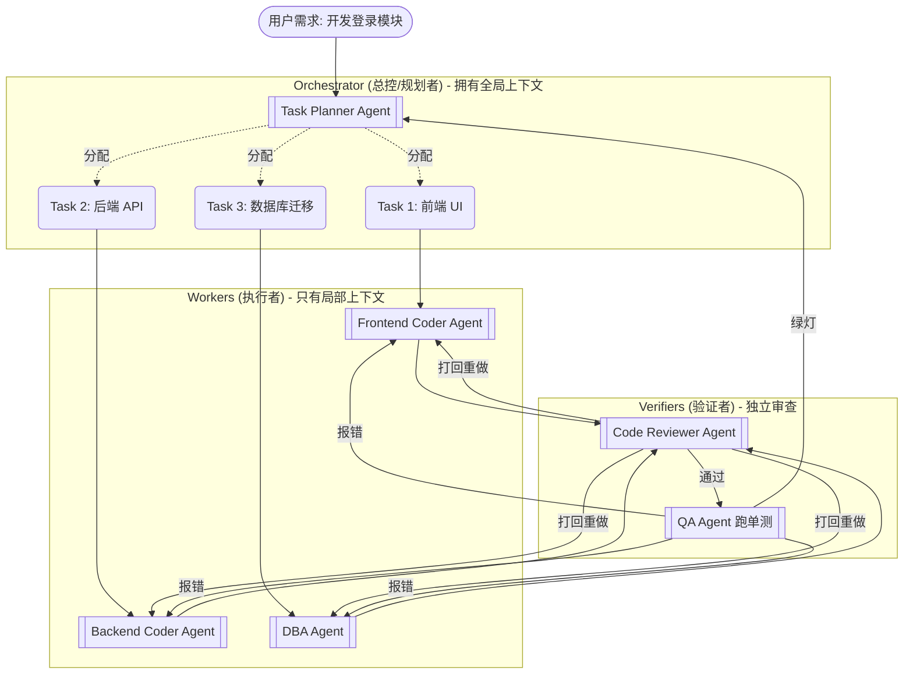

# 架构设计：从单体到多智能体协同

> 为什么复杂的编码任务不能只丢给一个大模型完成？

## 强对比：单体大模型 vs 多智能体交叉验证

<div class="grid grid-cols-2 gap-8 mt-6">

<div class="p-4 border border-red-200 rounded-lg bg-red-50/30">

### ❌ 传统单体 Agent (ReAct)
* **架构**: 一个模型既当产品经理，又当程序员，又当测试。
* **痛点**:
  - 上下文极易污染，写代码时忘记了需求。
  - "当局者迷"，发现不了自己写的逻辑漏洞。
  - 极易陷入 "执行报错 -> 乱改 -> 再次报错" 的无限死循环。

</div>

<div class="p-4 border border-green-200 rounded-lg bg-green-50/30">

### ✅ 现代多智能体协同 (Multi-Agent)
* **架构**: [Orchestrator-Workers](https://www.anthropic.com/research/building-effective-agents) / [Magentic-One](https://www.microsoft.com/en-us/research/project/magentic-one/)。
* **优势**:
  - **职能隔离**: Planner 拆解任务，Coder 专注写代码，Reviewer 专挑刺。
  - **交叉验证**: 强迫不同的模型实体互相审核（如 Mono-PI 论文提出的"单体规划者-多重验证者"模式）。

</div>

</div>

---
zoom: 0.5
---
# 工业级 Orchestrator-Workers 架构图



---

# 核心组件与职能

<div class="grid grid-cols-2 gap-6 mt-4">

<div class="bg-slate-50 dark:bg-slate-800/50 p-4 rounded-xl border border-slate-200">

### 1. Orchestrator（总控大脑）
- **职责**: 负责接收任务，将大目标拆解为 DAG（有向无环图）子任务。
- **能力**: 它不写代码，它只负责"分配工作"和"汇总成果"。
- **选型**: 必须使用推理能力最强的模型（如 Claude 3.5 Sonnet）。

</div>

<div class="bg-slate-50 dark:bg-slate-800/50 p-4 rounded-xl border border-slate-200">

### 2. Workers（执行工蜂）
- **职责**: 接收到非常具体的子任务和极其纯净的上下文，调用工具（Tool Use）干活。
- **选型**: 可以使用廉价、快速的小模型（如 Haiku / GPT-4o-mini）。

</div>

<div class="bg-slate-50 dark:bg-slate-800/50 p-4 rounded-xl border border-slate-200">

### 3. Verifier（交叉验证器）
- **职责**: 这是破除死循环的关键。专门负责审查 Worker 产出的质量，运行 `npm run test`。不符合标准直接打回。
- **理论支撑**: [Mono-PI](https://arxiv.org/abs/2402.11450) 指出，多重维度的独立验证者能成倍提高最终代码的正确率。

</div>

<div class="bg-slate-50 dark:bg-slate-800/50 p-4 rounded-xl border border-slate-200">

### 4. Shared Memory（共享黑板）
- **职责**: Agent 之间不直接用自然语言聊天，而是通过一个共享的 JSON 状态（State）来传递进度。

</div>

</div>

---

# 框架对比

## 主流 Agent 框架

<v-clicks>

| 框架 | 开发者 | 特点 |
|-----|--------|------|
| Anthropic Agent SDK | Anthropic | 官方框架，Claude 深度集成 |
| Vercel AI SDK | Vercel | 前端首选，流式支持强 |
| smolagents | HuggingFace | 轻量级，代码驱动，1000行 |
| LangChain | LangChain AI | 生态丰富，文档完善 |
| AutoGen | Microsoft | 多 Agent 协作 |
| OpenAI Agents SDK | OpenAI | GPT 深度集成 |

</v-clicks>

---

# 轻量级代表：smolagents

> HuggingFace 出品的轻量级 Agent 框架，核心只有约 **1000 行代码**。

## 核心创新：代码驱动

**传统方式**：LLM 输出 JSON/字典 → 解析 → 执行动作

**smolagents 方式**：LLM 直接生成 Python 代码 → 解释器执行

```python
from smolagents import CodeAgent, DuckDuckGoSearchTool

# 核心创新：LLM 直接生成 Python 代码作为行动
agent = CodeAgent(
    tools=[DuckDuckGoSearchTool()],
    model="default"  # 支持任意 LLM
)

# 执行任务
result = agent.run("搜索 2026 年 AI 最新发展")
```

## 为什么选择 smolagents？

| 特性 | 说明 |
|------|------|
| **轻量** | 核心约 1000 行代码 |
| **模型无关** | 支持任意 LLM (本地/云端) |
| **工具无关** | MCP、LangChain、Hub Space |
| **安全** | 支持沙箱执行 (E2B/Blaxel/Docker) |

---

# 📊 完整框架对比表格

| 框架 | 定位 | 优点 | 缺点 | 适用场景 |
|------|------|------|------|---------|
| Anthropic SDK | 官方 | Claude 深度集成 | 新框架 | Claude 生态 |
| Vercel AI SDK | 前端 | 流式支持强、MCP | 前端为主 | React/Next.js |
| smolagents | 轻量 | 代码驱动、1000行 | 生态小 | 快速原型 |
| LangChain | 全栈 | 生态丰富 | 抽象厚 | 企业级 |
| AutoGen | 多智能体 | 微软生态 | 复杂 | 多 Agent 协作 |
| OpenAI SDK | GPT | GPT 优化 | 绑定 OpenAI | GPT 优先 |

---

# Agent vs Workflows：正反对比

> 何时选 Agent？何时选 Workflows？

## ❌ 错误认知：Agent 一定比 Workflows 强

- **误区**：完全自主的 Agent 更"智能"
- **现实**：Agent 容易失控，成本高，难调试

## ✅ 正确认知：根据场景选择

| 场景 | 推荐方案 | 原因 |
|------|----------|------|
| 确定性任务 | Workflows | 流程固定，需要精确控制 |
| 开放性任务 | Agent | 需要灵活应变，无法预判路径 |
| 简单任务 | 提示词 | 不需要任何框架 |
| 复杂多步骤 | Evaluator-Optimizer | 需要迭代优化 |

## Anthropic 建议

> 从简单提示开始，用评估优化，只在简单方案不足时才添加多步骤智能体系统。

---

# Claude Agent

## Anthropic Agent SDK

Anthropic 提供的官方 Agent 开发框架，核心概念：

<v-clicks>

* **Messages**: 对话消息格式
* **Tools**: 可用工具定义
* **Max Turns**: 最大交互轮次
* **Stop Sequences**: 停止条件

</v-clicks>

---

# Claude Code Agent 模式

Claude Code 提供三种 Agent 运行模式：

## 1. Loop 模式

Agent 自主循环执行直到完成

```
Agent 会在每个工具调用后分析结果，
自主决定下一步行动，直到任务完成
```

---

## 2. Stop 模式

Agent 执行一步后停止，等待用户确认

```
适合需要用户审核的关键步骤
```

---

## 3. Resume 模式

恢复之前暂停的 Agent 任务

```
允许用户介入后继续执行
```

---

# Claude Code Agent 配置

```json
{
  "agent": {
    "mode": "loop",
    "max_turns": 50,
    "stop_sequences": ["用户确认", "错误"],
    "tools": ["read", "write", "bash"]
  }
}
```

---

# Agent 开发最佳实践

<v-clicks>

* **明确目标**: 清晰定义任务目标
* **限制范围**: 设置合理的执行边界
* **错误处理**: 添加异常处理逻辑
* **状态管理**: 妥善管理 Agent 状态
* **监控调试**: 添加日志和调试信息

</v-clicks>
