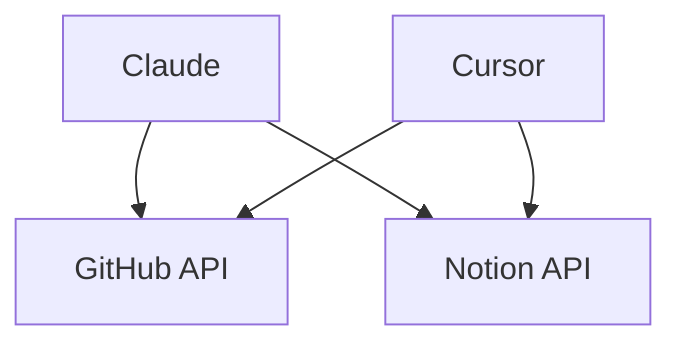
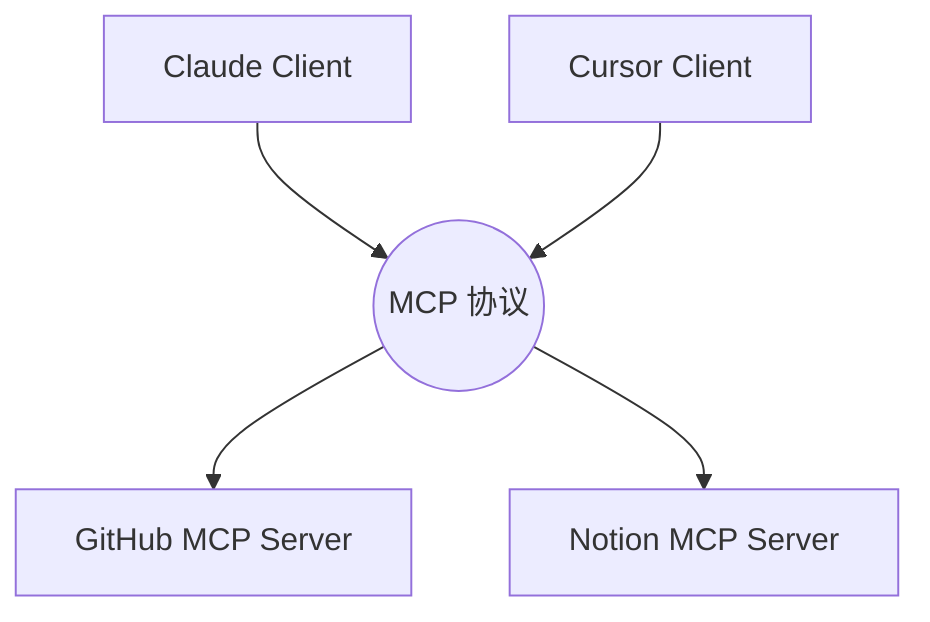

# 2. MCP 架构与对比

## 强对比：传统散装 API 架构 vs MCP 统一架构

<div class="grid grid-cols-2 gap-8">

<div class="p-4 border border-red-200 rounded-lg bg-red-50/30">

### ❌ 传统：N × M 的毛线团
* **Claude** 必须写一堆代码才能调 GitHub
* **Cursor** 又要重新写一遍逻辑接 GitHub
* **本地数据库** 无法暴露给云端 AI
* **痛点**: 每次集成都是一次重复造轮子



</div>

<div class="p-4 border border-green-200 rounded-lg bg-green-50/30">

### ✅ MCP：N + M 的集线器
* **统一协议**: 客户端只说 MCP 语
* **即插即用**: 数据源只需包一层 MCP Server
* **本地安全**: 甚至能让云端 AI 访问你的本地 SQLite



</div>

</div>

---

# 核心架构：三个关键参与者

```
┌─────────────────────────────────────────────────────┐
│                    MCP Host                         │
│       (如 Cursor, Claude Desktop, Windsurf)         │
├─────────────────────────────────────────────────────┤
│  ┌─────────────────────────────────────────────┐   │
│  │              MCP Client                      │   │
│  │         建立并维护与 Server 的 JSON-RPC 连接    │   │
│  └─────────────────────────────────────────────┘   │
└─────────────────────────────────────────────────────┘
                         │
                         ▼ (stdio 或 SSE)
┌─────────────────────────────────────────────────────┐
│                   MCP Server                        │
│    (如 GitHub Server, Postgres Server)              │
│    作为能力的提供者，暴露 工具、资源、提示词              │
└─────────────────────────────────────────────────────┘
```

---

# 通信方式 (Transport Layer)

<div class="grid grid-cols-2 gap-8 mt-6">

<div class="bg-slate-50 dark:bg-slate-800/50 p-6 rounded-xl border border-slate-200">

### 1. stdio (标准输入输出)
- **场景**: 客户端与服务端在**同一台机器**上运行。
- **原理**: 像管道一样，通过子进程的 stdin/stdout 通信。
- **例子**: Claude Desktop 调用本地的 `@modelcontextprotocol/server-postgres` 查你的本地库。

```json
{
  "command": "npx",
  "args": ["-y", "@modelcontextprotocol/server-postgres", "postgres://localhost/mydb"]
}
```

</div>

<div class="bg-slate-50 dark:bg-slate-800/50 p-6 rounded-xl border border-slate-200">

### 2. SSE (Server-Sent Events)
- **场景**: 跨机器通信 (如云端 AI 客户端连接公司内网的 Server)。
- **原理**: 基于 HTTP 的单向事件流 + POST 请求实现双向 JSON-RPC 通信。
- **例子**: 部署在内网的 Jira MCP Server 供全体研发调用。

```json
{
  "type": "sse",
  "url": "https://mcp.mycompany.com/jira"
}
```

</div>

</div>

---

# 传输类型对比表格

| 类型 | 场景 | 优点 | 缺点 | 推荐程度 |
|------|------|------|------|---------|
| **stdio** | 本地 CLI | 延迟最低，配置简单 | 只能本地，无法跨网络 | ⭐⭐⭐⭐⭐ |
| **SSE** | 远程服务 | 支持跨网，简单易用 | 单向通信，需要轮询 | ⭐⭐⭐⭐ |
| **Streamable HTTP** | 生产环境 | 推荐使用，双向流式 | 需要 HTTPS 配置 | ⭐⭐⭐⭐⭐ |
| **https** | 企业内网 | 安全，可控 | 配置复杂，需要证书 | ⭐⭐⭐ |

<div class="mt-4 p-4 bg-green-50 border border-green-200 rounded-lg">
<strong>⚡ 生产环境推荐</strong>: 使用 <strong>Streamable HTTP</strong>，它是官方推荐的生产环境传输方式，支持双向流式通信。
</div>

---
layout: center
---
# 本章小结：MCP 架构

<v-clicks>

1. **破局点**: 从 `N × M` 的直连噩梦，变成基于统一协议的 `N + M` 星型架构。
2. **三方架构**: Host (掌控全局调度)、Client (打杂通信)、Server (提供服务)。
3. **两大 Transport**: 本地极速用 `stdio`，远程跨网用 `SSE`。

</v-clicks>
